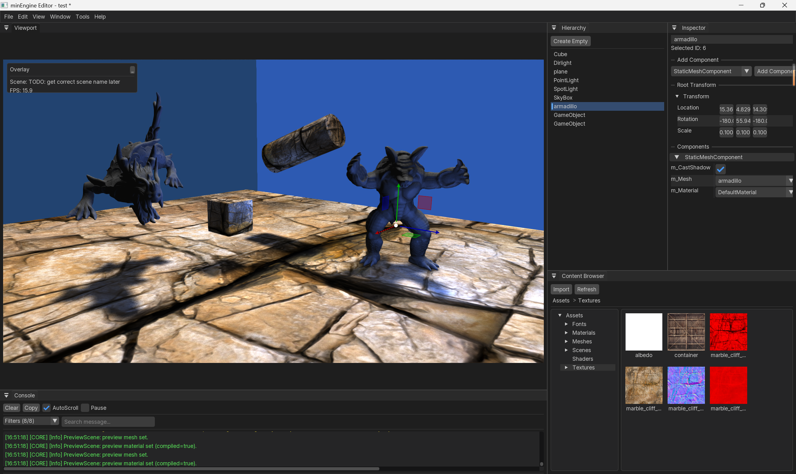
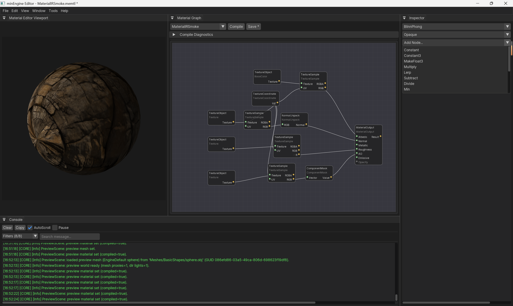
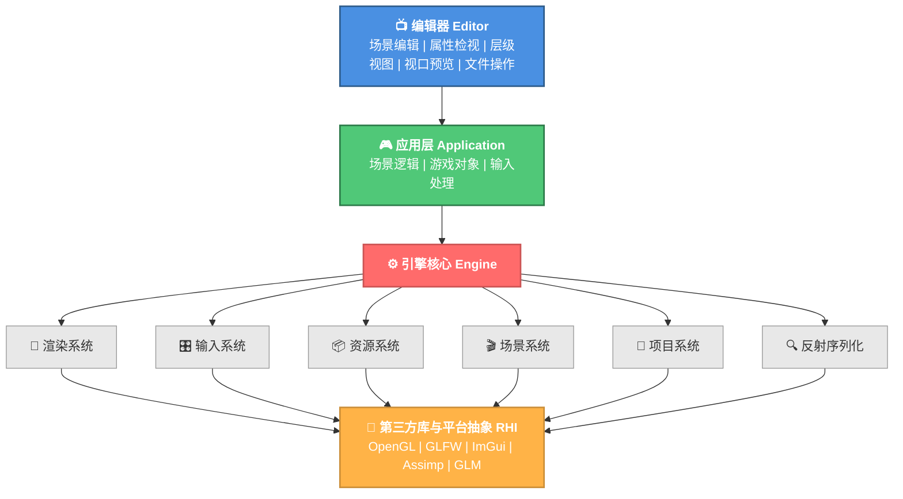

# minEngine - 个人学习型游戏引擎

**一个专注于清晰架构和渲染管线的 C++ 游戏引擎学习项目**

最后编辑时间：2026.04.30


[📖 文档](https://max1122chen.github.io/minEngine/) • [🏗️ 架构](#核心架构) • [⭐ 特色](#核心特色) • [🚀 快速开始](#快速开始)

https://github.com/Max1122Chen/minEngine.git

---

## 项目简介

**minEngine** 是一个个人的 C++ 游戏引擎学习项目，致力于打造一个**清晰、可扩展、高效的现代游戏引擎架构**。

### 设计哲学

- ✅ **清晰的架构** - 模块化设计，易于理解和扩展
- ✅ **工程实践** - 现代 C++ 最佳实践（反射、序列化、RAII）
- ✅ **渲染优先** - 深入理解现代渲染管线与优化
- ✅ **编辑器工作流** - 简单的引擎编辑器支持

---

## 编辑器快照

引擎主编辑器快照



材质编辑器快照：



## 核心架构

### 分层结构




### 核心系统

#### 1. **GameObject/Component 系统**
```cpp
GameObject (游戏对象)
├─ SceneComponent (根组件)
│  └─ Transform (变换信息)
├─ StaticMeshComponent (静态网格)
├─ CameraComponent (摄像机)
├─ DirectionalLightComponent (方向光)
├─ PointLightComponent (点光)
├─ SpotLightComponent (聚光)
├─ MovementComponent (移动控制)
└─ InputComponent (输入绑定)
```

每个 GameObject 包含多个组件，支持：
- 动态添加/移除组件
- 组件参数实时编辑
- 反射序列化支持

#### 2. **场景与世界管理**
- **Scene** - 场景容器，管理所有 GameObject
- **Level** - 关卡管理
- **WorldManager** - 全局世界状态管理
- **SceneManager** - 场景创建/加载/保存
- **ProjectManager** - 项目元数据和启动配置

#### 3. **渲染系统架构**

```
RenderSystem (渲染系统主类)
│
├─ RenderPipeline (渲染管线)
│  │
│  ├─ ShadowPass (阴影通道)
│  │  └─ ShadowResourceManager (阴影资源池)
│  │
│  ├─ BasePass (主场景通道)
│  ├─ TranslucencyPass (透明通道)
│  ├─ PostProcessPass (后处理通道)
│  └─ PresentPass (呈现通道)
│
├─ RenderScene (渲染侧场景代理)
│  ├─ PrimitiveSceneProxy (图元代理)
│  ├─ LightSceneProxy (灯光代理)
│  └─ DirectionalLightSceneProxy (方向光代理)
│
└─ RHI (渲染硬件接口)
   ├─ RHITexture2D (纹理)
   ├─ RHIBuffer (缓冲)
   ├─ RHIShader (着色器)
   └─ FrameBuffer (帧缓冲)
```

---

## 核心特色

### ⭐ 简单、架构清晰、模块化渲染管线

#### **多通道设计**
引擎目前实现了多通道的前向渲染，分层次执行不同的渲染任务：

| 通道 | 职责 | 特点 |
|------|------|------|
| **ShadowPass** | 阴影贴图写入 | 仅输出深度，为主通道提供阴影贴图 |
| **BasePass** | 不透明物体渲染 | 支持多光源、Phong 着色、CSM 级联阴影采样 |
| **TranslucencyPass** | 透明物体渲染 | 独立的透明物体通道，背景混合 |
| **PostProcessPass** | 后处理效果 | 扩展后处理效果的预留通道 |
| **PresentPass** | 最终呈现 | 离屏缓冲到屏幕输出 |

**优势**：
- 每通道职责清晰，易于调试和优化
- 支持快速添加新的渲染效果
- 状态管理显式化，避免状态污染

#### **方向光的级联阴影贴图 (Cascaded Shadow Maps, CSM)**

实现了完整的 CSM 系统，支持方向光的多级级联：

```
高质量近景阴影 ──► 中距离阴影 ──► 远景阴影 ──► 超远景阴影
  第 0 级       第 1 级        第 2 级      第 3 级
```

4级联，阴影贴图分辨率512*512，阴影渲染下的Armadillo，xyzrgb_dragon和cube图中为不同级联中的内容着了不同的纯色便于观察，颜色和级联的对应关系为：

| 级联级数 | 颜色 |
| :------- | ---- |
| 0        | 红   |
| 1        | 绿   |
| 2        | 蓝   |
| 3        | 黄   |

在关闭了级联混合的情况下，可见级联接缝处明显的阴影质量跳变，越远处的级联阴影质量越低


**特点**：

- 支持最多 4 级级联
- 自动级联分割计算
- 动态视锥体计算
- BasePass 中采用 PCF 采样优化阴影边缘

#### **"小而美"的阴影资源系统**

遵循**轻量级、可复用**的设计理念：

```cpp
// 核心组件
ShadowResourceManager      // 统一资源池，避免重复创建/销毁
├─ Depth2DArray           // 用于方向光 CSM
├─ DepthCubemap          // 用于点光（预留）
└─ ShadowAtlas           // 用于聚光（预留）

// 资源句柄模式
ShadowResourceHandle      // 一次性分配，整个引擎生命周期复用
├─ TextureUnit           // OpenGL 纹理单元位置
└─ Resolution           // 阴影分辨率
```

**优势**：
- 资源零碎化最小化
- 内存预测性强
- 实现复杂度可控，不引入虚拟阴影贴图等高阶特性

---

### 🔍 反射与序列化系统

#### **现代反射框架**

使用生成式反射，通过python脚本扫描增量变动代码文件中的反射宏在编译前生成反射注册代码：

```cpp
ReflectionSample.h:
namespace minEngine
{
    ME_ENUM()
    enum ReflectionSampleEnum
    {
        ValueA,
        ValueB,
        ValueC
    };

    ME_CLASS(Transient, meta = (Category = "ReflectionSample", DisplayName = "ReflectionSampleClass"))
    class MINENGINE_API ReflectionSampleClass
    {
        ME_GENERATED_BODY(ReflectionSampleClass)
    public:
        ME_PROPERTY(Transient, meta = (Category = "Sample", DisplayName = "Sample Int"), EditAnywhere)
        int IntField = 42;

        ME_PROPERTY(EditAnywhere)
        float FloatField = 3.14f;

        ME_PROPERTY(EditAnywhere)
        std::string StringField = "Hello, Reflection!";

        ME_PROPERTY(EditAnywhere)
        ReflectionSampleEnum EnumField = ReflectionSampleEnum::ValueB;
    };

    ME_CLASS()
    class ReflectionSampleComponent : public Component
    {
        ME_GENERATED_BODY(ReflectionSampleComponent)
    public:
        ME_PROPERTY(EditAnywhere)
        ReflectionSampleClass SampleData;

        ME_PROPERTY(EditAnywhere)
        std::vector<int> IntArray{ 1, 2, 3, 4, 5 };
    };
}

#include "ReflectionSample.gen.h"	// 有意为之的在文件末尾include
```
**生成的代码** (`.gen.h` & `.gen.cpp`)：

- 自动类型注册
- 属性元数据导出
- 反射查询接口
```cpp
ReflectionSample.gen.h:
// Auto-generated by minEngine_header_tool_new.py. Do not edit manually.
#pragma once

#include "Runtime/Core/Reflection/ReflectionMacros.h"

ME_REFLECTION_ENUM_DECLARE(minEngine::ReflectionSampleEnum, GReflectionEnumRegister_ReflectionSampleEnum_fa501ee3)

ME_REFLECTION_ACCESSOR_BEGIN(minEngine::ReflectionSampleClass)
    ME_REFLECTION_ACCESSOR_FIELD(minEngine::ReflectionSampleClass, IntField)
    ...
ME_REFLECTION_ACCESSOR_END()

ME_REFLECTION_CLASS_DECLARE(minEngine::ReflectionSampleClass, GReflectionClassRegister_ReflectionSampleClass_7a3bc910)

ME_REFLECTION_ACCESSOR_BEGIN(minEngine::ReflectionSampleComponent)
    ME_REFLECTION_ACCESSOR_FIELD(minEngine::ReflectionSampleComponent, SampleData)
    ME_REFLECTION_ACCESSOR_FIELD(minEngine::ReflectionSampleComponent, IntArray)
ME_REFLECTION_ACCESSOR_END()

ME_REFLECTION_CLASS_DECLARE(minEngine::ReflectionSampleComponent, GReflectionClassRegister_ReflectionSampleComponent_95cd1884)

```

```cpp
ReflectionSample.gen.cpp:
// Auto-generated by minEngine_header_tool_new.py. Do not edit manually.
#include "Runtime/Core/Reflection/ReflectionSample.h"

ME_REFLECTION_ENUM_DEFINE_BEGIN(minEngine::ReflectionSampleEnum, GReflectionEnumRegister_ReflectionSampleEnum_fa501ee3)
    ME_REFLECTION_ENUM_VALUE(ValueA, minEngine::ValueA)
	...
ME_REFLECTION_ENUM_DEFINE_END(minEngine::ReflectionSampleEnum)

ME_REFLECTION_CLASS_DEFINE_BEGIN(minEngine::ReflectionSampleClass, GReflectionClassRegister_ReflectionSampleClass_7a3bc910)
    ME_REFLECTION_CLASS_SET_ANNOTATIONS((static_cast<minEngine::Reflection::ClassSpecifierMask>(minEngine::Reflection::ClassSpecifier::Transient)), (minEngine::Reflection::ClassMetadata{{"Category", "ReflectionSample"}, {"DisplayName", "ReflectionSampleClass"}}))
    ME_REFLECTION_CLASS_ADD_FIELD(minEngine::ReflectionSampleClass, IntField, (static_cast<minEngine::Reflection::PropertySpecifierMask>(minEngine::Reflection::PropertySpecifier::Transient) | static_cast<minEngine::Reflection::PropertySpecifierMask>(minEngine::Reflection::PropertySpecifier::EditAnywhere)), (minEngine::Reflection::PropertyMetadata{{"Category", "Sample"}, {"DisplayName", "Sample Int"}}))
   ...
ME_REFLECTION_CLASS_DEFINE_END(minEngine::ReflectionSampleClass)

ME_REFLECTION_CLASS_DEFINE_BEGIN(minEngine::ReflectionSampleComponent, GReflectionClassRegister_ReflectionSampleComponent_95cd1884)
   ...
ME_REFLECTION_CLASS_DEFINE_END(minEngine::ReflectionSampleComponent)

   
```

#### **完整的序列化能力**

支持**复杂对象图的完整序列化**，包括：

1. **内联对象序列化** - 直接嵌入 JSON
   
   ```json
   {
     "GameObject": {
       "m_Components": [
         {
             "$ptr_typeName": "minEngine::StaticMeshComponent",
             ... // Properties of StaticMeshComponent
         }
       ]
     }
   }
   ```
   
2. **GUID 引用序列化** - 通过 ID 引用外部对象
   ```json
   "m_Mesh": {
       "$guid": {
           "high": 1195769813414201913,
           "low": 11320094043071953413
       }
   },
   ```
   
3. **自动所有权处理**
   - 直接子对象 → 内联序列化
   - 外部引用 → GUID 引用
   - ObjectManager 和 AssetManager 自动解析

#### **核心接口**

```cpp
class Serializer
{
public:
     public:
        static SerializeResult Serialize(const std::string& rootClassName,
                                         const void* rootObject,
                                         WriterArchive& archive,
                                         const SerializerOptions& options = SerializerOptions{});

        static SerializeResult Deserialize(const std::string& rootClassName,
                                           void* outRootObject,
                                           ReaderArchive& archive,
                                           std::vector<PendingObjectRef>& outUnresolvedRefs,
                                           const SerializerOptions& options = SerializerOptions{});

        static SerializeResult ToFile(const std::string& filePath,
                          const std::string& rootClassName,
                          const void* rootObject,
                          WriterArchive& archive,
                          const SerializerOptions& options = SerializerOptions{});
        static SerializeResult FromFile(const std::string& filePath,
                        const std::string& rootClassName,
                        void* outRootObject,
                        ReaderArchive& archive,
                        const SerializerOptions& options = SerializerOptions{});
};
```

```cpp
class MINENGINE_API WriterArchive
{
    public:
    virtual ~WriterArchive() = default;

    virtual bool BeginObject(const std::string& typeName) = 0;
    virtual bool EndObject() = 0;

    virtual bool BeginObjectPtr(const std::string& typeName) = 0;
    virtual bool EndObjectPtr() = 0;

    virtual bool BeginGuidRef(const minEngine::GUID& guid) = 0;
    virtual bool EndGuidRef() = 0;

    virtual bool BeginField(const std::string& fieldName) = 0;
    virtual bool EndField() = 0;

    virtual bool BeginArray(size_t count) = 0;
    virtual bool EndArray() = 0;

    virtual bool WriteNull() = 0;
    virtual bool WriteBool(bool value) = 0;
    virtual bool WriteInt64(int64_t value) = 0;
    virtual bool WriteUInt64(uint64_t value) = 0;
    virtual bool WriteDouble(double value) = 0;
    virtual bool WriteString(const std::string& value) = 0;

    virtual bool WriteToFile(const std::string& filePath) = 0;
    ...
};

class MINENGINE_API ReaderArchive
{
    ...
};
```

通过派生不同的Archive并交给Serialzier，可实现数据序列化成不同的文件类型，例如JsonWriter/ReaderArchive服务于JSON序列化

---

### 📦 资源管理系统

#### **GUID 身份体系**

每个资源都有唯一的 GUID：

```cpp
struct GUID
{
    uint64_t High;
    uint64_t Low;

    GUID() : High(0), Low(0) {}
    GUID(uint64_t high, uint64_t low) : High(high), Low(low) {}

    static GUID Zero() { return GUID(0, 0); }
    bool IsZero() const
    {
        return High == 0 && Low == 0;
    }
    ...
};
```

#### **资源元数据 (.meta)**

每个资源关联一个 `.meta` 文件：

```json
Assets/Meshes/armadillo.obj
Assets/Meshes/armadillo.obj.meta   ← 元数据文件

// 内容示例
{
    "AssetName": "armadillo",
    "AssetPath": "D:/Dev/GitRepo/minEngine/minEngine/MyMEProject/Assets/Meshes/armadillo.obj",
    "AssetType": "StaticMesh",
    "Guid": {
        "High": 4072227309906316303,
        "Low": 9519394673055252044
    }
}
```

#### **AssetManager 功能**

```cpp
class AssetManager
{
public:
    // 扫描资源目录
    void ScanAssets(const std::filesystem::path& assetsPath);
    
    // 按不同方式查找资源
    std::shared_ptr<Asset> LoadAssetByGUID(const GUID& guid, std::string& outErrorMessage);
    std::shared_ptr<Asset> LoadAssetByPath(const std::string& path, std::string& outErrorMessage);
    std::shared_ptr<Asset> LoadAssetByMeta(const AssetMeta& meta, std::string& outErrorMessage);

    
    // 资源缓存与查询
    std::shared_ptr<Asset> FindAssetByGUID(const GUID& guid);
};
```

**特点**：
- 热重载资源
- 资源缓存管理

---

### 🎮 简单的编辑器支持

基于 **Dear ImGui** 的轻量化编辑器：

#### **核心窗口**

| 窗口 | 功能 |
|------|------|
| **Hierarchy** | 场景对象树状视图，支持创建/删除/重命名 |
| **Inspector** | 实时编辑选中对象的所有属性和组件参数 |
| **Viewport** | 3D 场景预览和编辑 |
| **MainMenu** | 文件操作、编辑、视图菜单 |
| **Console** | 日志输出（spdlog 集成） |

#### **编辑器工作流**

```
新建项目 (.meproject)
    ↓
加载或创建场景
    ↓
在 Hierarchy 中创建 GameObject
    ↓
在 Inspector 中编辑属性和组件
    ↓
在 Viewport 中实时预览
    ↓
保存场景 (.scene.json)
    ↓
加载场景（自动恢复状态）
```

#### **场景序列化**

```json
{
  "version": 2,
  "sceneName": "EditorDefault",
  "m_GameObjects": [
    {
      "GameObject": {
        "m_ID": 0,
        "m_Components": [ ... ],
        "m_RootComponent": { ... }
      }
    }
  ]
}
```

---

### 📥 模型与资源导入

- **Assimp 集成** - 支持 FBX, OBJ, GLTF 等格式
- **贴图加载** - STB Image 库支持 PNG, JPG 等
- **动态加载** - 运行时通过 AssetManager 加载
- **性能优化** - 资源缓存，避免重复加载

---

### 🎛️ 输入系统

#### **模仿UE增强输入系统的用户侧输入映射架构**

```cpp
// 定义输入动作
InputAction IA_Move("IA_Move", InputActionValueType::Axis3D);
InputAction IA_Look("IA_Look", InputActionValueType::Axis2D);

// 创建输入映射上下文
InputMappingContext inputMappingContext({
    { &IA_Move, InputKeys::Key_W },
    { &IA_Move, InputKeys::Key_A, { NegateModifier, SwizzleModifier } },
    { &IA_Look, InputKeys::Mouse2D }
});

// 绑定回调
inputComponent->BindAction(&IA_Move, InputTriggerEvent::Triggered, 
    [](const InputActionValue& value) {
        // 处理移动输入
    });
```

**特点**：
- 声明式输入绑定
- 支持按键修饰符（否定、轴交换等）
- 鼠标和键盘统一处理

---

## 技术栈

### 编程语言与工具

| 层级 | 技术 | 备注 |
|------|------|------|
| **语言** | C++17/20 | 现代 C++ 特性 |
| **构建** | CMake 3.16+ | 跨平台构建配置 |
| **编译器** | MSVC 2022 / MinGW-w64 | Windows 支持 |

### 核心库

| 库 | 用途 | 版本 |
|----|------|------|
| **OpenGL** | 图形 API | 4.3+ |
| **GLFW** | 窗口与输入 | 3.3+ |
| **Dear ImGui** | UI 系统 | Latest |
| **GLM** | 数学库 | 0.9.9+ |
| **Assimp** | 模型加载 | 5.0+ |
| **spdlog** | 日志系统 | 1.8+ |
| **STB Image** | 图像加载 | Latest |
| **json** | JSON 序列化 | nlohmann/json |
| **ImGuizmo** | 编辑器Gizmo | Latest |

### 平台支持

- ✅ **Windows** (MSVC / MinGW)
- 🔲 Linux (后续可能支持)
- 🔲 macOS (后续可能支持)

---

## 项目结构

```
minEngine/
├── README.md                          # 本文件
├── CMakeLists.txt                     # 根 CMake 配置
│
├── minEngine/                         # 引擎核心代码
│   ├── src/
│   │   ├── Application.h              # 应用基类
│   │   ├── Runtime/
│   │   │   ├── Engine.h/.cpp          # 引擎主类（入口点）
│   │   │   │
│   │   │   ├── Core/                  # 核心系统
│   │   │   │   ├── Object/            # 对象系统（MEObject 基类）
│   │   │   │   ├── Reflection/        # 反射系统（MEReflection）
│   │   │   │   ├── Serialization/     # 序列化框架（Archive/Serializer）
│   │   │   │   ├── GUID/              # GUID 生成与管理
│   │   │   │   ├── Log/               # 日志系统封装
│   │   │   │   ├── Math/              # 数学工具类
│   │   │   │   └── Assert/            # 断言工具
│   │   │   │
│   │   │   ├── Function/              # 功能模块
│   │   │   │   ├── Framework/
│   │   │   │   │   ├── Scene/         # 场景系统
│   │   │   │   │   ├── GameObject/    # 游戏对象
│   │   │   │   │   ├── Components/    # 组件集合
│   │   │   │   │   ├── Transform/     # 变换系统
│   │   │   │   │   └── Project/       # 项目管理
│   │   │   │   │
│   │   │   │   ├── Render/            # 渲染系统
│   │   │   │   │   ├── RenderPipeline/
│   │   │   │   │   │   ├── RenderPasses/     # 各个渲染通道
│   │   │   │   │   │   ├── Shadow/           # 阴影系统
│   │   │   │   │   │   └── RenderPipeline.h  # 管线编排
│   │   │   │   │   │
│   │   │   │   │   ├── RHI/           # 渲染硬件接口抽象
│   │   │   │   │   ├── OpenGL/        # OpenGL 后端实现
│   │   │   │   │   ├── LightSceneProxies/    # 灯光渲染代理
│   │   │   │   │   ├── PrimitiveSceneProxies/# 图元代理
│   │   │   │   │   ├── DrawCommands/         # 渲染指令
│   │   │   │   │   │
│   │   │   │   │   ├── RenderSystem.h        # 渲染系统主类
│   │   │   │   │   ├── RenderScene.h         # 渲染侧场景
│   │   │   │   │   ├── RenderCamera.h        # 渲染摄像机
│   │   │   │   │   ├── Shader.h              # 着色器
│   │   │   │   │   ├── Texture.h             # 纹理
│   │   │   │   │   ├── Material.h            # 材质
│   │   │   │   │   ├── StaticMesh.h          # 静态网格
│   │   │   │   │   ├── WindowSystem.h        # 窗口抽象
│   │   │   │   │   └── GLFWWindowSystem.h    # GLFW 实现
│   │   │   │   │
│   │   │   │   └── Input/             # 输入系统
│   │   │   │       ├── InputSystem.h
│   │   │   │       ├── InputAction.h
│   │   │   │       └── InputMappingContext.h
│   │   │   │
│   │   │   └── Resource/              # 资源系统
│   │   │       ├── Asset.h             # 资源基类
│   │   │       ├── AssetManager.h      # 资源管理器
│   │   │       └── AssetMeta.h         # 资源元数据
│   │   │
│   │   └── Generated/                 # 代码生成输出目录
│   │
│   ├── CMakeLists.txt
│   └── Third-Party/                   # 第三方库（git submodules）
│       ├── glfw/
│       ├── glad/
│       ├── glm/
│       ├── imgui/
│       ├── assimp/
│       ├── spdlog/
│       ├── stb_image/
│       ├── ImGuizmo/
│       └── json/
│
├── Editor/                            # 引擎编辑器
│   ├── src/
│   │   ├── Editor.h/.cpp              # 编辑器主类
│   │   ├── EditorGUIManager.h/.cpp    # GUI 管理器
│   │   ├── EditorDefaultScene.h/.cpp  # 默认场景初始化
│   │   │
│   │   ├── UI/
│   │   │   ├── EditorWindows/         # 编辑器窗口
│   │   │   │   ├── EditorWindow.h     # 窗口基类
│   │   │   │   ├── HierarchyWindow.h  # 层级视图
│   │   │   │   ├── InspectorWindow.h  # 属性检视
│   │   │   │   ├── MainMenuWindow.h   # 菜单栏
│   │   │   │   └── ...
│   │   │   └─ ...
│   │   │
│   │   ├── Viewport/                  # 视口管理
│   │   │   └── EditorViewportClient.h
│   │   │
│   │   └── Gizmo/                     # 3D 编辑工具（ImGuizmo 集成）
│   │
│   └── CMakeLists.txt
│
├── Playground/                        # 测试游戏 / 演示场景
│   ├── src/
│   │   └── Playground.cpp             # 演示应用
│   └── CMakeLists.txt
│
├── MyMEProject/                       # 示例项目文件
│   ├── MyMEProject.meproject          # 项目描述符
│   ├── MyMEProjectSettings.mesettings # 项目设置
│   └── Assets/                        # 项目资源文件夹
│
├── Assets/                            # 引擎示例资源
│   ├── EngineDefault/
│   │   ├── Materials/
│   │   ├── Meshes/
│   │   ├── Shaders/
│   │   └── Textures/
│   └── Models/
│
├── Shaders/                           # GLSL 着色器源文件
│   ├── light.vert / light.frag       # 光照着色器
│   ├── Phong.vert / Phong.frag       # Phong 着色器
│   ├── ShadowPass.vert / ShadowPass.frag  # 阴影通道
│   ├── Present.vert / Present.frag   # 呈现通道
│   ├── FXAA.frag                     # FXAA 后处理
│   └── ...
│
├── docs/                              # 项目文档
│   ├── minEngine.md                   # 设计文档
│   ├── shadow-minimal-design.md       # 阴影系统设计
│   │
│   └── ai/                            # AI 协作文档
│       ├── PROJECT_CONTEXT.md         # 项目上下文
│       ├── PROGRESS_LOG.md            # 开发进度日志
│       ├── WORKING_WITH_AI.md         # AI 协作指南
│       └── sessions/                  # 会话记录
│
├── scripts/                           # 工具脚本
│   ├── minEngine_header_tool.py       # 代码生成工具
│   └── ...
│
└── build/                             # CMake 构建目录（本地）
    ├── CMakeCache.txt
    ├── Makefile (MinGW)
    └── ...
```

---

## 开发状态

### 已完成功能 ✅

- [x] **渲染管线** - 多通道架构（Shadow/Base/Translucency/PostProcess/Present）
- [x] **灯光系统** - 方向光、点光、聚光支持
- [x] **阴影系统** - 级联阴影贴图 (CSM) 完整实现
- [x] **GameObject/Component** - 完整的场景组件系统
- [x] **反射系统** - MEReflection 现代框架
- [x] **序列化系统** - 复杂对象图序列化支持
- [x] **资源管理** - AssetManager + GUID 系统
- [x] **编辑器基础** - 场景编辑、属性检视、层级视图
- [x] **项目系统** - ProjectManager + .meproject 支持
- [x] **模型导入** - Assimp 集成（FBX, OBJ, GLTF 等）
- [x] **输入系统** - 现代输入映射架构

### 进行中功能 🔄

- 🔄 **资源元数据持久化** - .meta 文件读写完善
- 🔄 **场景加载兼容性** - 旧格式场景迁移脚本
- 🔄 **编辑器 UI 完善** - Gizmo 工具、性能分析窗口

### 计划中功能 🔲

- [ ] **RenderGraph** - 现代渲染依赖图

- [ ] **聚光/点光阴影** - 接口已预留，具体实现待完成
- [ ] **物理系统** - 碰撞检测、刚体动力学
- [ ] **动画系统** - 骨骼动画、状态机
- [ ] **粒子系统** - 特效与粒子编辑器
- [ ] **音频系统** - 3D 音频支持
- [ ] **网络系统** - 多人同步架构
- [ ] **脚本系统** - Lua / C# 脚本支持
- [ ] **跨平台支持** - Linux / macOS 编译
- [ ] **Vulkan 后端** - 现代 API 支持

---

## 快速开始
> ⚠️ 警告：本仓库仍在开发中，当前的“快速开始”体验可能不佳。文档中列出的步骤旨在帮助在 Windows 开发环境上做最小可运行尝试，后续会改进编辑器启动与项目管理体验。

### 重要说明（请先阅读）

- 本工程依赖第三方库（例如 Assimp），但仓库不包含预编译的 Assimp 二进制。你需要自行编译或从包管理器安装可用的 Assimp 库（例如通过 `vcpkg` / `conan` / 手动编译），并确保 CMake 能找到它。常见做法：

    - 使用 vcpkg（推荐）：

        ```powershell
        git clone https://github.com/microsoft/vcpkg.git
        .\vcpkg\bootstrap-vcpkg.bat
        .\vcpkg\vcpkg.exe install assimp
        cmake .. -DCMAKE_TOOLCHAIN_FILE=<path_to_vcpkg>\scripts\buildsystems\vcpkg.cmake
        ```

    - 或者手动编译 Assimp 并把 `ASSIMP_DIR` / `ASSIMP_ROOT` 指向编译输出目录，或在系统路径中放置可用的库/头文件以供 CMake 查找。

- 编辑器当前**无法通过 UI 直接创建新项目**。你可以手动创建项目目录和项目描述符（`.meproject` / 项目描述文件），示例见下。

- 注意：仓库中现有的资源 `.meta` 文件含有基于作者机器的绝对路径（AssetPath 等字段）。要在你的机器上成功使用仓库中已有的项目，请删除现有的 `.meta` 文件，让 `AssetManager` 在首次扫描时重新生成合适的 meta（推荐先备份再删除）。

### 简易快速尝试步骤（最小可行）

1. 克隆并初始化子模块：

```bash
git clone <repo-url> minEngine
cd minEngine
git submodule update --init --recursive
```

2. 准备并安装 Assimp：使用 `vcpkg`、`conan` 或手动编译，确保 CMake 能检测到 Assimp（见上文）。

3. （可选）删除已有 `.meta` 文件（建议先备份）：

```powershell
# 在仓库根目录运行（PowerShell）
Get-ChildItem -Path . -Recurse -Filter "*.meta" | Remove-Item -Force
```

4. 手动创建一个最小项目目录，您可以完全参考项目中的"MyMEProject"目录中的内容

   值得注意的是，您的项目根目录下必须有一个.meproject项目描述符，以及一个.mesettings

5. 生成并编译引擎：

```bash
mkdir -p build
cd build
# Windows + MSVC 示例
cmake .. -G "Visual Studio 17 2022" -DCMAKE_BUILD_TYPE=Debug
cmake --build . --config Debug
```

6. 运行编辑器：
   - 目前编辑器在**无参数启动时**会尝试加载作者机器上的默认项目路径（绝对路径）（这是一个私人开发时的便捷设置），这可能导致打开时出现找不到资源或加载错误。建议先在编辑器启动前将你手写的 `MyLocalProject` 放到仓库内一个可访问的位置（例如仓库根），并通过启动Editor时用命令行参数打开该项目，您需要在命令行参数中提供项目根目录或项目描述符的绝对地址。或者您可以直接修改代码中的该默认路径，变成您的项目路径，相关代码在`Editor.cpp:Initialize(int, char*) line385`


7. 第一次运行后，`AssetManager` 会扫描 `Assets` 并生成新的 `.meta`（如果你已删除旧的 `.meta`）。如果遇到资源找不到或 GUID 不匹配，尝试删除并重新导入对应资源，然后重启编辑器。

### 额外提示

- 如果你想避免自己手动构建 Assimp，可以尝试使用包管理器（`vcpkg`、`conan`）获取预构建包，或在系统上全局安装 Assimp。
- 如果编辑器启动报错或找不到项目文件，检查日志（`bin/` 下的运行日志或编辑器控制台）以获取具体路径和缺失资源信息。
- 我计划在后续迭代中改进：
    - 编辑器支持通过 UI 创建项目并使用相对路径
    - 移除或规范化仓库中和示例项目中的绝对路径 meta

---


## 关键技术亮点

### 1. **清晰的渲染管线架构**
从逻辑提交到 GPU 命令，每个阶段职责分离，便于调试和优化。

### 2. **"小而美"的系统设计**
实现核心功能而不过度工程化，如 ShadowResourceManager 的轻量级设计。

### 3. **现代 C++ 最佳实践**
- 功能丰富的反射与序列化框架
- RAII 资源管理（shared_ptr、unique_ptr）
- 生成式代码减少手工编码

### 4. **工作流完整性**
从编辑器编辑 → 序列化保存 → 运行时加载，全链路贯通。

---

## 性能考量

### 已应用的优化

| 优化策略 | 实现 | 效果 |
|---------|------|------|
| **UBO 批上传** | 每帧一次灯光数据上传 | 减少 draw call 间的 CPU-GPU 同步 |
| **资源复用** | ShadowResourceManager 避免重复分配 | 降低显存碎片化 |

### 后续优化方向

- [ ] Batch rendering - 合并同材质的 drawcall
- [ ] GPU-driven rendering - 使用 Compute Shader 驱动渲染
- [ ] Occlusion culling - 视锥 + 遮挡剔除
- [ ] Async asset loading - 异步资源加载

---

## 常见问题 (FAQ)

### Q: 这个项目是商业引擎吗？
**A**: 完全不是。这是个人学习项目，目的是理解游戏引擎的设计与实现。

### Q: 可以用于商业游戏开发吗？
**A**: 完全不建议。这个项目只是一个个人学习和实践用途的项目，缺少大量功能支持与可靠性保证

### Q: 为什么选择 OpenGL 而不是 Vulkan？
**A**: OpenGL 学习曲线较平缓，便于专注于引擎架构。未来可能会支持 Vulkan 后端。

### Q: 代码风格遵循什么标准？
**A**: 代码风格命名规范：

- 类/结构体名首字母大写：`RenderSystem`
- 成员变量 `m_` 前缀：`m_RHI`
- 局部变量小写：`deltaTime`
- 结构体成员变量首字母大写：GUID::High

### Q: 如何贡献代码？
**A**: 这是个人项目，暂不接受外部 PR。但非常欢迎 fork 学习！

---

## 许可证

这是个人学习项目，主要用于教育和演示目的。

---

## 联系方式

- 📧 **联系** - [max1122chen@126.com]

---

## 致谢

感谢以下开源项目的支持：

- [Unreal Engine](https://www.unrealengine.com/) - 架构设计参考
- [GLFW](https://www.glfw.org/) - 窗口与输入系统
- [Dear ImGui](https://github.com/ocornut/imgui) - UI 框架
- [GLM](https://github.com/g-truc/glm) - 数学库
- [Assimp](https://github.com/assimp/assimp) - 模型加载
- [Stb](https://github.com/nothings/stb) - 图片加载
- [spdlog](https://github.com/gabime/spdlog) - 日志系统
- [ImGuizmo](https://github.com/CedricGuillemet/ImGuizmo) - 编辑器Gizmo
- [nlohmann-json](https://github.com/nlohmann/json) - C++ Json处理支持

---

**⭐ 如果这个项目对你有帮助，请给个 Star 吧！**

Made with ❤️ by minEngine Team

