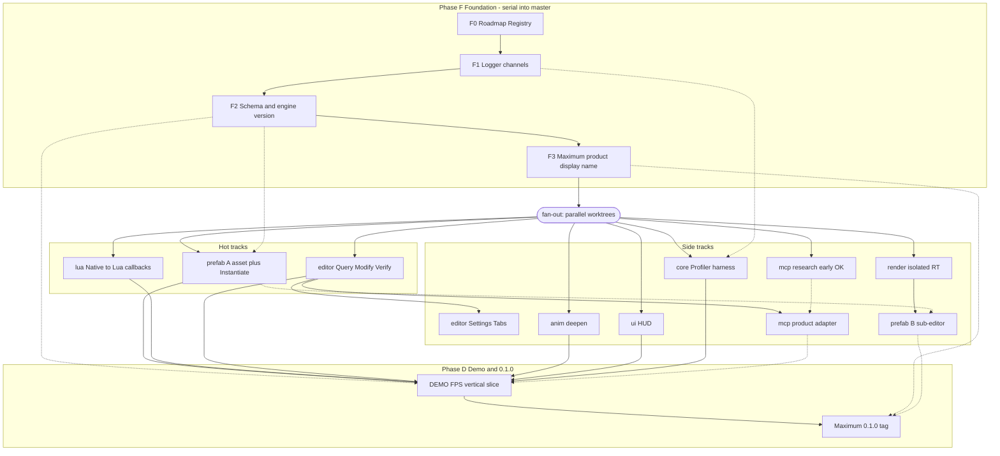

# Maximum 0.1.0 Roadmap（推向可玩 FPS Demo + Agent-friendly）

## Meta
- **ID:** N/A（跨 Feature 迭代路线图；覆盖多 DOMAIN）
- **Status:** In Progress
- **Owner:** project maintainer
- **Last updated:** 2026-09-11
- **Related:**
  - [ENGINE_DESIGN_PHILOSOPHY.md](./ENGINE_DESIGN_PHILOSOPHY.md)
  - [ENGINE_CAPABILITY_ROADMAP.md](./ENGINE_CAPABILITY_ROADMAP.md)（长期多轨；本文件 = **0.1.0 收口窗口**）
  - [ACTIVE_WORK.md](./ACTIVE_WORK.md) · [FEATURE_REGISTRY.md](./FEATURE_REGISTRY.md)
- **Trust:** Tier A — 与 ACTIVE_WORK 共同指导 0.1.0 窗口；具体下一刀以 ACTIVE_WORK 为准
- **Product name:** 编辑器**产品名 / 构建产物显示名** → **Maximum**（仓库/路径不必改成 Maximum；标志引擎 **0.1.0**，当前心智 **≈0.0.9**）

## TL;DR

本周期目标不是「再堆一个系统」，而是把已有 Anim / UI / Physics / Render / Play Mode **收成一条可玩竖切**，并让 Engine **天然适合人 + AI 协作做游戏**。

- **验收锚点：** 第一人称迷你射击 Demo（单机）+ Agent 同源 API 可查改验证。
- **执行模型：** **先 Core 地基合入 `master`**（Logger Channel + Schema/引擎版本 + Maximum 品牌名）→ **再 fan-out 多 worktree**（editor / anim / ui / lua / mcp / prefab）并行；Core 续做 Profiler。
- **Prefab 两期：** A = 资产 + Instantiate（可先行）；B = Unity 式独立 Prefab 子编辑器（依赖 **隔离渲染目标 / 非单 RDG 复用同尺寸 RT**，见 §3.4）。
- **MCP：** 可早开研究分支，但 **产品化适配必须接在 Editor Query–Command 面之后**（禁止双轨 API）。
- **明确后置：** 完整 GAS、完整 AnimBP、多人联网（§6）。

## Scope

### In
- 0.1.0 里程碑定义、Wave 划分、待登记 Feature 清单、Demo 验收、依赖/风险、与 Capability Roadmap 的关系
- Prefab、EditorSettings、Agent-friendly / MCP、Logger、Lua↔C++、Profiler、Schema 版本、产品命名
- Anim / UI / Physics / Render 在 Demo 所需范围内的加深提示

### Out
- 单 Feature 详细 Design / 切片 DoD（各自 `*_DESIGN.md`）
- 立即开码；未评审前不改 Registry Status 为 In Progress
- 把 Networking / 完整 ASC 写进 0.1.0 **必达**

## Reader quick start

1. 读本文件 §1 原则 + §2 Demo 验收。
2. 看 **§3.0 拓扑依赖图**（顺序一览），再读 §3.1–§3.6 说明与 §4 待登记 Feature。
3. 动手前：Registry 登记 → Design → Pre-flight；日常焦点仍以 [ACTIVE_WORK.md](./ACTIVE_WORK.md) 为准。
4. 长期轨图仍看 [ENGINE_CAPABILITY_ROADMAP.md](./ENGINE_CAPABILITY_ROADMAP.md)。

---

## 1) 方向与原则

### 1.1 产品命题

| 命题 | 含义 |
|------|------|
| **可做小游戏** | 一条 FPS 竖切能在 Maximum 里打开、Play、迭代资产，而不靠大量手改 JSON |
| **适合 AI 做游戏** | 人 / Editor / CLI / Lua / Agent **同一套** Query·Command·Reflection·Serialization；MCP 是薄适配层 |
| **Capabilities, not Opinions** | 枪、敌人、弹药、血条在 **Demo / Game Package**；Engine 提供 Prefab、物理查询、动画、UI、事件、脚本钩子 |
| **0.1.0 = 可演示的契约** | 版本号、schema、样例项目、命名一并冻结到「可对外说 Maximum 0.1.0」 |

### 1.2 Agent-friendly（硬约束）

- **先 Engine 面，后 MCP：** 没有稳定 `list/get/set/invoke/verify`，不上复杂 MCP 服务器产品化。
- **禁止**独立 Agent Framework 与双轨世界模型。
- Editor 多 Tab、Settings、Console 都是 **同一控制面** 的不同皮肤。

### 1.3 哲学闸门（本周期主动挑战）

| 冲动 | 默认立场 |
|------|----------|
| 为 FPS 先做完整 Character/GAS | **否** — 先 Character 移动/瞄准 **机制** 或 Demo 专用组件；Tag/Event 已有则复用 |
| 为「多人」先做 Net | **否** — 0.1.0 单机验收；Net 单开 0.2 愿景（依赖 Schema、对象身份、Prefab） |
| 为敌人先做通用 AI Framework | **否** — Demo 用简单感知 + 状态机 / Lua；真需求再立 `GP`/`AI` Feature |
| 多 Tab + MCP + Prefab 编辑器同时 Primary | **否** — 地基先合入；fan-out 后每轨一 Primary |
| 六个分支同时深挖实现 | **慎** — 允许并行，但合并窗口要短；MCP 研究 ≠ MCP 产品化 |
| Prefab 子编辑器阻塞 Prefab 机制 | **否** — Instantiate 先交付 Demo；隔离 RT 另开 Render/Editor 依赖项 |
---

## 2) Demo 验收（First-Person Mini Shooter）

### 2.1 体验目标（玩家侧）

- 第一人称视角移动与瞄准（键鼠）。
- 射击：命中世界几何 / 简单目标（物理 Raycast 或 overlap）。
- 至少一个 **Skeletal** 角色或武器相关 3D 动画（Idle / Fire 或敌人受击即可）。
- 至少一个有意义的 **渲染** 展示（方向光/点光、材质、阴影可用即可，不追求影视级）。
- HUD：弹药 / 准星等用现有 ScreenUI（不必新 UI Framework）。
- 可用 Prefab 刷出目标或弹匣类物体（体现 Prefab，而非手摆唯一实例）。

### 2.2 工程验收（开发者 / Agent 侧）

| # | 验收项 |
|---|--------|
| D1 | 样例工程在 Maximum 中打开；`ProjectRoot` 正确；场景可 Play / 退出回 Edit |
| D2 | 关键资产带 **schema / 引擎版本** 元数据；旧资产有明确失败或迁移策略（哪怕先「拒绝加载」） |
| D3 | Prefab 可实例化到当前 Scene（Editor 或 Runtime API）— **不要求** 0.1.0 必达 Prefab 独立子编辑器 |
| D3b | （加分 / 理想）Prefab 子编辑器：隔离预览 Scene + 独立 RT，无主视口串图 |
| D4 | Lua 能订阅至少一种 C++ 侧事件/委托（例如命中、开火）并改游戏状态 |
| D5 | 一组 **无 GUI** Command/Query smoke：查 Scene 对象数、改一个属性、触发一次验证 |
| D6 | （可选加分）同一 smoke 经 MCP 适配层调用通过 |
| D7 | 固定场景跑出一份 **帧时基线报告**（Profiler MVP），可存档对比 |
| D8 | 构建产物 / About / 窗口标题等展示 **Maximum 0.1.0** |

### 2.3 Demo 明确不做（0.1.0）

- 完整枪械数值体系、库存、任务、大厅 UI  
- 导航、载具、大地图流式加载  
- 权威服务器多人同步（见 §6）  
- 完整敌人导航网格 / Behavior Tree 产品化  

---

## 3) 执行模型与 Waves

### 3.0 拓扑依赖图（推荐阅读顺序）

边表示 **「完成后才能认真做 / 合入依赖」**（实线 = 硬依赖；虚线 = 软依赖或「产品化」门槛）。同层节点可并行。



图例（边未标文字，避免部分渲染器解析失败）：

| 边 | 含义 |
|----|------|
| `F0→F1→F2→F3` | 地基硬顺序 |
| `F3→FanOut→热/支线` | 合入后再并行 |
| `EdQC→McpP` | MCP 产品化硬依赖控制面 |
| `IsoRT→PrefabB` | 子编辑器硬依赖隔离 RT |
| 虚线 | 软依赖 / 加分（Schema→PrefabA、McpP→Demo、PrefabB→Tag 等） |

**读图要点：**

| 观察 | 含义 |
|------|------|
| F1→F2→F3 在一条链上 | 地基串行合入，再 fan-out |
| PrefabA ∥ EdQC ∥ LuaCB | 热轨无互相硬阻塞 |
| McpP 在 EdQC 之后 | 研究可早开；产品化必须跟控制面 |
| PrefabB 只挂在 IsoRT 下 | 串图问题不挡 PrefabA / Demo |
| 虚线进 Demo/Tag | 软依赖或加分项 |

**一层拓扑序（便于排期勾选）：**

1. `F0 → F1 → F2 → F3` → 合入 `master`  
2. 并行启动：`EdQC` · `PrefabA` · `LuaCB` ·（可选）`Anim` · `UI` · `Prof` · `McpR` · `IsoRT`  
3. `EdQC` 稳定后：`McpP` · `EdSet`  
4. `IsoRT` 完成后：`PrefabB`（可进 0.1.x）  
5. `Demo → Tag`（0.1.0；不要求 PrefabB）

### 3.1 维护者理想排序（已采纳为默认）

```text
┌─ Phase F（Foundation，串行合入 master）─────────────────────────┐
│  Logger channels  +  Schema/引擎版本  +  Maximum 品牌名（显示名）   │
│  （各 feat 分支都会长期依赖；先合入再 fan-out，减少重复冲突）        │
└────────────────────────────────────────────────────────────────┘
                              │
                              ▼
┌─ Phase P（Parallel worktrees）─────────────────────────────────┐
│  feat/editor   → Query/Command/Verify 世界状态；Settings；Tab…   │
│  feat/prefab   → Prefab A（资产+Instantiate）；B 视渲染隔离进度   │
│  feat/lua      → C++ → Lua / Delegate 回调                     │
│  feat/mcp      → 研究 + 薄适配（产品化等 Editor 控制面）          │
│  feat/anim     → 继续 Anim 机制加深（服务 Demo）                 │
│  feat/ui       → 继续 UI/HUD 加深（服务 Demo）                   │
│  master/core   → Profiler harness（可观测性）                    │
│  （可选）feat/render-isolation → 多视图/隔离 RT（解锁 Prefab 编辑器）│
└────────────────────────────────────────────────────────────────┘
                              │
                              ▼
┌─ Phase D（Demo + 0.1.0 tag）───────────────────────────────────┐
│  DEMO FPS 竖切合并；Agent smoke；Perf 基线；Maximum 0.1.0 打标     │
└────────────────────────────────────────────────────────────────┘
```

**对排序的评价（伙伴立场）：**

| 点 | 评价 |
|----|------|
| 地基先做 Log + Schema + 品牌 | **同意** — 全局契约，fan-out 前合入最划算 |
| 品牌名放地基 | **同意** — 成本低、减少「各分支各改标题」 |
| 然后多分支并行 | **同意方向**；建议 **热轨 ≤3–4**（editor / prefab / lua 必热；anim/ui 按 Demo 需要；mcp 可「冷研究」） |
| editor 主攻世界 Query–Modify–Verify | **同意** — 这是 Agent-friendly 的真源；MCP 只适配 |
| core 做 Profiler | **同意** — 与编辑器 UI 解耦 |
| mcp 与 editor 同时开 | **可以研究并行**；**实现契约以 editor/core API 为准**，mcp 分支禁止发明第二套操作语义 |
| Prefab 与「Unity 式子编辑器」 | **拆成 A/B**（下节）— 子编辑器被渲染隔离挡住时，**不要**堵死 Prefab A |

### 3.2 Phase F — Foundation（合入后再开并行）

| 顺序 | 能力 | 说明 |
|------|------|------|
| F0 | Roadmap → In Progress；Registry 登记 | 短 |
| F1 | **Logger multi-channel** | 取代 EngineCore/App 双 Logger 心智；过滤友好 |
| F2 | **Schema + 引擎版本注入** | 资产/序列化契约；加载失败策略 |
| F3 | **Maximum 品牌名** | 窗口标题 / About / 构建产物**显示名**（路径可仍叫 Editor） |

F1–F3 可在同一 `feat/core`（或 `master` 短切片）内串行；**全部合入 `master` 后再 fan-out**，避免六分支各改 Logger/Schema 一次。

### 3.3 Phase P — 并行轨职责

| Worktree / 分支 | Primary 焦点 | 合入门槛（对 0.1.0） |
|-----------------|--------------|---------------------|
| `feat/editor` | 世界 **Query / Modify / Verify**；EditorSettings；多 Document Tab（可后于控制面） | D5 级 smoke 可无 GUI 跑通 |
| `feat/prefab` | **Prefab A**：资产格式 + Instantiate（Runtime≡Editor API） | D3 |
| `feat/lua` | Native Delegate / Event → Lua 回调 | D4 |
| `feat/mcp` | MCP 协议调研 + 适配层草案；**实现跟 Editor API** | D6 加分；可晚于 editor 首刀 |
| `feat/anim` | F03 收口 / F04… 按 Demo 需要 | Demo 动画验收 |
| `feat/ui` | HUD 控件/布局按 Demo 需要 | Demo HUD |
| `master` / `feat/core` | **Profiler harness** | D7 |
| （可选）`feat/render-*` | **隔离渲染**（见 §3.4） | 解锁 Prefab B / 多预览 |

**合并纪律（吸取上一波经验）：**

- 地基相关改动 **禁止**在 fan-out 后各分支分叉再改一版。  
- 定期（例如每 Feature 切片）向 `master` 合入，避免再次「38 commit 大合并」。  
- `MyMEProject.meproject` 的 `ProjectRoot` **按 worktree 改本地、勿提交错树路径**。

### 3.4 Prefab A / B 与渲染隔离（重要）

| 期 | 内容 | 依赖 |
|----|------|------|
| **Prefab A（0.1.0 必达倾向）** | Prefab 资产 + Instantiate 进当前 Scene；极简 override | Schema（F2）；**不**依赖隔离 RT |
| **Prefab B（理想 / 可延到 0.1.x）** | Unity 式：打开 Prefab → 放入**隔离编辑 Scene** → 独立子编辑器保存回资产 | **隔离渲染**：不能「单 ForwardRenderer + 单 RDG」把多视口/同尺寸 RT 编进同一图导致 **backbuffer/RT 复用串图** |

**已知挡点（维护者）：** 仅用一套 ForwardRenderer + 一张 RDG 渲染所有 RT 时，同尺寸资源被复用 → 主视口与预览/离屏 **串图**。相关债可参考 Content Browser 缩略图路径（如 TD-027：缩略图与主 Forward 共用 RDG color）。

**建议解锁路径（择一或组合，需单独 Design）：**

1. **每预览上下文独立 Renderer 或独立 RDG 实例**（预览 Scene 自有 graph）  
2. **显式 RT 身份 / 禁用错误别名**（同尺寸不等于可复用同一 transient）  
3. **预览走简化 Manual/离屏路径**（功能子集，专供 Prefab/缩略图）

**默认立场：** Prefab B **不阻塞** Prefab A 与 FPS Demo；隔离渲染作为 **Render/Editor 显式 Feature**（建议登记如 `RND-F17` Isolated preview targets 或 `ED-F12` Prefab stage），与 Prefab 机制解耦排期。

### 3.5 Phase D — Demo + Maximum 0.1.0

同原 Wave 6：FPS 竖切、Agent smoke、Perf 基线、版本打标。Prefab B / 精美 Tab 宿主若未完成，**不挡** 0.1.0，可进 changelog「Known limitations」。

### 3.6 与旧 Wave 编号对照

| 旧 Wave | 现归属 |
|---------|--------|
| 0 命名 | Phase F3 + F0 |
| 1 Schema | Phase F2 |
| Logger / Profiler | F1 / Phase P core |
| 2 Prefab | Phase P prefab A；（B→隔离渲染后） |
| 3 Agent→MCP | Phase P editor → mcp |
| 4 Lua | Phase P lua |
| 5 Settings/Tab | Phase P editor（控制面之后） |
| 6 Demo | Phase D |

---

## 4) 待登记 Feature（评审后写入 Registry）

> 下列 ID 为 **建议占用**（按当前 Next free）；**批准本 Roadmap 后再正式登记**，避免抢号。

| 建议 ID | 标题 | Phase | 备注 |
|---------|------|-------|------|
| `CORE-F17` | LogChannel + structured LogRecord | F1 | **Done** · [Design](./Platform/Core/CORE-F17_LOGGING_CHANNELS_DESIGN.md) · 术语 LogChannel（非 Category） |
| `CORE-F18` | EngineVersion + disk schema gate / `$engineVersion` stamp | F2 | **Done** · engine **0.0.9** / schema **1** · [Design](./Platform/Serialization/CORE-F18_SCHEMA_ENGINE_VERSION_DESIGN.md) |
| `WF-F03` | Maximum 产品显示名与版本展示 | F3 | **Done** · [Design](./Platform/Docs/WF-F03_MAXIMUM_PRODUCT_BRANDING_DESIGN.md) |
| `CORE-F19` | Prefab A（资产 + Instantiate） | P prefab | 待 F 后登记 |
| `ED-F12` 或 `RND-F17` | Isolated preview / multi-RT（解串图） | P render | 待登记；**推荐占 `RND-F17`**（`ED-F12` 留给 Query 面） |
| `ED-F13` | Prefab stage / 子编辑器（隔离 Scene） | P prefab B | 依赖隔离 RT |
| `CORE-F20` | Lua ↔ Native callbacks | P lua | 待登记 |
| `CORE-F21` | Profiling harness | P core | 待登记 |
| `ED-F09` | Editor Log Console（LogRecord UI / filter） | P editor / 跟 F17 | **Done**（W0–W2） · [Design](./Editor/ED-F09_LOG_CONSOLE_RECORD_UI_DESIGN.md) |
| `ED-F10` | EditorSettings（原草案 F09） | P editor | **Planned 占位** · Design 未开 |
| `ED-F11` | Multi-document Tab host MVP | P editor | **In Progress**（W0–W2） · [Design](./Editor/ED-F11_MULTI_DOCUMENT_TAB_HOST_DESIGN.md) |
| `ED-F12` | Agent Edit Protocol（资产 Session × Command） | P editor | **Done** · [Design](./Editor/ED-F12_AGENT_EDIT_PROTOCOL_DESIGN.md)（edit/verify → 下一 Feature） |
| `MCP-F01` | MCP adapter（thin） | P mcp | DOMAIN 待定 |
| `DEMO-F01` | FPS mini-shooter sample | D | Demo Package |
### 已有、本周期顺带

| ID | 角色 |
|----|------|
| `ANIM-F03` | 收口 Done；Demo 若用 Graph |
| `ANIM-F04` / `F05` | **P anim 支线** |
| `UI-F04+` | **P ui 支线** |
| `ED-F02` / `ED-F04` | 作者路径与 Command 底座 |
| `PHYS-F03` | Contact 派发 — 按需 |
| `GP-F01` / `F02` | Tag / Event — Demo 优先复用 |
| `RND-F06` | 不升主航道；隔离预览另立 Feature |
| TD-027 | 缩略图与主 RDG 共用 — 与隔离 RT 同源问题族 |
---

## 5) 支线：Anim / UI / 其它（「值得做」但不挡 0.1.0）

| 域 | 可做内容 | 何时拉入 Primary |
|----|----------|------------------|
| Animation | F03 smoke；F04 1D Blend（走跑混合）；预览窗；Play 高亮 | Demo 移动手感明显不够时 |
| UI | 更多控件、锚点/安全区、世界空间 UI | HUD 做不动或布局债爆时 |
| Physics | 查询封装、击中过滤、简单 Character 胶囊 | 射击手感/移动穿透 |
| Audio | 开火/命中 one-shot 接入 Demo | 体验完整度 |
| Render | 准星后处理、简单 decal — 克制 | 纯表现加分，勿挡机制 |

---

## 6) 更大想法：AI Framework · 网络多人

### 6.1 「AI」在本周期的含义

| 层次 | 建议 |
|------|------|
| **Agent（做游戏的 AI）** | Phase P：**editor 控制面** 为主；**mcp** 为适配 |
| **游戏内 AI（敌人）** | Demo 用脚本/简单 SM；缺口清晰后再立 `GP-F03` Perception 或 `AI-F01` **机制**（不是行为树产品） |
| **完整 ASC/GAS** | **Out of 0.1.0**；违反 Minimal Core 除非改为 Optional Plugin 且有真实复用需求 |

### 6.2 网络 + 服务器（愿景 · 建议标为 0.2.x）

多人在线是合理的下一座山，但 **不要与 0.1.0 FPS 单机验收绑死**。

**建议前置（0.1.0 尽量铺好）：**

1. Schema / 引擎版本（Phase F2）  
2. 稳定对象身份与序列化边界（已有 CORE-F09 方向，继续消化债）  
3. Prefab A（可复制世界碎片）  
4. 明确 Net 哲学：复制的是 **状态与命令**，不是第二次写游戏逻辑  

**0.2 愿景里程碑（仅占位，不排期）：**

| 里程碑 | 内容 |
|--------|------|
| N0 | `NET` DOMAIN + Design：复制模型、谁权威、Tick 边界 |
| N1 | 本地 Listen Server 或专用服务器进程 + 一个可同步的 Transform/开火事件 |
| N2 | 2 人同场景射击互打竖切 |
| N3 | 与 MCP/Agent 的关系：Agent 连的是工具面，不是伪造客户端 |

**挑战：** 过早为 Net 抽象一切（通用 Replication Graph、完整 Prediction）会拖垮 0.1.0。默认：**先单机 Demo 证明内容管线，再开 NET-F01。**

---

## 7) 依赖与风险

| 项 | 说明 |
|----|------|
| 依赖 | Play Mode MVP；Command Console MVP；Anim/UI/Phys 雏形；Import 管线 |
| 风险 | 六分支并行 → 合并冲突与 ProjectRoot 再次指错树 |
| 风险 | MCP 研究分支提前「定死」API，与 editor 控制面分叉 |
| 风险 | Prefab B 与隔离 RT 绑死，拖死 Prefab A / Demo |
| 风险 | 单 RDG 多 RT 串图未立项，却承诺 Unity 式 Prefab 编辑器 |
| 风险 | Prefab Overrides / 多 Tab 范围膨胀 |
| 风险 | FPS Demo 把 Weapon/Character 写进 Core |
| 缓解 | Phase F 先合入；热轨限制；Prefab A/B 拆分；MCP 只适配；定期向 master 合 |

---

## 8) 与 ACTIVE_WORK / Capability 的衔接

| 文档 | 关系 |
|------|------|
| 本文件 | **0.1.0 迭代窗口**（Phase F → P → D） |
| `ENGINE_CAPABILITY_ROADMAP` | 长期 M4–M8；本周期消化 M5、M7、Prefab、可观测性 |
| `ACTIVE_WORK` | 评审后：Primary = Phase F；fan-out 后按轨更新 |

**维护者确认后建议动作：**

1. Status → **In Progress**  
2. Registry 登记 Phase F 三项（Log / Schema / Brand），再登并行轨 ID  
3. ACTIVE_WORK 锁定 **Phase F** 为第一刀（建议序：Log → Schema → Brand，或 Brand 穿插）  
4. 开 Logger 或 Schema Design + Pre-flight  
5. Prefab B / 隔离 RT 单独立项，不写进 Prefab A DoD  

---

## 9) 延后索引（0.1.0 默认不做）

| 项 | Unblock |
|----|---------|
| Prefab B 子编辑器（若隔离 RT 未完成） | `RND-F17`/`ED-F12` 类 Feature Done |
| Nested SM / 完整 AnimBP / IK / Root Motion / Retarget | Demo 需要或 0.2 |
| RND-F12 / Sort-Batch 主航道 | 性能数字证明瓶颈 |
| PHYS-F03 完整 gameplay 派发 | Raycast/查询不够用 |
| Prefab 深度 Overrides / Nested Prefab 同步 | Prefab A 用痛后 |
| Listen Server / Dedicated / 预测回滚 | 0.1.0 主验收完成 + NET Design |
| 完整 AI Framework / GAS | Plugin 提案 + 复用证据 |
| VK 阴影质量 | 视觉债触发 |
| MCP 富工具集 / 资源生成 Agent | ED-F11 稳定之后 |

---

## 10) 变更记录

| 日期 | 说明 |
|------|------|
| 2026-09-10 | Draft：FPS Demo、Wave 0–6、Prefab/Settings/Agent/MCP/Logger/Lua/Profiler/Schema/Maximum；Anim/UI 支线；Net/AI 后置 |
| 2026-09-10 | 修订：采纳「地基先合入再 fan-out」；Prefab A/B + 隔离 RT/串图挡点；并行轨职责与合并纪律；验收 D3b |
| 2026-09-10 | 增补 §3.0 Mermaid 拓扑依赖图 + 一层拓扑序 |
| 2026-09-10 | 修复 Mermaid：去掉连到 subgraph 的边、嵌套 subgraph、边上中文标签与特殊字符 |
| 2026-09-11 | Status → **In Progress**；登记 Phase F：`CORE-F17` / `CORE-F18` / `WF-F03` |
| 2026-09-11 | `CORE-F17` → **Done**（硬切 ME_LOG + logging-channels 单测） |
