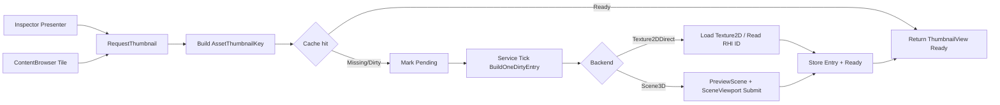
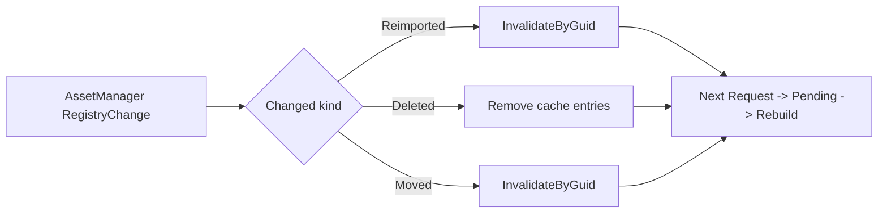

# AssetThumbnailService 统一缩略图服务设计（Inspector + Content Browser）

Last updated: 2026-05-28  
Status: **draft v0.1 — 待审批**  
父文档：[`EDITOR_TASK_ROLLOUT_2026-05-27.md`](./EDITOR_TASK_ROLLOUT_2026-05-27.md)  
相关：[`PREVIEWER_DESIGN.md`](./PREVIEWER_DESIGN.md), [`CB_TILE_DISPLAY_DESIGN.md`](./CB_TILE_DISPLAY_DESIGN.md)

---

## 0) 目标与拍板范围

本设计聚焦一个目标：**将 Inspector Preview 与 Content Browser Tile Thumbnail 统一为同一个服务模型**。

- 一个服务：`AssetThumbnailService`
- 两个调用方：Inspector / Content Browser
- 一份缓存：按资产键共享渲染结果
- 两种后端：`Texture2DDirect` 与 `Scene3D`

### 本轮拍板（v0.1）

- 缓存键 **不包含 RT 尺寸**（先共享结果，不做多分辨率）
- `Texture2D` 走直接纹理句柄
- `Material` / `StaticMesh` 走 `PreviewScene + SceneViewport` 渲染到服务 RT
- Inspector 不再每帧无条件 `SubmitSceneDraw`；改为服务内 dirty 驱动

---

## 1) 当前现状（重构前）

### 1.1 Inspector

- 入口：`InspectorPreviewPresenter::DrawSquarePreviewSlot()`
- 行为：每次 Draw 在 Scene3D 分支调用 `InspectorAssetInspection::RenderInspection()`
- 结果：`RenderInspection()` 内会执行 `RenderSystem::Get().SubmitSceneDraw(desc)`，导致静态预览也每帧提交

### 1.2 Content Browser

- `ContentBrowserWindow::DrawTileAssetIcon()` 当前是 Icon Font 绘制
- 未接入缩略图请求/缓存链路

### 1.3 问题本质

- 预览策略与缓存策略耦合在 Inspector 局部
- CB 无法复用 Inspector 生成结果
- UI 代码直接驱动渲染，不利于统一失效和预算控制

---

## 2) 设计原则

1. **单一真源**：所有资产缩略图都由 `AssetThumbnailService` 产出与缓存  
2. **UI 只消费状态**：窗口层不直接 submit，不持有渲染策略  
3. **按资产共享**：Inspector 与 CB 读取同一缓存 entry  
4. **增量演进**：先实现无尺寸键与同步路径，后续再扩展 size bucket / async  

---

## 3) 类型与数据结构（MVP 扁平版）

以下类型为建议的 C++ 草案，命名遵循当前工程风格（PascalCase, `m_` 成员）。

```cpp
enum class ThumbnailBackendKind : uint8_t
{
    None = 0,
    Texture2DDirect, // Texture2D::GetRHITexture()->GetID()
    Scene3D          // PreviewScene + SceneViewport -> RT
};

enum class ThumbnailState : uint8_t
{
    Empty = 0,
    Pending,
    Ready,
    Failed
};

enum class ThumbnailUsageHint : uint8_t
{
    Inspector = 0,
    ContentBrowser
};
```

```cpp
struct AssetThumbnailKey
{
    GUID AssetGuid = GUID::Zero();
    ThumbnailBackendKind BackendKind = ThumbnailBackendKind::None;

    bool IsValid() const;
    bool operator==(const AssetThumbnailKey& rhs) const;
};
```

```cpp
struct ThumbnailRequest
{
    const AssetMeta* Meta = nullptr;       // 调用时必须非空
    ThumbnailUsageHint Usage = ThumbnailUsageHint::Inspector;
};
```

```cpp
struct ThumbnailView
{
    ThumbnailState State = ThumbnailState::Empty;
    ImTextureID TextureId = nullptr;       // Ready 时有效

    // 供 UI 做 aspect-fit
    uint32_t Width = 0;
    uint32_t Height = 0;

    ThumbnailBackendKind BackendKind = ThumbnailBackendKind::None;
};
```

```cpp
struct ThumbnailCacheEntry
{
    ThumbnailState State = ThumbnailState::Empty;
    bool bDirty = true;                    // 首次请求后需要构建

    // 输出
    std::shared_ptr<RHITexture2D> RenderTargetTexture; // Scene3D 路径
    std::shared_ptr<Texture2D> TextureAsset;           // Texture2DDirect 路径
    ImTextureID CachedTextureId = nullptr;
    uint32_t Width = 0;
    uint32_t Height = 0;
};
```

```cpp
struct ThumbnailServiceConfig
{
    uint32_t FixedScene3DRenderSize = 256;   // v0.1 固定尺寸（不进 key）
    uint32_t MaxBuildJobsPerTick = 1;        // 每帧最多构建任务
};
```

---

## 4) 服务接口设计

```cpp
class AssetThumbnailService
{
public:
    void Initialize();
    void Shutdown();
    void Tick(float deltaTime);

    ThumbnailView RequestThumbnail(const ThumbnailRequest& request);

    void InvalidateByGuid(const GUID& assetGuid);
    void InvalidateAll();

private:
    ThumbnailBackendKind ResolveBackendKind(const AssetMeta& meta) const;
    AssetThumbnailKey BuildKey(const AssetMeta& meta) const;

    ThumbnailView BuildViewFromEntry(const ThumbnailCacheEntry& entry) const;
    ThumbnailCacheEntry& GetOrCreateEntry(const AssetThumbnailKey& key);

    void BuildOneDirtyEntry();                     // Tick 中按预算推进
    void BuildEntryNow(ThumbnailCacheEntry& entry);
    void BuildTexture2DEntry(ThumbnailCacheEntry& entry);
    void BuildScene3DEntry(ThumbnailCacheEntry& entry);
    void MarkEntryFailed(ThumbnailCacheEntry& entry);

    void SubscribeAssetRegistryEvents();
    void UnsubscribeAssetRegistryEvents();
    void HandleAssetRegistryChange(const AssetRegistryChange& change);

private:
    ThumbnailServiceConfig m_Config{};

    // Key -> Entry
    std::unordered_map<AssetThumbnailKey, ThumbnailCacheEntry, AssetThumbnailKeyHasher> m_Cache;

    // 复用 Inspector 现有规则：一个服务级 PreviewScene/Viewport
    PreviewScene m_PreviewScene;
    SceneViewport m_PreviewViewport;
    bool m_ViewportInitialized = false;
    uint32_t m_ViewportWidth = 0;
    uint32_t m_ViewportHeight = 0;

    uint32_t m_RegistrySubscriptionId = 0;
};
```

---

## 5) 后端策略规则（v0.1）

| AssetType | BackendKind | 输出来源 |
|----------|-------------|----------|
| `Texture2D` | `Texture2DDirect` | 资产 `RHITexture2D::GetID()` |
| `Material` | `Scene3D` | `PreviewScene` 默认球 + 材质 |
| `StaticMesh` | `Scene3D` | `PreviewScene` mesh + 默认预览材质 |
| 其他 | `None` | 不生成缩略图（UI fallback icon） |

> 说明：`Scene` / `Font` / `Shader` 继续走 CB Icon Font，不强制缩略图化。

---

## 6) 调用关系与数据流

### 6.1 请求-构建-消费（统一）



### 6.2 失效路径（MVP）



---

## 7) 与现有代码映射（重构建议）

### 7.1 复用来源

- `InspectorAssetInspection::ResolveDisplayKind()`  
  -> 迁移为 `AssetThumbnailService::ResolveBackendKind()`

- `RebuildScene3DPreview()` / `RebuildTexture2DPreview()`  
  -> 拆分迁移为 `BuildScene3DEntry()` / `BuildTexture2DEntry()`

- `RenderInspection()`  
  -> 迁移 submit 逻辑到 `BuildScene3DEntry()`（仅 dirty 执行）

### 7.2 UI 层改造

- `InspectorPreviewPresenter`  
  - 改为 `RequestThumbnail({meta, Inspector})` + 显示结果
  - 删除直接 `RenderInspection()` 调用路径

- `ContentBrowserWindow::DrawTileAssetIcon`  
  - 先请求缩略图
  - `Ready` -> `ImGui::Image`
  - `Pending/Failed/Unsupported` -> 继续现有 Icon Font fallback

---

## 8) 迁移步骤（建议）

### Phase 1：服务落地 + Inspector 接入

1. 新增 `AssetThumbnailService`（先放 `Editor/src/Services/Inspector/` 或 `Editor/src/Services/Thumbnail/`）
2. 将 `InspectorAssetInspection` 逻辑迁入服务
3. `InspectorPreviewPresenter` 改为只请求和绘制
4. 验证：静态 Material/StaticMesh 不再每帧 submit

### Phase 2：CB 复用同缓存

1. `ContentBrowserWindow` 请求同服务
2. `Texture2D` 优先显示真实缩略图
3. `Material/StaticMesh` 复用 Scene3D 缓存
4. 验证：同一资产在 Inspector/CB 呈现一致

### Phase 3：事件失效与预算

1. 接 AssetManager `Subscribe`
2. 实现 `Invalidate` 策略
3. 每帧构建预算（`MaxBuildJobsPerTick`）

---

## 9) MVP 验收标准

- [ ] Inspector 选中 `Material`/`StaticMesh` 时首次生成，之后静态停留不重复 submit  
- [ ] Inspector 与 CB 对同一资产复用同一缓存结果  
- [ ] `Texture2D` 通过 direct texture 显示，无 Scene submit  
- [ ] `Reimported` 后预览可自动刷新（下一次请求触发重建）  
- [ ] 未支持类型稳定 fallback（Icon Font / 占位）  

---

## 10) 已知风险与后续扩展

### v0.1 风险

- 固定单尺寸 RT 在 Inspector 放大时可能偏糊
- Scene3D 构建仍是同步路径，首次批量可见时有瞬时开销

### 后续可扩展（不阻塞 v0.1）

- Key 增加 `SizeBucket`（例如 128/256）
- LRU 回收与内存上限
- 异步/分帧任务队列
- 磁盘持久化缩略图（hash + version）

> 注：v0.1 刻意不引入过多调试字段/接口，先保持缓存 entry 扁平和调用链最短。

---

## 11) 审批清单（请勾选）

- [ ] A1：同意缓存键使用 `AssetGuid + BackendKind`（v0.1 不含尺寸）  
- [ ] A2：同意 `Texture2DDirect` + `Scene3D` 两后端模型  
- [ ] A3：同意 Inspector/CB 一律通过 `AssetThumbnailService::RequestThumbnail`  
- [ ] A4：同意先做同步 MVP，再做异步/LRU/持久化  

---

## 12) 变更记录

| 日期 | 说明 |
|------|------|
| 2026-05-28 | v0.1 初稿：统一服务模型、类型设计、流程图、迁移步骤、审批清单 |
| 2026-05-28 | v0.1 修订：按 MVP 扁平化，移除 Entry 冗余 Key 与多余调试接口/字段。 |

