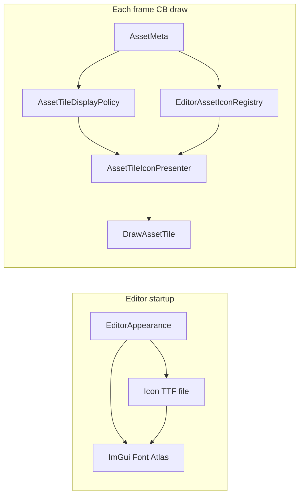

# CB Tile 展示设计 — Icon Font + 缩略图双通道

Last updated: 2026-05-28  
Status: **v0.1 — 设计拍板待实施**（先通 Icon Font，再逐步通缩略图）  
父文档：[EDITOR_TASK_ROLLOUT_2026-05-27.md](./EDITOR_TASK_ROLLOUT_2026-05-27.md) §C、[CONTENT_BROWSER_UI_DESIGN.md](../Platform/ContentBrowser/CONTENT_BROWSER_UI_DESIGN.md) §2.6  
相关：[PREVIEWER_DESIGN.md](./PREVIEWER_DESIGN.md)（E2.2b Inspector / E2.3b CB 缩略图）、[EDITOR_APPEARANCE.md](./EDITOR_APPEARANCE.md)（字体 atlas）

---

## 0) 背景

Content Browser 右侧 **Tile Grid** 已在 `ContentBrowserWindow::DrawAssetTile()` 预留 **120×120** 正方形 Icon 槽（`ViewMetrics::IconSize`）。当前为统一灰色占位框 + 边框，**不区分 `AssetType`**。

Rollout **C** 原描述为「静态 Asset Icon、缩略图后置 E2.3b」。经 2026-05-28 讨论，目标升级为：

> **同一 Icon 槽支持两种展示模式**，由 **`AssetType` 策略** 决定走 **Icon Font** 还是 **Thumbnail**；**先落地 Icon Font 通道**，缩略图按类型分批接入。

---

## 1) 目标与非目标

### 目标

- 为 CB Tile 建立 **可扩展的展示策略层**（不把所有逻辑堆在 `DrawAssetTile`）。
- **Phase C1**：接入 Icon Font（字体选型 **暂缓**），按类型显示 glyph，替换占位框。
- **Phase C2+**：为指定 `AssetType` 接入 **实例级缩略图**（与 Inspector 预览复用思路）。
- 未知类型 / 加载失败时有 **稳定 fallback**（Icon Font 通用图标或占位框）。

### 非目标（本设计 v0.1）

- 左树 `DrawAssetTreeLeaf` 的小图标（可选后续，不阻塞 C1）。
- 缩略图 **异步队列 / LRU 缓存 / 磁盘持久化**（E2.3b 完整版再定）。
- 右键菜单 Action 的 `GetIcon()`（可与 CB 共用映射表，但不在 C1 范围）。
- Icon Font 套件 **最终选型**（Codicons / Material Symbols / Font Awesome 等 **TBD**）。

---

## 2) 核心概念：双通道展示

```text
AssetMeta (AssetType + AssetPath)
        │
        ▼
AssetTileDisplayPolicy  ←── 按 AssetTypeId 查表
        │
        ├── IconFont      类型级 glyph（同类型所有 tile 相同）
        │
        └── Thumbnail     实例级图像（每个资产可不同）
                │
                ▼
        DrawAssetTile icon slot (120×120, 居中, clip)
```

| 模式 | 语义 | 数据来源 | 典型类型 |
|------|------|----------|----------|
| **IconFont** | 认「类型」 | `AssetType` → glyph codepoint（IconFontCppHeaders） | Font, Shader, Scene |
| **Thumbnail** | 认「这个资产长什么样」 | 加载/渲染资产 → `ImTextureID` | Texture2D, Material, StaticMesh |

**实施顺序：** 先 **IconFont** 全类型有图（含 Thumbnail 类型的 loading fallback），再逐类型替换为 Thumbnail。

---

## 3) AssetType → 展示策略（拍板 v0.1）

Key 与 [`AssetTypeRegistry`](../../minEngine/minEngine/src/Runtime/Resource/AssetTypeRegistry.cpp) / `AssetMeta::AssetType` 一致。

| AssetTypeId | Tile 模式 | 说明 |
|-------------|-----------|------|
| `Font` | **IconFont** | 字体文件，缩略图意义不大 |
| `Shader` | **IconFont** | 脚本/代码类资产 |
| `Scene` | **IconFont** | **暂保持 Icon**（用户拍板 2026-05-28） |
| `Texture2D` | **Thumbnail** | C2：复用 E2.2b 路径（`RHITexture2D` → `ImGui::Image`） |
| `Material` | **Thumbnail** | C3：复用 Inspector Scene3D 或简化预览 |
| `StaticMesh` | **Thumbnail** | C3：同上 |
| *unknown* | **IconFont fallback** | 通用文件 glyph 或占位框 |

**C1 行为：** Thumbnail 类型在 C1 阶段仍显示 **该类型的 IconFont glyph**（非空白）；C2/C3 再替换为真实缩略图。

---

## 4) Icon Font 技术说明（IconFontCppHeaders）

参考：[IconFontCppHeaders](https://github.com/juliettef/IconFontCppHeaders)

| 组件 | 作用 |
|------|------|
| **`.h` 头文件** | `ICON_*` 常量 = Unicode **码点**；`ICON_MIN_*` / `ICON_MAX_16_*` 供 ImGui merge 范围 |
| **`.ttf` 字体文件** | 实际 glyph 轮廓；**需单独引入**（头文件不包含字体二进制，除非用 generator 转 embedded header） |
| **ImGui merge** | `io.Fonts->AddFontFromFileTTF(..., MergeMode=true)` 合并进 UI 字体 atlas |

典型用法（ImGui 官方示例风格）：

```cpp
// 1. AddFontDefault / Body font
// 2. Merge icon font with icons_ranges[] = { ICON_MIN_XX, ICON_MAX_16_XX, 0 }
// 3. Draw: ImGui::Text(ICON_XX_FOO); 或 PushFont(iconFont) + Text
```

**接入点（建议）：** [`EditorAppearance::RebuildUiFontAtlas`](../../minEngine/Editor/src/UI/Appearance/EditorAppearance.cpp) — 与现有 `EditorTypographyRole` 字体烘焙同一生命周期；Icon Font 可作为 **独立 `ImFont*`** 或 merge 进 Body（CB tile 用 `AddText` / `CalcTextSize` 居中绘制）。

**字体选型：** **TBD**（Codicons / Material Symbols / Font Awesome Free 等）。选型后固定：Third-Party 头文件路径 + `.ttf` 资源路径 + licence 记录。

---

## 5) 建议模块划分

```text
Editor/
  UI/
    ContentBrowser/
      AssetTileDisplayPolicy.h/.cpp    // AssetTypeId → enum { IconFont, Thumbnail }
      EditorAssetIconRegistry.h/.cpp   // AssetTypeId → glyph / fallback
      AssetTileIconPresenter.h/.cpp    // 在 iconMin/iconMax 内绘制（Font 或 Image）
    Appearance/
      EditorAppearance.*               // C1: LoadIconFont / GetIconFont()
  UI/EditorWindows/
    ContentBrowserWindow.cpp           // DrawAssetTile 调用 Presenter，不内联策略
```

### `AssetTileDisplayPolicy`

- `GetPolicy(assetTypeId) -> IconFont | Thumbnail`
- 静态表或 constexpr map；**Editor 侧**维护（不修改 Runtime `AssetTypeRegistry` 结构，避免引擎耦合 Editor UI）。

### `EditorAssetIconRegistry`

- `GetGlyphForAssetType(assetTypeId) -> const char*`（UTF-8 字符串，含单个 codepoint）
- `GetFallbackGlyph() -> const char*`
- 内部引用 IconFontCppHeaders 的 `ICON_*` 常量；**映射表与字体套件绑定**，换字体时只改此模块。

### `AssetTileIconPresenter`

- `DrawIconSlot(drawList, iconMin, iconMax, meta, appearance)`
- 分支：
  1. `Policy == IconFont` → 居中 `AddText`（Icon Font）
  2. `Policy == Thumbnail` && `HasThumbnail(meta)` → `AddImage`（C2+）
  3. else → **类型 IconFont** 或 **fallback 占位**（C1）

### Thumbnail 提供者（C2+，接口先行）

- `IAssetThumbnailSource` 或复用 `InspectorAssetInspection` 的加载逻辑
- `TryGetThumbnailTexture(meta) -> ImTextureID / RHITexture2D*`
- 与 [PREVIEWER_DESIGN.md](./PREVIEWER_DESIGN.md) E2.3b 对齐；C2 仅需 **同步、无缓存** MVP。

---

## 6) 渲染接入点

**主入口：** [`ContentBrowserWindow::DrawAssetTile`](../../minEngine/Editor/src/UI/EditorWindows/ContentBrowserWindow.cpp)

现有结构（保持不变）：

- `iconMin` / `iconMax`：120×120，水平居中于 tile outer
- `PushClipRect(outerMin, outerMax)`
- 其下 caption：`BuildEllipsizedLabel(meta.AssetName)`

**替换：** 当前 `AddRectFilled` + `AddRect` 占位块 → 调用 `AssetTileIconPresenter::DrawIconSlot(...)`。

**Icon Font 绘制注意：**

- 使用 Icon Font 的 `ImFont*`（或 merge 后的 Body + glyph 字符串）
- `CalcTextSize` 居中于 `iconMin/iconMax`
- 颜色：`EditorAppearance` semantic color（如 `palette.TextSecondary`），可选类型 tint（后续）

**Thumbnail 绘制注意：**

- 与 Inspector / Viewport 一致：`ImTextureID` = `(uintptr_t)rhiTexture->GetID()`
- UV 翻转：`ImVec2(0,1), ImVec2(1,0)`（与 E2.2b 一致）
- aspect-fit 于 120×120（同 `InspectorPreviewPresenter`）

---

## 7) 分阶段实施计划

### Phase C1 — Icon Font 通道（当前优先级）

| 项 | 内容 |
|----|------|
| 引入 | IconFontCppHeaders 单套头文件 + `.ttf`（套件 TBD） |
| Atlas | `EditorAppearance` 加载 Icon Font；`RebuildUiFontAtlas` 后可用 |
| 策略 | `AssetTileDisplayPolicy` + `EditorAssetIconRegistry` 映射表 |
| UI | `DrawAssetTile` 显示类型 glyph；**含 Thumbnail 类型的临时 Icon** |
| Fallback | unknown 类型 → 通用文件 icon |
| 验收 | 各 builtin 类型 tile 可区分；Dark/Light 可读；无 ImGui 字体 assert |

### Phase C2 — Texture2D 缩略图

| 项 | 内容 |
|----|------|
| 范围 | 仅 `Texture2D` 从 IconFont 升级为 Thumbnail |
| 实现 | 懒加载 `Texture2D` + `GetRHITexture()->GetID()`（同 E2.2b） |
| Fallback | 加载失败 → 该类型 IconFont glyph |
| 验收 | 网格中 png/jpg 显示真实贴图；快速滚动不崩溃 |

### Phase C3 — Material / StaticMesh 缩略图

| 项 | 内容 |
|----|------|
| 范围 | `Material`, `StaticMesh` |
| 实现 | 复用 `PreviewScene` + 小尺寸 offscreen render，或 Inspector 检视子集 |
| 风险 | 每 tile 渲染成本高 → 需考虑 **仅可见 tile** / 低分辨率 / 后续异步（E2.3b） |
| 验收 | 与 Inspector 预览视觉大致一致 |

### Phase C4 — E2.3b 完整缩略图（可选，后置）

- 异步生成、缓存、CB 刷新策略
- 与 C2/C3 MVP 解耦，不在 C1 阻塞

---

## 8) 数据流（C1）



---

## 9) 与现有文档的关系

| 文档 | 关系 |
|------|------|
| [CONTENT_BROWSER_UI_DESIGN.md](../Platform/ContentBrowser/CONTENT_BROWSER_UI_DESIGN.md) §2.6 | Tile 尺寸与 clip 规则 **不变**；§2.4「Icon font 后续」→ 本设计 |
| [PREVIEWER_DESIGN.md](./PREVIEWER_DESIGN.md) E2.2b | Texture2D Inspector 预览；C2 CB 缩略图 **复用同一 RHI→ImGui 路径** |
| [PREVIEWER_DESIGN.md](./PREVIEWER_DESIGN.md) E2.3b | CB 缩略图完整版；C2/C3 为 **子集 MVP** |
| [EDITOR_CONTEXT_MENU_DESIGN.md](./EDITOR_CONTEXT_MENU_DESIGN.md) §11.7 | 未来 `AssetType → 图标` 可与 `EditorAssetIconRegistry` **共用** |

---

## 10) 开放问题（阅读后拍板）

| # | 问题 | 默认倾向 |
|---|------|----------|
| O1 | Icon Font 套件 | **暂缓**；C1 可用占位套件（如 FA6 Free）验证管线，后再换 |
| O2 | Icon merge 进 Body vs 独立 `ImFont*` | 独立 Icon Font 更易控字号；CB tile 内 `PushFont` |
| O3 | Thumbnail 类型 C1 是否显示「类型角标」 | 否；C1 仅 IconFont，C2+ 全图替换 |
| O4 | `Shader` 映射 glyph 命名 | 代码/脚本图标（套件选定后填 `ICON_*`） |
| O5 | Third-Party 布局 | `minEngine/Third-Party/iconfont/` 或 submodule IconFontCppHeaders + `Editor/Resources/Fonts/` 存 ttf |

---

## 11) 验收标准汇总

### C1（Icon Font）

- [ ] 选中 Content Browser 任意目录，Tile 网格中 **builtin 类型** 显示不同 Icon Font glyph
- [ ] `Scene` / `Font` / `Shader` 为 IconFont 模式（非占位灰框）
- [ ] `Texture2D` / `Material` / `StaticMesh` 在 C1 显示 **类型 Icon**（尚非真实缩略图）
- [ ] 未知扩展名资产显示 fallback icon
- [ ] 切换 Dark/Light 主题后 Icon 仍可读（随 `RebuildUiFontAtlas`）

### C2（Texture2D Thumbnail）

- [ ] `Texture2D` tile 显示真实贴图（aspect-fit）
- [ ] 加载失败回退类型 Icon

### C3（Material / StaticMesh Thumbnail）

- [ ] 两类型 tile 显示预览图（允许低分辨率 MVP）
- [ ] 滚动浏览目录无明显卡顿（或接受 MVP 限制并记录）

---

## 12) 变更记录

| 日期 | 说明 |
|------|------|
| 2026-05-28 | **v0.1**：双通道模型；AssetType 策略表；C1→C3 分阶段；IconFontCppHeaders 说明；Scene 暂 IconFont |
