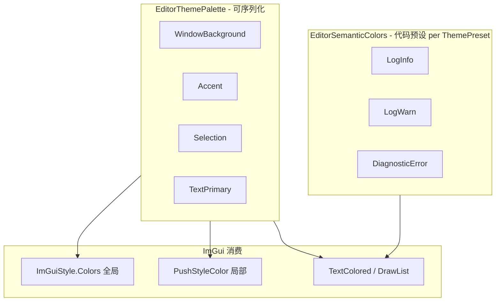

# Editor 主题色 M6 — 设计案（散落 `PushStyleColor` 清扫）

Last updated: 2026-05-26  
Status: **M6a/M6b 已合入（待人工验收 Light 主题）**；Hierarchy 选中 GO 保留蓝色；M6c 未做  
父文档：[EDITOR_APPEARANCE.md](./EDITOR_APPEARANCE.md) §5、§9  
依赖：**M1 已合入**（`EditorThemePalette`、`EditorAppearance::ApplyPaletteToImGui`）  
关联：[FONT_ASSET_DESIGN.md](./FONT_ASSET_DESIGN.md)（M5.1 排版清扫模式可复用）

---

## 0) 一句话

**M6 = 把 Editor 窗口里硬编码的 `ImVec4` / `PushStyleColor` 收拢到 `EditorThemePalette` 语义色 + 少量「固定语义色表」（日志/诊断），通过 `EditorAppearance` 查询与 RAII `EditorThemeScope` 局部覆盖；切换 Dark/Light 时这些 UI 随主题走，而不是再 grep 改 RGB 魔法数。**

---

## 1) 背景与问题

### 1.1 现状（M1 之后）

| 层 | 行为 |
|----|------|
| **全局** | `EditorAppearance::ApplyResolvedPalette` → `ApplyPaletteToImGui` 把 `EditorThemePalette` 写入 `ImGuiStyle.Colors[...]` |
| **局部** | 多个窗口在绘制前 **`PushStyleColor`** 写死蓝灰色 RGB（与 DarkEngine 预设里 **中性灰 Accent** 不一致） |

### 1.2 仓库扫描（2026-05-26，`minEngine/Editor`）

| 类别 | 文件 | 典型硬编码 | 行数量级 |
|------|------|------------|----------|
| **A. 应用 chrome** | `HierarchyWindow.cpp` | `FrameBg` / `Header` 蓝灰 trio | ~6 |
| | `SceneEditorInspectorSource.cpp` | 选中对象重命名区、组件折叠 Header | ~9 |
| | `ConsoleWindow.h` | 半透明 `Header*` | ~3 |
| | `SceneEditingViewportWindow.cpp` | 视口 Caption `ChildBg` / `Border` | ~2 |
| | `MaterialGraphWindow.cpp` | `ImGuiCol_Text` 全白 | ~1 |
| **B. 语义状态色** | `ConsoleWindow.h` | Trace/Debug/Info/Warn/Error 各级 | ~7 |
| | `MaterialCompileDiagnosticsDrawer.cpp` | Info/Warning/Error 着色 | ~3 |
| | `MaterialGraphWindow.cpp` | 诊断计数 `TextColored` 黄 | ~1 |
| **C. 图/画布域** | `HierarchyWindow.cpp` | `drawList` 选中竖条 `IM_COL32(102,178,255)` | ~1 |
| | `MaterialGraphWindow.cpp` | Pin 连线色 connected/disconnected | ~2 |
| | `MaterialGraphNodeRegistry.*` | 节点类别 `HeaderColor` | 注册表级 |

**核心矛盾：** M1 预设已把 `ImGuiCol_Header*` 映射到 **`palette.Accent*`**（中性灰），但 Hierarchy/Inspector 等仍 Push **另一套蓝色**，导致 **View→Theme Light** 时局部仍像「嵌了一块旧皮肤」。

---

## 2) 目标与非目标

### 2.1 目标

| # | 目标 |
|---|------|
| G1 | **A 类**硬编码 → 从 `EditorAppearance::GetActivePalette()` 派生或 Push 对应 token |
| G2 | 提供 **`EditorThemeScope`**（RAII `PushStyleColor` / `PopStyleColor`），对齐 M5 `EditorTypographyScope` 用法 |
| G3 | 提供 **`EditorAppearance` 颜色查询 API**（`LinearColor` → `ImVec4` / `ImU32`，含可选 alpha 缩放） |
| G4 | **B 类**收拢为 **`EditorSemanticColors`**（或 palette 扩展字段），Dark/Light 各一套预设值 |
| G5 | 切换主题后，Hierarchy / Inspector / Console / Viewport overlay **视觉一致**，无遗漏 Pop |
| G6 | 文档 + grep 验收：`PushStyleColor` + 裸 `ImVec4(` 在 Editor chrome 路径显著减少 |

### 2.2 非目标

| # | 非目标 |
|---|--------|
| NG1 | 重做 M1 预设美学（除非清扫时发现 token 不够用） |
| NG2 | 用户可在 UI 里逐控件改色（仍只 **Theme preset + CustomPalette merge**） |
| NG3 | Material Graph **节点类别色**、Pin 类型色（**C 类**）— 属图编辑器域，M6 仅评估是否抽 `EditorGraphTheme` |
| NG4 | 游戏 Viewport 内 3D  gizmo / 渲染 debug 色 |
| NG5 | Icon font / 工具栏图标 |

---

## 3) 设计取向

### 3.1 两层颜色模型



| 层 | 含义 | 是否进 `.mesettings` |
|----|------|----------------------|
| **Theme tokens** | 面板、字段、强调、边框、选项卡 | **是**（已有 `CustomPalette`） |
| **Semantic colors** | 日志级别、编译诊断严重度、可选 Warning 强调 | **否**（M6）；随 `ThemePresetId` 在代码表切换 |
| **Domain colors** | 材质图节点类别、Pin | **否**；后续独立 |

### 3.2 与 M5 `EditorTypographyScope` 对称

| M5 排版 | M6 主题 |
|---------|---------|
| `EditorTypographyScope` | **`EditorThemeScope`** |
| `EditorAppearance::GetImFont(role)` | **`GetDisplayColor(token, alpha)`** |
| `EditorWindowTypography::BeginPanel` | 可选 **`EditorWindowTheme::BeginPanelChrome`**（Hierarchy/Inspector 共用 Header 样式） |

---

## 4) API 草案

### 4.1 `EditorThemeColorRole`（局部 Push 用）

枚举映射到 **已有 palette 字段** + 少量 **派生**（不新增反射字段，除非 §5 扩展）：

| Role | 来源 | 典型 ImGuiCol |
|------|------|----------------|
| `PanelChrome` | `PanelBackground` | `ChildBg` |
| `Field` | `FieldBackground` / Hovered / Active | `FrameBg*` |
| `SectionHeader` | `Accent` / Hovered / Active | `Header*` |
| `ListSelection` | `Selection` + alpha | `Header*`（Hierarchy 行选中） |
| `Border` | `Border` | `Border` |
| `PrimaryText` | `TextPrimary` | `Text` |

**派生规则示例（实现时写死在 `EditorAppearance`）：**

- `ListSelection`：`Selection` RGB，`A = 0.75`（Dark）/ `0.85`（Light）— 替代 Hierarchy 当前 `Header` Push。
- `RenameField`：复用 `Field*` trio，不再单独一套蓝灰。

### 4.2 `EditorAppearance` 扩展（Editor only）

```cpp
// 伪代码 — 具体命名以实现为准
ImVec4 GetDisplayColor(const LinearColor& token, float alphaScale = 1.0f) const;
ImU32 GetDisplayColorU32(const LinearColor& token, float alphaScale = 1.0f) const;

ImVec4 GetThemeColor(EditorThemeColorRole role, EditorThemeColorVariant variant = Normal) const;
void PushThemeColors(EditorThemeColorRole role);  // 推 1～3 个 ImGuiCol
void PopThemeColors(int count);
```

`EditorThemeScope` 构造时调 `PushThemeColors`，析构 `PopThemeColors`。

### 4.3 `EditorSemanticColors`

```cpp
struct EditorSemanticColors
{
    LinearColor LogTrace;
    LinearColor LogDebug;
  // ...
    LinearColor DiagnosticInfo;
    LinearColor DiagnosticWarning;
    LinearColor DiagnosticError;
};
```

- `EditorThemePresets::GetSemanticColorsDark()` / `GetSemanticColorsLight()`
- `EditorAppearance::GetSemanticColors() const` — 随当前 `ThemePresetId` 返回
- **不进** `EditorThemePalette` JSON（避免用户 Custom 误改日志可读性）；若将来要可配置，单独 settings 块

### 4.4 可选：`EditorWindowTheme` 辅助

与 `EditorWindowTypography` 同级：

```cpp
struct EditorPanelTheme
{
    EditorThemeColorRole SectionHeaderRole = EditorThemeColorRole::SectionHeader;
    bool bSubduedHeaders = false;  // Console 半透明 → alphaScale
};
void BeginPanel(EditorAppearance& appearance, const EditorPanelTheme& theme);
void EndPanel(EditorAppearance& appearance);
```

减少每个窗口重复写 3～6 行 Push。

---

## 5) Palette 是否扩展？

**默认：M6a 不扩展 `EditorThemePalette` 反射**，用现有 token + alpha 派生覆盖 A 类。

若实现中发现 **Selection 蓝条** 与 **列表行高亮** 在 Light 主题上对比度不足，再 **M6b** 增加可选字段（需 codegen + preset + merge）：

| 候选字段 | 用途 |
|----------|------|
| `SelectionAccent` | Hierarchy 竖条、强选中（可带色相） |
| `OverlayBackground` | Viewport Caption 半透明底 |

**拍板建议：** 先做 **不扩展** 的 M6a；对比度问题用 `Selection` / `PanelBackground` alpha 调参验证后再决定 M6b。

---

## 6) 分文件清扫清单

### 6.1 M6a — Editor chrome（必做）

| 文件 | 改法 |
|------|------|
| `HierarchyWindow.cpp` | 重命名 `FrameBg*` → `Field`；行选中 `Header*` → `ListSelection`；竖条 → `GetDisplayColorU32(Selection)` |
| `SceneEditorInspectorSource.cpp` | 删除蓝灰魔法数；`EditorThemeScope(SectionHeader)` + 重命名区 `Field` |
| `ConsoleWindow.h` | Header 半透明 → `SectionHeader` + `alphaScale`；日志行 → `GetSemanticColors()` |
| `SceneEditingViewportWindow.cpp` | Caption → `PanelChrome` + `Border`（alpha 派生） |
| `MaterialGraphWindow.cpp` | 仅 `ImGuiCol_Text` 白 → `PrimaryText`（图内其余留 M6c） |

### 6.2 M6b — 语义色（建议同 PR 或紧跟）

| 文件 | 改法 |
|------|------|
| `MaterialCompileDiagnosticsDrawer.cpp` | `SeverityColor` → semantic Diagnostic* |
| `MaterialGraphWindow.cpp` | 诊断计数黄 → `DiagnosticWarning` |

### 6.3 M6c — 图域（可选 / 后置）

| 文件 | 说明 |
|------|------|
| `MaterialGraphNodeRegistry.*` | 节点 `HeaderColor` 保持类别语义；可抽 `MaterialGraphTheme` **不阻塞** M6a 验收 |
| `MaterialGraphWindow.cpp` | Pin 色、drawList 连线 — 与节点注册表一并规划 |

### 6.4 已符合方向（仅引用）

| 文件 | 说明 |
|------|------|
| `MaterialEditorInspectorSource.cpp` | `TextColored(ImColor(style.HeaderColor))` — 节点样式表，**非** theme palette |
| `EditorColorConversion.cpp` | 正确集中 sRGB ↔ ImGui |

---

## 7) 实施分期

| 阶段 | 内容 | 验收 |
|------|------|------|
| **M6-core** | `EditorThemeColorRole`、`GetDisplayColor*`、`EditorThemeScope`、`EditorSemanticColors` + Dark/Light 表 | 单元/肉眼：API 不泄漏裸 RGB 到调用方 |
| **M6a-wire** | §6.1 五处窗口清扫 | Dark/Light 切换后 Hierarchy/Inspector/Console/Viewport 无「嵌蓝块」 |
| **M6b-wire** | §6.2 诊断/日志语义色 | 日志与编译诊断在 Light 下仍可读 |
| **M6c**（可选） | 材质图域主题 | 独立 PR；不纳入 M6 主线 Done 定义 |

**PR 建议：** M6-core + M6a-wire 一个 PR；M6b 可同 PR；M6c 另开。

---

## 8) 验收标准

### M6a（主线 Done）

- [x] `HierarchyWindow` / `SceneEditorInspectorSource` / `ConsoleWindow` / `SceneEditingViewportWindow` **无** 裸 `ImVec4(0.1x, 0.2x, 0.4x, ...)` 用于 chrome（Hierarchy **选中 GO** 保留蓝色语义色）
- [x] 上述文件 `PushStyleColor` 均通过 `EditorThemeScope` 或 `EditorAppearance` 查询
- [ ] View → Theme **Dark / Light** 切换后，四处 UI 随主题变化（需人工确认）
- [x] 无 `PushStyleColor` / `PopStyleColor` 不匹配（RAII `EditorThemeScope`）

### M6b

- [x] Console 日志级别色、材质编译诊断色来自 `EditorSemanticColors`
- [ ] Light 主题下 Warn/Error 对比度人工确认

### 工具验收

```text
# 目标：Editor chrome 路径趋近 0（允许 EditorAppearance / EditorThemeScope 内部实现文件）
rg "PushStyleColor" minEngine/Editor/src/UI/EditorWindows
rg "ImVec4\(0\.[12]" minEngine/Editor/src/UI/EditorWindows
rg "PushStyleColor" minEngine/Editor/src/Scene/SceneEditorInspectorSource.cpp
```

M6 完成后，剩余 `PushStyleColor` 应主要在 **M6c 图域** 或 **Appearance 实现** 内。

---

## 9) 风险与对策

| 风险 | 对策 |
|------|------|
| 去掉蓝色后 Hierarchy 选中不明显 | 用 `Selection` + 竖条 `SelectionAccent` 派生；必要时 M6b 加 palette 字段 |
| `PushStyleColor` 与 `PushFont` 嵌套顺序 | 文档约定：**先 ThemeScope，再 TypographyScope**（或相反但固定一种） |
| Light 主题半透明 Header 发灰 | `alphaScale` 按 preset 分表，不写死 0.35 |
| 反射/codegen 扩展 palette 成本高 | 默认 M6a 不扩字段 |

---

## 10) 待审批项

| ID | 问题 | 建议 |
|----|------|------|
| **T1** | 是否新增 `EditorThemePalette` 字段 | **M6a 否**；不足再 M6b |
| **T2** | 日志/诊断色放哪 | **`EditorSemanticColors`**，不进 CustomPalette |
| **T3** | 材质图节点色是否进 M6 | **M6c 后置**，不阻塞 |
| **T4** | 是否需要 `EditorWindowTheme::BeginPanel` | **是**（与 Typography 对称），M6-core 一并交付 |
| **T5** | Hierarchy 蓝色是否保留为品牌色 | **是（已拍板）** — 选中 GO 行/竖条保留蓝色；其余 chrome 走 palette |

---

## 11) 变更记录

| 日期 | 说明 |
|------|------|
| 2026-05-26 | M6 设计案初稿：扫描清单、两层颜色模型、分期与验收 |
