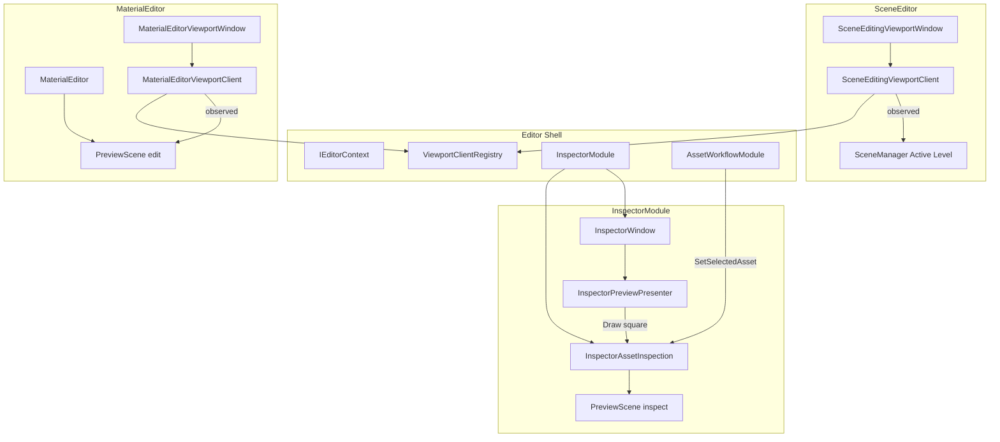

# E2 — Previewer 与 Editor 视口设计

Last updated: 2026-05-26  
Status: **v0.6 — E2.1 + E2.2 + E2.3a 已实现；Texture2D 检视延后；E2.3b / E2.4 未做**  
父文档：[EDITOR_PLATFORM_PLAN.md](./EDITOR_PLATFORM_PLAN.md) §E2、[EDITOR_VIEWPORT_WINDOWS.md](./EDITOR_VIEWPORT_WINDOWS.md)  
相关：[EDITOR_ARCHITECTURE_REVIEW.md](./EDITOR_ARCHITECTURE_REVIEW.md)、[CONTENT_BROWSER_UI_DESIGN.md](../Platform/ContentBrowser/CONTENT_BROWSER_UI_DESIGN.md)

---

## 0) 设计立场（必读）

### 0.1 「Preview」是职责名，不是视口类型名

| 说法 | 对错 | 说明 |
|------|------|------|
| Material 窗口是「一种 PreviewViewport」 | **错** | 与 Scene 主视口同属 **`EditorViewportWindow` + `EditorViewportClient` 派生**。 |
| Material 窗叫 Preview | **对** | 编辑语境是预览材质；渲染源是 **`PreviewScene`**（薄世界），不是 Active Level。 |
| 再抽 `SceneViewportEditorClient` 中间层 | **错（v0.4）** | 共用逻辑 **直接进 `EditorViewportClient`**；默认即支持 Scene 离屏绘制。 |
| `PreviewDisplayKind` 决定 A 类窗画什么 | **错** | 仅 **Inspector 内嵌检视** 使用。 |

### 0.2 两类 UI 宿主

```text
┌────────────────────────────────────────────────────────────────────────┐
│ A. Editor 视口（Dock 窗）                                               │
│    EditorViewportWindow  →  EditorViewportClient 派生                 │
│    · BeginFrame / UpdateFrameState / EndFrame / Submit                 │
│    · 基类持 SceneViewport；派生类决定观察谁、输入、flags                  │
├────────────────────────────────────────────────────────────────────────┤
│ B. Inspector 内嵌检视区                                                 │
│    InspectorPreviewPresenter（呈现）                                   │
│    InspectorModule 内嵌资产检视（桥接 + 世界，类比 Client）              │
│    · 固定方形槽；不可折叠                                               │
│    · Presenter 绘制时按需 Submit                                       │
└────────────────────────────────────────────────────────────────────────┘
```

### 0.3 核心所有权（v0.4 定稿）

```text
PreviewScene（薄世界类，Editor）
  · Scene + 少量 GO/Component（球、平行光等）
  · GetRenderScene() / Setup… / 绑定材质或 mesh
  · 无 SceneViewport、无 ImGui、无 Submit
  · 共用：MaterialEditor、Inspector 检视、后续 CB 缩略图

SceneViewport（Runtime，RT + Camera + observed RenderScene*）
  · 由 EditorViewportClient 或 InspectorModule 检视子系统持有

EditorViewportClient（基类，默认 Scene 能力）
  · protected SceneViewport m_SceneViewport
  · RT resize、BuildDrawDesc、Submit 辅助
  · 派生：SyncObservedScene / 输入 / flags

MaterialEditor
  · 拥有 PreviewScene m_PreviewScene
  · MaterialEditorViewportClient 观察 m_PreviewScene.GetRenderScene()

InspectorModule
  · 内嵌 InspectorAssetInspection（命名见 §2.4）
  · 拥有检视用 PreviewScene 实例 + SceneViewport
  · 不单独注册 EditorServiceModule
```

---

## 1) 术语表

| 术语 | 含义 |
|------|------|
| **`PreviewScene`** | **薄世界类**（Editor）：仅承载 `Scene` + 简单 GO/Component；可复用于编辑预览、Inspector 检视、未来缩略图。 |
| **`SceneViewport`** | RT 代理 + 相机 + `SetObservedScene`；**不**放进 `PreviewScene`。 |
| **`EditorViewportClient`** | 视口行为基类；**默认** 内嵌 `SceneViewport` 与共用 Submit/resize 逻辑。 |
| **Material 编辑视口** | `MaterialEditorViewportWindow` + `MaterialEditorViewportClient`（**E2 即改名**，不做渐进）。 |
| **资产检视** | `InspectorModule` 内嵌逻辑 + `InspectorPreviewPresenter`；只读。 |
| **`PreviewDisplayKind`** | 仅 B 类：`None` / `Scene3D`（**Texture2D 延后**，见 §8.2）。 |

---

## 2) 类派生关系（目标架构）

### 2.1 呈现层：Window

```text
EditorWindow
└── EditorViewportWindow
    ├── SceneEditingViewportWindow          // owner: SceneEditor
    └── MaterialEditorViewportWindow        // owner: MaterialEditor（现 MaterialPreviewWindow）
```

### 2.2 呈现层：ViewportClient（无中间层）

```text
EditorViewportClient
  · SceneViewport m_SceneViewport
  · InitializeEditorSceneViewport(RHI, w, h)   // 或等价 protected API
  · SyncRenderTargetSize() / SubmitObservedScene(flags)  // 共用实现放基类
  │
  ├── SceneEditingViewportClient
  │     · SyncObservedScene → SceneManager Active Level
  │     · Gizmo、Picking、飞行、Shadow|Post|Skybox
  │
  └── MaterialEditorViewportClient            // 现 MaterialPreviewViewportClient，E2 改名
        · SyncObservedScene → MaterialEditor::GetPreviewScene().GetRenderScene()
        · 输入策略可后续增强；默认无 Gizmo
```

**原则：** 除非未来出现「非 Scene 的 Editor 视口」（纯 2D 等），否则 **不** 再插一层 `SceneViewport*Client`。

### 2.3 世界层：`PreviewScene`（薄类，E2 抽取）

```text
// 建议路径：Editor/src/Preview/PreviewScene.h
class PreviewScene
{
    std::shared_ptr<Scene> m_Scene;
    // 句柄：预览 mesh GO、平行光 GO 等（按实现选 shared_ptr 或裸指针+生命周期约定）
public:
    void BuildDefaultSphereScene();              // 原 MaterialPreviewViewport::BuildPreviewScene 世界部分
    void SetPreviewMaterial(shared_ptr<Material>);
    void SetPreviewMesh(shared_ptr<StaticMesh>); // Inspector StaticMesh 检视
    bool EnsureStaticMeshPreviewMaterial();      // Materials/InspectorStaticMeshPreview.memtl
    RenderScene* GetRenderScene();
    void Shutdown();
    // GC：RegisterGarbageRootSource / MarkReachable（自 MaterialPreviewViewport 迁入）
};
```

| 规则 | 说明 |
|------|------|
| **职责** | 只放「几个简单 Comp 和 GO」；**不** 持 `SceneViewport`。 |
| **复用** | `MaterialEditor` 持有一个实例；`InspectorModule` 检视持 **另一实例**。 |
| **拆解来源** | 现 Runtime `MaterialPreviewViewport` **删除**；世界逻辑进 `PreviewScene`，RT 逻辑进 Client/检视。 |
| **缩略图（E2.5+）** | CB Tile 可复用同一 `PreviewScene` 搭建函数 + 独立小 `SceneViewport` 或共享检视 RT（后续细案）。 |

### 2.4 检视层：`InspectorModule` 内嵌（非独立 Service 模块）

```text
InspectorModule                          // 现有 EditorServiceModule
├── Register → InspectorWindow
├── InspectorAssetInspection             // 内嵌类或同名 struct（不单独 EditorServiceModule）
│     ├── PreviewScene m_World           // 检视专用实例
│     ├── SceneViewport m_Viewport
│     ├── PreviewDisplayKind
│     ├── SetInspectionTarget(AssetMeta*)
│     └── RenderInspection(size) → SubmitSceneDraw
└── （对外）GetAssetInspection() 供 Presenter / AssetWorkflow 使用

InspectorPreviewPresenter                // UI：固定方形 DrawPreviewSlot
AssetWorkflowInspectorSource           // Meta 属性 + Presenter
```

**与 A 类对称：**

| A 类 | B 类 |
|------|------|
| `EditorViewportWindow` | `InspectorPreviewPresenter` |
| `EditorViewportClient` | `InspectorAssetInspection`（在 `InspectorModule` 内） |
| `ViewportClientRegistry` | 无 Registry |
| Sub-Editor 拥有 `PreviewScene` | **检视用** `PreviewScene` 归 `InspectorModule` |
| `EndFrame` Submit | Presenter `Draw` → `RenderInspection` Submit |

**联动：** `AssetWorkflowModule::SetSelectedAsset` 在 CB 聚焦路径下调用 `InspectorModule` 的 `SetInspectionTarget`（或经 `IEditorContext::GetInspectorModule()`）。

### 2.5 Inspector Scene3D 槽 UX（拍板）

| 项 | 定稿 |
|----|------|
| 形状 | **正方形**（宽 = 高，`min(contentWidth, kMaxSquareSize)`；当前 `kMaxSquareSize = 224`，水平居中） |
| 折叠 | **不可折叠**（无 `CollapsingHeader`） |
| 位置 | Inspector 面板 **顶部**（Meta 属性之上） |
| Scene3D | 方形内 `ImGui::Image` 显示检视 RT |
| Texture2D | **延后**（§8.2）；当前选中时不显示预览槽 |
| None | 不显示槽（`HasPreviewContent() == false`） |

---

## 3) 所有权与关系图



### 3.1 `SceneViewport` 持有者

| 持有者 | 观察的 `RenderScene` |
|--------|----------------------|
| `SceneEditingViewportClient`（基类成员） | Active Level |
| `MaterialEditorViewportClient`（基类成员） | `MaterialEditor` 的 `PreviewScene` |
| `InspectorAssetInspection` | `InspectorModule` 内检视 `PreviewScene` |
| ~~`MaterialPreviewViewport`~~ | **删除** |

### 3.2 ViewportClientRegistry

- `GetOrCreateSceneEditingViewportClient` — 不变  
- `GetOrCreateMaterialEditorViewportClient` — **E2 改名**（原 `MaterialPreview…`）  
- panel id：`material_editor_preview` 可保留或改为 `material_editor_viewport`（与类名一致即可）

### 3.3 Submit

- A 类：`EditorViewportWindow::OnDraw` → 派生 `EndFrame` → 基类/派生 `SubmitObservedScene`  
- B 类：仅当 Inspector 绘制且 CB 检视激活时，`RenderInspection` Submit；**D6：Presenter 可见时按需渲染**

---

## 4) 模块职责矩阵

| 组件 | 拥有 | 禁止 |
|------|------|------|
| `PreviewScene` | `Scene`、预览 GO/Comp | `SceneViewport`、ImGui、Submit |
| `EditorViewportClient` | `SceneViewport` | 拥有 Session、资产检视目标 |
| `MaterialEditor` | `PreviewScene`（编辑）、Session | `SceneViewport` |
| `MaterialEditorViewportClient` | （基类）`SceneViewport` | 改图/Compile |
| `SceneEditingViewportClient` | （基类）`SceneViewport` | 拥有 `PreviewScene` |
| `InspectorModule` | `InspectorAssetInspection` 全套 | 注册 ViewportClient |
| `InspectorPreviewPresenter` | — | 拥有 `PreviewScene` |
| `AssetWorkflowModule` | 选中 `AssetMeta` | 直接 Submit |

---

## 5) 数据流

### 5.1 Material 编辑

```text
MaterialEditor::OpenSession / Compile
  → m_PreviewScene.SetPreviewMaterial(...)
  → MaterialEditorViewportWindow::OnDraw
  → MaterialEditorViewportClient::EndFrame
       → SyncObservedScene()  // PreviewScene::GetRenderScene()
       → SubmitObservedScene(PostProcess, …)
```

### 5.2 Scene 关卡编辑

```text
SceneEditingViewportClient::SyncObservedScene → Active Level
  → EndFrame → SubmitObservedScene(Shadow|Post|Skybox)
```

### 5.3 CB / Inspector 检视

```text
AssetWorkflowModule::SetSelectedAsset(meta)
  → InspectorModule::SetInspectionTarget(meta)
       → PreviewDisplayKind
       → Scene3D：m_InspectWorld.Rebuild…；m_Viewport.SetObservedScene(...)
       → Texture2D：`ResolveDisplayKind` → `None`（无预览槽，见 §8.2）

AssetWorkflowInspectorSource::DrawInspector
  → InspectorPreviewPresenter::DrawSquareSlot()   // 固定方形，不折叠
       → Scene3D：inspection.RenderInspection(squareSize) → GetSceneColorTexture → ImGui::Image
       → StaticMesh：Scene3D + PreviewScene::SetPreviewMesh + DefaultMaterial
```

---

## 6) 与 E1 的边界

- E1：Meta → PropertyWidgets；`DrawInspector` 顶部调用 `Presenter::DrawSquareSlot()`（可先空实现）。  
- E2：实现 `InspectorAssetInspection` + `PreviewScene` + Material 视口改名与基类合并。

---

## 7) 命名与文件（E2 实现时一次性完成）

| 现状 | 目标 |
|------|------|
| `MaterialPreviewWindow` | `MaterialEditorViewportWindow` |
| `MaterialPreviewViewportClient` | `MaterialEditorViewportClient` |
| `MaterialEditorPreview` | **删除** |
| `MaterialPreviewViewport` (Runtime) | **删除** → `Editor/Preview/PreviewScene` |
| `GetOrCreateMaterialPreviewViewportClient` | `GetOrCreateMaterialEditorViewportClient` |
| Dock 标题 `"Material Preview"` | `"Material Editor Viewport"` 或与窗口类一致（产品可再调） |
| 新增 | `Editor/Preview/PreviewScene.{h,cpp}` |
| 新增 | `InspectorModule` 内 `InspectorAssetInspection.{h,cpp}`（或单 cpp） |
| 新增 | `InspectorPreviewPresenter.{h,cpp}` |
| 新增 | `MyMEProject/Assets/Materials/DefaultMaterial.memtl`（StaticMesh 检视默认材质） |

**`EditorViewportClient`：** 从 `SceneEditingViewportClient` / `MaterialEditorViewportClient` 上移共用的 `m_SceneViewport`、resize、Submit 辅助。

---

## 8) 分阶段交付

| 阶段 | 内容 |
|------|------|
| **E2.1** | `PreviewScene` 薄类；拆解删除 `MaterialPreviewViewport`；**Material 全套改名**；`EditorViewportClient` 合并 `SceneViewport` 共用逻辑；`MaterialEditor` + `MaterialEditorViewportClient` 接线 |
| **E2.2** | `InspectorModule` 内嵌 `InspectorAssetInspection`；`InspectorPreviewPresenter` 固定方槽；`SetSelectedAsset` 联动；Material Scene3D 检视 MVP |
| **E2.2b** | ⏳ **Texture2D Inspector 检视**（§8.2） |
| **E2.3a** | ✅ StaticMesh 检视：`PreviewScene::SetPreviewMesh`；默认材质 `MyMEProject/Assets/Materials/DefaultMaterial.memtl`（图结构同 MaterialIRSmoke，独立 GUID；用户可改为灰材质） |
| **E2.3b** | ⏳ CB 缩略图（复用 `PreviewScene` 搭建；见 CONTENT_BROWSER_UI_DESIGN） |
| **E2.4** | ⏳ Material 视口飞行/轨道（同基类 Client，不同策略） |

**MVP（E2.1+E2.2）：** Inspector 顶栏方槽预览 Material（Scene3D）。  
**E2.3a 后：** Inspector 选中 StaticMesh 显示真实 mesh + `DefaultMaterial`。

---

## 9) 拍板记录（v0.4）

| ID | 决策 |
|----|------|
| **D1** | `InspectorAssetInspection` **嵌在 `InspectorModule`**，不单独 `EditorServiceModule` |
| **D2** | Inspector Scene3D 槽：**固定正方形**，**不可折叠** |
| **D3** | 抽 **薄 `PreviewScene`**；编辑/检视 **各一实例**；搭建逻辑可共享 free 函数 |
| **D4** | **不** 抽 `SceneViewportEditorClient`；共用逻辑 **进 `EditorViewportClient`** |
| **D5** | Material 相关 **rename 在 E2.1 一次性完成** |
| **D6** | B 类 Submit：**Presenter 绘制方槽时** 调 `RenderInspection`（Inspector 不可见则不 Submit） |
| **D7** | E2.1 允许零 UX 纯重构 PR |

---

## 10) 建议文件布局（实现参考）

```text
Editor/src/Preview/
  PreviewScene.h / .cpp

Editor/src/Viewport/
  EditorViewportClient.h / .cpp      // + SceneViewport 成员与共用方法
  SceneEditingViewportClient.*       // 移除重复 SceneViewport 实现
  MaterialEditorViewportClient.*     // 新名

Editor/src/UI/EditorWindows/
  MaterialEditorViewportWindow.*     // 新名

Editor/src/Services/
  InspectorModule.h / .cpp           // + InspectorAssetInspection
  InspectorAssetInspection.h / .cpp  // 或合并进 Module cpp

Editor/src/UI/Inspector/             // 或 EditorWindows/
  InspectorPreviewPresenter.h / .cpp
```

---

## 11) 变更记录

| 日期 | 说明 |
|------|------|
| 2026-05-26 | v0.1–v0.3 讨论迭代 |
| 2026-05-26 | **v0.4** 薄 `PreviewScene`；基类 `EditorViewportClient` 持 `SceneViewport`；Material 改名即做；Inspector 方槽；检视归 `InspectorModule` |
| 2026-05-26 | **E2.1** `PreviewScene`、Material 视口改名、删除 `MaterialPreviewViewport`（Runtime） |
| 2026-05-26 | **E2.2** `InspectorAssetInspection` + `InspectorPreviewPresenter` 方槽；`SetSelectedAsset` 联动 |
| 2026-05-26 | **v0.5** Texture2D blit 路径、方槽 224+居中；**E2.3a** StaticMesh 检视 + `DefaultMaterial.memtl`；§5.4 记录 Texture 技术债 |
| 2026-05-26 | Texture 切换前释放 3D 检视 `SceneViewport`；`DefaultMaterial` 自 Smoke 图克隆 |
| 2026-05-26 | **v0.6** 移除 Texture2D Present blit 实现；Texture 检视标 **E2.2b 延后** |

---

## 8.1) 实现备注（v0.6）

| 项 | 状态 |
|----|------|
| Material / StaticMesh Inspector 预览 | Scene3D + `SubmitSceneDraw`；Material 复位默认球 |
| Texture2D Inspector 预览 | **未实现**（§8.2） |
| CB Tile 缩略图 | **E2.3b**，未实现 |
| Material 视口相机操控 | **E2.4**，未实现 |

---

## 8.2) Texture2D 检视（延后 — E2.2b）

**现状（v0.6）：** CB 选中 `Texture2D` 时 `ResolveDisplayKind` 返回 `None`，不显示预览方槽；已删除临时 **Present blit + 直接 GL** 路径（与 Scene3D 的 `SubmitSceneDraw` 帧序冲突，且暴露 RHI 细节）。

**目标实现（后续拍板后做）：**

- 与 Material / StaticMesh 一致走 **Scene3D 管线**：薄 `PreviewScene` + 检视 `SceneViewport` + `SubmitSceneDraw`。
- 预览内容：**正交相机** + 全屏 quad（或默认平面 mesh）+ **MaterialInstance**（Unlit/简单材质）采样目标 `Texture2D` 参数。
- **不** 在 `InspectorAssetInspection` 内直接 `glDrawArrays` / 绑定资源纹理给 ImGui。

**曾尝试、弃用的方案：** 资源 `RHITexture2D` → Present blit 到检视 RT → `ImGui::Image`；存在格式兼容、与延迟 Submit 同 RT 竞态等问题。

---

## 12) 附录：UE `FPreviewScene` 对照

> `Engine/Source/Runtime/Engine/Public/PreviewScene.h` — *simple scene setup for preview or thumbnail rendering*

| UE | minEngine v0.4 |
|----|----------------|
| `FPreviewScene`（`UWorld` + 组件，无 RT） | **`PreviewScene`**（`Scene` + GO/Comp，无 RT） |
| `FEditorViewportClient` | **`EditorViewportClient`** + `SceneViewport` |
| Material 编辑器持 `FAdvancedPreviewScene` | **`MaterialEditor`** 持 `PreviewScene` |
| Details 预览 | **`InspectorModule::InspectorAssetInspection`** |

**学习点：** UE 与 v0.4 一致 —— **世界类不嵌 Viewport**；RT 在 Client 或 Inspector 检视子系统的 `SceneViewport` 中。
