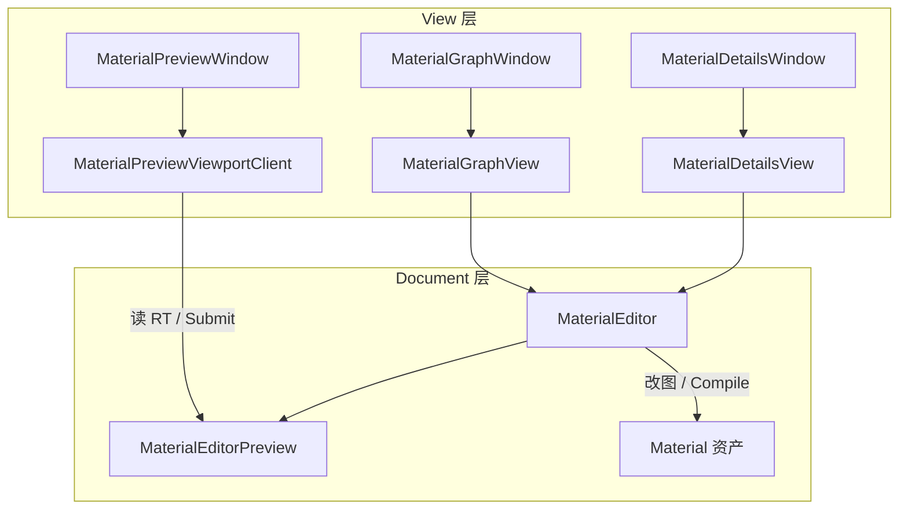
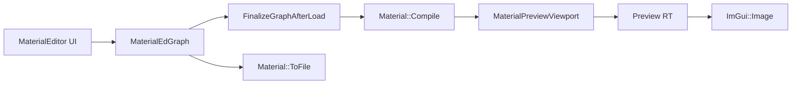

# Material Editor 计划

> **前置（已完成）：**  
> - 阶段 1：`RuntimeGlobalContext` → `Engine`（`c885f63` 及后续）  
> - 阶段 2：多 Scene / `SceneDrawCommand` / `SceneRenderContext`（`518e975`）  
> - P5：`MaterialPreviewViewport` + `MaterialPreviewViewportWindow`（独立 RT、第二条 Submit）  
>  
> **第三方：** `minEngine/Third-Party/imgui-node-editor/`（从本机 `D:\Dev\GitRepo\imgui-node-editor` vendoring，仅 **Editor** 链接）  
>  
> **UE 参照：** `UMaterialEditor` + `FPreviewScene` + Material Graph（`UMaterialExpression` 连线）

---

## 1. 目标与边界

### 1.1 做什么

在 **Editor 模块** 内实现独立 **`MaterialEditor`**：`Editor` 只作入口（菜单 / 将来 Content Browser），不内嵌材质图逻辑。

| 层 | 职责 | 现状 |
|----|------|------|
| 资产 / 数据 | `Material` + `MaterialEdGraph` + `.memtl` | ✅ |
| 编译 / 运行时 | MIR → GLSL → `Shader` → BasePass | ✅ |
| **编辑体验** | 节点图、Preview、Details、保存 | ❌ 本计划 |

**数据原则：** UI **不复制**第二份图；唯一真相 = `Material::m_Graph`（Instanced Outer 链不变）。

### 1.2 不做什么（本计划范围外）

- Undo / Command 队列（直接调 `ConnectPins` / `DisconnectInput`）
- Content Browser 双击打开（用 **Material 下拉** 妥协）
- 全节点库、Comment 框、子图、Shader 文本编辑器
- 向量节点 R/G/B 多引脚 UI（见 `PROGRESS_LOG` deferred，E4 之后）
- 替换 / 删除 P5 调试窗口前，先 **嵌入** 同一 Preview 能力，再考虑合并 Dock

---

## 2. 目标架构

### 2.1 命名：一律 `*Window`，不用 `*Panel`

| 旧草案名 | 定名 |
|----------|------|
| `MaterialPickerPanel` | 并入 **`MaterialGraphWindow`** 顶栏，或独立 **`MaterialToolbarWindow`**（拍板见 §2.4） |
| `MaterialPreviewPanel` | **`MaterialPreviewWindow`**（`EditorViewportWindow` 子类） |
| `MaterialDetailsPanel` | **`MaterialDetailsWindow`** |
| `MaterialGraphView` | 逻辑在 **`MaterialGraphWindow::OnDraw`** 内；辅助类可用 `MaterialGraphEditor`（非 Window） |

**`MaterialEditor`**：仅 **Session / 业务**（`OpenSession`、`Compile`、`Save`），**不是** `EditorWindow`。

### 2.2 单主窗口：UI 模式切换（非多应用窗口）

当前仅 **一个 GLFW 主窗口** + ImGui Dock。不做「材质编辑器另开 OS 窗口」；改为 **整应用 UI 模式** 二选一：

```text
EditorUIMode::SceneEditing   ←→   EditorUIMode::MaterialEditing
     │                                      │
     ▼                                      ▼
 Scene 套件 Window 可见              Material 套件 Window 可见
 Scene 视口 Submit                   Material Preview Submit
```

**实现（推荐）：** `EditorGUIManager` 持 `m_UIMode`；每个 `EditorWindow` 声明所属套件；`Tick` / `Draw` / `BuildDefaultDockLayout` 只处理 **当前模式 + Shared** 窗口。

```cpp
enum class EditorUIMode { SceneEditing, MaterialEditing };

enum class EditorWindowSuite {
    Shared,           // MainMenuWindow, ConsoleWindow（若保留）
    SceneEditing,     // Viewport, Hierarchy, Inspector
    MaterialEditing,  // MaterialPreview, MaterialDetails, MaterialGraph
};

class EditorWindow {
    virtual EditorWindowSuite GetSuite() const = 0;
};
```

```text
SetUIMode(MaterialEditing):
  1. （可选）未保存提示 Scene / Material
  2. Scene 套件 → SetOpen(false)
  3. Material 套件 → SetOpen(true)
  4. requestResetLayout = true → BuildMaterialEditingDockLayout()
  5. m_MaterialEditor->OnEnterMode()
```

**渲染：** 仅 **当前模式** 的 ViewportClient 在 `EndFrame` 里 `SubmitSceneDraw`（Scene 主视口 vs Material Preview），避免双 RT 白画。

**与「将来多窗口」：** 以后 OS 多窗口 = 多个 DockSpace / 多个 `EditorGUIManager` 实例；本阶段 **模式切换 API 不变**，只是把「可见套件」映射到不同 host。

### 2.3 Document / View 分离（E1.5 重构，E2 前落地）

**Editor 与 Viewport 分工（已拍板）：**

| 侧 | 管什么 | 不管什么 |
|----|--------|----------|
| **MaterialEditor（数据 / 命令）** | Session、`.memtl` 列表、Open/Save/Compile、`MaterialEditorPreview`（预览世界 + `SetPreviewMaterial`） | ImGui、RT 像素尺寸、Submit |
| **Material*View + *Window** | ImGui 展示；用户操作 → 调 `MaterialEditor` 命令 | 持有 `Material*`、不 Submit |
| **MaterialPreviewViewportClient（渲染宿主）** | 帧矩形、RT 缩放、`EndFrame` → `SubmitSceneDraw` | 打开哪个材质、何时 `BuildPreviewScene`、图/Details 编辑 |

**两层数据真源：**

| 层 | 真源 | 职责 |
|----|------|------|
| **持久化 / 编译** | `Material::m_Graph`（Runtime） | 资产内容、MIR、GLSL |
| **编辑会话** | `MaterialEditor` | 打开哪个 `.memtl`、dirty、列表选中、预览球用哪份材质、（E2）图 UI 状态 |

**角色划分（类似 UE Asset Editor + Viewport）：**

```text
MaterialEditor（Document / 命令中枢）
  ├─ MaterialEditorSession + 材质列表 + dirty
  ├─ MaterialEditorPreview（拥有 MaterialPreviewViewport：建场景、SetPreviewMaterial）
  ├─ 命令：OpenSession / Save / Compile / SetShadingModel / …
  └─ 禁止直接 ImGui（交给 *View）

Material*View（ImGui 视图，Editor/src/Material/Views/）
  ├─ MaterialGraphView     → 读 Editor 状态，用户操作调 Editor 命令
  ├─ MaterialDetailsView
  └─ 不持有 Material*、不 Submit

Material*Window（Dock 壳，仅 Begin/End + 调 View）
  ├─ MaterialGraphWindow / MaterialDetailsWindow / MaterialPreviewWindow

MaterialPreviewViewportClient（预览渲染宿主）
  ├─ 帧矩形、RT 缩放、EndFrame → SubmitSceneDraw
  ├─ 通过 MaterialEditor 取 SceneViewport / Preview，不拥有预览世界
  └─ 不决定打开哪个材质、何时 BuildPreviewScene
```



**硬规则（E2 起）：** 节点连线、材质字段修改、预览换材质 **不得** 写在 `*Window.cpp` / `MaterialPreviewViewportClient`（Client 除 resize/submit 外）。

### 2.4 模块关系（与 Editor 入口）

```text
Editor
  ├─ EditorUIMode m_UIMode
  ├─ std::unique_ptr<MaterialEditor> m_MaterialEditor
  ├─ EditorGUIManager（按 m_UIMode 过滤 Window）
  └─ MainMenu：进入 / 返回 Material 模式

Material 套件（EditorWindow → View）
  ├─ MaterialPreviewWindow  → MaterialPreviewViewportClient（渲染）
  ├─ MaterialDetailsWindow  → MaterialDetailsView
  └─ MaterialGraphWindow    → MaterialGraphView

Runtime
  Material / MaterialEdGraph / MaterialPreviewViewport（RT+场景，由 MaterialEditorPreview 驱动）
```



---

## 3. Material 模式 Dock 布局（多 Window 拼成一套 UI）

进入 **`EditorUIMode::MaterialEditing`** 时，`BuildMaterialEditingDockLayout()` 布置 **三个** ImGui Dock 窗（均 `EditorWindow`）：

```text
┌─ MaterialGraphWindow（右 ~60%）──────────────────────────────────┐
│ [Material ▼] [Compile] [Save] *                                 │
│  ax::NodeEditor 节点图画布                                        │
└──────────────────────────────────────────────────────────────────┘
┌─ MaterialPreviewWindow（左 ~40% 上）──┐ ┌─ （与 Graph 共享左列）────┐
│ ImGui::Image(Preview RT)            │ │ MaterialDetailsWindow    │
└─────────────────────────────────────┘ │ ShadingModel / 节点参数   │
                                        └──────────────────────────┘
```

**实现要点：**

- **三个独立 `EditorWindow`**，靠 DockBuilder 拼布局（与 Scene 的 Viewport/Hierarchy/Inspector 同套路）。
- **仅 `MaterialGraphWindow`** 内调用 `ax::NodeEditor::Begin/End`。
- `MaterialPreviewWindow` 继承 `EditorViewportWindow`，client id 固定 `material_editor_preview`（与 P5 调试 id 分离，见 §13 拍板）。
- Scene 模式的 **`SceneEditingViewportWindow` / Hierarchy / Inspector** 在 Material 模式下 **`SetOpen(false)`**，不参与 Draw/Submit。

---

## 4. 第三方：imgui-node-editor

### 4.1 已 vendoring 路径

`minEngine/minEngine/Third-Party/imgui-node-editor/`

| 类型 | 文件 |
|------|------|
| 编译 | `imgui_node_editor.cpp`, `imgui_node_editor_api.cpp`, `imgui_canvas.cpp`, `crude_json.cpp` |
| 公共头 | `imgui_node_editor.h`（`namespace ax::NodeEditor`） |
| 内部（勿在应用 include） | `imgui_node_editor_internal.h`, `imgui_canvas.h`, `crude_json.h`, `imgui_*_math.*` |

### 4.2 CMake

- **`Editor/CMakeLists.txt`**：`target_sources` + `PUBLIC` include `Third-Party/imgui-node-editor` 与 `Third-Party/imgui`。
- **不**加入 `minEngine` Runtime 共享库。

### 4.3 Config（避免多余 JSON）

```cpp
ax::NodeEditor::Config cfg;
cfg.SettingsFile = nullptr;
cfg.SaveSettings = nullptr;
cfg.LoadSettings = nullptr;
// 节点位置 → MaterialEdGraphNode::m_EditorPosX / m_EditorPosY（.memtl 已有字段）
```

### 4.4 ID 映射（`MaterialGraphView`）

| 库 ID | 映射 |
|-------|------|
| `NodeId` | `uintptr_t` ← `MaterialEdGraphNode*`（稳定至节点删除） |
| `PinId` | 编码 `(nodePtr, PinKind, pinIndex)` |
| `LinkId` | 编码 `(fromNode, fromOut, toNode, toIn)` 或递增 id |

**同步：**

- 打开 Session：遍历 `m_Graph->m_Nodes` → `BeginNode` / `BeginPin` / 现有连线 `Link`。
- 新建连线：`QueryNewLink` → `AcceptNewItem` → `ConnectPins` → `Finalize` → `Compile`。
- 断线：`DeleteLink` 事件 → `DisconnectInput`。
- 帧末：`GetNodePosition` → 写回 `m_EditorPosX/Y`。

### 4.5 NodeDef → UI 注册表（薄层）

`MaterialGraphNodeRegistry`（Editor 内）：NodeDef 类型名、显示色、输入/输出引脚列表（读 `MaterialGraphNodeDef` 反射或手写 MVP 表）。

---

## 5. 与现有 Editor / Preview 的关系

| 现有 | 本计划 |
|------|--------|
| `MaterialPreviewViewportWindow`（P5 调试） | E1 起 Preview **嵌入** Material Editor 左栏；调试窗可保留至 E2 验收后 **默认关闭** |
| `MaterialPreviewViewport` + `SubmitSceneDraw` | 不变；Session 切换材质时 `SetPreviewMaterial` / 更新球上 `StaticMeshComponent` |
| `Editor::GetOrCreateMaterialPreviewViewportClient` | `MaterialEditor` 持专用 client id，例如 `material_editor_preview` |
| 主关卡 `SceneEditingViewport` | 不受影响 |

**Preview 内容（E1）：**

- 默认 mesh：`EngineDefault/sphere.obj`（与 P5 一致，可后加平面切换）。
- 材质：当前 Session 的 `Material*`（替换硬编码 `MaterialIRSmoke` GUID）。

---

## 6. 编辑流程（无 Undo）

```text
Picker 选中 .memtl
  → LoadAsset<Material> → OpenSession(material, path)
  → BuildPreviewScene + 同步图到 NodeEditor

用户改图 / Details
  → 改 MaterialEdGraph 或 Material 字段
  → FinalizeGraphAfterLoad()
  → Material::Compile()（失败 → Details 显示 Diagnostics）
  → Preview 球刷新材质
  → dirty = true

Save
  → Material::ToFile(path) → dirty = false
```

**Compile 时机：** E2 起 **每次有效图变更立即 Compile**；E4 可选 200–300ms debounce。

---

## 7. 分阶段计划

### 阶段 E0 — 模式切换 + Material 套件壳

**目的：** `EditorUIMode` 切换；Material 三窗布局；Picker + Details + Save；Graph 占位。

| 区域 | 文件（建议新增） | 要点 |
|------|------------------|------|
| 模式 | `EditorUIMode.h`, `EditorGUIManager` | `SetUIMode`、按 `GetSuite()` 过滤 Tick/Draw |
| Dock | `BuildSceneEditingDockLayout` / `BuildMaterialEditingDockLayout` | 两套布局函数 |
| Session | `Material/MaterialEditor.h/.cpp` | 非 Window；`OpenSession` / `Save` |
| 窗口 | `MaterialGraphWindow`, `MaterialPreviewWindow`, `MaterialDetailsWindow` | 均 `EditorWindow`；Graph 右、Preview/Details 左 |
| 入口 | `Editor.h/.cpp`, `MainMenuWindow` | `m_MaterialEditor`；菜单 **进入/返回** 模式 |
| 渲染 | `Editor::Run` 或 ViewportClient | Material 模式不 Submit 主 Scene 视口 |

**验收**

- [x] 菜单 **Window → Material Editor / Scene Editor** 切换套件
- [ ] 菜单进入 Material 模式后 **看不见** Hierarchy/Inspector/Scene Viewport（需本地目视）
- [ ] 返回 Scene 模式后 **看不见** Material 三窗（需本地目视）
- [x] Material 模式：左 Preview/Details + 右 Graph 占位；材质下拉、`ShadingModel`、Save
- [ ] Scene 模式主视口与 `--material-ir-test` 无回归（需本地跑）

---

### 阶段 E1 — Preview 闭环

**目的：** 左栏 Preview 显示当前编辑材质的球体 RT。

| 区域 | 文件 | 要点 |
|------|------|------|
| Preview | `MaterialPreviewWindow.cpp` | `EditorViewportWindow` + `MaterialPreviewViewportClient` |
| Runtime 桥 | `MaterialPreviewViewport.h/.cpp` | `SetPreviewMaterial`；`BuildPreviewScene` 仅球+光 |
| Editor | `MaterialEditor.cpp` + `MaterialEditorPreview.*` | `ApplySessionToPreview`：OpenSession / Compile / 进模式 |
| Views | `Material/Views/MaterialGraphView.*` `MaterialDetailsView.*` | 仅 ImGui；`*Window` 只调 View |
| Client | `MaterialPreviewViewportClient.*` | 从 `MaterialEditor::GetPreview()` 取 RT，不拥有预览世界 |

**验收**

- [x] 下拉换 `.memtl` → Preview 球使用对应材质（非固定 MaterialIRSmoke GUID）
- [ ] 改 `ShadingModel` 或 Compile 后 Preview 变化（需本地目视）
- [ ] Preview RT 与主 Viewport RT **纹理 ID 不同**
- [ ] 主视口仍正常

---

### 阶段 E2 — 节点图（imgui-node-editor）

**目的：** 右栏完整画布；读写 `MaterialEdGraph`。

| 区域 | 文件 | 要点 |
|------|------|------|
| 图 UI | `MaterialGraphView.h/.cpp` | `CreateEditor` / `Begin`/`End` / 节点引脚 |
| ID | `MaterialGraphIds.h` | NodeId/PinId/LinkId 编解码 |
| 注册表 | `MaterialGraphNodeRegistry` | MVP：Smoke 图已有节点类型 |
| Session | `MaterialEditorSession` | 图变更 → Finalize → Compile |

**验收**

- [ ] 打开 Smoke 图，节点位置与 `.memtl` 中 `m_EditorPosX/Y` 一致
- [ ] 改一根线（如 Albedo）→ Compile → Preview 颜色变化
- [ ] 拖节点后 Save，重开位置保留
- [ ] **不**生成 `NodeEditor.json`（`SettingsFile = nullptr`）

---

### 阶段 E3 — Details 节点参数 + Palette

| 功能 | 要点 |
|------|------|
| Details | `ScalarParameter`、`TextureObject.DefaultTexture`（纹理 GUID 下拉） |
| Palette | 右键/面板：添加已有 NodeDef 类型；`AddNode<>` + Outer |
| 删除 | 删节点 / 断线（仍无 Undo） |

**验收**

- [ ] 改 Metallic → BlinnPhong 高光变化
- [ ] 新建 `Multiply` 节点并连到 Output

---

### 阶段 E4 — 体验与 deferred 项

| 功能 | 说明 |
|------|------|
| Compile 诊断面板 | 展示 `MaterialCompileResult::Diagnostics` |
| Debounce Compile | 大图卡顿时再加 |
| 向量 Constant3 R/G/B 多引脚 | 对齐 `PROGRESS_LOG` |
| 关闭独立 `Material Preview` 调试窗默认打开 | 仅保留 Material Editor 内 Preview |

---

## 8. 文件清单（汇总）

### 新增（Editor）

```
Editor/src/EditorUIMode.h
Editor/src/Material/
  MaterialEditor.h / .cpp              // Session 控制器（非 Window）
  MaterialEditorSession.h / .cpp
  MaterialGraphWindow.h / .cpp
  MaterialGraphIds.h / .cpp
  MaterialGraphNodeRegistry.h / .cpp
  MaterialPreviewWindow.h / .cpp
  MaterialDetailsWindow.h / .cpp
Editor/src/UI/EditorWindows/
  （扩展 EditorWindow.h：GetSuite()）
```

### 修改

```
Editor/src/Editor.h / Editor.cpp
Editor/src/EditorGUIManager.cpp
Editor/src/UI/EditorWindows/MainMenuWindow.cpp
Editor/CMakeLists.txt                    # 已接 node-editor
minEngine/.../MaterialPreviewViewport.*  # E1 SetPreviewMaterial
```

### 第三方（已存在）

```
minEngine/Third-Party/imgui-node-editor/*  （14 文件 + LICENSE）
```

---

## 9. UE 对照

| UE | minEngine |
|----|-----------|
| `UMaterialEditor` | `MaterialEditor` + `MaterialEditorWindow` |
| Material Graph（右/中画布） | **右栏** `MaterialGraphView` |
| Preview Viewport | **左栏上** `MaterialPreviewPanel` |
| Details / Material Properties | **左栏下** `MaterialDetailsPanel` |
| `FPreviewScene` | `MaterialPreviewViewport` |
| 选资产打开 | `MaterialPickerPanel`（暂代 Content Browser） |

---

## 10. 风险与对策

| 风险 | 对策 |
|------|------|
| NodeDef 与 UI 双份维护 | `MaterialGraphNodeRegistry` 单表；MVP 只登记已有类型 |
| Compile 失败 | Details 显示 Diagnostics；Preview 保持上一帧合法 shader |
| Instanced 新节点 Outer 错 | 必须 `AddNode(material)`，禁止裸 `new` EdNode |
| Preview / 主视口 RT 混淆 | 独立 `SceneViewport` + 独立 `SceneDrawDesc`（已 P5） |
| imgui-node-editor 与 ImGui 版本 | 已 patch `imgui_extra_math.*`（`IMGUI_VERSION_NUM >= 19200` 跳过 `float*ImVec2`）；升级 ImGui 时复测 |
| 右栏 NodeEditor 抢输入 | 仅右栏 `Begin`；左栏 Preview 用普通 ImGui |

---

## 11. 验收总表（发布「可用 Material Editor」前）

| 项 | E0 | E1 | E2 | E3 |
|----|----|----|----|-----|
| 右栏节点图 | 占位 | 占位 | ✅ | ✅ |
| 左栏 Preview | 占位 | ✅ | ✅ | ✅ |
| Material 下拉 | ✅ | ✅ | ✅ | ✅ |
| ShadingModel | ✅ | ✅ | ✅ | ✅ |
| 连线 / 断线 | — | — | ✅ | ✅ |
| 节点参数 | — | — | — | ✅ |
| Save / 重载 | ✅ | ✅ | ✅ | ✅ |
| 主视口无回归 | ✅ | ✅ | ✅ | ✅ |
| material-ir-test | ✅ | ✅ | ✅ | ✅ |

---

## 12. 建议实施顺序

```text
1. E0 壳 + 布局（图右）+ Picker + Details + Save
2. E1 Preview 绑定 Session 材质
3. E2 MaterialGraphView + imgui-node-editor 连线
4. E3 Palette + 节点 Details
5. E4 诊断 / debounce / 关调试 Preview 窗
```

与全局路线图关系：

```text
（已完成）Engine 收敛 → 多 Scene 渲染 → 本计划 Material Editor
```

---

## 13. 已拍板（2026-05-19）

| # | 决策 |
|---|------|
| A | **Console** 保留：`EditorWindowSuite::Shared`，两种模式均可见 |
| B | 切换模式：**仅 `*` 提示**，不弹窗、不阻塞切换 |
| C | ~~P5 `MaterialPreviewViewportWindow`~~ **已删除**；仅保留 Material 模式 **`MaterialPreviewWindow`** |
| D | Picker / Compile / Save：放在 **`MaterialGraphWindow` 顶栏**，不新增 Toolbar Window |
| E | Material 模式下 **SceneManager 继续逻辑 Tick**；**不 Submit** 主 Scene 视口 |
| F | 入口：**MainMenu → Window → Material Editor**；返回：**Window → Scene Editor**（或同级菜单项） |

---

## 14. 参考文档

- [RENDER_REFACTOR_PLAN.md](./RENDER_REFACTOR_PLAN.md) — P5 Preview 基建  
- [EDITOR_VIEWPORT_WINDOWS.md](./EDITOR_VIEWPORT_WINDOWS.md) — Viewport 窗口分层  
- [MATERIAL_RUNTIME_BRIDGE_CHECKLIST.md](./MATERIAL_RUNTIME_BRIDGE_CHECKLIST.md) — 运行时编译/绘制  
- [MATERIAL_SHADING_MODEL_PLAN.md](./MATERIAL_SHADING_MODEL_PLAN.md) — ShadingModel 与模板  
- [PROGRESS_LOG.md](./PROGRESS_LOG.md) — 会话记录与 deferred 提醒  
