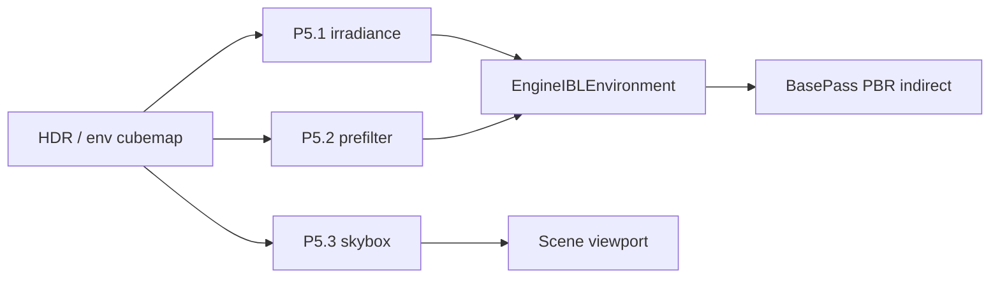

# Material System — Phase 5 详细设计（IBL 完善）

Last updated: 2026-05-23  
Status: **已定案 · 待实施**  
前置：[MATERIAL_SYSTEM_PHASE4.md](./MATERIAL_SYSTEM_PHASE4.md) ✅ · [RESOURCE_PIPELINE_PLAN.md](./RESOURCE_PIPELINE_PLAN.md) R2 ✅

**范围拍板（2026-05-23）：** Phase 5 **仅 IBL**（irradiance / prefilter / skybox）。**Parallax / POM / WPO** 移出 P5，列入 [§12 Backlog](#12-backlog视差--顶点位移有空再做)。

---

## 0) Phase 5 目标与边界

Phase 4 已交付 **可用的 split-sum IBL**（HDR → cubemap、BRDF LUT、`CalcIndirectPBR`、Pass 绑定）。Phase 5 **只做一件事**：

**把 IBL 从「能看」做到「更像 LearnOpenGL / UE」**——独立 irradiance、真 prefilter、场景天空背景。

| 做 | 不做（本阶段 / 后续） |
|----|----------------------|
| GPU **irradiance convolution** cubemap | Parallax / POM / WPO（→ §12 Backlog） |
| GPU **prefilter** cubemap（或规范离线资产管线） | Tessellation / displacement |
| **Skybox** 背景绘制（EngineDefault HDR cubemap） | 材质编辑器 Undo / Shader 实时预览 |
| `--material-ir-test` IBL 子集扩展 | Translucent IBL 专项、Detail Normal |
| | `u_EnvIntensity` 编辑器暴露（可顺手，非关门） |

**已定参数：**

| 项 | 选择 |
|----|------|
| 子阶段顺序 | **P5.1 → P5.2 → P5.3** |
| Irradiance 分辨率 | **32**（可配置常量，后续改 64 成本低） |
| Skybox | **场景视口默认开启**（保留调试开关） |

**建议工期：** 约 1–1.5 周，三块可独立 commit、独立目视验收。

---

## 1) 现状（P4 结束）

| 能力 | P4 状态 | P5 要补的 gap |
|------|---------|----------------|
| Diffuse IBL | 采样 **environment** cubemap | **Irradiance** 卷积 cubemap |
| Specular IBL | `textureLod` + HDR **mip** 或 alias | **Prefilter** pass cubemap |
| 背景 | 无 | **Skybox** |
| Normal map | ✅（P2） | 本阶段不扩展 |

---

## 2) 技术路线

| 子阶段 | LearnOpenGL / 参考 |
|--------|------------------|
| P5.1 Irradiance | [IBL Diffuse irradiance](https://learnopengl.com/PBR/IBL/IBL) |
| P5.2 Prefilter | [Specular IBL](https://learnopengl.com/PBR/IBL/Specular-IBL) |
| P5.3 Skybox | 同教程 background shader |

---

## 3) 实施顺序总览

```text
P5.1  Irradiance convolution（GPU）→ m_Irradiance 专用
P5.2  Prefilter cubemap（GPU）→ m_Prefilter 专用
P5.3  Skybox pass + 与 IBL 共用 environment cubemap
```



---

## 4) P5.1 — Irradiance convolution

### 4.1 目标

从 **environment cubemap**（P4 HDR capture 或加载链）生成 **低频 diffuse** cubemap，仅供 `CalcIndirectPBR` 的 `texture(u_EnvIrradianceMap, N)`。

### 4.2 实现要点

| 项 | 说明 |
|----|------|
| Shader | `EngineDefault/Shaders/EnvMap/irradiance_convolution.{vert,frag}` |
| C++ | `EnvMapCapture::ConvolveIrradiance(envCube, faceSize=32)` |
| 存储 | `EngineIBLEnvironment::m_Irradiance` = 卷积结果；**environment** 仍作 prefilter 源 |
| 加载顺序 | 仍优先 `irradiance_*.png` 六面；无则 **GPU conv**；再 fallback 现有链 |

### 4.3 验收

- [x] 日志：`convolved irradiance cubemap 32x32 from environment`
- [ ] 目视：漫反射环境更 **柔和**（P5.2 后与 specular 分离更明显）
- [x] `--material-ir-test`：`VerifyIBLIrradianceConvolution`

---

## 5) P5.2 — Prefilter environment map

### 5.1 目标

生成 **带 mip 的 prefilter cubemap**（重要性采样近似），替换「environment + `glGenerateMipmap`」的 specular 近似。

### 5.2 实现要点

| 项 | 说明 |
|----|------|
| Shader | `prefilter.{vert,frag}` + 每 mip × 每 face 渲染 |
| 输入 | RGB16F environment cubemap（512） |
| 输出 | `m_Prefilter`（512，完整 mip 链） |
| `kMaterialPBRMaxReflectionLod` | 与 `log2(faceSize)` 对齐（P4 为 7.0 @512） |
| 离线备选 | 保留 `prefilter_posx.png` … 加载路径 |

### 5.3 验收

- [ ] 目视：Roughness 0 / 1 镜面模糊差异明显
- [x] 成功时 prefilter 为独立 GPU cubemap（8 mips，与 `kMaterialPBRMaxReflectionLod` 对齐）
- [x] `--material-ir-test`：`VerifyIBLGpuConvolutionAndPrefilter`

---

## 6) P5.3 — Skybox 背景

### 6.1 目标

场景视口显示 **HDR 天空**，与物体反射同源；深度最远。

### 6.2 实现要点

| 项 | 说明 |
|----|------|
| Pass | `SkyboxPass`（或 Present 前单次 draw） |
| Mesh | 单位立方体 + `background.vert/frag` |
| 资源 | `EngineIBLEnvironment` 的 environment cubemap |
| 开关 | 默认 **开**；`RenderPipeline` / 视口可关（调试） |
| Depth | `GL_LEQUAL`，天空在远平面；不写 depth 或仅读 |

### 6.3 验收

- [ ] 旋转相机：天空色调与物体 **环境反射** 一致
- [ ] 不透明物体 depth / 排序正常

---

## 7) 测试与文档（Phase 5 关门）

| 项 | 内容 |
|----|------|
| IR test | `VerifyIBLIrradiancePrefilter`（init 后 cubemap 非空 / 非 alias）；现有 IBL 用例仍绿 |
| 文档 | 本文件验收勾选；`IBL/README.md`；ROADMAP；PROGRESS_LOG |
| 目视 | §8 |

---

## 8) Phase 5 完成后应看到的效果

| 区域 | 效果 |
|------|------|
| **天空** | 场景背景为 HDR 天空，不再是纯色清屏 |
| **漫反射环境** | 更柔和，与镜面反射分离 |
| **镜面反射** | 粗糙度对反射模糊更贴近教程 |
| **贴图凹凸** | 仍仅 **法线贴图**（P2）；无视差 / WPO |

**仍不会有：** POM、WPO、真细分位移、编辑器 Undo。

---

## 9) 风险与对策

| 风险 | 对策 |
|------|------|
| 启动时 GPU pass 变多 | irradiance 32³ + prefilter 一次性；二期可缓存到 `Textures/IBL/generated/` |
| Prefilter 耗时 | 首启日志 + 可选离线六面；与 P4 相同 |
| Skybox 与 UI 清屏色冲突 | 有 skybox 时视口清屏可弱化或忽略 |

---

## 10) 实施检查清单（开发用）

| 顺序 | 任务 | 关键路径 |
|------|------|----------|
| 1 | irradiance shader + FBO | `EnvMap/irradiance_convolution.*` |
| 2 | `ConvolveIrradiance` | `EnvMapCapture.cpp` |
| 3 | `EngineIBLEnvironment` 加载链 | 无 png 时 conv，再 bind |
| 4 | prefilter shader + mip 循环 | `EnvMap/prefilter.*` |
| 5 | `PrefilterEnvironment` | `EnvMapCapture.cpp` |
| 6 | Skybox mesh + pass | `RenderPipeline`、视口 |
| 7 | IR test + README | `MaterialIRTest.cpp`、`IBL/README.md` |

---

## 11) 参考

- [LearnOpenGL IBL](https://learnopengl.com/PBR/IBL/IBL) · [Specular IBL](https://learnopengl.com/PBR/IBL/Specular-IBL)
- [MATERIAL_SYSTEM_PHASE4.md](./MATERIAL_SYSTEM_PHASE4.md)
- [MATERIAL_SYSTEM_PHASE3.md](./MATERIAL_SYSTEM_PHASE3.md) §11（视差 / WPO 概念，非 P5 范围）

---

## 12) Backlog（视差 / 顶点位移，有空再做）

不绑定 Phase 编号，实施时再开独立设计小节或 **Phase 6**。

| 项 | 说明 | 依赖 |
|----|------|------|
| **Parallax / POM** | `MaterialParallax.glslinc`；高度图；PBR + BlinnPhong | TBN ✅ |
| **WPO** | `MP_WorldPositionOffset` 暴露；ShadowPass 一致 | 顶点编译 ✅ 占位 |
| **MP_Height** | 可选正式属性（与 POM 同批） | — |
| **Tessellation** | 真几何位移 | 管线 hull/domain |

原 P5.4 / P5.5 细节可从 git 历史或 Phase 3 §11 展开；**不在本文件维护步骤级设计**，避免与 IBL 实施混淆。
