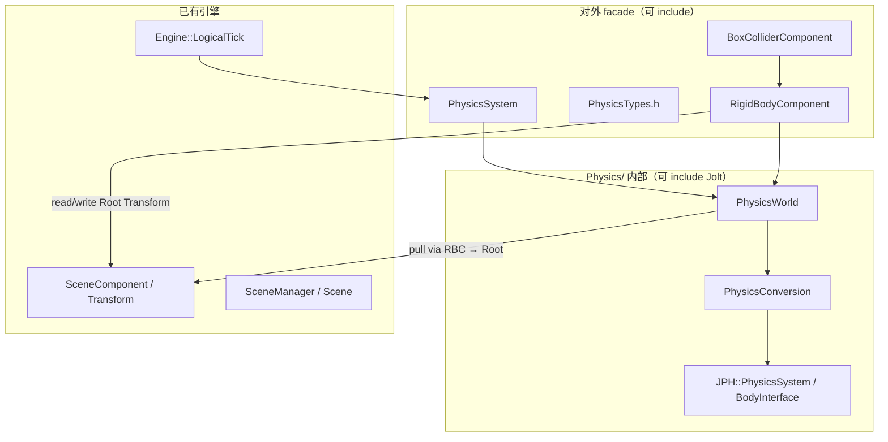
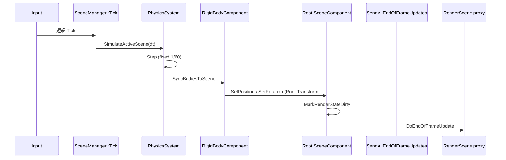

# Jolt Physics Bootstrap — Design Spec

## Meta
- **ID:** `PHYS-F01`
- **Type:** Feature
- **Status:** Done
- **Owner:** project maintainer
- **Last updated:** 2026-08-01 (**S03 Done** — Scene::LineTrace)
- **Related:** [Implementation](./PHYS-F01_JOLT_INTEGRATION_IMPLEMENTATION.md), [FEATURE_REGISTRY.md](../FEATURE_REGISTRY.md), [CORE-F01 Transform quaternion](../Platform/Core/CORE-F01_TRANSFORM_QUATERNION_DESIGN.md)

## TL;DR

**PHYS-F01 是物理子系统的 bootstrap（启动计划），不是完整物理产品。** 目标：引入 Jolt、建立最薄的引擎物理抽象层、提供 `RigidBodyComponent`（物理代理，**非** `SceneComponent`）+ `BoxColliderComponent`，跑通固定步长仿真与动态刚体 pose 写回 GO **RootComponent** 的 Transform（四元数）。**S01–S02 Done。** 下一：S03 `LineTrace`（同一 Channel 的 Trace 用法）。角色、载具、Editor 物理调试、渲染管线改动均不在本 Feature。

## Scope

- **In（bootstrap）：**
  - Jolt 以 submodule + CMake 接入（`Third-Party/Jolt`）
  - `PhysicsSystem`（引擎单例）+ 每 `Scene` 一个 `PhysicsWorld`
  - 固定 `1/60 s` 步长 + accumulator；挂接 `Engine::LogicalTick`
  - `PhysicsConversion`：minEngine 坐标 ↔ Jolt 坐标（集中一处）
  - `RigidBodyComponent`（`Component` 子类，物理代理）+ `BoxColliderComponent`（反射、序列化字段最小集）
  - Transform 真源：**GO `RootComponent`**（`SceneComponent`）；刚体组件无自有 Transform
  - 动态刚体 simulate 后 **pull** 写回 RootComponent 的 `Position` + `Rotation(quat)`
  - **S01-e：** `ETeleportType`（对齐 UE）+ `MarkTransformDirty` / `MarkRenderStateDirty` 分离；场景 ↔ 物理同步闭环（§3.2.1）
  - headless 落体 / sync / load 测试；可选 Playground 目视
  - **S02：** 碰撞通道 + Response 矩阵 + Contact Begin/End（§3.6）
  - **S03：** `LineTrace`（§3.7）
- **Out（刻意不做）：**
  - Character / Vehicle / Cloth / Ragdoll
  - 复杂形状生态（Mesh、Convex hull、Compound 等）— S01 仅 Box
  - 非均匀 Scale 参与碰撞（S01 仅 uniform scale；非均匀只影响视觉）
  - 传送门 **速度换参考系**（Δ 旋转 \(v,\omega\)）— 以后 `PortalTeleport` gameplay API；非 `ETeleportType` 能表达的全部语义
  - `ETeleportType::None` 的 **Sweep 位移推速度** 语义（S01-e 枚举预留，行为后续 slice）
  - Editor 物理可视化、碰撞体 Gizmo、Simulate 按钮、Collision Preset UI
  - 每物体覆盖 Response 矩阵（UE Collision Presets）— **Deferred**
  - `QueryOnly` / `PhysicsOnly`（UE `CollisionEnabled`）— **Deferred**
  - RHI、RenderPipeline、SceneProxy、Material、ImGuizmo
  - 完整 Tick Group 枚举（Pre/Post Physics 组件组）— 用固定插入点代替
  - 多物理后端抽象（仅 Jolt）

## Reader quick start

1. 本文件 — 定位、架构、Tick 时序、拍板项、验收。
2. [PHYS-F01_JOLT_INTEGRATION_IMPLEMENTATION.md](./PHYS-F01_JOLT_INTEGRATION_IMPLEMENTATION.md) — 切片、PR 边界、命令。
3. 代码入口（计划）：`Runtime/Function/Physics/`，`Engine::LogicalTick`。

---

## 1) 背景与目标

### Pain
- 引擎尚无物理模块；`MovementComponent` 为占位，无法验证碰撞、重力、刚体行为。
- `CORE-F01` 已将 `Transform::Rotation` 改为四元数存储，为 Jolt pose 写回铺平道路。
- 若无清晰边界层，Jolt 头文件与坐标转换会散落各模块，与 `render` track 并行 merge 时风险高。

### Goals
- **最小垂直切片：** 一个动态 Box 在重力下下落，pose 经 `RigidBodyComponent` 代理写回 **RootComponent** Transform，headless 测试可断言。
- **隔离层：** Runtime 非 `Physics/` 代码不 `#include` Jolt；对外 facade 为 `PhysicsSystem`、`PhysicsTypes`、组件类型。
- **与 UE 同类的时序：** Simulate → 回写 Component Transform → `SendAllEndOfFrameUpdates`（渲染代理刷新）。
- **可扩展钩子：** S02/S03 在同一 `PhysicsWorld` 上叠加，不重写 bootstrap 骨架。

### Success
- `cmake --build` + `minEngineTests` physics smoke 通过。
- `LogicalTick` 内仿真与写回顺序稳定；动态刚体本帧渲染可见正确 pose（经现有 `MarkRenderStateDirty` → `DoEndOfFrameUpdate` 链）。
- Jolt 仅出现在 `Runtime/Function/Physics/` 及 CMake 链接配置。

---

## 2) 现状

### 2.1 逻辑帧时序

```216:221:minEngine/minEngine/src/Runtime/Engine.cpp
    void Engine::LogicalTick(float deltaTime)
    {
        m_InputSystem->Tick(deltaTime);
        m_SceneManager->Tick(deltaTime);
        m_SceneManager->SendAllEndOfFrameUpdates();
    }
```

Editor 在 UI 之后额外 flush 一次 `SendAllEndOfFrameUpdates`，再 `TickRendererFrame`（Inspector 晚于 `LogicalTick` 的改动仍能更新 proxy）。

### 2.2 Transform 与渲染脏标记

- `SceneComponent::SetPosition` / `SetRotation` / `SetTransform` 会 `MarkRenderStateDirty()` → `MarkForNeededEndOfFrameUpdate()`。
- `PrimitiveComponent::DoEndOfFrameUpdate` 在 dirty 时 `RenderScene::UpdatePrimitive`。
- **物理回写应走 GO `RootComponent` 的 `SceneComponent` API**，不直接改 `SceneProxy`；`RigidBodyComponent` 自身不持有 Transform。

### 2.3 坐标约定（引擎侧）

自 `SceneComponent` 方向向量：

| 轴 | 引擎语义 |
|----|----------|
| +X | Forward |
| +Y | Up |
| +Z | Right |

右手系。Jolt 默认右手 **Y-up**；轴映射全部经 `PhysicsConversion` 完成，禁止在组件内散落 `swap` 或手写矩阵。

### 2.4 缺失项

- 无 `Third-Party/Jolt` submodule。
- 无 `PhysicsSystem` / `PhysicsWorld` / 物理组件。
- `Scene` 无物理世界生命周期钩子。

---

## 3) 方案

### 3.1 模块分层



**硬规则：**
1. `#include <Jolt/...>` 只允许出现在 `Runtime/Function/Physics/` 下的 `.cpp` 及该目录内头部（若必须）；其它模块只 include facade。
2. `PhysicsConversion` 是唯一坐标与类型转换入口。
3. 组件不直接调用 Jolt 全局 API；经 `PhysicsWorld` 或 `PhysicsSystem` 提供的窄接口。

### 3.2 核心类型

#### PhysicsSystem（单例）

| 职责 | 说明 |
|------|------|
| `Initialize` / `Shutdown` | Jolt `RegisterTypes`、工厂、临时分配器等一次性设置 |
| `SimulateActiveScene(float deltaTime)` | 对 `SceneManager` 当前活动 `Scene` 的 `PhysicsWorld` 步进 |
| `GetOrCreateWorld(Scene*)` | 懒创建 per-Scene 世界 |
| `DestroyWorld(Scene*)` | `Scene` 卸载/重置时销毁 |

生命周期：`Engine::StartSystems` / `ShutdownSystems` 中与 `SceneManager` 同级注册。

#### PhysicsWorld（每 Scene 一个）

| 职责 | 说明 |
|------|------|
| `Step(float deltaTime)` | 固定 `1/60 s` + accumulator；调用 Jolt `Update` |
| `CreateBody` / `DestroyBody` | 由组件生命周期驱动 |
| `SyncBodiesFromScene()` | **S01-d：** stub。**S01-e：** 从 **RootComponent** Transform → Jolt Body（见 §3.2.1） |
| `SyncBodiesToScene()` | 动态体且 `bSimulatePhysics`：Body pose → **RootComponent**（经 `RigidBodyComponent`） |
| `SetGravity` | 默认 `(0, -9.81, 0)` 引擎空间，经 conversion 传入 Jolt |

**Body 句柄：** 对外使用 `PhysicsBodyId`（`uint32_t` 或薄包装），不暴露 `JPH::BodyID` 给 `Physics/` 以外代码。`RigidBodyComponent` 内存可持 `PhysicsBodyId`；内部映射在 `PhysicsWorld`。

#### RigidBodyComponent（物理代理）

**定位：** 物理子系统在 Scene 图上的**代理人**——连接 GO 的 **RootComponent Transform** 与 Jolt Body。不承担场景节点职责。

| 约束 | 说明 |
|------|------|
| 继承 | `Component`（**非** `SceneComponent`） |
| Transform | **无**自有 `m_Transform`；不当 `RootComponent` |
| 读写目标 | `GetOwner()->GetRootComponent()` 的 `Position` / `Rotation(quat)` / `Scale` |
| Body 所有权 | 持 `PhysicsBodyId`；创建/销毁 body 由此组件驱动 |

字段（S01 最小集）：
- `BodyType`：`Static` | `Dynamic`（`Kinematic` 枚举预留，S01 可不实现行为）
- `Mass`（dynamic 时用）
- `bSimulatePhysics`（是否参与 Jolt 步进 **与** pull；见 §3.2.1）

生命周期：
- 启用时：若 GO 有有效 `RootComponent`，在 `PhysicsWorld` 创建 body（若同 GO 已有 `BoxColliderComponent` 则附加形状）
- 无 `RootComponent`：**不创建** body（`ME_ASSERT` 或 log + skip）
- 销毁时：从 world 移除 body

同步（由 `PhysicsWorld` 统一调用，不在 `DoEndOfFrameUpdate`）：
- **Push**（`SyncBodiesFromScene`）：消费 Root 的 **Transform 脏** + 挂起的 `ETeleportType` → Jolt Body
- **Pull**（`SyncBodiesToScene`）：Jolt Body → Root **Simulation 写入**（不标 Transform 脏；见 §3.2.1）

#### 3.2.1 场景 ↔ 物理同步（S01-e）

**背景：** S01-d 的 Push stub 与 `bSimulatePhysics` 仅 gate Pull，导致 Editor 手改不同步、关模拟仍积分。S01-e 在进 S02 前补齐。

**`ETeleportType`（对齐 [UE `ETeleportType`](https://dev.epicgames.com/documentation/en-us/unreal-engine/API/Runtime/Engine/ETeleportType)）**

定义于 **无 Jolt** 的公共头（建议 `PhysicsTypes.h` 或 `Runtime/Core` 公共 types；`SceneComponent` 与 `PhysicsWorld` 共用）：

| 值 | 含义（权威 Transform 变更 → 物理） |
|----|-----------------------------------|
| **`None`** | 不按 teleport 处理；位移可参与 sweep/推速度（**S01-e 预留**，公开 setter 默认不用） |
| **`TeleportPhysics`** | Teleport body；**保持**世界空间线/角速度；路径无碰撞积分 |
| **`ResetPhysics`** | Teleport body；**清零**线/角速度（Editor 拖拽 / Inspector 改 Transform **默认**） |

**与 `MarkRenderStateDirty` 分离（`SceneComponent`）**

| 路径 | API | `MarkTransformDirty` | 记录 `m_PendingTeleportType` | `MarkRenderStateDirty` |
|------|-----|----------------------|------------------------------|------------------------|
| 权威（脚本 / Inspector / 未来 Gizmo） | `SetTransform(t, teleport)` 等，`teleport` 默认 **`ResetPhysics`** | ✅ | ✅（最后一次权威 teleport） | ✅ |
| 模拟写回（Pull） | 内部 `SetTransformFromSimulation(t)`（**不走** `ETeleportType`） | ❌ | — | ✅ |

Pull **不得**调用带 `ETeleportType` 的公开 `SetTransform` 默认值，否则每帧标脏会在下帧误触发 Push。

**每步 `SimulateActiveScene` 顺序：**

```text
SyncBodiesFromScene()   // 消费 Transform 脏 + PendingTeleport
Step(dt)
SyncBodiesToScene()     // Simulation 写回
```

| 对象 | `bSimulatePhysics` | Pre-Physics Push | Step | Post-Physics Pull |
|------|-------------------|------------------|------|-------------------|
| Static | 任意 | Root **脏**时：pose → Body，按 `PendingTeleport`（通常 `ResetPhysics`） | 否 | 否 |
| Dynamic | **true** | Root **脏**时：teleport + `ResetPhysics` 清速度 **或** `TeleportPhysics` 保速度 | 是 | 是（Simulation 写回） |
| Dynamic | **false** | **每步** Root→Body + `ResetPhysics`；deactivate | 否 | 否 |

**`bSimulatePhysics` 关 → 开：** 当前 Root pose + `ResetPhysics` push → activate。

**S01-e 实现范围：**

- ✅ `ResetPhysics`（主路径：Editor、headless teleport 测试）
- ✅ `TeleportPhysics`（枚举 + `SyncBodiesFromScene` 分支；`physics-sync` 至少 1 条保速断言，可选）
- ⏸ `None`：仅文档/枚举占位，无 sweep API

**刻意不做（S01-e）：**

- 传送门 Δ 变换速度、Gameplay `PortalTeleport`
- Kinematic 完整语义
- Editor Play/Simulate 模式开关
- `ETeleportType::None` 的 sweep/CCD 管线

#### BoxColliderComponent

- 继承 `Component`。
- 字段：
  - `Vector3 HalfExtent`（引擎空间，uniform scale 由 **RootComponent** 的 scale 参与计算）
  - **`ECollisionChannel ObjectChannel`**（S02；默认见 §3.6；**形状侧身份**，不挂在 `RigidBodyComponent`）
- 与同 GO 的 `RigidBodyComponent` 配对；形状位姿相对 **Root Transform**（S01 中心在 Root 原点，无独立 offset）。
- 自身不是场景节点；可视化仍由 Root 上的 `PrimitiveComponent` 等负责。

#### GameObject 装配（S01）

典型动态落体对象：

```text
GameObject
  RootComponent: SceneComponent（或 StaticMeshComponent 等 SceneComponent 子类）  ← Transform 真源
  RigidBodyComponent（Dynamic）                                                    ← 物理代理
  BoxColliderComponent                                                             ← 形状
```

典型静态地板：Root 为 `SceneComponent` + `RigidBodyComponent(Static)` + `BoxColliderComponent`。

**不变量：** 一个参与仿真的 GO 上，有且仅有一个 `RigidBodyComponent` 代理该 Root 的 body（S01 不处理多刚体 GO）。

### 3.3 Tick 时序（对齐 UE）

UE（Chaos）简化对照：

| UE 相位 | 行为 | minEngine PHYS-F01 |
|---------|------|---------------------|
| PrePhysics | 权威 Transform → Body；消费 Transform 脏 | `SyncBodiesFromScene`（`ETeleportType`） |
| Simulate | 求解器步进 | `PhysicsWorld::Step`（仅 `bSimulatePhysics` 的 Dynamic） |
| PostPhysics | 动态体 pose 写回场景组件 | `PhysicsWorld::SyncBodiesToScene` → GO **RootComponent** |
| 渲染准备 | SceneProxy / 相机更新 | `SendAllEndOfFrameUpdates` |
| Render | 绘制 | `RendererTick` |

**目标 `LogicalTick`：**

```text
InputSystem::Tick(dt)
SceneManager::Tick(dt)                    // 游戏逻辑
PhysicsSystem::SimulateActiveScene(dt)    // SyncFrom + Step + SyncTo（S01-e 完整顺序）
SceneManager::SendAllEndOfFrameUpdates()  // Camera / Primitive proxy
```

Editor 第二次 `SendAllEndOfFrameUpdates` 保持不变。

**原则（与 UE 一致）：**
- 回写写 **RootComponent Transform 真源**（经 `RigidBodyComponent` 代理），不直接改 `SceneProxy`。
- 物理在 **第一次 EndOfFrame 之前** 完成，使本帧 proxy 吃到最终 pose。
- 不在 `DoEndOfFrameUpdate` 内做 `Step`（避免顺序晚于其它 EndOfFrame 消费者）。



### 3.4 坐标转换（PhysicsConversion）

集中提供：

| 函数 | 方向 |
|------|------|
| `ToJoltPosition(Vector3)` | 引擎 → Jolt |
| `FromJoltPosition(JoltVec)` | Jolt → 引擎 |
| `ToJoltQuaternion(Quaternion)` | 引擎 → Jolt |
| `FromJoltQuaternion(JoltQuat)` | Jolt → 引擎 |
| `ToJoltVec3` 用于 half-extent、gravity 等 | 同上 |

**轴映射（拍板，实现时写入代码注释与单元测试）：**

引擎 `(Xf, Yu, Zr)` 右手系 → Jolt 右手 Y-up：

| 引擎 | Jolt |
|------|------|
| +X Forward | +Z |
| +Y Up | +Y |
| +Z Right | +X |

即：`(ex, ey, ez)_engine → (ez, ey, ex)_jolt`（实现以 `PhysicsConversion` 单测锁定，避免手写散落）。

### 3.5 仿真参数

| 参数 | 值 |
|------|-----|
| 固定步长 | `1/60 s` |
| 最大子步 | 4（单帧 `dt` 过大时 clamp） |
| 重力（引擎空间） | `(0, -9.81, 0)` |
| Scale | S01 仅 **uniform**；`HalfExtent * uniformScale` |


### 3.6 碰撞过滤（S02 设计；对齐 UE 语义）

> **Meta：** 本节为 S02 设计定稿；**已实现 2026-08-01**（`physics-contact` 通过）。

#### 3.6.1 两条管线、一张 Channel 表

| 管线 | 何时 | 问什么 | 查矩阵方式 |
|------|------|--------|------------|
| **Simulation** | 每步 `Step` | A 与 B 碰上后 Ignore / Overlap / Block？ | `ObjectChannel_A × ObjectChannel_B → Response` |
| **Query** | 按需（S03） | 这次射线「以 Channel T」打物体 O 时算不算？ | `TraceChannel_T × ObjectChannel_O → Response` |

**`ECollisionChannel` 是同一枚举的两面用法**（学 UE，**不**拆成 Object/Trace 两个 enum）：

- **Object 用法：** Collider「我是什么」（挂在组件上）
- **Trace 用法：** 查询「我以什么身份去打」（S03 `LineTrace` 参数）

一张 **Response 矩阵** 服务两种用法；差别只在「行/列语义」，不在类型系统。

#### 3.6.2 类型（`PhysicsTypes.h`，无 Jolt）

```text
ECollisionChannel : uint8
  WorldStatic = 0     // 地板、墙；默认 Object 用法
  Default             // 普通动态物
  Trigger             // 感应体积；默认 Overlap、无冲量
  Visibility          // 内置 Trace 用法名（S03 射线常用；也可作 ObjectType，与 UE 一致）
  GameChannel1 … 8    // 项目自定义预留槽（配置命名）
  MAX

ECollisionResponse : uint8
  Ignore = 0
  Overlap
  Block

EContactPhase : uint8
  Begin = 0
  End
```

S02 运行时真正驱动过滤的内置通道：`WorldStatic` / `Default` / `Trigger`。
`Visibility`：S02 可只占枚举位；S03 再用于 `LineTrace`。
`GameChannel1–8`：S02 **预留槽位 + 名字映射 API**；**不必**做 Editor UI / ProjectSettings 面板。

#### 3.6.3 默认 Simulation 矩阵

行 = A，列 = B（**对称**；实现可只存三角并镜像）：

| ↓ A \ B → | WorldStatic | Default | Trigger |
|-----------|-------------|---------|---------|
| **WorldStatic** | Ignore | Block | Overlap |
| **Default** | Block | Block | Overlap |
| **Trigger** | Overlap | Overlap | **Ignore** |

说明：

- Static↔Static Ignore：与 S01「NonMoving 不碰 NonMoving」一致。
- Trigger↔X 均为 Overlap（无冲量）——体积感应。
- Trigger↔Trigger = **Ignore**（感应区互不报；拍板默认）。
- 涉及 `Visibility` / `GameChannel*` 的格子：S02 默认填 **Block**（保守），直至项目配置覆盖。

API（概念）：

```cpp
ECollisionResponse GetCollisionResponse(ECollisionChannel a, ECollisionChannel b);
void SetCollisionResponse(ECollisionChannel a, ECollisionChannel b, ECollisionResponse r); // 后期 / 测试
```

S02：**全局默认矩阵**（`PhysicsSystem` 或 `CollisionChannelRegistry` 持有）；**不做**每 Collider 覆盖矩阵。

#### 3.6.4 字段归属与 Trigger 物理语义

| 字段 | 位置 | 默认 |
|------|------|------|
| `ObjectChannel` | **`ColliderComponent`**（基类；`BoxColliderComponent` 继承） | Dynamic 装配 → `Default`；Static 地板 → `WorldStatic`；感应区 → `Trigger` |

**一 Collider 一 `ObjectChannel`（S02 实现）；多身份不禁止：**

- S02：每个 Collider 一个 Object Channel（可测垂直切片）。
- 应用层多身份：推荐多 `ColliderComponent`；**或** 以后 `ObjectChannelMask`（不在 S02 实现）。
- 底层**不**写死「永不支持一 Collider 多 Channel」。

**Trigger 实现（拍板）：**

1. 矩阵上对相关通道为 `Overlap`
2. 注册 body 时：`ObjectChannel == Trigger` → Jolt **`SetIsSensor(true)`**（无接触约束 / 无冲量）
3. ContactListener 仍可收到 Added/Removed → 引擎侧发 **Overlap** Begin/End

`Block` → 正常约束 + Hit/Contact 事件（`Response=Block`）。
`Ignore` → `ObjectLayerPairFilter` 返回 false，不进窄相。

#### 3.6.4b 世界单位与 HalfExtent（与 mesh 对齐）

| 约定 | 说明 |
|------|------|
| **1 引擎单位 = 1 米** | Transform、渲染、Jolt **共用**同一数字空间；`PhysicsConversion` **仅**轴置换，无长度缩放 |
| 重力 | `(0, -9.81, 0)` 引擎空间（m/s²） |
| `BoxColliderComponent::HalfExtent` | **半边长**（与 Jolt `BoxShape` 一致），默认 `(0.5, 0.5, 0.5)` |
| 与 `cube.obj` | 顶点 ±0.5 → 全尺寸 1×1×1；与默认 HalfExtent **对齐**。若把 HalfExtent 填成 `(1,1,1)` 会得到全尺寸 2×2×2，与 unit cube **不对齐**（命名误用，非双单位） |

#### 3.6.5 字符串 ↔ 枚举映射（面向用户扩展）

对齐 UE「预留 GameChannel + 配置起名」：

```text
CollisionChannelRegistry（或 PhysicsSystem 内嵌）
  - Name → ECollisionChannel
  - ECollisionChannel → Name
  - 内置名固定：WorldStatic, Default, Trigger, Visibility
  - GameChannel1..8：默认名 "GameChannel1"..；以后可 SetChannelName(slot, "Projectile")
```

- 序列化 **优先存枚举值**；显示名走映射（避免改名炸存档）。
- S02：实现 registry + 内置名；**不要求**从 ini 加载自定义名。
- 用户扩展路径（文档承诺，非 S02 交付）：配置把 `GameChannelN` 命名为玩法通道，**不**改 C++ enum 源码。

#### 3.6.6 Jolt 映射

| 引擎概念 | Jolt |
|----------|------|
| `ECollisionChannel` | `ObjectLayer`（1:1，层数 = `MAX`） |
| Response ≠ Ignore | `ObjectLayerPairFilter::ShouldCollide` == true |
| Response == Overlap | Sensor body 和/或 不建约束；事件 Kind=Overlap |
| Response == Block | 普通 dynamic/static 接触 |
| BroadPhase | 可保留 2 层（Static vs Moving）作粗筛；Channel 在 ObjectLayer |

S01 的 Moving/NonMoving 两层 **升级/替换** 为 Channel↔ObjectLayer；Static body 默认 `WorldStatic`，Dynamic 默认 `Default`。

#### 3.6.7 Contact / Overlap 事件（双缓冲）

```text
struct PhysicsContactEvent {
  PhysicsBodyId BodyA;
  PhysicsBodyId BodyB;
  // 解析用：RigidBodyComponent* / GameObject*（由 PhysicsWorld 查表）
  ECollisionResponse Response;  // Block → Hit；Overlap → Overlap
  EContactPhase Phase;          // Begin / End
};
```

时序（接在现有 simulate 之后）：

```text
SyncBodiesFromScene
Step                      // Listener → write buffer
SwapContactBuffers
SyncBodiesToScene
// 随后 gameplay / 测试可读 read buffer（本帧事件）
```

约束：Listener **只记事件**，不改场景图、不调脚本。每步末 swap；读侧在 swap 之后、下一次 Step 之前稳定。

#### 3.6.8 S02 / S03 交付边界

| 切片 | 交付 | 不做 |
|------|------|------|
| **S02** | Channel + Response + 默认矩阵；Collider.`ObjectChannel`；Layer/Sensor；Contact 双缓冲；`physics-contact`；Name↔enum 内置映射 | LineTrace；每物体矩阵覆盖；Editor 通道 UI；ini 自定义名加载 |
| **S03** | `Scene::LineTrace`（公开）；内部 `PhysicsWorld::LineTrace`；同一矩阵 `TraceChannel × ObjectChannel`；最小 `CollisionQueryParams` | 完整 QueryOnly 组件模式；`PhysicsSystem` 再挂一份转发 |

### 3.7 S03 查询 API（**Done**；拍板 2026-08-01）

**挂点（对齐 UE `UWorld`）：** 玩法 / 测试只调 **`Scene::LineTrace`**。一个 Scene ↔ 一个 `PhysicsWorld`；World 为实现细节，避免用户多了解一层。

```cpp
// 公开：Scene
bool Scene::LineTrace(
  const Vector3& start,
  const Vector3& end,
  ECollisionChannel traceChannel,  // 同一 enum 的 Trace 用法
  const CollisionQueryParams& params,
  HitResult& outHit);

// 内部：PhysicsWorld（由 Scene 转发）
bool PhysicsWorld::LineTrace(...);
```

**命名：** 不用 UE 式 `F` 前缀（`HitResult` / `CollisionQueryParams`）。

**过滤：**
- `Block` / `Overlap` 均可产生 hit（`bBlockingHit` 区分）；`Ignore` 跳过。
- Trigger 命中由矩阵决定（**不加** `bIgnoreTriggers`）。
- `CollisionQueryParams` 最小：`IgnoreGameObject`（忽略发起者）。

---

## 4) 拍板项（P1–P14）

| ID | 问题 | 决定 |
|----|------|------|
| **P1** | Jolt 引入方式 | `Third-Party/Jolt` git submodule + `add_subdirectory` |
| **P2** | 物理世界粒度 | 每个 `Scene` 一个 `PhysicsWorld` |
| **P3** | 仿真步长 | 固定 `1/60 s` + accumulator；`LogicalTick` 传入 `deltaTime` |
| **P4** | Body 与 GO 映射 | `RigidBodyComponent` 持 `PhysicsBodyId`；销毁时从 world 移除 |
| **P5** | 写回策略 | 动态刚体每步 pull 至 **RootComponent**：`Position` + `Rotation(quat)`；kinematic push S01 可 stub |
| **P6** | 碰撞体 scale | S01 仅 uniform scale（取自 RootComponent） |
| **P7** | 坐标转换 | 单一 `PhysicsConversion`；§3.4 轴映射 |
| **P8** | S01 验证 | headless 测试为主；Editor 目视可选 |
| **P9** | 分支策略 | 继续 `physics` 分支；与 `render` 并行，定期 merge `master` |
| **P10** | `RigidBodyComponent` 模型 | **物理代理**：继承 `Component`；无自有 Transform；不当 Root；读写 `GetOwner()->GetRootComponent()`（用户拍板 2026-06-12） |
| **P11** | Channel 模型 | **单一** `ECollisionChannel`（Object/Trace 为用法，非两枚举）；学 UE（2026-08-01） |
| **P12** | Response | `Ignore` / `Overlap` / `Block`；全局默认矩阵；Trigger↔Trigger = Ignore |
| **P13** | Channel 字段位置 | `ColliderComponent::ObjectChannel`（`BoxCollider` 继承）；S02 每 Collider 一个 Channel，多身份扩展不禁止 |
| **P14** | Trigger | Sensor + Overlap；扩展靠 `GameChannel1–8` + **string↔enum 映射**（非改引擎 enum） |
| **P15** | LineTrace 挂点 | **`Scene::LineTrace` 公开**；`PhysicsWorld` 实现；不加 `PhysicsSystem` 转发（2026-08-01） |
| **P16** | 查询类型命名 | `HitResult` / `CollisionQueryParams`（无 `F` 前缀） |

P1–P9 用户确认全部默认（2026-06-11）。P11–P14 已确认（2026-08-01）。P15–P16 已确认（2026-08-01）。

---

## 5) 备选方案

| 选项 | 优点 | 缺点 | 结论 |
|------|------|------|------|
| A. 全局单一 PhysicsWorld | 实现简单 | 多 Scene 编辑器预览会串 | 否决 |
| B. 每 Scene 一个 PhysicsWorld | 与 UE `UWorld` 一致；隔离预览 | 多一层 map | **选用（P2）** |
| C. 在 `DoEndOfFrameUpdate` pull | 与渲染更新近 | 顺序晚于其它 EOF；违背 UE | 否决 |
| D. 直接改 SceneProxy | 少一次 dirty | Transform 非真源 | 否决 |
| E. `RigidBodyComponent : SceneComponent` 兼作 Root | 单组件简单 | 场景节点与物理耦合 | 否决（**P10**） |
| F. `RigidBodyComponent : Component` 代理 Root | 场景图 / 物理职责分离 | 需保证 Root 存在 | **选用（P10）** |
| G. ObjectChannel / TraceChannel 拆两个 enum | 初学不易混 | 偏离 UE；两套扩展与矩阵 | 否决（**P11**） |
| H. Unity 式 Layer 二元矩阵 + `isTrigger` | 简单 | 无 Trace×Object 表达力 | 否决 |
| I. Channel 挂 RigidBody 而非 Collider | 字段少 | 多 Collider 时难扩展 | 否决（**P13**） |

---

## 6) 风险与缓解

| 风险 | 影响 | 缓解 |
|------|------|------|
| Jolt + MinGW 编译/链接 | S01 阻塞 | S01-a 独立 PR；Jolt 官方 CMake |
| worktree submodule 路径 | `git status` 异常 | `scripts/fix-worktree-submodule-gitdirs.ps1` |
| 轴映射错误 | 物体横飞/穿模 | `PhysicsConversion` 单测 + 落体仅 Y 变化断言 |
| 非均匀 Scale | 碰撞与视觉不一致 | S01 文档声明 + assert 或忽略非均匀 |
| 无 RootComponent 的 GO 挂刚体 | 无法创建 body | 创建时 assert / skip |
| Scene attach 树与物理 | 子节点与 body 不同步 | body 只跟踪 **Root** Transform |
| CORE-F01 未合 master | Transform API 分叉 | PHYS 基于 physics 分支继续 |
| ObjectLayer 数量上升 | filter 复杂度 | Channel 上限小（≤16）；BroadPhase 仍可 2 层 |
| Sensor + ContactListener 语义 | Begin/End 漏报或重复 | `physics-contact` 覆盖 Trigger 进出 |
| 字符串映射与序列化 | 改名导致错通道 | 存档存 enum；名字仅显示/脚本查找 |

---

## 7) 验收标准

### PHYS-F01（整体 Feature，含 S01–S03）

- [x] S01：Jolt 链接、落体 headless 测试通过
- [x] S02：默认矩阵 + Trigger Overlap 事件 + `physics-contact` 通过（§3.6）
- [x] S03：`LineTrace` hit 测试通过
- [x] 非 `Physics/` 模块无 Jolt include（S01 范围）
- [x] `test smoke` 无回归（`verify.ps1` 全量未在本 slice 重跑）

### S01 bootstrap（S01-a–d，已 land）

- [x] `cmake --build minEngine/build --target minEngineTests` 通过
- [x] 新 suite：`physics-smoke` — 动态 box `h0=10`，90 步后 `Y < h0` 且 `Y > 0.5`
- [x] `Engine::LogicalTick` 已挂接 `PhysicsSystem::SimulateActiveScene`
- [x] 动态体写回 **RootComponent**（quat）；`RigidBodyComponent` 无 Transform 字段

### S01-e — 场景 ↔ 物理同步（**Done**）

- [x] `ETeleportType`（`None` / `TeleportPhysics` / `ResetPhysics`）公共枚举
- [x] `SceneComponent`：`SetTransform(..., ETeleportType)` 默认 `ResetPhysics`；`SetTransformFromSimulation`（Pull）
- [x] `SyncBodiesFromScene` / `Step` / `SyncBodiesToScene` 按 §3.2.1
- [x] `bSimulatePhysics` gate 步进 + pull；关→开从 Root 种子
- [x] `physics-sync` 通过；`physics-smoke` + `test smoke` 无回归

### S02 — 碰撞通道 + Contact（**Done**）

- [x] `ECollisionChannel` / `ECollisionResponse` / 默认矩阵（§3.6.3）
- [x] `ColliderComponent::ObjectChannel`（`BoxCollider` 继承）；Trigger → Sensor
- [x] Contact 双缓冲；Block Begin + Overlap Begin/End 可测
- [x] `CollisionChannelRegistry` 内置名映射
- [x] `minEngineTests.exe test physics-contact` 通过；既有 physics suites 无回归

### S03 — LineTrace（**Done**）

- [x] `HitResult` / `CollisionQueryParams`（无 F 前缀）
- [x] `PhysicsWorld::LineTrace` + `Scene::LineTrace`（P15）
- [x] 矩阵 Trace×Object；Ignore self；`physics-linetrace`

---

## 8) Status note

（无 Blocked 项。）**PHYS-F01 S01–S03 Done 2026-08-01**（bootstrap 垂直切片完成）。

---

## 变更记录

| 日期 | 说明 |
|------|------|
| 2026-06-11 | 初稿：bootstrap 定位、P1–P9 拍板、UE 对齐 Tick 时序 |
| 2026-06-12 | **P10**：`RigidBodyComponent` 改为 `Component` 物理代理，Transform 真源在 RootComponent |
| 2026-06-12 | **S01-e**：`ETeleportType` + Transform 脏 / Simulation 写回分离（对齐 UE teleport 模型） |
| 2026-08-01 | **S03 Done**：`Scene::LineTrace` + `physics-linetrace`；PHYS-F01 bootstrap 切片收齐 |
| 2026-08-01 | **S03 开写**：公开入口 `Scene::LineTrace`；P15–P16；无 F 前缀 |
| 2026-08-01 | **S02 Done**：Channel/矩阵/Sensor/Contact 双缓冲 + `physics-contact`；下一 S03 |
| 2026-08-01 | **S02 设计草案**：单 `ECollisionChannel`、Response 矩阵、Collider 通道、Sensor Trigger、string↔enum、P11–P14；待审批 |
