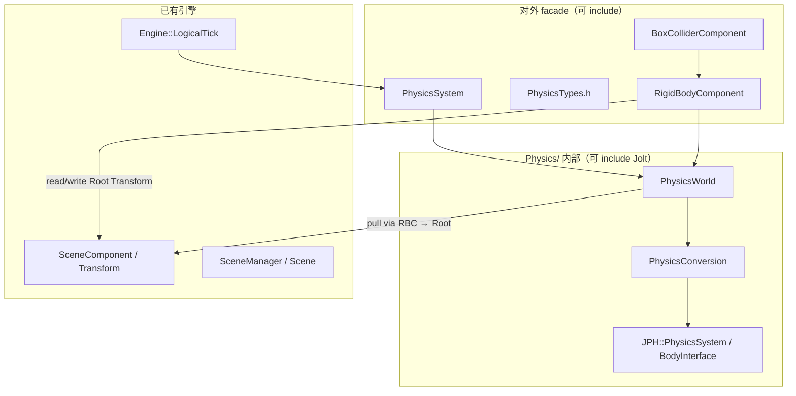
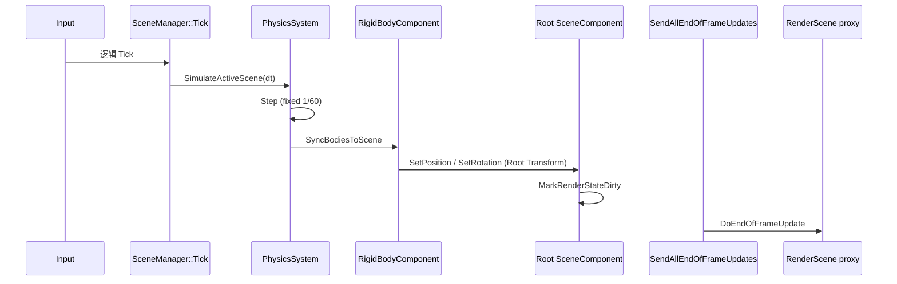

# Jolt Physics Bootstrap — Design Spec

## Meta
- **ID:** `PHYS-F01`
- **Type:** Feature
- **Status:** In Progress
- **Owner:** project maintainer
- **Last updated:** 2026-06-12
- **Related:** [Implementation](./PHYS-F01_JOLT_INTEGRATION_IMPLEMENTATION.md), [FEATURE_REGISTRY.md](../FEATURE_REGISTRY.md), [CORE-F01 Transform quaternion](../Platform/Core/CORE-F01_TRANSFORM_QUATERNION_DESIGN.md)

## TL;DR

**PHYS-F01 是物理子系统的 bootstrap（启动计划），不是完整物理产品。** 目标：引入 Jolt、建立最薄的引擎物理抽象层、提供 `RigidBodyComponent`（物理代理，**非** `SceneComponent`）+ `BoxColliderComponent`，跑通固定步长仿真与动态刚体 pose 写回 GO **RootComponent** 的 Transform（四元数）。碰撞通道、Contact 事件、`LineTrace` 为 S02/S03 跟进切片；角色、载具、Editor 物理调试、渲染管线改动均不在本 Feature。

## Scope

- **In（bootstrap）：**
  - Jolt 以 submodule + CMake 接入（`Third-Party/Jolt`）
  - `PhysicsSystem`（引擎单例）+ 每 `Scene` 一个 `PhysicsWorld`
  - 固定 `1/60 s` 步长 + accumulator；挂接 `Engine::LogicalTick`
  - `PhysicsConversion`：minEngine 坐标 ↔ Jolt 坐标（集中一处）
  - `RigidBodyComponent`（`Component` 子类，物理代理）+ `BoxColliderComponent`（反射、序列化字段最小集）
  - Transform 真源：**GO `RootComponent`**（`SceneComponent`）；刚体组件无自有 Transform
  - 动态刚体 simulate 后 **pull** 写回 RootComponent 的 `Position` + `Rotation(quat)`
  - headless 落体 smoke 测试（主验收）；可选 Playground 目视
  - S02：碰撞层 + Contact Begin/End；S03：`LineTrace`（本设计定边界，实施见 Implementation Plan）
- **Out（刻意不做）：**
  - Character / Vehicle / Cloth / Ragdoll
  - 复杂形状生态（Mesh、Convex hull、Compound 等）— S01 仅 Box
  - 非均匀 Scale 参与碰撞（S01 仅 uniform scale；非均匀只影响视觉）
  - Kinematic 双向同步的完整语义（S01 可 stub；动态 pull 为主）
  - Editor 物理可视化、碰撞体 Gizmo、Simulate 按钮
  - RHI、RenderPipeline、SceneProxy、Material、ImGuizmo
  - 完整 Tick Group 枚举（Pre/Post Physics 组件组）— 用固定插入点代替
  - 多物理后端抽象（仅 Jolt）

## Reader quick start

1. 本文件 — 定位、架构、Tick 时序、拍板项、验收。
2. [PHYS-F01_JOLT_INTEGRATION_IMPLEMENTATION.md](./PHYS-F01_JOLT_INTEGRATION_IMPLEMENTATION.md) — 切片、PR 边界、命令。
3. 代码入口（计划）：`Runtime/Function/Physics/`，`Engine::LogicalTick`。

---

## 1) 背景与目标

### Pain
- 引擎尚无物理模块；`MovementComponent` 为占位，无法验证碰撞、重力、刚体行为。
- `CORE-F01` 已将 `Transform::Rotation` 改为四元数存储，为 Jolt pose 写回铺平道路。
- 若无清晰边界层，Jolt 头文件与坐标转换会散落各模块，与 `render` track 并行 merge 时风险高。

### Goals
- **最小垂直切片：** 一个动态 Box 在重力下下落，pose 经 `RigidBodyComponent` 代理写回 **RootComponent** Transform，headless 测试可断言。
- **隔离层：** Runtime 非 `Physics/` 代码不 `#include` Jolt；对外 facade 为 `PhysicsSystem`、`PhysicsTypes`、组件类型。
- **与 UE 同类的时序：** Simulate → 回写 Component Transform → `SendAllEndOfFrameUpdates`（渲染代理刷新）。
- **可扩展钩子：** S02/S03 在同一 `PhysicsWorld` 上叠加，不重写 bootstrap 骨架。

### Success
- `cmake --build` + `minEngineTests` physics smoke 通过。
- `LogicalTick` 内仿真与写回顺序稳定；动态刚体本帧渲染可见正确 pose（经现有 `MarkRenderStateDirty` → `DoEndOfFrameUpdate` 链）。
- Jolt 仅出现在 `Runtime/Function/Physics/` 及 CMake 链接配置。

---

## 2) 现状

### 2.1 逻辑帧时序

```216:221:minEngine/minEngine/src/Runtime/Engine.cpp
    void Engine::LogicalTick(float deltaTime)
    {
        m_InputSystem->Tick(deltaTime);
        m_SceneManager->Tick(deltaTime);
        m_SceneManager->SendAllEndOfFrameUpdates();
    }
```

Editor 在 UI 之后额外 flush 一次 `SendAllEndOfFrameUpdates`，再 `TickRendererFrame`（Inspector 晚于 `LogicalTick` 的改动仍能更新 proxy）。

### 2.2 Transform 与渲染脏标记

- `SceneComponent::SetPosition` / `SetRotation` / `SetTransform` 会 `MarkRenderStateDirty()` → `MarkForNeededEndOfFrameUpdate()`。
- `PrimitiveComponent::DoEndOfFrameUpdate` 在 dirty 时 `RenderScene::UpdatePrimitive`。
- **物理回写应走 GO `RootComponent` 的 `SceneComponent` API**，不直接改 `SceneProxy`；`RigidBodyComponent` 自身不持有 Transform。

### 2.3 坐标约定（引擎侧）

自 `SceneComponent` 方向向量：

| 轴 | 引擎语义 |
|----|----------|
| +X | Forward |
| +Y | Up |
| +Z | Right |

右手系。Jolt 默认右手 **Y-up**；轴映射全部经 `PhysicsConversion` 完成，禁止在组件内散落 `swap` 或手写矩阵。

### 2.4 缺失项

- 无 `Third-Party/Jolt` submodule。
- 无 `PhysicsSystem` / `PhysicsWorld` / 物理组件。
- `Scene` 无物理世界生命周期钩子。

---

## 3) 方案

### 3.1 模块分层



**硬规则：**
1. `#include <Jolt/...>` 只允许出现在 `Runtime/Function/Physics/` 下的 `.cpp` 及该目录内头部（若必须）；其它模块只 include facade。
2. `PhysicsConversion` 是唯一坐标与类型转换入口。
3. 组件不直接调用 Jolt 全局 API；经 `PhysicsWorld` 或 `PhysicsSystem` 提供的窄接口。

### 3.2 核心类型

#### PhysicsSystem（单例）

| 职责 | 说明 |
|------|------|
| `Initialize` / `Shutdown` | Jolt `RegisterTypes`、工厂、临时分配器等一次性设置 |
| `SimulateActiveScene(float deltaTime)` | 对 `SceneManager` 当前活动 `Scene` 的 `PhysicsWorld` 步进 |
| `GetOrCreateWorld(Scene*)` | 懒创建 per-Scene 世界 |
| `DestroyWorld(Scene*)` | `Scene` 卸载/重置时销毁 |

生命周期：`Engine::StartSystems` / `ShutdownSystems` 中与 `SceneManager` 同级注册。

#### PhysicsWorld（每 Scene 一个）

| 职责 | 说明 |
|------|------|
| `Step(float deltaTime)` | 固定 `1/60 s` + accumulator；调用 Jolt `Update` |
| `CreateBody` / `DestroyBody` | 由组件生命周期驱动 |
| `SyncBodiesFromScene()` | （S01 可选 stub）从各 `RigidBodyComponent` 读取 **RootComponent** Transform → Body |
| `SyncBodiesToScene()` | 动态体：Body pose → **RootComponent**（经 `RigidBodyComponent` 解析 GO） |
| `SetGravity` | 默认 `(0, -9.81, 0)` 引擎空间，经 conversion 传入 Jolt |

**Body 句柄：** 对外使用 `PhysicsBodyId`（`uint32_t` 或薄包装），不暴露 `JPH::BodyID` 给 `Physics/` 以外代码。`RigidBodyComponent` 内存可持 `PhysicsBodyId`；内部映射在 `PhysicsWorld`。

#### RigidBodyComponent（物理代理）

**定位：** 物理子系统在 Scene 图上的**代理人**——连接 GO 的 **RootComponent Transform** 与 Jolt Body。不承担场景节点职责。

| 约束 | 说明 |
|------|------|
| 继承 | `Component`（**非** `SceneComponent`） |
| Transform | **无**自有 `m_Transform`；不当 `RootComponent` |
| 读写目标 | `GetOwner()->GetRootComponent()` 的 `Position` / `Rotation(quat)` / `Scale` |
| Body 所有权 | 持 `PhysicsBodyId`；创建/销毁 body 由此组件驱动 |

字段（S01 最小集）：
- `BodyType`：`Static` | `Dynamic`（`Kinematic` 枚举预留，S01 可不实现行为）
- `Mass`（dynamic 时用）
- `bSimulatePhysics`（是否参与步进与 pull）

生命周期：
- 启用时：若 GO 有有效 `RootComponent`，在 `PhysicsWorld` 创建 body（若同 GO 已有 `BoxColliderComponent` 则附加形状）
- 无 `RootComponent`：**不创建** body（`ME_ASSERT` 或 log + skip）
- 销毁时：从 world 移除 body

同步（由 `PhysicsWorld` 统一调用，不在 `DoEndOfFrameUpdate`）：
- **Push**（`SyncBodiesFromScene`，S01 可 stub）：`RootComponent` Transform → Jolt Body
- **Pull**（`SyncBodiesToScene`）：Jolt Body → `RootComponent::SetPosition` / `SetRotation`

#### BoxColliderComponent

- 继承 `Component`。
- 字段：`Vector3 HalfExtent`（引擎空间，uniform scale 由 **RootComponent** 的 scale 参与计算）。
- 与同 GO 的 `RigidBodyComponent` 配对；形状位姿相对 **Root Transform**（S01 中心在 Root 原点，无独立 offset）。
- 自身不是场景节点；可视化仍由 Root 上的 `PrimitiveComponent` 等负责。

#### GameObject 装配（S01）

典型动态落体对象：

```text
GameObject
  RootComponent: SceneComponent（或 StaticMeshComponent 等 SceneComponent 子类）  ← Transform 真源
  RigidBodyComponent（Dynamic）                                                    ← 物理代理
  BoxColliderComponent                                                             ← 形状
```

典型静态地板：Root 为 `SceneComponent` + `RigidBodyComponent(Static)` + `BoxColliderComponent`。

**不变量：** 一个参与仿真的 GO 上，有且仅有一个 `RigidBodyComponent` 代理该 Root 的 body（S01 不处理多刚体 GO）。

### 3.3 Tick 时序（对齐 UE）

UE（Chaos）简化对照：

| UE 相位 | 行为 | minEngine PHYS-F01 |
|---------|------|---------------------|
| PrePhysics | 游戏逻辑、输入、向物理推 kinematic 目标 | `SceneManager::Tick`（S01 不单独拆组） |
| Simulate | 求解器步进 | `PhysicsWorld::Step` |
| PostPhysics | 动态体 pose 写回场景组件 | `PhysicsWorld::SyncBodiesToScene` → GO **RootComponent** |
| 渲染准备 | SceneProxy / 相机更新 | `SendAllEndOfFrameUpdates` |
| Render | 绘制 | `RendererTick` |

**目标 `LogicalTick`：**

```text
InputSystem::Tick(dt)
SceneManager::Tick(dt)                    // 游戏逻辑
PhysicsSystem::SimulateActiveScene(dt)    // Step + SyncBodiesToScene
SceneManager::SendAllEndOfFrameUpdates()  // Camera / Primitive proxy
```

Editor 第二次 `SendAllEndOfFrameUpdates` 保持不变。

**原则（与 UE 一致）：**
- 回写写 **RootComponent Transform 真源**（经 `RigidBodyComponent` 代理），不直接改 `SceneProxy`。
- 物理在 **第一次 EndOfFrame 之前** 完成，使本帧 proxy 吃到最终 pose。
- 不在 `DoEndOfFrameUpdate` 内做 `Step`（避免顺序晚于其它 EndOfFrame 消费者）。



### 3.4 坐标转换（PhysicsConversion）

集中提供：

| 函数 | 方向 |
|------|------|
| `ToJoltPosition(Vector3)` | 引擎 → Jolt |
| `FromJoltPosition(JoltVec)` | Jolt → 引擎 |
| `ToJoltQuaternion(Quaternion)` | 引擎 → Jolt |
| `FromJoltQuaternion(JoltQuat)` | Jolt → 引擎 |
| `ToJoltVec3` 用于 half-extent、gravity 等 | 同上 |

**轴映射（拍板，实现时写入代码注释与单元测试）：**

引擎 `(Xf, Yu, Zr)` 右手系 → Jolt 右手 Y-up：

| 引擎 | Jolt |
|------|------|
| +X Forward | +Z |
| +Y Up | +Y |
| +Z Right | +X |

即：`(ex, ey, ez)_engine → (ez, ey, ex)_jolt`（实现以 `PhysicsConversion` 单测锁定，避免手写散落）。

### 3.5 仿真参数

| 参数 | 值 |
|------|-----|
| 固定步长 | `1/60 s` |
| 最大子步 | 4（单帧 `dt` 过大时 clamp） |
| 重力（引擎空间） | `(0, -9.81, 0)` |
| Scale | S01 仅 **uniform**；`HalfExtent * uniformScale` |

### 3.6 S02 / S03 边界（本 Feature 内，非 S01）

| 切片 | 交付 | 说明 |
|------|------|------|
| **S02** | `ECollisionChannel`：Default / WorldStatic / Trigger；Contact Begin/End 双缓冲 | 不在 S01 实现 |
| **S03** | `PhysicsWorld::LineTrace` 引擎空间 API | 不在 S01 实现 |

---

## 4) 拍板项（P1–P10）

| ID | 问题 | 决定 |
|----|------|------|
| **P1** | Jolt 引入方式 | `Third-Party/Jolt` git submodule + `add_subdirectory` |
| **P2** | 物理世界粒度 | 每个 `Scene` 一个 `PhysicsWorld` |
| **P3** | 仿真步长 | 固定 `1/60 s` + accumulator；`LogicalTick` 传入 `deltaTime` |
| **P4** | Body 与 GO 映射 | `RigidBodyComponent` 持 `PhysicsBodyId`；销毁时从 world 移除 |
| **P5** | 写回策略 | 动态刚体每步 pull 至 **RootComponent**：`Position` + `Rotation(quat)`；kinematic push S01 可 stub |
| **P6** | 碰撞体 scale | S01 仅 uniform scale（取自 RootComponent） |
| **P7** | 坐标转换 | 单一 `PhysicsConversion`；§3.4 轴映射 |
| **P8** | S01 验证 | headless 测试为主；Editor 目视可选 |
| **P9** | 分支策略 | 继续 `physics` 分支；与 `render` 并行，定期 merge `master` |
| **P10** | `RigidBodyComponent` 模型 | **物理代理**：继承 `Component`；无自有 Transform；不当 Root；读写 `GetOwner()->GetRootComponent()`（用户拍板 2026-06-12） |

P1–P9 用户确认全部默认（2026-06-11）。

---

## 5) 备选方案

| 选项 | 优点 | 缺点 | 结论 |
|------|------|------|------|
| A. 全局单一 PhysicsWorld | 实现简单 | 多 Scene 编辑器预览会串 | 否决 |
| B. 每 Scene 一个 PhysicsWorld | 与 UE `UWorld` 一致；隔离预览 | 多一层 map | **选用（P2）** |
| C. 在 `DoEndOfFrameUpdate` pull | 与渲染更新近 | 顺序晚于其它 EOF；违背 UE | 否决 |
| D. 直接改 SceneProxy | 少一次 dirty | Transform 非真源 | 否决 |
| E. `RigidBodyComponent : SceneComponent` 兼作 Root | 单组件简单 | 场景节点与物理耦合；与「Transform 在 Root」模型冲突 | 否决（**P10**） |
| F. `RigidBodyComponent : Component` 代理 Root | 场景图 / 物理职责分离；Root 可为 Mesh 等 | 需保证 Root 存在；同步经 Root API | **选用（P10）** |

---

## 6) 风险与缓解

| 风险 | 影响 | 缓解 |
|------|------|------|
| Jolt + MinGW 编译/链接 | S01 阻塞 | S01-a 独立 PR；Jolt 官方 CMake；必要时关 SSE 等选项 |
| worktree submodule 路径 | `git status` 异常 | `scripts/fix-worktree-submodule-gitdirs.ps1` |
| 轴映射错误 | 物体横飞/穿模 | `PhysicsConversion` 单测 + 落体仅 Y 变化断言 |
| 非均匀 Scale | 碰撞与视觉不一致 | S01 文档声明 + 运行时 assert 或忽略非均匀 |
| 无 RootComponent 的 GO 挂刚体 | 无法创建 body | 创建时 assert / skip；测试必须设 Root |
| Scene attach 树与物理 | 子节点 Transform 与 body 不同步 | S01 body 只跟踪 **Root** Transform；子 attach 不参与物理 |
| CORE-F01 未合 master | 双分支 Transform API 分叉 | CORE-F01 S06 尽快 PR；PHYS 基于 physics 分支继续 |

---

## 7) 验收标准

### PHYS-F01（整体 Feature，含 S01–S03）

- [ ] S01：Jolt 链接、落体 headless 测试通过
- [ ] S02：两层碰撞 + Trigger contact 事件测试通过
- [ ] S03：`LineTrace` hit 测试通过
- [ ] 非 `Physics/` 模块无 Jolt include
- [ ] `verify.ps1` / smoke 无回归

### S01 bootstrap（首批 land）

- [ ] `cmake --build minEngine/build --target minEngineTests` 通过
- [ ] 新 suite：`physics-smoke` — 动态 box 初始高度 `h0`，仿真 `N` 步后 `Y < h0` 且下降合理
- [ ] `Engine::LogicalTick` 已挂接 `PhysicsSystem::SimulateActiveScene`
- [ ] 动态体写回后 **RootComponent** `Rotation` 为 quat（非 Euler 回环）；`RigidBodyComponent` 无 Transform 字段

---

## 8) Status note

（无 Blocked 项；`CORE-F01` 代码已 land，可并行 S06 文档收尾。）

---

## 变更记录

| 日期 | 说明 |
|------|------|
| 2026-06-11 | 初稿：bootstrap 定位、P1–P9 拍板、UE 对齐 Tick 时序 |
| 2026-06-12 | **P10**：`RigidBodyComponent` 改为 `Component` 物理代理，Transform 真源在 RootComponent |
