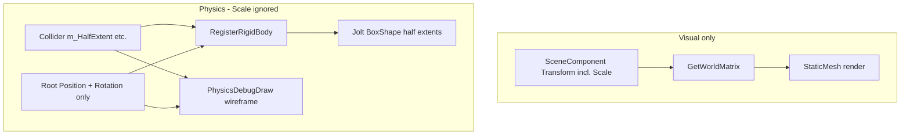

# PHYS-F04 — Collider Size Independent of Transform Scale — Design Spec

## Meta
- **ID:** `PHYS-F04`
- **Type:** Feature（语义修正 + bugfix）
- **Status:** Done
- **Owner:** project maintainer
- **Last updated:** 2026-09-01
- **Branch:** `master`
- **Related:** [FEATURE_REGISTRY](../FEATURE_REGISTRY.md) · [ACTIVE_WORK](../ACTIVE_WORK.md) · [PHYS-F01](./PHYS-F01_JOLT_INTEGRATION_DESIGN.md) · [RND-F11 DebugDrawing](../Render/RND-F11_DEBUG_DRAWING_DESIGN.md)
- **Supersedes:** PHYS-F01 §3.6「`HalfExtent * uniformScale`」— 见 §4

## TL;DR
**碰撞体形状尺寸与 `SceneComponent` 的 Transform Scale 完全无关。** `HalfExtent` / `Radius` / `HalfHeight` 表示碰撞体自身的世界空间尺寸（由组件属性单独定义）；改 GO 的 Scale 只影响视觉网格，**不得**改变 Jolt shape 或 debug wireframe 的大小。当前代码在注册与 debug draw 中乘以 `scale.x`，且 scale 变更不重建 body — 与本语义冲突，本 Feature 一次性纠正。

## Scope
- **In:**
  - 移除所有 `colliderSize * GetUniformScale(scale)` 逻辑
  - Jolt shape 创建、形状刷新、`PhysicsDebugDraw` 与上述语义一致
  - 文档化：`HalfExtent` = 半边长（世界单位），与 unit cube 默认 `(0.5,0.5,0.5)` 对齐
  - 测试更新 / 增补 scale 无关断言
- **Out:**
  - 非均匀 scale 参与碰撞（仍 **不支持**；scale 仅视觉）
  - 子节点 collider offset（无独立 `SceneComponent` 于 collider 上时，仍以 root pose 为准）
  - `PHYS-F03` Contact 玩法派发
  - 自动从 mesh AABB 拟合 collider

## Reader quick start
1. 本文件：语义契约（**Scale ⊥ Collider**）
2. 代码：`PhysicsWorld::RegisterRigidBody`、`PhysicsDebugDraw.cpp`
3. 对照：mesh 用 `GetWorldMatrix()`（含 scale）— **预期与 collider 可不一致**

---

## 1) 背景与目标

### 用户意图（明确）
> Collider Shape 大小和物体 Scale **不应挂钩**；两者 **完全独立**，不要有一点关系。

即：
- 艺术家把 Cube **Scale 设为 (2,2,2)** → 仅 mesh 变大；**BoxCollider 的 1×1×1 碰撞盒不变**（除非手动改 `HalfExtent`）。
- 反过来，只改 `HalfExtent` → 只改物理；**不**随 Scale 自动缩放。

### 当前问题
1. **`RegisterRigidBody`**：`engineHalfExtent = GetHalfExtent() * uniformScale`（`uniformScale = scale.x`）。
2. **`PhysicsDebugDraw`**：wireframe 同样 `* uniformScale`，且每帧读 scale → 与 Jolt body（注册时 bake 的 scale）**分裂**。
3. **Scale 变更**只触发 `SyncBodiesFromScene` 推 pose，**不**重建 shape；debug 线框跟 scale 变、碰撞体不变 → Editor 里「线框和碰撞对不上」。

### 目标
- 单一语义：**Collider 维度 = 组件字段字面量（世界单位）**；Transform 仅提供 **位置 + 旋转** 给物理与 debug。
- Debug wireframe 与 Jolt 碰撞 **永远同尺寸**。
- 与 `PHYS-F01` 文档冲突处，以 **本 Design + 下文 ADR 式决策** 为准。

---

## 2) 语义契约（API / 不变量）

### 2.1 Collider 组件字段

| 组件 | 字段 | 含义 | 默认 |
|------|------|------|------|
| `BoxColliderComponent` | `m_HalfExtent` | 世界空间 **半边长**（米） | `(0.5, 0.5, 0.5)` → 1m 立方体 |
| `SphereColliderComponent` | `m_Radius` | 世界空间半径 | `0.5` |
| `CapsuleColliderComponent` | `m_Radius`, `m_HalfHeight` | 世界空间半径 / 圆柱半高（+Y 轴） | `0.5`, `0.5` |

**不变量：**
- 创建 Jolt shape 时 **直接使用** 上述数值，**不** 读取 `RootComponent::GetScale()`。
- Debug draw 使用 **相同数值**，**不** 读取 scale。
- `RootComponent` 的 **Position / Rotation** 仍驱动 body pose 与 wireframe 变换。

### 2.2 Transform Scale 的角色

| 系统 | Scale 是否参与 |
|------|----------------|
| `StaticMeshComponent` / 渲染 | **是**（`GetWorldMatrix()`） |
| Jolt collider shape | **否** |
| `PhysicsDebugDraw` wireframe | **否** |
| `PhysicsWorld` 查询 / 仿真 | **否** |

若需要「视觉与碰撞一起变大」，用户应 **同时** 调 Scale（仅视觉）与 Collider 属性（物理）— 或将来由 Editor 工具一键同步（**本 Feature 不做**）。

### 2.3 命名说明（Extent 轴）

- 引擎 convention：**X/Y/Z 与场景一致**；`HalfExtent` 为 **half**，非 full size。
- `SetFullExtent` 辅助 API 保留（`full * 0.5` → half）；Inspector 只暴露 `m_HalfExtent`。
- 与 `PHYS-F01` 一致：默认 half `(0.5,0.5,0.5)` 对齐 `cube.obj` ±0.5；误填 `(1,1,1)` 会得到 2m 盒 — **文档 + tooltip 说明**，非代码自动修正。

---

## 3) 方案

### 3.1 代码修改要点

**`PhysicsWorld.cpp` — `RegisterRigidBody`**
```cpp
// Before (wrong):
const Vector3 engineHalfExtent = boxCollider->GetHalfExtent() * uniformScale;

// After:
const Vector3 engineHalfExtent = boxCollider->GetHalfExtent();
```
Sphere / Capsule 同理；**删除** `GetUniformScale` 在本路径的使用（若全文件无用则删 helper）。

**`PhysicsDebugDraw.cpp` — `SubmitCollider`**
```cpp
// Before:
DebugDraw::Box(worldTransform, boxCollider.GetHalfExtent() * uniformScale, color);

// After:
DebugDraw::Box(worldTransform, boxCollider.GetHalfExtent(), color);
```
`BuildColliderWorldTransform` 保持 **仅 translation × rotation**（不含 scale）— 已符合目标。

**Scale 变更不再触发 shape 尺寸变化**
- 移除「scale dirty → 需 RefreshPhysicsBody」的需求（因尺寸与 scale 无关）。
- `SyncBodiesFromScene` 继续只同步 pose 即可。
- 若曾计划「scale 变重建 shape」，**本方案取消该逻辑**。

**`PhysicsEditorSideEffects`**
- 无需为 `m_Transform.Scale` 触发 collider refresh（仅 position/rotation 走现有 teleport 路径）。

### 3.2 共享辅助（可选，小范围）

若 `PhysicsWorld` 与 `PhysicsDebugDraw` 需统一读 collider 尺寸，可提取 **header 内联** 或 `ColliderComponent` 上的 `GetWorldShapeHalfExtent()`（**不**读 scale）— 仅当去重明显时做，避免过度抽象。

### 3.3 数据流（修正后）



### 3.4 与 PHYS-F01 的冲突处理

| PHYS-F01 原表述 | PHYS-F04 决策 |
|-----------------|---------------|
| S01 仅 uniform scale；`HalfExtent * uniformScale` | **废止** — scale 不参与 collider |
| 非均匀 scale 与碰撞不一致 | 仍成立：scale **只**影响视觉，碰撞永远忽略 scale |

在 `PHYS-F01` 文首可加一行 **Legacy note** 指向本文件（实现时顺手改，非本 DoD 必须）。

---

## 4) 备选方案

| 选项 | 说明 | 结论 |
|------|------|------|
| **A. Collider 完全独立于 Scale** | 用户指定 | **选用** |
| B. Local half-extent × uniform scale | PHYS-F01 原方案 | **拒绝** |
| C. Local half-extent × scale.xyz 非均匀 | 复杂且与「完全独立」矛盾 | 拒绝 |
| D. Scale 仅影响视觉，自动同步 collider | 隐式联动，违反「独立」 | 拒绝 |

---

## 5) 风险与缓解

| 风险 | 缓解 |
|------|------|
| 已有场景依赖「scale 放大碰撞」 | 破坏性变更；`PROGRESS_LOG` 注明；用户手动改 HalfExtent |
| 线框与 mesh 不再贴合 | **预期行为**；靠调 collider 或 scale 分别对齐 |
| 测试假设 scale 影响碰撞 | 审查 `physics-*`；改为断言 scale 无关 |
| BUG-PHYS-002 Inspector 直写字段 | 仍靠 `ApplyPhysicsEditorSideEffects`；与 scale 无关 |

---

## 6) 实施切片

| Slice | 内容 | 验证 |
|-------|------|------|
| **PHYS-F04-S01** | 移除 `PhysicsWorld` 中 scale × extent | `physics-shapes` / `physics-smoke` |
| **PHYS-F04-S02** | 移除 `PhysicsDebugDraw` 中 scale × extent | Editor wireframe vs 碰撞一致 |
| **PHYS-F04-S03** | 删/收敛 `GetUniformScale`；PHYS-F01 legacy note | 全仓 grep 无 collider×scale |
| **PHYS-F04-S04** | 测试：GO scale (2,2,2) 不改变 sphere trace / 落点 | 新用例或扩 `PhysicsSyncTest` |

---

## 7) 验收标准

- [x] `grep`：`HalfExtent * uniformScale` / `GetUniformScale` 在 Physics 路径为 0
- [x] 同一 GO：`SetScale(2,2,2)` 前后，`BoxCollider` trace 结果 **不变**（仅 mesh 视觉变）
- [x] Debug wireframe 与 Jolt 碰撞一致（改 scale 线框不变；改 HalfExtent 两者同变）
- [x] `physics-shapes`、`physics-smoke`、`physics-sync` 全绿
- [x] GL Editor 手动：scale 与 collider 独立可调

---

## 8) Status note

| 字段 | 内容 |
|------|------|
| Branch | `master` |
| Blocks | 无（不挡 PHYS-F03） |
| User decision | 2026-09-01 — Scale 与 Collider **零耦合** |

---

## 9) 变更记录

| 日期 | 说明 |
|------|------|
| 2026-08-31 | Registry 占位 |
| 2026-09-01 | 调查：scale 乘 extent + debug/物理分裂 |
| 2026-09-01 | 用户确认语义：完全独立；扩写 Design Spec |
| 2026-09-02 | S01–S04 Done；验收勾选（`c2c0893`） |
