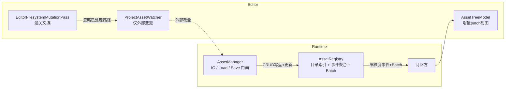
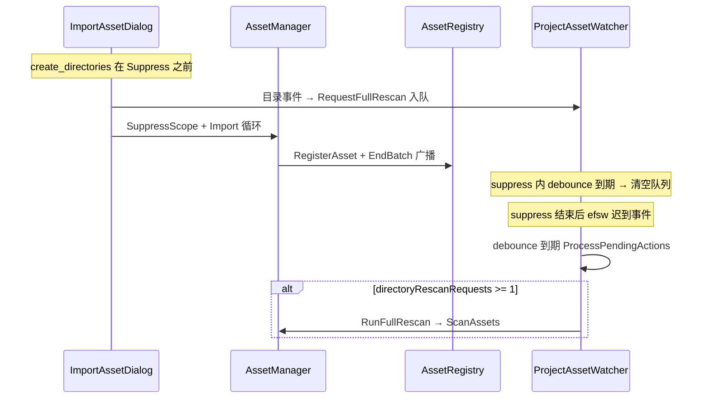

# AssetRegistry 重构计划

## 背景与目标

当前 `AssetManager` 承担了三件事：资产索引（registry map）、IO 与生命周期（Import/Delete/Load/Save）、事件广播。导致：

- `FindAssetMetasUnderDirectory` 是 O(资产总数) 全表扫描，无目录索引
- `AssetTreeModel` 收到任何 `AssetRegistryChange` 都调用 `RebuildDirectoryTree()`，整树重建
- 调用方还在订阅之外手动重复 `RebuildDirectoryTree()`
- Editor 内部 CRUD 写盘后，`ProjectAssetWatcher` 仍会触发 `ScanAssets` 全库扫描（与 Registry 已更新重复）

**目标架构：**



**职责边界（拍板）：**

| 组件 | 职责 |
|------|------|
| `AssetManager` CRUD | 写盘 + 更新 `AssetRegistry`（**真源闭环，不依赖 Watcher**） |
| `AssetRegistry` | 内存索引、目录索引、变更事件、Batch 合并广播 |
| `AssetTreeModel` | Registry 事件的 **视图**；仅初始化/Refresh 时全量重建 |
| `ProjectAssetWatcher` | **仅**同步外部磁盘变更（Explorer、git 等） |
| Editor 通关文牒 (#4) | 标记「本次 Editor 已处理的磁盘路径」，Watcher 不再重复同步 |

---

## 实施状态总览

| 阶段 | 内容 | 状态 |
|------|------|------|
| **R0** | `AssetRegistry` 类 + `AssetManager` 内部切换 + 目录索引 + Batch | **已实现** |
| **R1** | `AssetTreeModel` 增量 patch + 去掉重复 Refresh | **已实现** |
| **R2** | Batch 从 suppress 拆出；Watcher 用通关文牒 (#4) | **待做** |
| **R3** | Watcher 策略收尾（directory threshold、ScanAssets Batch 等） | **待做（可选保险）** |

关联 issue 记录：[CONTENT_BROWSER_REGISTRY_REFRESH_ISSUE.md](./CONTENT_BROWSER_REGISTRY_REFRESH_ISSUE.md)

---

## 阶段 R0：AssetRegistry（已完成）

**目标：** 把索引数据与目录模型封装进独立类，`AssetManager` 内部切换到 `AssetRegistry`，对外 API 不变。

### 核心数据结构

`AssetRegistry` 持有：

- `m_Metas: unordered_map<string /*relPath*/, AssetMeta>` — 主索引
- `m_PathByGuid: unordered_map<GUID, string>` — GUID 反查
- `m_MetasByType: unordered_map<string, vector<AssetMeta*>>` — 类型桶
- `m_MetasByParentDir: unordered_map<string /*parentRelDir*/, vector<AssetMeta*>>` — **目录索引**（O(1) 按父目录查询）

### 事件契约

沿用 `AssetRegistryTypes.h` 中的 `AssetRegistryChangeKind`，Batch 机制：

```cpp
void BeginBatch();   // 暂停广播，depth 计数支持嵌套
void EndBatch();     // depth 归零时按顺序广播 pending 列表（不合并 Kind/Path）
```

### AssetManager 变更（已落地）

- 删除 `m_AssetRegistry` / `m_AssetPathByGuid` / `m_AssetMetasByType`，改为 `m_Registry`
- `CacheMeta` / `UncacheMeta` / `Subscribe` / `FindAssetMetasUnderDirectory` 委托给 `m_Registry`
- `MoveMeta` 在 Registry 内发 `Moved` 事件
- **R2 已拆分：** `AssetRegistryBroadcastBatchScope`（仅 Batch）+ `EditorFilesystemMutationPass`（Watcher 过滤）；`SuppressExternalSyncScope` 已移除

### R0 验收（已通过）

- `cmake --build` → `Editor` ✅
- `Editor.exe --asset-manager-test --engine-config=./minEngine/EngineConfig.meconfig` ✅
- `Editor.exe --material-ir-test --engine-config=./minEngine/EngineConfig.meconfig` ✅

---

## 阶段 R1：AssetTreeModel 增量更新（已完成）

**目标：** `OnRegistryChange` 按 Kind 局部 patch；`RebuildDirectoryTree` 仅用于显式全量路径。

### 变更规则（已实现）

| Kind | 树（DirectoryNode） | 当前目录列表 |
|------|---------------------|--------------|
| `Registered` | `GetOrInsertDirectoryNode(parent)` → 插入 meta 指针 | 若在当前目录 → 追加 |
| `Unregistered` | 从父节点 `Assets` 移除 | 从 `m_CurrentAssets` 移除 |
| `Moved` | Old 移除 + New 插入 | 按 old/new 与当前目录关系更新 |
| `MetaUpdated` / `Reimported` | 不动树结构 | 若在当前目录 → 替换列表项 |

### 已去掉的重复刷新

- `AssetWorkflowModule::ImportAssetDialog` 末尾不再 `RebuildDirectoryTree`
- `ContentBrowserImportAction` / `ContentBrowserDeleteAction` 不再调用 `RefreshContentBrowser`
- **保留：** `ContentBrowserRefreshAction`、工具栏 Refresh → 显式全量重建

### R1 验收（代码层）

- Import/Delete 的 Registry 路径不再触发 `RebuildDirectoryTree` ✅
- **目视：** 若仍卡顿并见 `running full ScanAssets` 日志 → 属 R2 Watcher 问题，非 AssetTree 全量重建

---

## 问题复盘：Import/Delete 后仍像「全量扫描」

### 两种「全量」勿混

| 类型 | 入口 | 典型日志 / 现象 |
|------|------|-----------------|
| **Registry 全量** | `AssetManager::ScanAssets` | `ProjectAssetWatcher: running full ScanAssets on '...'` |
| **UI 全量** | `AssetTreeModel::RebuildDirectoryTree` | 递归 `directory_iterator` 重建整棵树（R1 后 Import/Delete 主路径已避免） |

### Editor CRUD 是否已更新 Registry？

**是。** 不依赖 Watcher 扫盘才能变对。

| API | 磁盘 | Registry | 事件 |
|-----|------|----------|------|
| `ImportAsset` | `copy_file` | `RegisterAsset` → `CacheMeta` | `Registered` |
| `DeleteAsset` | 删资产 + `.meta` | `UncacheMeta` | `Unregistered` |
| `MoveAsset` / `RenameAsset` | `rename` | `MoveRegistryEntry` → `MoveMeta` | `Moved` |
| `UnregisterAsset` | 可选删 meta | `UncacheMeta` | `Unregistered` |
| `ScanAssets` | 递归扫目录 | 每文件 `RegisterAsset` | 大量变更（**无 Batch**，外部/全量路径） |

结论：**Editor 内调 AssetManager CRUD = 写盘 + Registry 已更新；Watcher 再跟一遍是重复同步。**

### 根因：Watcher + debounce + 抑制窗口不完整



要点：

1. **`create_directories` 在 `SuppressExternalSyncScope` 之前**（`AssetWorkflowModule`），目录事件可能先入队。
2. **`SuppressExternalSyncScope` 只覆盖 CRUD 执行期**；efsw 异步 / 父目录 Modified 常在 suppress **结束后** 才 debounce 处理。
3. suppress 期间 `ProcessPendingActions` **清空队列**，但不阻止 suppress **结束后** 新事件。
4. **`kDirectoryEventThreshold = 1`**：批次内只要有 1 个 `RequestFullRescan` → `RunFullRescan()` → 整库 `ScanAssets`。
5. **`ScanAssets` 无 Batch**：全库逐文件 `RegisterAsset`，已存在则 `MetaUpdated` 洪水。

**不是**「debounce 没被抑制」 alone，而是 **抑制时间范围 < 文件系统事件到达时间** + **目录事件策略过激**。

---

## 阶段 R2：Batch 拆分 + Editor 通关文牒 (#4)（已完成）

### 设计拍板

| 机制 | 职责 | 实现位置 |
|------|------|----------|
| **Registry Batch** | 合并一次 Editor 事务内多条 `AssetRegistryChange` 广播 | 从 `SuppressExternalSyncScope` **拆出**，如 `AssetRegistryBroadcastBatchScope` |
| **Editor 通关文牒 (#4)** | Watcher 忽略「Editor 已处理的磁盘路径」 | `EditorFilesystemMutationPass`（名待定）+ `ProjectAssetWatcher::handleFileAction` 过滤 |
| ~~Watcher suppress 清队列~~ | 不再作为主方案 | R2 完成后删除 `IsExternalSyncSuppressed()` 分支 |

**不能把 Batch 和 Watcher 抑制绑在一个 scope 里删掉：** Batch 解决订阅方 N 次通知；通关文牒解决 Watcher 重复扫盘。二者不可互相替代。

### #4 通关文牒 — 概要设计

**思路：** Editor 内部写盘前/后登记「本次 touch 的路径」；Watcher 收到 efsw 事件时，若路径（或父目录）在凭证集内且未过期 → **直接 return，不入队**。

建议 API（草案）：

```cpp
// Runtime 或 Editor 公共头，供 AssetManager + Watcher 使用
class EditorFilesystemMutationPass
{
public:
    // RAII：构造 Begin，析构 End；内部可 extend TTL
    class Scope { ... };

    static void NoteMutatedAbsolutePath(const std::filesystem::path& absolutePath);
    static void NoteMutatedProjectRelativePath(std::string_view relPath);
    static bool ShouldIgnoreWatcherEvent(const std::filesystem::path& absolutePath);

private:
    // path (canonical) -> expiry time；或 batchId + set
    static constexpr float kDefaultTtlSeconds = 1.0f; // > kDebounceSeconds (0.4f)
};
```

**登记点（须全覆盖）：**

| 操作 | 应登记路径 |
|------|------------|
| Import | 目标目录、`destFile`、`.meta` |
| Delete | 资产文件、`.meta`、父目录（若仍对目录事件敏感） |
| Move/Rename | `oldRel`、`newRel`、两侧 meta、相关父目录 |
| `create_directories`（Import 入口） | 新建目录绝对路径（**必须在写盘事务 Scope 内**） |

**Watcher 接入：**

在 `ProjectAssetWatcher::handleFileAction` **最前**：

```text
if (EditorFilesystemMutationPass::ShouldIgnoreWatcherEvent(absolutePath))
    return;
```

目录事件：若 `absolutePath` 为目录且已登记，或父路径已登记 → 不 `RequestDebouncedFullRescan`。

### Batch 拆分 — 概要设计

```cpp
// AssetManager.h — 替代「Suppress 兼 Batch」的语义
class AssetRegistryBroadcastBatchScope
{
public:
    AssetRegistryBroadcastBatchScope();
    ~AssetRegistryBroadcastBatchScope();
    // 仅 m_Registry.BeginBatch / EndBatch，不碰 Watcher
};
```

**保留嵌套计数：** `ImportAssetDialog` 外包一层 Batch；内部 `ImportAsset` 若仍有 scope，应改为仅 Batch 或去掉内层（避免重复嵌套无妨）。

**`SuppressExternalSyncScope`：**  deprecate 或改为空壳转发 Batch-only；**删除** `ProjectAssetWatcher` 对 `IsExternalSyncSuppressed()` 的依赖。

### R2 文件改动（预计）

| 文件 | 改动 |
|------|------|
| `Runtime/Resource/EditorFilesystemMutationPass.h/.cpp`（或 `Platform/`） | **新建** 通关文牒 |
| `AssetManager.h/.cpp` | `BroadcastBatchScope`；CRUD 内 `NoteMutated*`；弱化/移除 suppress 的 Watcher 语义 |
| `AssetWorkflowModule.cpp` | Import：`create_directories` 纳入 `MutationPass::Scope` |
| `ProjectAssetWatcher.cpp` | 入口 `ShouldIgnoreWatcherEvent`；删除 suppress 清队列 |
| `ASSET_REGISTRY_REFACTOR_PLAN.md` | 本文 |

### R2 验收

- [x] 代码：`EditorFilesystemMutationPass` + `AssetRegistryBroadcastBatchScope`；`SuppressExternalSyncScope` / `IsExternalSyncSuppressed` 已删除
- [x] `--asset-manager-test` / `--material-ir-test` exit 0（自动化）
- [ ] 目视：Import 单文件 / Delete 单文件不出现 `ProjectAssetWatcher: running full ScanAssets`
- [ ] 目视：Import 10+ 文件 Registry 一批广播、Watcher 不 Full Scan
- [ ] 目视：Explorer 拷入 Assets 仍能被 Watcher 同步

---

## 阶段 R3：Watcher 策略收尾（可选）

在 R2 之后若仍有边缘 Full Scan，再考虑：

| 项 | 说明 |
|----|------|
| `kDirectoryEventThreshold` | 从 `1` 提高到 `3~5`，或目录 Modified 不直接 Full Scan |
| `ScanAssets` + Batch | 外部大批量 Full Scan 时包 `BeginBatch`/`EndBatch` |
| `kFullRescanFileThreshold` | 保持 32 或按项目规模调参 |

**不在 R2 必须做：** 通关文牒 + 事务级登记到位后，多数 Import/Delete 应已不触发 Full Scan。

---

## R2 风险与缓解

| 风险 | 说明 | 缓解 |
|------|------|------|
| **凭证漏登记** | Registry 已对，Watcher 若未忽略会重复；若误忽略外部变更会落后 | 所有写盘 API 集中 `NoteMutated*`；RAII `Scope` 覆盖整事务 |
| **凭证过多 / TTL 过长** | 用户同时在 Explorer 改同一文件，被忽略 | TTL ≈ 1s（> debounce 0.4s），不登记整棵 Assets 根 |
| **目录 / 父目录事件** | 只登记文件仍可能 `RequestFullRescan` | 登记目录路径；Move 登记 old/new 父目录；R3 调 threshold |
| **Move 只登记一侧** | old path 的 Delete 仍进 Watcher | old + new + meta 成对登记 |
| **ScanAssets 仍无 Batch** | 外部 Full Scan UI 抖动 | R3：`ScanAssets` 外包 Batch |
| **开工程 Scan** | 不应走通关文牒 | 凭证仅 Editor CRUD `Scope` 写入 |
| **可观测性** | 「Watcher 没反应」难查 | Debug 日志 `ignored editor-originated` |

---

## 其他 Action 是否触发全量（参考）

| 入口 | Registry ScanAssets | UI RebuildDirectoryTree |
|------|---------------------|-------------------------|
| CB / 菜单 Import | R2 前：高概率 Watcher；R2 后：否 | R1 后：否（增量） |
| CB Delete | R2 前：可能（目录事件）；R2 后：否 | R1 后：否 |
| Refresh 按钮 / 菜单 | 否 | **是**（显式） |
| `OpenProject` | **是**（`ProjectManager::ScanAssets`） | **是**（`ResetForProject`） |
| Explorer 外部改盘 | Watcher 负责 | 增量（R1） |

---

## 原始文件改动清单（R0+R1 已做）

| 文件 | 状态 |
|------|------|
| `Runtime/Resource/AssetRegistry.h/.cpp` | ✅ 新建 |
| `Runtime/Resource/AssetManager.h/.cpp` | ✅ 切换 Registry |
| `Editor/.../AssetTreeModel.h/.cpp` | ✅ 增量 patch |
| `Editor/.../AssetWorkflowModule.cpp` | ✅ 删重复 Rebuild |
| `Editor/.../ContentBrowserBuiltInActions.cpp` | ✅ 删 Import/Delete Refresh |

---

## 变更记录

| 日期 | 说明 |
|------|------|
| 2026-05-27 | 初稿：R0/R1 计划 |
| 2026-05-27 | 落盘；R0/R1 标记已实现 |
| 2026-05-27 | 增补：Import/Delete 仍 Full Scan 根因（Watcher）；Editor CRUD 已更新 Registry；R2 Batch 拆分 + #4 通关文牒；R3 可选；风险表 |
