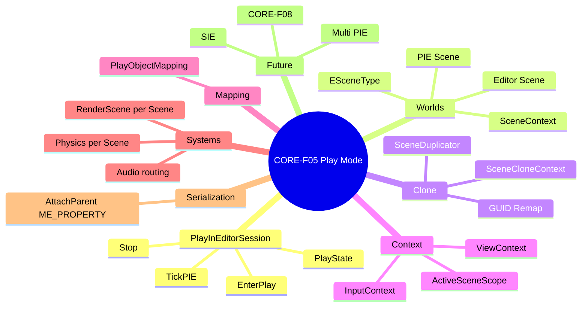
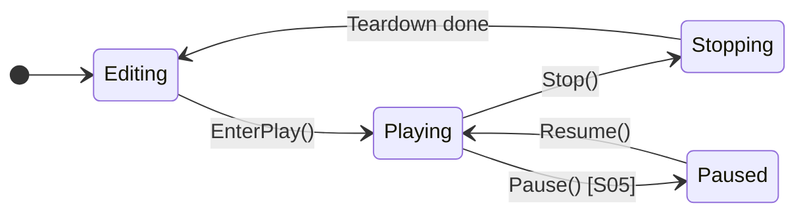

# CORE-F05 — Play Mode — Design Spec

## Meta
- **ID:** `CORE-F05`
- **Type:** Feature
- **Status:** **Done**（MVP；S05 Deferred；见 Impl）
- **Owner:** project maintainer
- **Last updated:** 2026-09-03（MVP 收口）
- **Branch:** `master`
- **Related:** [FEATURE_REGISTRY](../../FEATURE_REGISTRY.md) · [ACTIVE_WORK](../../ACTIVE_WORK.md) · [Implementation Plan](./CORE-F05_PLAY_MODE_IMPLEMENTATION.md) · [CORE-F06 Component Activate](./CORE-F06_COMPONENT_ENABLE_DESIGN.md) · [Play Mode Guideline](../../../external/minEngine%20Play%20Mode%20Development%20Guideline.md)（外部参考，Tier B）
- **Depends on:** ~~`CORE-F06`~~ **Done**
- **Precedes:** `ANIM-F01`（动画 Play 下验证）
- **Extends / 后续占位:** 见 §12；本文档 **不封闭**。

## TL;DR
对齐 **UE PIE**：双 Scene 共存；Play 仅跑 PIE；Stop 销毁 PIE。**MVP Done（2026-09-03）：** Clone、TickPolicy、Viewport/Input、Per-World Audio/Physics、Inspecting Context。Deferred：Pause/Step（S05）；EnterPlay rollback（TD-030）；Binary PIE（TD-028/029）。

## Scope
- **In（MVP）：**
  - `SceneDuplicator` + `SceneCloneContext`
  - 双 Scene 共存：`ESceneType::Editor` / `PIE`
  - `PlayInEditorSession`：`EnterPlay` / `Stop` / `TickPIE`
  - `SceneContext`、`PlayObjectMapping`、`ActiveSceneScope`
  - **`SceneComponent` Attach：`m_AttachParent` → `ME_PROPERTY` GUID**（Clone 自动 Remap）
  - Per-Scene Physics / Render / Audio；View / Input 分离；Toolbar
  - **Inspecting Context（S06）**
- **Out（MVP，§12）：** 多 PIE、SIE、Pause/Step（S05）、Hot Reload、子进程 Play、`CORE-F08+` 完整生命周期
  - EnterPlay 完整失败 rollback（**TD-030**）
  - PIE Binary clone（**TD-028/029**）

## Reader quick start
1. §2 架构 · §3 数据结构 · §7 Tick · **§9 Inspecting**
2. [Implementation Plan](./CORE-F05_PLAY_MODE_IMPLEMENTATION.md) · [S06](./CORE-F05_S06_INSPECTING_CONTEXT.md)

---

## 1) 目标与原则

### 1.1 目标
**Authoring Scene（Editor）** 与 **PIE Scene** 隔离共存；Play 时 Runtime 仅在 PIE 上跑；Stop 后 Editor 不变。

### 1.2 设计原则

| # | 原则 |
|---|------|
| P1 | Editor / PIE State 隔离 |
| P2 | `PlayInEditorSession` 是协调器 |
| P3 | World / View / Input 用 Context，不散落 `if (IsPlaying())` |
| P4 | Copy mutable, share immutable Assets |
| P5 | Stop 与 Enter 同等重要 |
| P6 | 对标 UE 双 World；MVP 单 PIE 实例 |
| P7 | **命名遵循 minEngine 习惯**（无 `F` 前缀） |
| P8 | **层级/Attach 走反射序列化**，不单独 Post-clone 复制 |

### 1.3 与 UE 对齐

| UE | minEngine |
|----|-----------|
| `EWorldType` | `ESceneType` |
| `FWorldContext` | `SceneContext` |
| `PlayInEditorSession` | `PlayInEditorSession` |
| `CreatePIEWorldByDuplication` | `SceneDuplicator::DuplicateForPIE` |
| `SetPlayInEditorWorld` | `ActiveSceneScope` |
| `GetEditorWorldCounterpartActor` | `PlayObjectMapping::FindEditorCounterpart` |

---

## 2) 架构总览

### 2.1 思维导图



### 2.2 运行时结构

```text
              ┌──────────────────────────────────┐
              │      PlayInEditorSession         │
              │  PlayState · PIEInstanceId       │
              └───────────────┬──────────────────┘
                              │
        ┌─────────────────────┼─────────────────────┐
        ▼                     ▼                     ▼
 ┌─────────────┐      ┌─────────────┐      ┌──────────────┐
 │ Editor Scene│      │  PIE Scene  │      │Shared Assets │
 │ Type=Editor │      │  Type=PIE   │      │ AssetManager │
 │ TickPolicy: │      │ TickPolicy: │      └──────────────┘
 │ None/Viewport│      │  Gameplay   │
 └──────┬──────┘      └──────┬──────┘
        │                    │
   RenderScene_E        RenderScene_PIE
   PhysicsWorld_E       PhysicsWorld_PIE
```

---

## 3) 核心数据结构

> **命名约定：** 不使用 UE 的 `F` 前缀；枚举 `E` 前缀与现有 `EBodyType` 等一致。

### 3.1 `ESceneType`（对标 `EWorldType`）

```cpp
enum class ESceneType : uint8_t
{
    None = 0,
    Editor,
    PIE,
    // 预留 §12：EditorPreview, Game, Inactive, Simulating
};
```

- 运行时元数据（`Transient`，**不**写入 PIE 磁盘资产）。
- PIE Scene **永不**写回 `.mescene`。

### 3.2 `ESceneTickPolicy`（Editor World 在 Playing 时如何 Tick）

```cpp
enum class ESceneTickPolicy : uint8_t
{
    None,           // 不 Tick GO / 不步进 Physics（MVP：Editor Scene @ Playing）
    ViewportOnly,   // 仅视口相关（粒子预览等 — 预留，对标 UE LEVELTICK_ViewportsOnly）
    Gameplay,       // 完整 Scene::Tick + Physics（PIE Scene）
};
```

由 `SceneContext` 持有；`PlayInEditorSession` 在 Enter/Stop 时设置。

### 3.3 `SceneContext`（对标 `FWorldContext`）

```cpp
struct SceneContext
{
    ESceneType Type = ESceneType::None;
    ESceneTickPolicy TickPolicy = ESceneTickPolicy::None;
    int32 PIEInstanceId = -1;              // MVP: 0
    std::shared_ptr<Scene> Scene;
    std::string ContextHandle;             // 稳定句柄，可选
    // 预留：AudioDeviceId, GameViewportClient*
};
```

`PlayInEditorSession` 持有：
- `SceneContext m_EditorContext`
- `std::vector<SceneContext> m_PIEContexts`（MVP：`size == 1`）

### 3.4 `PlayInEditorSession`

```cpp
class PlayInEditorSession
{
public:
    PlayState GetState() const;
    bool EnterPlay();
    void Stop();
    void TickPIE(float deltaTime);

    Scene* GetEditorScene() const;
    Scene* GetPIEScene(int32 instanceId = 0) const;

    const SceneContext* GetEditorContext() const;
    const SceneContext* GetPIEContext(int32 instanceId = 0) const;
    Scene* GetTickTargetScene() const;

private:
    PlayState m_State = PlayState::Editing;
    std::shared_ptr<Scene> m_EditorScene;
    std::shared_ptr<Scene> m_PIEScene;
    PlayObjectMapping m_ObjectMapping;
    int32 m_NextPIEInstanceId = 0;
};
```

**归属：** `Editor/PlayMode/`。

### 3.5 `PlayObjectMapping`

```cpp
class PlayObjectMapping
{
public:
    void Build(const Scene& editorScene, const Scene& pieScene);
    void Clear();

    GameObject* FindPIECounterpart(const GameObject& editorGO) const;
    GameObject* FindEditorCounterpart(const GameObject& pieGO) const;
    Component* FindPIECounterpart(const Component& editorComp) const;

private:
    std::unordered_map<GUID, GUID> m_EditorToPIE;
    std::unordered_map<GUID, GUID> m_PIEToEditor;
};
```

### 3.6 `SceneCloneContext`

```cpp
struct SceneCloneContext
{
    int32 PIEInstanceId = 0;
    ESceneType TargetType = ESceneType::PIE;

    std::unordered_map<GUID, GUID> SourceToClonedGuid;
    std::unordered_map<GUID, std::shared_ptr<MEObject>> ClonedBySourceGuid;

    MEObject* ResolveSceneRef(const GUID& sourceGuid) const;
};
```

### 3.7 `Scene` / `SceneManager` 扩展

**Scene：**

| API | 说明 |
|-----|------|
| `GetSceneType() / SetSceneType()` | `ESceneType` |
| `GetTickPolicy() / SetTickPolicy()` | `ESceneTickPolicy` |
| `GetPIEInstanceId()` | PIE ≥ 0 |
| `IsEditorScene() / IsPIEScene()` | 便捷判断 |

**SceneManager：**

```cpp
Scene* GetEditorScene() const;
Scene* GetPIEScene(int32 instanceId = 0) const;
Scene* GetTickTargetScene() const;   // Playing → PIE；Editing → Editor
std::span<const SceneContext> GetSceneContexts() const;

void RegisterPIEScene(std::shared_ptr<Scene> pieScene, int32 instanceId);
void UnregisterPIEScene(int32 instanceId);

void TickScenes(float deltaTime);    // 按各 Context.TickPolicy 分发
```

> **迁移：** `GetCurrentActiveScene()` 过渡期可别名 `GetTickTargetScene()`；Editor 视口渲染显式 `GetEditorScene()->GetRenderScene()`。

### 3.8 `ActiveSceneScope`（对标 `SetPlayInEditorWorld`）

```cpp
class ActiveSceneScope
{
public:
    explicit ActiveSceneScope(Scene* pieScene);
    ~ActiveSceneScope();
};
```

### 3.9 `PlayState`

```cpp
enum class PlayState : uint8_t
{
    Editing,
    Playing,
    Paused,     // S05
    Stopping,
};
```

---

## 4) 接口设计

### 4.1 `IPlayModeService`

```cpp
class IPlayModeService
{
public:
    virtual ~IPlayModeService() = default;
    virtual PlayState GetPlayState() const = 0;
    virtual bool IsPlaying() const = 0;
    virtual bool EnterPlay() = 0;
    virtual void Stop() = 0;
    virtual void TickPIE(float deltaTime) = 0;

    virtual Scene* GetEditorScene() const = 0;
    virtual Scene* GetPIEScene() const = 0;
    virtual PlayObjectMapping& GetObjectMapping() = 0;
};
```

### 4.2 `SceneDuplicator`

```cpp
class SceneDuplicator
{
public:
    static std::shared_ptr<Scene> DuplicateForPIE(
        const Scene& editorScene,
        SceneCloneContext& inOutContext);

    static void FinalizePIEScene(Scene& pieScene);
};
```

### 4.3 View / Input（占位）

`ViewContext`、`IViewContextProvider`、`EInputRoutingTarget` — 见上一版 §4.3，命名不变。

### 4.4 `ISceneContextListener`（预留）

```cpp
struct ISceneContextListener
{
    virtual void OnPIESceneCreated(Scene& pieScene) {}
    virtual void OnPIESceneDestroyed(Scene& pieScene) {}
    virtual void OnBeginPIE(Scene& pieScene) {}
    virtual void OnEndPIE(Scene& pieScene) {}
};
```

---

## 5) Scene Clone + Attach 序列化

### 5.1 Clone 流程

```text
DuplicateForPIE(EditorScene)
  ├── Serialize → in-memory JSON (JsonWriterArchive; **TD-029**)
  ├── Deserialize → new Scene (Type=PIE, new GUIDs, SceneCloneContext)
  ├── FinalizePIEScene
  ├── ObjectManager register PIE subgraph
  ├── PlayObjectMapping::Build
  └── SceneManager::RegisterPIEScene
```

**Wire format（2026-09-03）：** PIE clone 使用与 `.mescene` 相同的 **JSON + Serializer** 路径（`allowObjectPtrSerialization=true`），仅在内存 round-trip，**不写盘**。原计划 Binary in-memory buffer 因 **TD-028**（`EndObject` 与 10 字符字段名长度歧义）在多 physics-mesh GO 场景下失败；Binary 待协议修订后恢复（见 TD-029）。

### 5.2 `SceneComponent` Attach 升级（**CORE-F05 前置 / S00**）

**决策 D4（修订）：** 不再 Post-clone 手工复制 Attach 边。

将 `m_AttachParent` 改为 **`ME_PROPERTY` GUID 引用**（与 `GameObject::m_RootComponent` 同模式）：

```cpp
// SceneComponent.h — 目标形态
ME_PROPERTY()
SceneComponent* m_AttachParent{ nullptr };  // 序列化为 $guid；反序列化 + Clone Remap

// m_AttachChildren 保持运行时缓存，由 AttachToComponent / load 重建
std::vector<SceneComponent*> m_AttachChildren;
```

- **磁盘：** `.mescene` 存 parent GUID；load 后 `ResolvePendingObjectRefs` + 重建 children 列表。
- **Clone：** Serializer Remap 自动把 parent GUID 指向 PIE 内对应 `SceneComponent`。
- **实现切片：** `CORE-F05-S00`（Attach 序列化）→ 阻塞 S01 Clone 单测中含 Attach 的场景。

### 5.3 Post-clone fixup

| 项 | 动作 |
|----|------|
| `RebuildRuntimeGameObjectIndex` | ✓ |
| `ResolvePendingActivationsForScene` | ✓ |
| `m_PhysicsBodyId` 等 Transient | 重置 |
| 新 `RenderScene` | ✓ |
| Attach | **Serializer Remap**（非手工） |

### 5.4 不变量

```text
Invariant A: PIE 可序列化 MEObject 引用 ∈ PIEClone ∪ SharedAssets，∉ EditorScene
Invariant B: Per-Scene Physics/Render/Audio 独立
Invariant C: PIE 不写 Editor Dirty
Invariant D: Editor GUID 与 PIE GUID 不重叠；Mapping 可查
```

---

## 6) 状态机

（与上一版相同，名称替换为 `PlayInEditorSession`）



Enter/Stop 流程图见上一版 §6.2 / §6.3（`PlaySession` → `PlayInEditorSession`）。

---

## 7) Per-System 行为矩阵

| 系统 | Editor Scene @ Playing | PIE Scene @ Playing |
|------|------------------------|---------------------|
| **Scene::Tick** | **`TickPolicy=None`**（默认不 Tick GO） | **`TickPolicy=Gameplay`** |
| **Physics** | 不步进（world 可存在供 query） | 步进 |
| **Render** | Editor Viewport 用 Editor `RenderScene` | Game View 用 PIE `RenderScene` |
| **Audio** | 静音（对标 UE `bAllowAudioPlayback=false`） | Runtime voices |
| **Lua** | 不执行 gameplay | BeginPlay 绑定 |
| **ObjectManager** | Editor GUID 注册 | PIE 新 GUID 注册 |

---

## 8) Editor World 在 Playing 时是否 Tick？（业界 + minEngine 决策）

### 8.1 结论先说

**不是「全部停掉」。** 各引擎策略不同；对标 UE 时，**Editor World 在 PIE 期间通常仍可能被 Tick，但 Tick 类型与 PIE 不同，且默认不跑完整 Gameplay。**

**minEngine MVP 推荐：** Editor Scene **`ESceneTickPolicy::None`**（不 `Scene::Tick`、不步进 Physics）；仅 PIE Scene **`Gameplay`**。视口仍可用 Editor `RenderScene` **静态/交互绘制**（不驱动 GO gameplay Tick）。

### 8.2 Unreal Engine

源码 `EditorEngine.cpp`：

1. **默认** `bShouldTickEditorWorld = true`。
2. **PIE 时**若可见 Viewport 处于 **Immersive**，则 `bShouldTickEditorWorld = false`（除非另有可见 Editor World viewport）。
3. 若仍 Tick Editor World，使用 **`LEVELTICK_ViewportsOnly`** 或 **`LEVELTICK_TimeOnly`**（非 `LEVELTICK_All`），即 **非完整 Gameplay Tick**（粒子/视口相关、时间类等）。
4. **PIE World** 单独循环，`SetPlayInEditorWorld` 后 `World->Tick(LEVELTICK_All, …)` — **完整 Gameplay**。
5. **标注方式：**
   - `PlayWorld != nullptr` → 进入 PIE 分支
   - `bShouldTickEditorWorld` bool
   - `ELevelTick` 枚举区分 Tick 深度
   - `EditorWorld->bAllowAudioPlayback = false`
   - `SetViewportsRealtimeOverride(false)` 关闭 Editor viewport realtime

### 8.3 Godot

- **默认 Play：** **子进程**跑游戏；Editor 进程内 **edited scene 不跑 game loop**（无并行双 World Tick）。
- **Embedded Game View：** 子进程 + debugger；Editor 侧 Scene Tree 仍为编辑树。
- **标注：** 进程边界 + `EditorRun::STATUS_PLAY`；非同一 Scene Tree Tick。

### 8.4 Unity

- **非双 World：** Play 时 **同一 Scene Hierarchy** 进入 Play Mode（或快照恢复），**没有**并行的 Editor World gameplay Tick。
- **标注：** `EditorApplication.isPlaying`；整体切换而非 per-world policy。

### 8.5 minEngine 决策（D9）

| 项 | MVP | 预留 |
|----|-----|------|
| Editor Scene @ Playing | `ESceneTickPolicy::None` | `ViewportOnly`（对标 UE） |
| PIE Scene @ Playing | `ESceneTickPolicy::Gameplay` | — |
| 门控位置 | `SceneManager::TickScenes` 查 `SceneContext.TickPolicy` | |
| SIE（§12） | — | Editor Scene `Gameplay` 或专用 `Simulating` type |

```cpp
void SceneManager::TickScenes(float deltaTime)
{
    for (const SceneContext& ctx : m_SceneContexts)
    {
        if (!ctx.Scene) continue;
        switch (ctx.TickPolicy)
        {
        case ESceneTickPolicy::None:
            break;
        case ESceneTickPolicy::ViewportOnly:
            // 预留：仅 EOF / render dirty / 预览
            break;
        case ESceneTickPolicy::Gameplay:
            ctx.Scene->Tick(deltaTime);
            break;
        }
    }
    // PhysicsSystem::Tick 仅对 TickPolicy==Gameplay 的 Scene 步进
}
```

---

## 9) Editor 集成与 Inspecting Context（S06）

> 切片摘要：[CORE-F05_S06_INSPECTING_CONTEXT.md](./CORE-F05_S06_INSPECTING_CONTEXT.md)

### 9.1 三种 Scene 语义

| 语义 | API（目标） | Play 时指向 | 用途 |
|------|-------------|-------------|------|
| **Document** | `GetEditorScene()` / `SceneEditor::GetDocumentScene()` | **始终 Editor** | 保存、Dirty |
| **Runtime / Tick** | `GetTickTargetScene()` | **PIE** | GO Tick、Physics |
| **Inspecting** | `IEditorContext::GetInspectingScene()` | **默认 PIE** | Hierarchy、Selection、Inspector、Console |

**不切 Document Active。** 命名用 **Inspecting**（对齐 Inspector），不用 Observing。

### 9.2 决议

| ID | 决议 |
|----|------|
| **D11** | Editor 维护 Inspecting Context；模块读 Inspecting，不直读 Document Active |
| **D12** | Play → Inspecting=PIE；Stop → Editor |
| **D13** | Play 允许修改性指令改 PIE（`set` 等） |
| **D14** | mutate 目标必须是 Inspecting；禁止静默改 Editor |
| **D15** | Mapping 仅可选边界选中，非 inspect 主路径 |

**D5 修订：** 允许写 PIE；不 Dirty Editor。

### 9.3 Mutate 安全

- 单一路径：`set` / Inspector 写必须解析对象所属 Scene == Inspecting
- 失败显式提示，不回退 Editor
- PIE mutate 不 Dirty、默认不入 Editor Undo 栈
- UI：`Inspecting: PIE` / `Editor`

### 9.4 验收

- [ ] Play：Hierarchy/`get`/`set` 作用于 PIE
- [ ] Stop 后 Editor 文档未被 Play 中 `set` 污染
- [ ] Save 仍只写 Document

---

## 10) Decision log

| ID | 议题 | 决议 | 日期 |
|----|------|------|------|
| D1 | World 模型 | UE 双 World 共存 | 2026-09-02 |
| D2 | Stop | Editor 常驻；不 reload | 2026-09-02 |
| D3 | Clone | Serializer + `SceneCloneContext` | 2026-09-02 |
| D4 | Attach | **`ME_PROPERTY` GUID 序列化**；无 Post-clone 复制 | 2026-09-02 |
| D5 | Inspector @ Playing | **允许写 PIE**；不 Dirty Editor | 2026-09-03 |
| D6 | ObjectManager | 双注册 + Mapping | 2026-09-02 |
| D7 | Pause/Step | Defer S05 | 2026-09-02 |
| D8 | BeginPlay | S04 最小派发；完整 CORE-F08+ | 开放 |
| D9 | Editor Tick @ Playing | **`ESceneTickPolicy::None`**（MVP） | 2026-09-02 |
| D10 | 命名 | `ESceneType`、`SceneContext`、`PlayInEditorSession`；无 `F` 前缀 | 2026-09-02 |
| D11–D15 | Inspecting Context | 见 §9 | 2026-09-03 |

---

## 11) Feature 切片

| Slice | 标题 |
|-------|------|
| **S00** | `SceneComponent` Attach → `ME_PROPERTY` GUID |
| **S01** | `SceneDuplicator` + Clone 单测 |
| **S02b** | `SceneManager` / `SceneContext` / `ESceneTickPolicy` |
| **S02** | `PlayInEditorSession` Enter/Stop |
| **S03** | Toolbar + View/Input + `ActiveSceneScope` |
| **S04** | Per-World System lifecycle |
| **S05** | Pause/Step（Deferred） |
| **S06** | Inspecting Context（Hierarchy / Inspector / Command） |

---

## 12) 扩展占位

| ID | 主题 | 扩展点 |
|----|------|--------|
| PIE-EXT-01 | 多 PIE | `m_PIEContexts[]` |
| PIE-EXT-02 | SIE | `ESceneType::Simulating`；Editor `TickPolicy=Gameplay` |
| PIE-EXT-03 | 网络 PIE | `SceneContext` + NetMode |
| PIE-EXT-04 | Hot Reload | Play 中重载 Script |
| PIE-EXT-05 | 子进程 Play | Godot 式 |
| PIE-EXT-06 | Gameplay 生命周期 | **CORE-F08** |
| PIE-EXT-07 | Runtime Undo 栈 | Play 中 PIE mutate 可逆 |
| PIE-EXT-08 | SceneSubsystem | per `ESceneType` |
| PIE-EXT-09 | Editor `ViewportOnly` Tick | 对标 UE `LEVELTICK_ViewportsOnly` |
| PIE-EXT-10 | 手动切换 Inspecting（Play 中看 Editor 树） | 调试用 |

---

## 13) 风险

| 风险 | 缓解 |
|------|------|
| Attach 序列化改动影响现有 `.mescene` | S00 迁移 + 加载后重建 children |
| `GetCurrentActiveScene` 语义 | 拆分 Document / Tick / Inspecting（§9） |
| Editor 误 Tick | `ESceneTickPolicy` 集中门控 |
| Play `set` 误改 Editor | D14 + Inspecting 门面 |
| Save 写到 PIE | Document 永不切 PIE |

---

## 14) 变更记录

| 日期 | 说明 |
|------|------|
| 2026-09-01 | Registry 占位 |
| 2026-09-02 | 双 World 共存初稿 |
| 2026-09-02 | 命名修订；Attach ME_PROPERTY；§8 Editor Tick 业界对齐 |
| 2026-09-03 | S03 Done；登记 S06 |
| 2026-09-03 | **§9 Inspecting Context**（命名由 Observing 调整）；D11–D15 |
| 2026-09-03 | **MVP Done**；S05 Deferred；TD-030 EnterPlay rollback |
