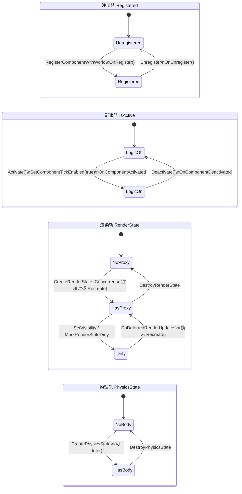
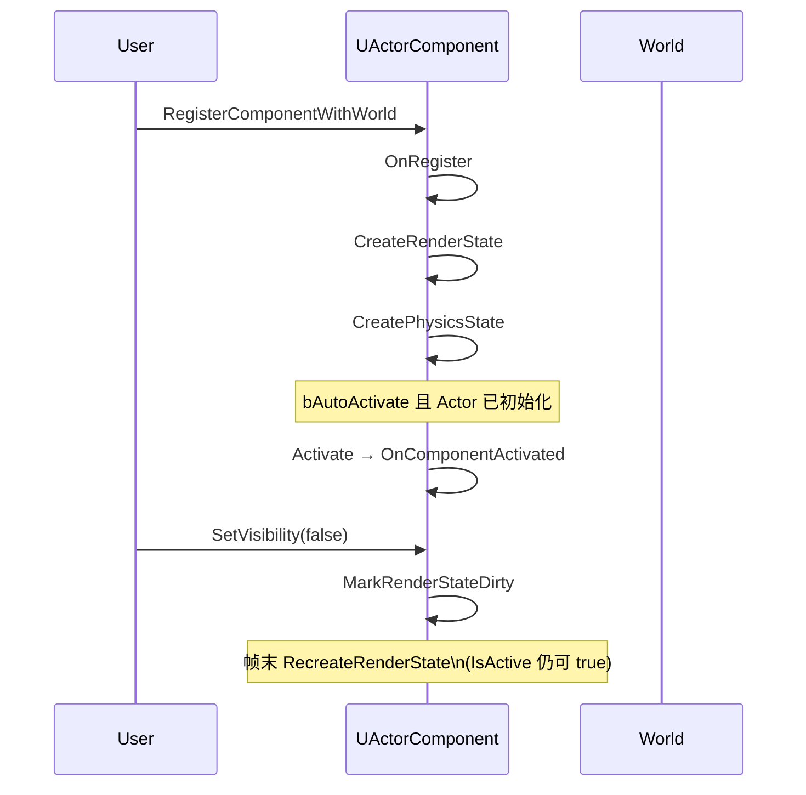
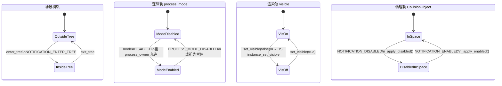

# CORE-F06 — Component Activate — Design Spec

## Meta
- **ID:** `CORE-F06`
- **Type:** Feature
- **Status:** Done
- **Owner:** project maintainer
- **Last updated:** 2026-09-02
- **Branch:** `master`
- **Related:** [FEATURE_REGISTRY](../../FEATURE_REGISTRY.md) · [ACTIVE_WORK](../../ACTIVE_WORK.md) · [CORE-F05 Play Mode](./CORE-F05_PLAY_MODE_DESIGN.md) · [Implementation Plan](./CORE-F06_COMPONENT_ENABLE_IMPLEMENTATION.md)
- **Precedes:** `CORE-F05`（Play Mode 依赖本 Feature 的 activate 语义）

## TL;DR
在 **`Component` 基类**引入序列化 **`m_bActive`**（默认 `true`）与对外 **`SetActive` / `IsActive`**、回调 **`OnActivate` / `OnDeactivate`**，用 **Activate 语义**表达「组件是否参与运行时」（**不再使用 Enable/Disable 作 API 名**）。引擎内部用 **`ApplyActivation` / `RemoveActivation`** 挂接/拆除各 System；运行时 **`m_bPendingActivation`** 表示「已 `Active` 但尚未 `ApplyActivation`」（例如无 Owner、不在 Scene、或 defer 队列中）。disable 时渲染 **立即 Remove** proxy；activate 后 **EOF 重建**。本 Feature 不做 GameObject 级 active、不做 Play Mode gate。

## Scope
- **In:**
  - `m_bActive` 序列化 + **`SetActive` / `IsActive`**（唯一对外开关）
  - 回调 **`OnActivate` / `OnDeactivate`**
  - 内部：`CanApplyActivation`、`TryActivate`、`Deactivate`、`ApplyActivation`、`RemoveActivation`、`m_bPendingActivation`
  - System 审计：Tick、Physics、Audio、Render、Lua
  - 合并 `SkyBoxComponent::m_Enabled` → 基类 `m_bActive`；厘清 `LuaComponent::m_ScriptEnabled`
  - Inspector：Component header **Active** checkbox
  - Scene Load 后 `FulfillPendingActivations`
- **Out:**
  - API 名 `Enable`/`Disable`/`SetEnabled`/`OnEnable`（文档与代码均避免，除与 UE 对照表）
  - GameObject 级 `bActive`（Hierarchy 整棵禁用）
  - Play Mode gate（`CORE-F05`）
  - `Awake`/`Start`/`OnDestroy` 全套
  - 对外暴露 `ApplyActivation`/`RemoveActivation`

## Reader quick start
1. 本文件：§2 业界对齐与状态图；§4 API 与状态机
2. [Implementation Plan](./CORE-F06_COMPONENT_ENABLE_IMPLEMENTATION.md)
3. 代码：`Component.h/.cpp`、`GameObject.cpp`、各 System 组件

---

## 1) API 分层（命名约定）

| 层级 | 符号 | 可见性 | 含义 |
|------|------|--------|------|
| **用户 / 序列化** | `m_bActive`、`SetActive`、`IsActive` | **public** | 设计意图，写入 `.mescene` |
| **生命周期回调** | `OnActivate`、`OnDeactivate` | **protected virtual** | 瞬态钩子 |
| **内部调度** | `TryActivate`、`Deactivate` | **private** | `SetActive` 与生命周期事件驱动 |
| **System 挂接** | `ApplyActivation`、`RemoveActivation` | **private** | Physics / Audio / Render 注册与拆除 |
| **运行时状态** | `m_bPendingActivation` | **private** | 见 §4.2、§2.2 |
| **运行时状态** | `m_bActivationApplied` | **private** | `ApplyActivation` 已执行 |

> **与 UE 对照：** UE 的 `UActorComponent::Activate` 是运行时 API；本 Feature 的 **`SetActive`≈用户开关 + 内部 `TryActivate`**，**`ApplyActivation`≈挂 System**，避免与 UE 公有 `Activate(bool)` 混用时再读 §2.4。

### 1.1 为何不用 Enable

- 用户语义统一为 **Active / Inactive**（与 Inspector「组件是否激活」一致）。
- 内部用 **ApplyActivation / RemoveActivation** 表达「把激活状态落实到各 System」，与 **PendingActivation**（意图已到、落实未至）形成清晰三角关系。

---

## 2) 业界对齐 (Industry alignment)

> **结论：** F06 不是新发明的行为模型，而是 Unity / UE / Godot 共有的「**意图 → 进 World → 挂 System → 回调**」模式在 minEngine 上的**显式命名与收口**。差异主要在**轴的数量**（大厂常把逻辑 / 渲染 / 物理拆成多条），而非哲学不同。  
> 对照源码：`d:\Dev\GitRepo\UnrealEngine`、`d:\Dev\GitRepo\godot`（本仓库同级目录）。

### 2.1 分层对照表

| 层 | minEngine F06 | Unity | Unreal Engine | Godot |
|----|---------------|-------|---------------|-------|
| **用户意图（序列化）** | `m_bActive` | `Behaviour.enabled` | `bAutoActivate`；用户/蓝图调 `SetActive` | `process_mode`（含 `DISABLED`） |
| **等待进 World** | `m_bPendingActivation` | `enabled` 但非 `activeInHierarchy` | 已 `Register` 但 `Activate` 等 Actor 初始化 | `process_mode` 已改但 `!is_inside_tree()` |
| **挂到 System** | `ApplyActivation` | 引擎内部在 `OnEnable` 前后 | `ExecuteRegisterEvents` → `CreateRenderState` / `CreatePhysicsState` | `NOTIFICATION_ENTER_WORLD`；`_apply_enabled` |
| **从 System 拆除** | `RemoveActivation` | `OnDisable` 前后内部拆除 | `ExecuteUnregisterEvents` | `NOTIFICATION_EXIT_WORLD`；`_apply_disabled` |
| **生命周期回调** | `OnActivate` / `OnDeactivate` | `OnEnable` / `OnDisable` | `OnComponentActivated` / `OnComponentDeactivated` | `NOTIFICATION_ENABLED` / `NOTIFICATION_DISABLED` |
| **渲染轴（独立？）** | **合并进 `m_bActive`**（MVP） | 常合并；还有 `Renderer.enabled` | **分离**：`bVisible` / `SetVisibility` | **分离**：`visible` / `set_visible` |
| **物理轴（独立？）** | **合并进 `m_bActive`** | 常合并 | **部分分离**：`SetActorEnableCollision` | **分离**：`disable_mode` on `CollisionObject3D` |

### 2.2 minEngine F06 — 组件激活（单轴，本 Feature）

```mermaid
stateDiagram-v2
    direction TB

    [*] --> Inactive: 默认 / SetActive(false)

    Inactive --> CheckApply: SetActive(true)
    CheckApply --> Applied: CanApplyActivation
    CheckApply --> Pending: !CanApplyActivation

    Pending --> Applied: FulfillPendingActivation()\n(AddComponent / LoadScene / defer drain)

    Applied --> Inactive: SetActive(false)\nOnDeactivate → RemoveActivation

    state Inactive {
        [*]: m_bActive=false
        note right: Pending=false\nApplied=false
    }

    state Pending {
        [*]: m_bActive=true
        note right: Pending=true\nApplied=false\n无 OnActivate
    }

    state Applied {
        [*]: m_bActive=true
        note right: Pending=false\nApplied=true\nApplyActivation 已执行\nOnActivate 已调
    }

    state CheckApply <<choice>>
```

**Apply 路径（进入 Applied）：** `ApplyActivation` → `OnActivate`  
**Remove 路径（离开 Applied）：** `OnDeactivate` → `RemoveActivation`

### 2.3 Unity — `Behaviour.enabled` × `activeInHierarchy`

Unity **不**把「挂 System」暴露给用户，但逻辑上等价于两轴相与后才 `OnEnable`：

```mermaid
stateDiagram-v2
    direction TB

    [*] --> Off: enabled=false

    Off --> WaitingHierarchy: enabled=true\n(activeInHierarchy=false)
    WaitingHierarchy --> Running: activeInHierarchy=true\n→ OnEnable()
    Running --> WaitingHierarchy: 父节点 inactive\n→ OnDisable()
    Running --> Off: enabled=false\n→ OnDisable()
    WaitingHierarchy --> Off: enabled=false

    state Off {
        note right: 不 Tick\n不 OnEnable
    }

    state WaitingHierarchy {
        note right: 类似 PendingActivation\n意图 on，未进有效 hierarchy
    }

    state Running {
        note right: 等价 Applied\nTick + OnEnable 语义
    }
```

| minEngine | Unity |
|-----------|-------|
| `m_bActive` | `enabled` |
| `CanApplyActivation()`（在 Scene） | `activeInHierarchy` |
| `OnActivate` | `OnEnable` |
| `ApplyActivation`（内部） | 引擎在 OnEnable 路径内注册物理/渲染等（不公开） |

### 2.4 Unreal Engine — 多轨并行（逻辑 Active ≠ 渲染 ≠ 物理）

UE **刻意拆分**；下图是 **同一 `UActorComponent` 上并行存在的几条轨**（非互斥状态机，而是多个 bool / 阶段）：



**典型时序（简化）：**



| minEngine F06 | UE |
|---------------|-----|
| `SetActive` + `ApplyActivation` | `Activate` + `Register`/`Create*State`（**拆开的多步**） |
| `m_bActive` 管 Tick+渲染+物理 | `IsActive` **只管** Tick/委托；`bVisible`、Collision 另管 |
| `m_bPendingActivation` | `bAutoActivate` 等 Actor `IsActorInitialized()` |
| `OnActivate` | `OnComponentActivated` |

### 2.5 Godot — 多轴：`tree` × `process_mode` × `visible` × 物理 `disable_mode`



**`set_process_mode` 与 minEngine `SetActive` 最接近**（改 mode 时若已在 tree 则**同步**发 `NOTIFICATION_ENABLED/DISABLED`）：

```mermaid
stateDiagram-v2
    direction TB

    [*] --> StoredOnly: !is_inside_tree()\n只存 process_mode

    StoredOnly --> Evaluating: enter_tree /\nset_process_mode while in tree
    Evaluating --> LogicOff: process_mode==DISABLED\n或 can_process==false
    Evaluating --> LogicOn: enabled process\nNOTIFICATION_ENABLED

    LogicOff --> LogicOn: 改为可 process
    LogicOn --> LogicOff: DISABLED / PAUSED\nNOTIFICATION_DISABLED

    state StoredOnly {
        note right: 类似 PendingActivation\n不发 ENABLED 通知
    }
```

| minEngine F06 | Godot |
|---------------|-------|
| `m_bActive` | `process_mode != DISABLED`（逻辑轴） |
| `m_bPendingActivation` | `!is_inside_tree()` 时只存 mode |
| `ApplyActivation` | `_apply_enabled` / `ENTER_WORLD` 挂 physics space |
| `RemoveActivation` | `_apply_disabled` / `body_set_space(RID())` |
| `OnActivate` | `NOTIFICATION_ENABLED` |
| **合并渲染** | Godot 另用 `visible`（**分离轴**） |

### 2.6 本质共同点 vs minEngine 有意简化

**共同点（行业惯例，非自造）：**

1. **用户开关 ≠ 立刻跑逻辑** — 总要等「在场景/World/Tree 里」或等价条件。  
2. **挂 System 与回调成对** — 启用时注册物理/渲染/音频，停用时对称拆除（或 mark dirty）。  
3. **Pending / 等待** — 意图先到、落实后到（Unity hierarchy、UE Actor 初始化、Godot enter_tree、minEngine `PendingActivation`）。  
4. **危险上下文 defer** — Godot physics callback 内要求 `call_deferred`；F06 的 `DeferredActivationRequest` 同类。

**minEngine MVP 的刻意简化：**

| 简化 | 说明 | 将来若需要 |
|------|------|------------|
| **单轴 `m_bActive`** | 逻辑+渲染+物理一次开关 | 拆 `bVisible`、`bSimulatePhysics`（学 UE/Godot） |
| **显式 `ApplyActivation`** | UE/Godot 藏在引擎内部 | 保持 private 即可 |
| **Render disable 同步 Remove** | UE 偏帧末 Recreate | 产品选择，非模型错误 |

---

## 3) 背景与目标

- `Component` 无统一 active 开关；`SkyBoxComponent::m_Enabled`、`LuaComponent::m_ScriptEnabled` 分散。
- `GameObject::Tick` / `Engine::LogicalTick` 不区分 inactive 组件；Editor 下 Physics/Audio 持续运行。
- 各 System 注册路径不一致，缺少统一的 `ApplyActivation` / `RemoveActivation` 收口。
- 为 **`CORE-F05` Play Mode** 与 **`ANIM-F01`** 提供稳定前置。

---

## 4) 方案

### 4.1 数据模型

```cpp
class Component : public MEObject
{
public:
    void SetActive(bool active);
    bool IsActive() const { return m_bActive; }

protected:
    virtual void OnActivate();
    virtual void OnDeactivate();

private:
    bool CanApplyActivation() const;
    void TryActivate();
    void Deactivate();
    void ApplyActivation();
    void RemoveActivation();
    void FulfillPendingActivation();  // CanApply 且 Pending 时 Apply

    ME_PROPERTY(EditAnywhere, meta: HideInInspector)
    bool m_bActive = true;

    bool m_bPendingActivation = false;   // 不序列化
    bool m_bActivationApplied = false;     // 不序列化；ApplyActivation 后为 true
};
```

| 字段 | 序列化 | 含义 |
|------|--------|------|
| `m_bActive` | 是 | 用户希望组件处于 **Active** |
| `m_bPendingActivation` | 否 | `m_bActive==true` 但尚不能或尚未 `ApplyActivation` |
| `m_bActivationApplied` | 否 | `ApplyActivation` 已执行且未 `RemoveActivation` |

**推荐不变量：**
- `m_bActive == false` ⇒ `m_bPendingActivation == false` 且 `m_bActivationApplied == false`
- `m_bActivationApplied == true` ⇒ `m_bActive == true` 且 `CanApplyActivation() == true`
- `m_bPendingActivation == true` ⇒ `m_bActive == true` 且 `m_bActivationApplied == false`
- `CanApplyActivation()`：`m_Owner != nullptr` 且 Owner 在有效 `Scene` 内

**旧场景迁移：** 原无字段 → `m_bActive = true`；曾用 `SkyBoxComponent::m_Enabled` → 读档映射到 `m_bActive`（或删子类字段后默认 true）。

### 4.2 状态机（Active / Pending / Applied）

三种运行时相关状态（用户只改 `m_bActive`）：

```
                    ┌─────────────────────────────────────┐
                    │  Inactive (m_bActive == false)      │
                    │  Pending=false, Applied=false       │
                    └─────────────────────────────────────┘
                           │ SetActive(true)
                           ▼
              ┌────────────────────────┐
              │  CanApplyActivation()? │
              └────────────────────────┘
                    │              │
                   yes            no
                    │              │
                    ▼              ▼
    ┌───────────────────────┐   ┌────────────────────────┐
    │  Applied              │   │  PendingActivation       │
    │  Active=true          │   │  Active=true             │
    │  Pending=false        │   │  Pending=true            │
    │  Applied=true         │   │  Applied=false           │
    └───────────────────────┘   └────────────────────────┘
                    │              │ FulfillPendingActivation()
                    │              │ (AddComponent / LoadScene / defer drain)
                    │              └──────────┐
                    │                         ▼
                    │              ┌───────────────────────┐
                    └──────────────│  Applied (同上)       │
           SetActive(false)       └───────────────────────┘
           or Deactivate()
                    │
                    ▼
              Inactive
```

**`SetActive(bool active)`**（**唯一 public 开关**）：
1. 若 `active == m_bActive` → return
2. `m_bActive = active`
3. `active ? TryActivate() : Deactivate()`

**`TryActivate()`**（`private`）：
- 若 `!m_bActive` → return
- 若 `!CanApplyActivation()` → `m_bPendingActivation = true`；return（**不调 OnActivate**）
- 若 `m_bActivationApplied` → return（已 Applied）
- `ApplyActivation()`
- `OnActivate()`
- `m_bActivationApplied = true`；`m_bPendingActivation = false`

**`Deactivate()`**（`private`；`SetActive(false)` 或销毁前）：
- 若 `m_bActivationApplied`：`OnDeactivate()` → `RemoveActivation()`；`m_bActivationApplied = false`
- `m_bPendingActivation = false`（清除等待）
- （`m_bActive` 已由 `SetActive(false)` 置 false）

**`FulfillPendingActivation()`**（`private`；Scene Load / `AddComponent` / `SetOwner` 后调用）：
- 若 `m_bPendingActivation && m_bActive && CanApplyActivation()` → 走 `TryActivate()` 的 Apply 分支

**顺序（已定）：**
- **Apply 路径：** `ApplyActivation` → `OnActivate`
- **Remove 路径：** `OnDeactivate` → `RemoveActivation`

### 4.3 生命周期挂接

| 事件 | 行为 |
|------|------|
| `AddComponent`，`m_bActive==true` | `TryActivate()` 或置 `Pending` |
| `AddComponent`，`m_bActive==false` | 仅挂接 |
| `SetOwner` 变更 | `Deactivate()`（仅 Remove 已 Applied 部分）→ 改 owner → `TryActivate()` / `FulfillPendingActivation` |
| `RemoveComponent` / GO 销毁 | `Deactivate()`；`m_bActive` 随销毁无关 |
| Scene Load 完成 | 遍历组件 `FulfillPendingActivation()` |

**禁止：** 在 `OnDeactivate` 内 `SetActive`、Add/Remove Component、Load Scene。

### 4.4 `OnActivate` / `OnDeactivate`

- 仅在 **Applied** 路径进入/离开时被调用（**Pending 阶段不调用 OnActivate**）
- 同步、主线程；Physics 回调内 `SetActive` → defer 队列，drain 时再 `TryActivate`/`Deactivate`

**`LuaComponent::m_ScriptEnabled`：** 运行时熔断；`Tick` 需 `IsActive() && m_ScriptEnabled`。

### 4.5 各 System 契约（`ApplyActivation` / `RemoveActivation`）

| 组件 | `ApplyActivation` | `RemoveActivation` | 遍历 gate |
|------|-------------------|--------------------|-----------|
| **Tick** | — | — | `!IsActive()` skip |
| **RigidBody** | `RefreshPhysicsBody` | `DestroyPhysicsBody` | `RebuildWorldBodies` |
| **Audio** | `RegisterEmitter` | `Unregister` + `Stop` | emitter 列表 |
| **AudioListener** | `RegisterListener` | `UnregisterListener` | 同上 |
| **Primitive / Light** | `MarkRenderStateDirty` | **Remove proxy 立即** | `IsActive()` |
| **SkyBox** | 基类 `m_bActive` | Remove proxy | Pass |
| **Lua** | 无 | 不 `UnloadScript` | Tick gate |

### 4.6 Defer（窄场景）

Physics 步进/回调内 `SetActive`：
- 入 **`DeferredActivationRequest`** 队列
- 下一 `LogicalTick` 开始前 drain → `SetActive`

### 4.7 Inspector

- Header checkbox → `SetActive`；标签 **Active**（非 Enabled）
- `m_bActive` 隐藏于属性表；inactive 时 header 灰显，属性仍可编辑

### 4.8 与 `CORE-F05`

- F06：`m_bActive==false` → Edit/Play 均不模拟、不渲染贡献
- F05：Play Mode 模式 gate，叠在 F06 之上

---

## 5) 备选方案

| 选项 | 结论 |
|------|------|
| Enable/Disable 命名 | 拒绝（本 Feature 统一 Active） |
| 仅 Pending 一位、不存 Applied | 拒绝（无法区分 Pending vs Inactive） |
| 本方案：Active + PendingActivation + ApplyActivation | **选用** |

---

## 6) 风险与缓解

- **反序列化 `m_Owner` 不经 `SetOwner`：** 场景加载后 proxy/body 可由 EOF/`RebuildWorldBodies` 建立，但 `m_bActivationApplied` 仍为 false → 首 Deactivate 无效。**缓解：** `LoadSceneByPath` 后 `ResolvePendingActivationsForScene` 对每个组件 `SyncActivationWithActiveFlag`。**根治（TD-026）：** Serializer pending ref resolve 对 `Component::m_Owner` 走反射 Setter / `SetOwner`。
- 其余：`SetOwner` 统一走 `TryActivate`；Render Remove/EOF 竞态；SkyBox 迁移；OnDeactivate 重入。

---

## 7) 验收标准

- [x] 对外 **`SetActive`/`IsActive`/`OnActivate`/`OnDeactivate`**；无 public `SetEnabled`
- [x] `m_bPendingActivation` 在「Active 但未进 Scene」为 true；`ResolvePendingActivation` 后为 Applied
- [ ] inactive mesh/light/skybox 不可见；RigidBody/Audio/Lua 行为符合 §3.5（**Editor 目视待确认**）
- [x] `physics-*`、`audio-smoke` 通过（`verify.ps1` 全量 smoke 中 `material-ir` 既有失败，与 F06 无关）

---

## 8) 实现切片

见 [Implementation Plan](./CORE-F06_COMPONENT_ENABLE_IMPLEMENTATION.md)。

---

## 9) Status note

| 字段 | 内容 |
|------|------|
| **Status** | Done — S01–S07 落地；DeferredActivation 队列 Defer；已知 BUG-PHYS-004（collider 形体注销） |
| **Naming** | Active（用户）+ ApplyActivation/RemoveActivation（内部）+ PendingActivation（内部状态） |

---

## 变更记录

| 日期 | 说明 |
|------|------|
| 2026-09-01 | Registry 占位 |
| 2026-09-01 | Design 草稿 |
| 2026-09-01 | §2 业界对齐：分层对照表 + minEngine/Unity/UE/Godot 状态图（Mermaid） |
| 2026-09-01 | Status → In Progress；S01–S07 落地（DeferredActivation 队列 Defer） |
| 2026-09-02 | Status → Done；BUG-PHYS-004 登记 |
