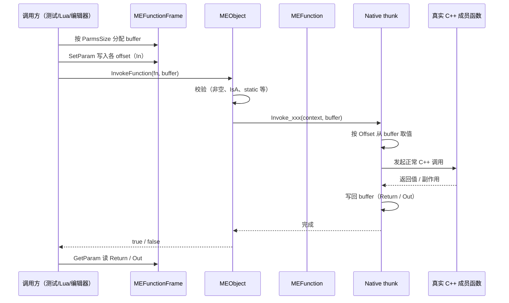

# 函数反射 — 设计稿（P4）

Last updated: 2026-05-28  
Status: **设计中（可按阶段实现）**  
父文档：[Platform 路线图](../PLATFORM_ROADMAP.md) §2 P4、§11  
前置阅读：[函数反射现状](./REFLECTION_FUNCTIONS_CURRENT_STATE.md)、[UE 方法反射学习笔记](./UE_FUNCTION_REFLECTION_NOTES.md)

---

## 0) 目标与边界

### 0.1 最终目标（你定义的终态）

在 `MEClass` 可反射体系内，方法反射最终支持：

- 有返回值 / 无返回值
- 参数与返回值类型覆盖所有可反射字段类型
- 支持：`primitive`、`string`、`Vector2/3/4`、`array`、对象指针（及可支持的智能指针）
- 参数修饰：值传递 / `const` 值参数 / 引用参数（含 `const&` / `&`）
- 支持成员函数与静态函数
- 统一供 C++ 调用与脚本调用（后续 Lua）复用

### 0.2 本设计目标

把上述终态拆成 **可逐步落地且不返工** 的切片，避免先做“临时接口”导致后续重构成本过高。

### 0.3 非目标（P4 之外）

- 不在本阶段实现委托完整系统（独立到 P5）
- 不在本阶段实现 Lua 绑定细节（独立到 P6）
- 不引入 Blueprint/字节码 VM 级执行模型

---

## 1) UE 对齐原则（用于约束切片）

参考 UE 的 `UFunction + FProperty + ProcessEvent` 思路，本设计遵循：

1. **函数元数据是反射对象**：`MEFunction` 与 `MEProperty` 同级，不做“仅字符串注册”。
2. **参数类型系统复用 `MEProperty`**：不单独再造 `ParamType` 枚举；**参数角色（In/Return/Out）仅存 `MEParamDescriptor`**，不写入 `MEProperty`。
3. **统一调用入口**：`MEObject::InvokeFunction(MEFunction*, void*)`（见 §1.1；UE 对应 `ProcessEvent`，命名刻意区分）。
4. **脚本调用复用同一调用管线**：脚本层只负责封送，不绕过 `InvokeFunction`。
5. **先打通稳定主干，再逐步扩展类型语义**（ref/const/static/out 等）。

### 1.1 为何不用 `ProcessEvent`（命名说明）

UE 的 `ProcessEvent` 历史语义偏「事件/脚本调度」，且与 Blueprint Event、Delegate 广播等概念绑在一起。  
在 minEngine 中，该 API 的本意是：

> **在已有 `MEFunction` 元数据与参数缓冲的前提下，对目标对象（或静态上下文）执行一次反射式函数调用。**

因此采用 **`InvokeFunction`**：

- 表达「按反射描述调用函数」，不暗示一定是 Gameplay Event；
- 与直接 C++ 成员调用（`obj->Foo()`）在命名上可区分；
- 学习笔记中仍可写「UE: ProcessEvent ↔ minEngine: InvokeFunction」便于对照。

---

## 2) 数据结构设计与增补

## 2.1 新增枚举与结构

```cpp
enum class MEFunctionFlags : uint32_t
{
    None         = 0u,
    Native       = 1u << 0,
    Static       = 1u << 1,
    ConstMethod  = 1u << 2, // 成员函数自身 const（类似 void Foo() const）
    HasReturn    = 1u << 3,
    HasOutParams = 1u << 4, // 预留：阶段后续开启
    Callable     = 1u << 5, // 可被外部/脚本调用
};
```

```cpp
enum class MEParamPassKind : uint8_t
{
    Value,       // T
    ConstValue,  // const T
    Ref,         // T&
    ConstRef,    // const T&
};

enum class MEParamRole : uint8_t
{
    In     = 0,
    Return = 1,
    Out    = 2, // 阶段 C 起用
};
```

```cpp
struct MEParamDescriptor
{
    MEProperty* Property = nullptr; // 类型与读写：仅描述「是什么类型」
    MEParamPassKind PassKind = MEParamPassKind::Value;
    MEParamRole Role = MEParamRole::In; // 在本次调用中的角色（不进 MEProperty）
    uint32 Offset = 0;                  // 在 ParmsBuffer 中的偏移

    bool IsReturn() const { return Role == MEParamRole::Return; }
    bool IsOut() const { return Role == MEParamRole::Out; }
};
```

> **拍板（D1/D2）：** 不在 `MEProperty` 上增加 `bParm` / `bReturnParm` / `bOutParm`；`PassKind` 与 `Role` 用 `uint8_t` 枚举紧凑存储，避免 Desc 内多个 `bool` 造成对齐浪费。

## 2.2 新增 `MEFunction`

```cpp
class MEFunction
{
public:
    using NativeMemberInvoker = void(*)(MEObject* context, void* parmsBuffer);
    using NativeStaticInvoker = void(*)(void* parmsBuffer);

    const std::string& GetName() const;
    const MEClass* GetOwnerClass() const;
    MEFunctionFlags GetFlags() const;

    uint16 GetParmsSize() const;
    uint8 GetNumParms() const;
    int32 GetReturnValueOffset() const; // -1 表示无返回值

    const std::vector<MEParamDescriptor>& GetParams() const;
    const MEParamDescriptor* GetReturnParam() const;

    bool IsStatic() const;
    bool IsConstMethod() const;
    bool HasReturn() const;
};
```

> 说明：第一版不引入脚本专用 invoker，脚本通过 `InvokeFunction` 复用 native 调用链。

## 2.3 `MEClass` 增补

- 新增：
  - `std::vector<MEFunction*> m_Functions;`
  - `std::unordered_map<std::string, MEFunction*> m_FunctionsByName;`
- 新接口：
  - `void AddFunction(MEFunction* fn);`
  - `MEFunction* FindFunction(const std::string& name) const;`
  - `const std::vector<MEFunction*>& GetFunctions() const;`

## 2.4 `ReflectionSystem` 增补

- 内存所有权：`m_OwnedFunctions`
- 创建与注册：
  - `CreateFunction(...)`
  - `RegisterFunction(OwnerClass, Function)`
- Finalize 增加校验：
  - 同类重名函数策略（阶段内先不支持重载，直接禁止同名多签名）
  - 参数 offset 连续性与 `ParmsSize` 合法性
  - 返回值定义唯一性

## 2.5 `MEProperty` 与函数参数的分工（拍板）

| 职责 | 归属 |
|------|------|
| 类型类别（Primitive/Object/Array…）、读写 accessor | `MEProperty` |
| In/Return/Out、Value/Ref/ConstRef、ParmsBuffer 内 Offset | **`MEParamDescriptor` only** |

`MEProperty` **不** 为函数参数增加额外 flag，避免 Inspector/序列化与「仅存在于函数签名」的 property 混淆。  
若某参数需要独立 `MEProperty` 实例（无对应类字段），由注册阶段为 `MEFunction` 专门创建，仍只通过 Desc 表达调用角色。

---

## 3) 接口设计（调用链）

## 3.1 `MEObject` 入口

```cpp
class MEObject
{
public:
    bool InvokeFunction(MEFunction* function, void* parmsBuffer);
    bool InvokeFunctionByName(const std::string& functionName, void* parmsBuffer);
};
```

可选：静态函数也可提供自由函数入口，避免伪造 `MEObject` 实例：

```cpp
bool InvokeStaticFunction(MEFunction* function, void* parmsBuffer);
```

行为约束：

- 非 static 函数：`context` 必须非空且 `IsA(function->OwnerClass)`。
- static 函数：允许 `context == nullptr` 或忽略对象实例。
- 失败返回 `false` 并写日志（与当前反射错误体系一致）。

## 3.2 参数缓冲（`MEFunctionFrame`）

```cpp
class MEFunctionFrame
{
public:
    explicit MEFunctionFrame(const MEFunction& function);
    ~MEFunctionFrame();

    void* GetBuffer();
    const void* GetBuffer() const;

    template<typename T> bool SetParam(const std::string& name, const T& value);
    template<typename T> bool GetParam(const std::string& name, T& outValue) const;
};
```

职责：

- 按 `ParmsSize` 分配连续内存
- 按参数 `MEProperty` 初始化/销毁（字符串、数组等非 POD 类型）
- 提供 name-based 填参便于脚本/测试

## 3.3 Native thunk 与 UE 对照

### 3.3.1 UE（观察结论，便于对照）

| 层 | UE |
|----|-----|
| 元数据 | `UFunction`（`UStruct`），参数为带 `CPF_Parm` 等的 `FProperty` 链表；`ParmsSize` / `ReturnValueOffset` / `NumParms` |
| 原生入口 | `FNativeFuncPtr Func` 或 UHT 生成的 `execFoo(FFrame&, RESULT_DECL)` |
| 统一调度 | `UObject::ProcessEvent(UFunction*, void* Parms)` → 构造 `FFrame`、拷贝 Parms、最终 `UFunction::Invoke` |
| Thunk 职责 | 从 `FFrame` / Parms 按 `FProperty` 取参，调用真实 C++，写回 Return/Out |

UE 的 `ProcessEvent` 还承担脚本/网络/蓝图等分流；**native thunk 只是其中一条路径**。

### 3.3.2 minEngine（Phase B 采用形态）

**一句话：** 每个 `MEFunction` 绑定一个 C 函数指针 `MENativeThunkFn`；`MEObject::InvokeFunction` 只做校验并调用该指针；参数与返回值只通过 `ParmsBuffer`（由 `MEFunctionFrame` 按 `MEParamDescriptor.Offset` 管理）。

```cpp
using MENativeThunkFn = void (*)(minEngine::MEObject* context, void* parms);
```

| 项 | 约定 |
|----|------|
| 成员函数 | `void Invoke_MyClass_Foo(MEObject* context, void* parms)` — `context` 即 `this`（`MEObject*`），**不进** buffer |
| 静态函数 | 同一签名，`context` 可为 `nullptr`（Phase E）；Phase B 仅成员函数 |
| `MEFunction` | `SetNativeThunk` / `GetNativeThunk`；无 thunk 则 `InvokeFunction` 失败 |
| Thunk 实现 | 按 `Offset` 从 `parms` 读写（手写或 header tool）；可用 `MEFunction::CopyParamFromBuffer` / `CopyParamToBuffer` 辅助 |
| 调用方 | 脚本/编辑器/测试 **不得** 直接拿 C++ 成员函数指针，只走 `InvokeFunction` |

`InvokeFunction` 校验（失败返回 `false` + 日志）：

1. `function != nullptr`、`parms != nullptr`
2. 非 static：`this != nullptr` 且 `IsA(function->OwnerClass)`
3. `function->GetNativeThunk() != nullptr`
4. 调用 `nativeThunk(this, parms)`

**Thunk 伪码（`Add` 示意）：**

```cpp
void Invoke_ReflectionSampleComponent_Add(MEObject* context, void* parms)
{
    auto* self = static_cast<ReflectionSampleComponent*>(context);
    const MEFunction* fn = self->GetClass()->FindFunction("Add");
    int32_t a = 0;
    int32_t b = 0;
    fn->CopyParamFromBuffer(parms, "FirstOperand", &a, sizeof(a));
    fn->CopyParamFromBuffer(parms, "SecondOperand", &b, sizeof(b));
    const int32_t result = self->Add(a, b);
    fn->CopyParamToBuffer(parms, "ReturnValue", &result, sizeof(result));
}
```

Phase B 手写 thunk 放在 `ReflectionFunctionNativeThunks.cpp`（或测试夹具旁）；header tool 后续生成同名胶水。

### 3.4 运行时调用序列图（复习）

下图概括 **Phase B 及之后** 从「准备 buffer」到「native 执行」的整条路径，便于和 UE 的 `ProcessEvent(UFunction*, Parms)` 对照记忆。

要点：

- **成员函数**：`this` 由 `MEObject* context` 单独传入，**不**占用 `ParmsBuffer`；buffer 里只排 **In / Out / Return** 等签名字段（与 `MEFunction` 元数据中的 `Offset` / `ParmsSize` 一致）。
- **静态函数**：无 `this`，仅 `parms`（或 `context == nullptr`，由实现约定）。



---

## 4) 类型支持策略（按阶段开启）

## 4.1 最终支持矩阵（终态）

| 维度 | 终态支持 |
|------|----------|
| 返回值 | void + 非 void |
| 参数基础类型 | bool/int/float/double/string/Vector2/3/4 |
| 复合类型 | array、对象指针、可反射 struct/object |
| 参数修饰 | value / const value / ref / const ref |
| 函数形态 | 成员函数 + 静态函数 |

## 4.2 阶段内约束

为保证主干稳定，按“从窄到宽”开启：

1. 先值参数 + 返回值
2. 再 `const` 与 static
3. 再 ref/out
4. 再复杂容器与指针语义细化

---

## 5) 阶段切片与验收目标

## Phase A（P4.1）— 元数据主干

### 功能集

- `MEFunction` / `MEParamDescriptor` / `MEFunctionFlags`
- `MEClass` 可注册与查询函数
- `ReflectionSystem` 可持有并注册函数
- 暂不执行调用（可只做元数据）

### 类型与语义

- 参数仅支持：`primitive`、`string`、`Vector2/3/4`（值传递）
- 返回值：`void` 与单返回值
- 不支持：ref/out、array、指针、static

### 验收

- 可通过 API 列出类上函数与参数签名
- 反射 finalize 后可稳定查找函数
- 重名冲突能报错

---

## Phase B（P4.2）— Invoke MVP

### 功能集

- `MEObject::InvokeFunction`
- `MEFunctionFrame` 参数缓冲
- Native thunk 调用打通

### 类型与语义

- 继续仅值参数
- 返回值可读回
- 仅成员函数

### 验收

- 至少 3 个样例函数（void、有返回值、多参数）可被 `InvokeFunction` 成功调用
- 参数填充错误能被检测并失败返回

---

## Phase C（P4.3）— 参数/修饰扩展

### 功能集

- `MEParamPassKind` 生效
- 支持 `const value`、`const&`、`&`
- out 参数基础链路（不含脚本层）

### 类型与语义

- 基础类型 + string + Vector ref/const ref
- 仍暂不开放 array ref/out 与复杂对象引用

### 验收

- `const&` 不可写、`&` 可写且可回写
- out 参数可从被调函数回传给调用侧缓冲

---

## Phase D（P4.4）— 类型覆盖扩展

### 功能集

- array 参数/返回值
- 对象指针参数（raw/shared，以当前反射可识别集合为准）
- 可反射 struct/object 参数（按值或 const 引用）

### 验收

- 终态目标中的“字段可反射类型”在函数参数/返回值维度完成覆盖
- 至少 1 个 array、1 个 object pointer、1 个 struct 参数案例通过

---

## Phase E（P4.5）— 静态函数与脚本桥接前置

### 功能集

- static 函数反射与调用
- `InvokeFunctionByName` / name-based 调用入口稳定
- 为脚本层提供统一填参/读返回接口

### 验收

- 成员函数与静态函数都可反射可调用
- 提供脚本桥接 smoke test（可先 mock，不接 Lua VM）

---

## 6) 技术债控制（阶段间约束）

为避免后续返工，阶段实现时必须遵守：

1. **参数统一走 `MEProperty` 描述**，禁止另起临时 `switch(type)` 框架。
2. **调用统一走 `InvokeFunction`**，禁止脚本/工具层直接绑原生函数指针。
3. **`ParmsSize + Offset` 必须从第一阶段就保留**，即使初期类型少也不要省略。
4. **函数查找策略先禁止重载**，但数据结构预留后续签名重载能力（例如 name + signature hash）。
5. **错误路径显式返回**（bool + error log），不要 silent fail。

---

## 7) 对 header tool 的最小要求（简述）

本阶段只需保证：

- 能扫描 `ME_FUNCTION(...)`
- 生成函数注册代码
- 生成 native thunk 绑定
- 生成参数 `MEParamDescriptor`（含 offset/pass kind）

复杂语义（重载解析、模板函数、默认参数）不放在首批。

---

## 8) 风险与应对

| 风险 | 影响 | 应对 |
|------|------|------|
| ref/out 语义过早引入 | 调用栈复杂、bug 高 | 按 Phase C 再开启 |
| array/object 参数销毁时机错误 | 内存泄漏/悬挂 | `MEFunctionFrame` 统一 init/destroy |
| 静态函数与成员函数调用约定混淆 | 调用崩溃 | 分离 invoker 类型 + flags 校验 |
| 后续 Lua 走旁路 | 双调用体系 | 强制脚本层只调 `InvokeFunction` |

---

## 9) 里程碑验收总表

| 阶段 | 可交付结果 | CLI 子项 |
|------|------------|----------|
| A | 仅元数据可查 | `meta` |
| B | 成员函数可 invoke | `invoke` |
| C | ref/const/out 生效 | `ref` |
| D | array/ptr/struct 覆盖 | `types` |
| E | static + script bridge pre | `static` |

统一入口：`--reflection-function-test`（无参数 = 跑已实现的全子项）；`--reflection-function-test=meta,invoke`（只跑指定子项）。

---

## 10) 当前决策（本稿默认）

- 函数参数类型系统：**复用 `MEProperty`**（对齐 UE 思路）
- 参数角色 / 传递方式：**仅存 `MEParamDescriptor`**（`MEParamRole` + `MEParamPassKind`），**不** 扩展 `MEProperty` flag
- 调用入口：**`MEObject::InvokeFunction`**（UE 对照：`ProcessEvent`）
- 切片策略：**先元数据/调用主干，再语义扩展**
- 测试策略：**先在 `ReflectionSample` 夹具上跑通，再推广到业务类**（控制编译与回归范围）
- 委托与 Lua：仍在后续模块，不并入本设计实现范围

---

## 11) 测试设计

### 11.1 原则

1. **样例先行**：所有阶段先在 `ReflectionSampleComponent` / `ReflectionSampleClass` 上验证，通过后再给 `Component`、Gameplay 等广泛加 `ME_FUNCTION`。
2. **自动化 headless**：与 `SerializationArchiveTest`、`ObjectManagerTest` 同模式，CLI 触发、失败非零退出。
3. **Phase A 可手写注册**：元数据 API 稳定前，在 `ReflectionFunctionTest.cpp` 内手写 `RegisterFunction`，不依赖 header tool；tool 就绪后补「codegen 与手写一致」小测。
4. **不测未实现阶段**：子开关未实现的 case 打印 `SKIP` 并跳过，不 fail 整个套件（除非显式跑 `all` 且该阶段已声明必须存在）。

### 11.2 夹具（`ReflectionSample.h`）

| 类型 | 用途 |
|------|------|
| `ReflectionSampleComponent` | **主测类**（`MEObject`）：成员函数 `InvokeFunction`、可观测状态字段 |
| `ReflectionSampleClass` | **参数样本**（非 `MEObject`）：struct 按值 / enum / 基础字段；不作为 `this` |
| `ReflectionSampleEnum` | enum 参数（Phase D） |

**可观测状态（随 Phase B 起加入组件，Phase A 可不依赖）：**

```cpp
int m_FunctionTestCounter = 0;
std::string m_LastInvokeTag;
```

native 实现修改上述字段，测试用 **property 反射读回**，避免只能断言返回值。

### 11.3 CLI 与代码布局

```text
Runtime/Core/Reflection/
  ReflectionSample.h                 # 夹具；ME_FUNCTION 按阶段逐步添加
  ReflectionFunctionTest.h
  ReflectionFunctionTest.cpp         # EnsureReflectionReady + TestPhaseMeta/...
```

启动参数（挂到 `Editor` 或 `minEngine` 主程序，与现有 test 一致）：

- `--reflection-function-test` → 运行所有**已实现**子项
- `--reflection-function-test=meta` → 仅 Phase A
- `--reflection-function-test=meta,invoke` → 组合

### 11.4 各阶段测试用例

#### Phase A — `meta`（不调用，只验元数据）

| # | 用例 | 断言 |
|---|------|------|
| A1 | `FindFunction("Add")` on `ReflectionSampleComponent` | 非空，`GetOwnerClass()` 正确 |
| A2 | 错误类上查找 | `Component::StaticClass()->FindFunction("Add")` 为空 |
| A3 | 参数列表 | `NumParms`、`ParmsSize`、`ReturnValueOffset`（无返回 = -1） |
| A4 | `MEParamDescriptor` | 每个 param：`Property` 非空、`Role`（In/Return）、`PassKind==Value`、`Offset` 合法且单调 |
| A5 | 返回值唯一 | 至多一个 `MEParamRole::Return` |
| A6 | Finalize 重名冲突 | 故意注册重名 → `FinalizeReflection()` 失败且有 `GetLastErrors()` |

**Phase A 样例函数（手写注册，签名示意）：**

- `void ResetCounter()` — 无参无返回（仅元数据）
- `int Add(int, int)` — 两入参 + 返回 `int`

不在此阶段要求 C++ 函数体或 thunk 可被调用。

#### Phase B — `invoke`

| # | 用例 | 断言 |
|---|------|------|
| B1 | `ResetCounter` | void；counter → 0 |
| B2 | `GetCounter` | 返回值 == counter |
| B3 | `Add(2,3)` | 返回 5 |
| B4 | `MEFunctionFrame` | name 填参与 raw buffer `InvokeFunction` 一致 |
| B5 | 失败路径 | 空 function/buffer、`IsA` 不匹配 → `false` |

#### Phase C — `ref`

| # | 用例 | 断言 |
|---|------|------|
| C1 | `AddInPlace(int&)` | 调用侧变量被回写 |
| C2 | `PeekString(const string&)` | 入参不变 |
| C3 | `FillOut` | `Role==Out`，out 值回传 |

#### Phase D — `types`

覆盖（以当前已落地的 `ReflectionFunctionTest.cpp` 为准）：

- `ReflectionSampleEnum`（value + return）
- `std::vector<int>`（`const&` 入参 + return）
- `MEObject*`（value + return）
- `Math::Vector2/3/4`（value 入参 + value return、以及 `&` ref 回写）
- `std::string`（`const&` + `&` in-out；**不做 string value 语义**）
- `Component*`（non-owning 指针：valid/null 路径）

验收命令：

```bash
Editor.exe --reflection-function-test=types
```

#### Phase E — `static`

| # | 用例 | 断言 |
|---|------|------|
| E1 | `StaticAdd` | `InvokeStaticFunction` 成功 |
| E2 | `InvokeFunctionByName` | 与 `FindFunction` + `InvokeFunction` 一致 |
| E3 | Script bridge mock | 仅封送 + `InvokeFunction`，不直接绑 native 指针 |

### 11.5 夹具函数演进表（推广前锁定在 Sample）

| 阶段 | 新增 `ME_FUNCTION`（示意） | 备注 |
|------|---------------------------|------|
| A | （测试 cpp 手写注册即可） | 可不改 `ReflectionSample.h` |
| B | `ResetCounter`, `GetCounter`, `Add` | 首次在 Sample 上加真实声明 |
| C | `AddInPlace`, `PeekString`, `FillOut` | |
| D | enum/string/vector/struct/ptr 各 1 | 复用现有字段类型 |
| E | `StaticAdd` | static + ByName |

**推广门槛：** 当前阶段对应子开关全绿 + 你确认后，才在 `Component` 等业务类批量加 `ME_FUNCTION`。

---

## 12) Phase A 实施提案（待审批）

> 审批前**不写业务推广**；仅 Runtime 反射核心 + Sample 夹具测试。

### 12.1 交付范围（In）

| 项 | 内容 |
|----|------|
| 类型 | `MEFunctionFlags`、`MEParamPassKind`、`MEParamRole`、`MEParamDescriptor`、`MEFunction` |
| `MEClass` | `AddFunction` / `FindFunction` / `GetFunctions` |
| `ReflectionSystem` | `m_OwnedFunctions`、`CreateFunction`、Finalize 校验（重名、offset、return 唯一） |
| 测试 | `ReflectionFunctionTest.cpp` + `--reflection-function-test=meta` |
| 夹具 | 测试内手写注册 `ReflectionSampleComponent` 上 2 个样例函数签名 |

### 12.2 明确不做（Out）

- `MEObject::InvokeFunction` / `MEFunctionFrame`（Phase B）
- `ME_FUNCTION` 宏与 header tool 生成（Phase B 之后）
- 修改 `Component`、`GameObject` 等业务头文件
- Lua / 委托

### 12.3 计划新增/修改文件

| 文件 | 操作 |
|------|------|
| `Runtime/Core/Reflection/MEFunction.h` | 新增 |
| `Runtime/Core/Reflection/MEFunction.cpp` | 新增（若需） |
| `Runtime/Core/Reflection/MEClass.h` | 增补函数列表 API |
| `Runtime/Core/Reflection/Reflection.h` / `Reflection.cpp` | 注册、Finalize、所有权 |
| `Runtime/Core/Reflection/ReflectionFunctionTest.h` | 新增 |
| `Runtime/Core/Reflection/ReflectionFunctionTest.cpp` | 新增（含手写注册 + A1–A6） |
| `CMakeLists.txt`（minEngine） | 加入新 cpp |
| `Engine.cpp` 或 `Editor` 启动 | 解析 `--reflection-function-test` |

`ReflectionSample.h`：**Phase A 可不改**（注册完全在 test cpp）；若你希望样例函数声明也进头文件，可审批后加空声明 + 注释「Phase B 实现体」。

### 12.4 审批后验收命令

```bash
cmake --build minEngine/build --target minEngine
minEngine/bin/minEngine.exe --reflection-function-test=meta
# 或 Editor.exe，取决于 test 挂载点
```

期望：退出码 `0`，日志含 `ReflectionFunctionTest: PASSED (meta)`。

### 12.5 风险与回滚

- 风险：`MEClass` / `ReflectionSystem` 接口变动影响面小，但需重编 minEngine。
- 回滚：删除新文件、还原 `MEClass`/`ReflectionSystem` 即可；业务无依赖。

### 12.6 Phase A 实现修正（size/alignment 来源）

为避免“按 `primitiveTypeName` 字符串猜参数 size”的维护风险，Phase A 落地时做了以下修正：

1. `MEProperty` 增加通用存储元数据：
   - `StorageSize`
   - `StorageAlignment`
2. `CreatePropertyByType<T>()` 在创建 property 时统一写入：
   - `SetStorageSize(sizeof(T))`
   - `SetStorageAlignment(alignof(T))`
3. 函数参数改为复用类型创建路径：
   - `ReflectionSystem::CreateFunctionParamProperty<T>()`
4. `MEFunction::FinalizeLayout()` 不再依赖类型名字符串，改为读取 property 元数据并执行对齐布局：
   - 参数 offset 按 alignment 对齐
   - `ParmsSize` 按本函数最大 alignment 对齐收尾
5. `FinalizeReflection` 的函数元数据校验同步改为基于 `StorageSize/StorageAlignment`。

这保证了参数布局来源统一、可扩展到更多类型，并为 Phase B/C 的调用与 ref/out 语义打下基础。

---

## 13) Phase C 最小切片提案（待审批）

> 目标：在不扩大类型面的前提下，先稳定 `ref/const ref/out` 的调用语义。

### 13.1 本轮范围（In）

1. 仅新增三类参数语义能力：
   - `int32_t&`（Ref，可回写）
   - `const std::string&`（ConstRef，只读）
   - `int32_t& out`（Out，函数回填）
2. 保持统一调用路径：
   - `MEFunctionFrame` 填参
   - `MEObject::InvokeFunction`
   - Native thunk 解包 + 写回
3. 扩展测试子项：`--reflection-function-test=ref`
   - C1 `AddInPlace(int32_t&)`
   - C2 `PeekString(const std::string&)`
   - C3 `FillOut(int32_t&)`

### 13.2 明确不做（Out）

- 不开放 array/object ref/out（仍放到 Phase D）
- 不引入脚本层封送细节（Lua 仍后置）
- 不做 header tool 自动生成语义扩展（先手写验证）

### 13.3 参数缓冲语义（拍板候选）

本提案采用：**Ref / ConstRef / Out 在 `ParmsBuffer` 中存“指针槽位”**。

| 语义 | Buffer 中内容 |
|------|---------------|
| `Value` / `ConstValue` | `T` 本体 |
| `Ref` | `T*` |
| `ConstRef` | `const T*` |
| `Out` | `T*` |

对应约束：

1. `MEProperty` 继续描述“目标类型 T”；
2. `MEParamDescriptor` 的 `PassKind/Role` 决定 buffer 存值还是存指针；
3. 对 `Ref/ConstRef/Out` 参数，布局按 `sizeof(void*)` + `alignof(void*)` 计算；
4. thunk 读取参数时先取指针，再解引用读写真实值。

### 13.4 `MEFunctionFrame` API 增补（最小）

新增三组 helper（保留现有 value API）：

- `SetParamRef<T>(name, T& value)`
- `SetParamConstRef<T>(name, const T& value)`
- `SetOutParam<T>(name, T& outValue)`

`GetParam` 保持用于 Return（及 value 参数读取）；Out 值优先通过调用方变量直接观察。

### 13.5 期望验收

命令：

```bash
Editor.exe --reflection-function-test=meta,invoke,ref
```

期望：

- `meta` / `invoke` 回归不退化；
- `ref` 三项全绿；
- 无未定义行为（空指针 / 类型不匹配路径显式失败）。

### 13.6 风险与保护

| 风险 | 影响 | 保护策略 |
|------|------|----------|
| 把 ref 当值拷贝 | 回写失效/语义错误 | PassKind 分支统一走指针槽 |
| out 指针悬挂 | 崩溃/脏写 | `SetOutParam` 强制引用活体变量；空指针 fail-fast |
| 旧布局校验不兼容 | false negative | `ValidateFunctions` 增加 value vs pointer 槽规则 |

---

## 14) 模板化 Native Thunk 统一设计（待审批）

> 目标：减少手写 thunk 重复代码，统一参数解包/回写规则，同时保留运行时反射元数据驱动。

### 14.1 设计边界（先拍板）

1. **模板负责“执行桥接”**：把 `ParmsBuffer` 解包成 C++ 调用，再写回 Return/Out。
2. **反射系统负责“运行时描述”**：参数名、`Offset`、`Role`、`PassKind`、`ParmsSize` 仍由 `MEFunction` 元数据提供。
3. **不尝试用模板替代反射**：模板不承担参数名发现与运行时脚本查询职责。

### 14.2 核心类型草案

```cpp
using MENativeThunkFn = void (*)(minEngine::MEObject* context, void* parms);
```

通用模板入口（示意）：

```cpp
template<typename TOwner, auto TMethod>
void InvokeNativeThunk(minEngine::MEObject* context, void* parms);
```

`TMethod` 可覆盖：

- 成员函数：`R (TOwner::*)(Args...)`
- const 成员函数：`R (TOwner::*)(Args...) const`
- 静态函数：`R (*)(Args...)`（Phase E 启用）

### 14.3 解包/回写策略（Marshaller）

新增 `ParamMarshaller<T, Role, PassKind>`（或等价 traits）：

1. `Load(...)`：按 `MEFunction` + `paramName` 从 buffer 取值/取指针
2. `StoreReturn(...)`：写回 Return
3. `StoreOut(...)`：写回 Out

约束：

- `Value` 走值槽位；
- `Ref/ConstRef/Out` 走指针槽位；
- marshaller 内统一做 size/alignment/pointer-null 检查并 fail-fast。

### 14.4 统一化后的 thunk 形态

从当前手写：

```cpp
void Invoke_ReflectionSampleComponent_Add(MEObject* context, void* parms) { ... }
```

收敛为：

```cpp
addFn->SetNativeThunk(&InvokeNativeThunk<ReflectionSampleComponent, &ReflectionSampleComponent::Add>);
```

好处：

1. 减少重复 `CopyParamFromBuffer/ToBuffer` 模板样板代码；
2. 新增函数时只需要“注册绑定”，不重复手写解包逻辑；
3. 后续 header tool 可直接生成模板实例化绑定语句。

### 14.5 风险与控制

| 风险 | 影响 | 控制 |
|------|------|------|
| 模板错误信息过长 | 开发体验差 | 分层 traits + static_assert 友好报错 |
| 签名支持不完整 | 需回退手写 thunk | 先覆盖 Value/Ref/ConstRef/Out；复杂类型逐步接入 |
| 运行时开销疑虑 | 调用性能不稳定 | 保持 thunk 为编译期实例化，避免动态反射分派 |

---

## 15) Phase D（与 C 联动）切片提案（待审批）

> 目标：你提出 C 与 D 一起做。这里给出“同一波实现、双闸验收”的分片，降低一次性放量风险。

### 15.1 总策略

1. **实现层面：C+D 一次开发**
   - 先完成 ref/out 语义基础（C）
   - 同步接入 D 的基础类型覆盖（string/vector/enum/object ptr/struct）
2. **验收层面：双闸**
   - Gate-1：`meta,invoke,ref` 先绿
   - Gate-2：`types` 追加全绿

### 15.2 切片内容（建议）

#### Slice CD-1：语义底座（C 核心）
- `PassKind`/`Role` 的 buffer 槽位规则全接入（value vs pointer）
- `MEFunctionFrame` 引用/输出 API
- `ref` 子套件通过

#### Slice CD-2：基础类型覆盖（D 基础）
- `std::string`（value/const ref）
- `Vector2/3/4`（value/ref）
- enum（value）
- `types` 子套件先覆盖 primitive + string + vector

#### Slice CD-3：复合类型与指针（D 扩展）
- `vector<int>`（value/const ref）
- `MEObject*` / `shared_ptr<MEObject>` 参数
- 可反射 struct/object（按值或 const ref）

### 15.3 测试组织（新增建议）

统一入口不变：

- `--reflection-function-test=meta,invoke,ref,types`

建议新增断言组：

1. `types-string`: 构造/析构安全 + 不泄漏
2. `types-vector`: 大小与元素一致
3. `types-objectptr`: IsA 校验 + 空指针路径
4. `types-struct`: 按值复制与 const 引用只读

### 15.4 风险与回滚

| 风险 | 影响 | 回滚策略 |
|------|------|----------|
| C+D 同时放量导致定位困难 | 调试成本升高 | 按 Slice CD-1/CD-2/CD-3 分提交，逐步开测试 |
| string/vector 生命周期处理不当 | 崩溃/泄漏 | 优先由 `MEFunctionFrame` 托管，禁止 thunk 手写 new/delete |
| object ptr 语义混乱 | 悬挂引用 | 显式区分 owned vs non-owned；本阶段只允许 non-owning 参数 |

---

## 16) Phase E 切片方案（Static 调用 + Script Bridge）

> 目标：在保持当前 Native 调用稳定的前提下，补齐静态函数反射调用路径，并给 Lua 脚本桥接建立最小闭环。

### 16.1 本轮范围（In）

1. **Static Native Function 调用**
   - 支持 `MEFunctionFlags::Static` 的 invoke 路径；
   - `InvokeNativeThunk` 模板补齐静态函数签名：`R (*)(Args...)`。
2. **Script Bridge MVP（Lua）**
   - 新增 `CallFunctionByName(object, functionName, args...)` 到反射层桥接；
   - 先支持已稳定类型：primitive/string/enum/object ptr（non-owning）。
3. **返回值策略保持收敛**
   - 继续只允许按值 Return；
   - 多返回通过 `Out` 参数表达；
   - 明确禁止 Return 的 Ref/ConstRef（维持当前约束）。

### 16.2 明确不做（Out）

- 不做异步脚本调用（不处理 coroutine yield/resume）；
- 不做脚本侧泛型容器自动映射（如任意 table->vector/struct 深转换）；
- 不放开 Return 引用语义（生命周期管理仍未收敛）。

### 16.3 切片内容（建议）

#### Slice E-1：Static Invoke 基础
- `MEObject::InvokeFunction` 对 `Static` 分支允许 `context==nullptr` 或忽略实例校验；
- `MENativeThunkFn` + `InvokeNativeThunk` 支持 free/static function 签名；
- 回归 `meta/invoke/ref/types` 必须不退化。

#### Slice E-2：Script Bridge 最小闭环
- Lua -> reflection 参数编组（只做支持类型白名单）；
- reflection -> Lua 返回值/Out 回写；
- 错误路径统一：参数数目、类型不匹配、空对象、函数不存在。

#### Slice E-3：桥接可观测性
- 增加桥接层日志标签（functionName + fail reason）；
- 增加脚本桥接用例（成功/失败各最少 3 组）。

### 16.4 验收门槛

命令建议：

```bash
Editor.exe --reflection-function-test=meta,invoke,ref,types,static,script
```

期望：

1. `static` 子套件全绿（含 return/out）；
2. `script` 子套件全绿（含错误路径）；
3. 现有 `meta/invoke/ref/types` 全量回归无退化。

### 16.5 风险与保护

| 风险 | 影响 | 保护策略 |
|------|------|----------|
| static 调用混入实例校验 | 误报失败 | static 分支独立校验路径 |
| 脚本类型转换过宽 | 隐式截断/脏数据 | 白名单 + 明确拒绝策略 |
| 错误可观测性不足 | 调试成本高 | 桥接层统一 error code + 日志 |

### 16.6 推进顺序调整（最新，先 E1 再 D）

> 决策：先完成 **E-1 Static Invoke**，Lua Bridge 与 meta 消费后置；随后优先推进 Phase D 的类型扩展。

推荐顺序：

1. **E-1 Static Invoke**：补齐 static/free function 的 thunk 与 dispatch（先让调用模型闭环）
2. **D Type Coverage 扩展**：按风险分层逐步扩类型（见下节风险分析）
3. **Lua Bridge**：等 Lua 真正接入时再做脚本桥接与类型映射
4. **meta 消费**：后期再做编辑器/脚本侧消费与验证

验收策略：

- Gate-1：`meta,invoke,ref,types` 必须持续全绿（防退化）
- Gate-2：`static` 子套件在 E1 完成后全绿

### 16.7 Phase D 类型扩展风险分析（供后续规划）

核心结论：类型扩展的主要风险不在“多支持几个类型名”，而在 **对象语义/生命周期/ABI 对齐** 是否能正确封送。

风险分级（从低到高）：

1. **低风险：trivially copyable value 类型**
   - 例：`Vector2/3/4`（glm vec2/vec3）、简单 POD struct
   - 主要风险：size/alignment（已通过 `MEProperty.storageSize/storageAlignment` 变为显性问题）
2. **中风险：非 trivial 类型（建议先走 const ref / ref / out）**
   - 例：`std::string`、`std::vector<T>`
   - 风险：按值需要正确构造/析构/拷贝，不能 memcpy；否则 UB/泄漏/双析构
   - 建议：优先支持 `const ref`（指针槽位），value 语义后置
3. **中高风险：对象指针语义**
   - 例：`MEObject*`
   - 风险：悬挂指针、类型安全（IsA 校验）、owned vs non-owned 语义混乱
   - 建议：本阶段只允许 non-owning，并做 fail-fast 校验策略
4. **高风险：可反射 struct/class 按值传递**
   - 风险：需要引入 Construct/Destruct/Copy/Move（或限制仅 trivially copyable）
   - 建议：先约束为 trivially copyable，否则只允许 const ref/ref/out

> 规划落点：等 E1 验收完再细化 D 的切片（D1~D4），避免同时动“调用模型”与“类型语义”导致排查困难。

---

## 17) Phase F 切片方案（沿用 Header Tool，改为“宏装配”函数反射生成）

> 目标：**不重构 header tool 架构**，但将函数生成策略对齐为：Python 仅输出 `ME_REFLECTION_*` 宏调用序列，不直接拼装细粒度 C++ 语句；具体注册逻辑集中在宏定义中，便于后续只改宏。

### 17.1 现状对齐（基于当前脚本）

当前 header tool 特征（保持不变）：

1. 单脚本串行职责：解析 + 语义整理 + 字符串渲染（无模板引擎）；
2. 生成模式：每个源文件输出一对 `.gen.h/.gen.cpp`；
3. 代码风格：依赖 `ME_REFLECTION_*` 宏组装注册代码；
4. 增量机制：manifest + mtime/hash 缓存，支持并行扫描与增量再生。

**Phase F 本轮要求：保持以上模式不变，并把函数反射也并入同一“宏装配”风格。**

### 17.2 本轮范围（In）

1. 在现有解析流程中新增 `ME_FUNCTION(...)`（或最终确定的函数标记）提取；
2. 在 `render_source_gen_cpp` 输出**函数反射宏调用块**（而不是直接展开 `CreateFunction/AddParameter/...`）；
3. 在 `ReflectionMacros.h`（或同级宏头）新增函数反射宏，承载：
   - 创建函数对象；
   - 参数/返回值注册；
   - thunk 绑定（`InvokeNativeThunk<TOwner, &TOwner::Method>`）；
4. 与现有 class/enum 一样进入同一 manifest 与增量更新流程。

### 17.3 明确不做（Out）

- 不拆分成 IR 层/模板层；
- 不引入 jinja 等模板引擎；
- 不做 header tool 大重构（留到后续独立任务）；
- 不在本阶段追求“可配置生成样式（模板引擎级）”。

### 17.4 切片内容（建议）

#### Slice F-1：函数元数据宏装配（无绑定）
- 解析函数签名并生成 `ME_REFLECTION_FUNCTION_*` 宏调用序列；
- 宏内部先覆盖 `CreateFunction + AddParameter + Flags`；
- 暂不自动生成 thunk 绑定，允许手写绑定过渡。

#### Slice F-2：自动 thunk 绑定
- 对可支持签名自动输出 `ME_REFLECTION_FUNCTION_BIND_NATIVE(...)`（宏内完成 `SetNativeThunk(...)`）；
- 不可支持签名输出 warning，并保持可手写覆盖。

#### Slice F-3：样板类去手写化
- 在 `ReflectionSampleComponent` 先落地全自动函数注册/绑定；
- 删除对应手写注册代码并保持测试绿灯。

### 17.5 语义映射规则（与运行时一致）

1. 参数映射：
   - `T` -> `In + Value`
   - `const T` -> `In + ConstValue`
   - `T&` -> `In + Ref`（显式 Out 标记时映射 `Out + Value`）
   - `const T&` -> `In + ConstRef`
2. 返回值：
   - 仅允许 `Return + Value`；
   - `T&` / `const T&` Return 生成期报错（与当前运行时限制一致）。
3. 类型范围：
   - 先限定为 D/E 已支持类型白名单，超出范围仅告警并回退手写。

### 17.6 宏形态建议（示意）

建议新增（命名可微调）：

- `ME_REFLECTION_FUNCTION_BEGIN(OWNER_TYPE, FUNC_NAME, FLAGS)`
- `ME_REFLECTION_FUNCTION_PARAM(TYPE, NAME, ROLE, PASS_KIND)`
- `ME_REFLECTION_FUNCTION_RETURN(TYPE)`
- `ME_REFLECTION_FUNCTION_BIND_NATIVE(OWNER_TYPE, METHOD)`
- `ME_REFLECTION_FUNCTION_END()`

> 约束：语义判定（Role/PassKind/合法性）仍在 Python；宏负责执行与样板封装，不承担复杂决策。

### 17.6.1 函数注解（meta）预留（新增）

目标：虽然本阶段函数 `meta` 尚未在运行时消费，但 **header tool 与函数反射宏层要先对齐 Class/Property 的注解形态**，保证后续无缝接入。

建议语法（对齐 UE 风格与现有注解习惯）：

```cpp
ME_FUNCTION(BlueprintCallable, meta = (Category = "Math", DisplayName = "Add In Place"))
void AddInPlace(int32_t& value, int32_t delta);
```

本阶段要求：

1. **解析层预留**
   - header tool 解析 `ME_FUNCTION(...)` 的 specifier + `meta=(...)`；
   - 语法错误（未知 token、meta 格式错误）在生成期报错，行为与 `ME_CLASS/ME_PROPERTY` 保持一致。
2. **生成层透传**
   - 生成函数宏调用时附带 `FunctionSpecifierMask` 与 `FunctionMetadata` 参数；
   - 即使运行时暂未消费，也要完整落盘到 generated 代码与 manifest。
3. **运行时可渐进接入**
   - 当前可先不影响 invoke 路径；
   - 后续只需在 `MEFunction` 增加注解存储/访问，即可启用脚本、编辑器、蓝图式查询能力。

建议新增宏形态（在现有建议基础上扩展）：

- `ME_REFLECTION_FUNCTION_BEGIN(OWNER_TYPE, FUNC_NAME, FLAGS, SPECIFIER_MASK, METADATA)`
- `ME_REFLECTION_FUNCTION_SET_ANNOTATIONS(SPECIFIER_MASK, METADATA)`（可选二段式）

> 约束：本阶段“预留并透传”优先，避免为了立刻消费 meta 而扩大 runtime 改动面。

### 17.7 验收门槛

1. 至少 1 个样板类实现“函数反射零手写注册”，且生成文件只包含函数宏调用块；
2. 仅修改函数反射宏定义即可改变生成行为（Python 无需改动）；
3. `meta,invoke,ref,types,static` 全绿；
4. clean/incremental 构建下生成结果稳定，不出现重复/漂移注册。

### 17.8 风险与回滚

| 风险 | 影响 | 回滚策略 |
|------|------|----------|
| 宏定义不完整或副作用问题 | 编译报错/行为偏差 | 先在样板类灰度接入，逐步替换 |
| 函数签名解析边界不全 | 生成缺失或误判 | 先支持白名单签名，复杂签名回退手写 |
| 自动绑定覆盖不足 | 编译失败或运行时无 thunk | 生成 warning + 保留手写绑定入口 |
| 改动影响现有 class/enum 生成 | 反射回归退化 | 分阶段开关 + 样板类先行验证 |

---

**请审批 §16（Phase E：Static + Script Bridge）与 §17（Phase F：Header Tool 自动生成函数反射绑定）。**

