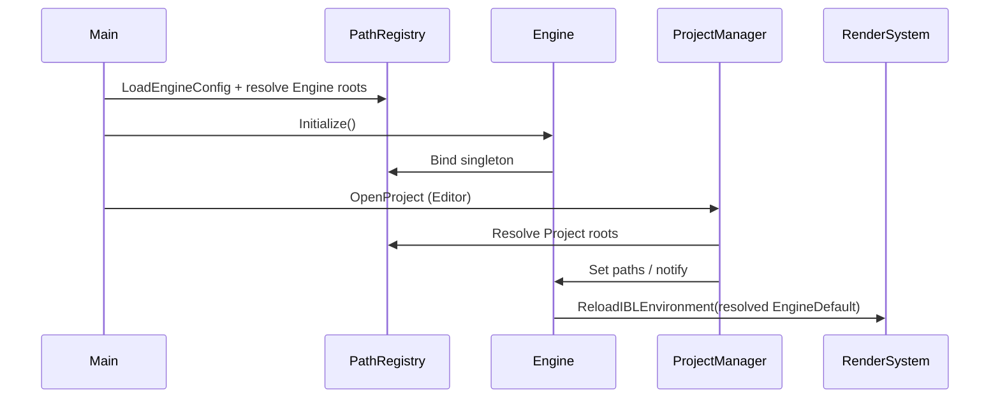

# 引擎启动与路径配置 — 设计草稿

Last updated: 2026-05-23  
Status: **M0 已实施（2026-05-23）** — `PathRegistry`、相对 `EngineConfig.meconfig`、`--engine-root` / `--engine-config`  
父文档：[Platform 路线图](../PLATFORM_ROADMAP.md)

---

## 0) 问题陈述

当前痛点：

1. `EngineConfig.meconfig` 使用 **绝对路径**（如 `D:/Dev/.../EngineDefault`），换机器/CI 即失效。
2. Playground 等处仍有 **硬编码资源路径**。
3. 「引擎资源 / 项目 Content / 编辑器 Saved」边界未在类型上区分，调用方各自拼路径。
4. `SetEngineDefaultAssetsRoot` 在 Engine 初始化后才生效，失败时错误分散在各子系统。

目标：**一次解析、全局只读、相对路径优先**，行为可预测、可日志验证。

---

## 1) 设计选项

### 选项 A — 仅扩展现有 `EngineConfig.meconfig`

- 继续单文件 JSON；增加 `ProjectRoot`、`ContentRoot` 等字段。
- **优点：** 改动小。  
- **缺点：** Engine 与 Project 配置混在一起；Editor/Playground 各读各的。

### 选项 B — 三层配置 + `PathRegistry`（推荐）

| 层 | 文件 / 来源 | 内容示例 |
|----|-------------|----------|
| **Engine** | `EngineConfig.meconfig`（相对可执行文件或 `MINENGINE_ROOT`） | `EngineDefaultAssetsRoot` → `Assets/EngineDefault` |
| **Project** | `MyMEProject/*.mesettings`、`.meproject` | Content 根、默认场景、Saved |
| **CommandLine** | `--project=...`、`--engine-root=...` | 覆盖、自动化测试 |

启动末期构建 **`PathRegistry`**（或 `FPaths` 风格静态 API）：

```cpp
// 伪 API
PathRegistry::Get().EngineDefaultAssets();  // absolute, normalized
PathRegistry::Get().ProjectContent();
PathRegistry::Get().Resolve(PathKind::EngineRelative, "Shaders/EnvMap/background.vert");
```

- **优点：** 与 UE `FPaths` 心智一致；子系统不再拼字符串。  
- **缺点：** 需一轮调用点迁移（可分批）。

### 选项 C — 环境变量为主

- 例如 `MINENGINE_ENGINE_DEFAULT=...`。
- **优点：** CI 友好。  
- **缺点：** 对初学者不友好；与「打开项目即跑」编辑器流程不符。  

**可作为 B 的补充**（CLI/CI 覆盖），不作为唯一机制。

---

## 2) 拍板选择：**选项 B**

**理由：**

1. 你已定 UE 化路线；UE 的 `FPaths` + `GConfig` 分层已被验证。  
2. 项目已有 `ProjectManager::OpenProject`、`EngineConfig`、`ProjectSettings` — B 是自然延伸，不是重写。  
3. M0 可只做 Engine + Project 根解析，不必等反射或 GC。

---

## 3) 路径解析规则

1. **配置文件内路径默认为相对**：
   - Engine 相对 → **Engine 根**（含 `EngineConfig.meconfig` 的目录或显式 `EngineRoot`）
   - Project 相对 → **项目根**（`.meproject` 所在目录）
2. 启动时 **normalize** 为 `std::filesystem::path`（绝对路径），并 `ME_CORE_INFO` 打印关键根（Debug 配置可 verbose）。
3. 禁止在 Runtime 热路径依赖 **当前工作目录**；`ScanAssets` 等只接受已 resolve 的路径。
4. 找不到路径 → **启动失败**（Editor）或 **降级 + WARN**（仅当子系统可选，如 Playground 无 IBL）。

### 目录约定（建议固定）

```text
<EngineRoot>/
  EngineConfig.meconfig
  Assets/EngineDefault/     ← EngineDefaultAssetsRoot
<ProjectRoot>/
  MyMEProject.meproject
  Assets/                   ← Content（扫描入口）
  Saved/                    ← 生成物、缓存（不进版本库）
```

---

## 4) 启动顺序（目标）



与现状差异（2026-05-23 已实施）：

- `PathRegistry` 在 `Engine::Initialize` 内、**StartSystems 之前**加载。
- `RenderSystem::LoadEngineRenderingAssets()` 在 RHI 就绪且路径有效后 **只加载一次** IBL + SkyBox（不再 `Initialize("")` + Reload）。
- 材质模板路径读 `PathRegistry`；Editor `OpenProject` 后 `ScanAssets(ProjectContent)`。

---

## 5) 实施阶段（M0）

| 步骤 | 内容 | 验收 |
|------|------|------|
| S0.1 | `PathRegistry` 类 + Engine 段解析（相对路径） | ✅ |
| S0.2 | `EngineConfig.meconfig` 改为相对示例 | ✅ `Assets/EngineDefault` |
| S0.3 | `SyncEngineDefaultAssetsFromPathRegistry` + Material 读 PathRegistry | ✅ |
| S0.4 | Playground 硬编码路径 | ✅ `ResolveEngineRelative` |
| S0.5 | `--engine-root=` / `--engine-config=`；`MINENGINE_ENGINE_*` env | ✅ |

**不在 M0：** 热重载配置、Saved 缓存路径策略、插件路径。

---

## 6) 风险

| 风险 | 对策 |
|------|------|
| 旧绝对路径配置失效 | `README` + 一次迁移说明；启动时检测 `is_absolute` 仍兼容一版 |
| 多入口（Editor/Playground/Test） | 共享 `PathRegistry::InitializeForEngine` |
| 测试无项目 | IR test 用 `EngineDefaultAssetsRootOverride`（已有 Material 编译 env 先例） |

---

## 7) 参考代码锚点

- `minEngine/EngineConfig.meconfig`
- `Engine::SetEngineDefaultAssetsRoot` — `Engine.cpp`
- `ProjectManager::OpenProject` — `ProjectManager.cpp`
- `MaterialShellAssemblerBase::ResolveEngineDefaultAssetsRoot`
