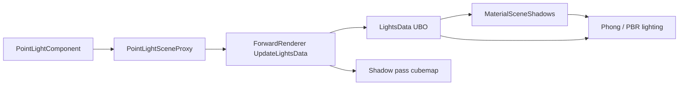

# BUG-RENDER-014 — Point Light Radius & Attenuation — Design Spec

## Meta
- **ID:** `BUG-RENDER-014`（`master` 小修复；不新开 Feature ID）
- **Type:** Bugfix Design
- **Status:** Done (pending commit)
- **Owner:** project maintainer
- **Last updated:** 2026-09-01
- **Branch:** `master`
- **Related:** [Bug Record](../bugs/BUG-RENDER-014.md) · [RND-F06 Forward Renderer](./RND-F06_FORWARD_RENDERER_DESIGN.md) · [ACTIVE_WORK](../ACTIVE_WORK.md)
- **Affects:** `PointLightComponent`, `ForwardRenderer`, graph shaders (`MaterialPhongLighting` / `MaterialPBR` / `MaterialSceneShadows`)

## TL;DR
点光源缺少 **影响半径** 与 **距离衰减**；阴影在超出有效范围后仍全强度采样，导致画面像「全屏落影」。方案：在 `PointLightComponent` 暴露 `AttenuationRadius`（+ 可选 falloff），UBO/shader 统一衰减光照与阴影贡献；点光 shadow pass 的 far plane 与半径对齐。

## Scope
- **In:**
  - `PointLightComponent` 新属性 + 序列化 + Inspector
  - CPU → `LightsData` UBO 字段约定
  - Phong / PBR 点光光照衰减
  - 点光 shadow PCF 在 radius 外归零 + `currentDepth > 1` 保护
  - 点光 cubemap shadow pass far plane 与半径一致
- **Out:**
  - Dir/Spot 阴影质量（ED-F01 defer）
  - IES / 色温 / 物理单位（candela/lumen）换算
  - 每灯独立 shadow bias 曲线调参 UI

## Reader quick start
1. 本文件：语义与 UBO 契约
2. Bug：`docs/ai/bugs/BUG-RENDER-014.md`
3. 代码：`ForwardRenderer.cpp`（UBO + `BuildPointShadowDrawCommands`）、`PointLightComponent`、`Material*Lighting.glslinc`、`MaterialSceneShadows.glslinc`

---

## 1) 背景与目标

### 问题
- 点光在场景任意距离仍按满强度参与光照与阴影，无半径截止。
- `PointLightData.Position.w` 在 shader 注释中预留为 radius，CPU 却写死 `1.0`。
- Shadow far 全局常量 `kPointShadowFar = 50`；fragment 超出 far 后 `currentDepth > 1` 仍做 PCF，易长期判定为「在阴影中」→ 全屏变暗。

### 目标
- 艺术家可在 Inspector 配置 **影响半径**；半径外光照与阴影贡献 → 0。
- 行为在 **GL / VK**、Phong / PBR 材质路径上一致。
- 改动面小，适合 `master` 直接落地。

---

## 2) 现状（调查结论）

| 层级 | 现状 |
|------|------|
| Component | `LightComponent` 仅有 color / intensity / cast shadow；无 radius |
| CPU UBO | `Position = (xyz, 1.0)`；`Params = (0, 0, kPointShadowFar, shadowIndex)` |
| 光照 shader | `CalcPointLightGraph` / `CalcPointLightPBR` 无距离衰减 |
| 阴影 shader | `SamplePointShadowPCF*` 无 radius mask；无超 far 早退 |
| Shadow pass | `BuildPointShadowDrawCommands` 固定 `kPointShadowNear/Far` |

`ForwardRenderer.h` 已有注释：`Position.w` 用于 radius/attenuation — **设计与实现脱节**。

---

## 3) 方案

### 3.1 组件 API（C++）

在 `PointLightComponent`（或基类 `LightComponent` 若 Spot 将来复用）增加：

| 属性 | 类型 | 默认 | 说明 |
|------|------|------|------|
| `m_AttenuationRadius` | `float` | `10.0f` | 影响半径（世界单位，米）。`<= 0` 视为不发光（可选 clamp 最小 `0.01`） |
| `m_AttenuationFalloff` | `float` | `2.0f` | 衰减指数（`2` = 近似平方反比；实现用归一化距离幂次） |

`PointLightSceneProxy` 在 `CreateSceneProxy` / 更新路径同步上述字段。

**不新增**单独 `ShadowFar`：shadow cubemap far **= `AttenuationRadius`**（见 3.3），避免半径外仍写入/采样阴影。

### 3.2 UBO 契约（`PointLightData`）

保持 std140 布局，复用已有字段：

```text
Position.xyz  = 世界空间灯位置
Position.w    = AttenuationRadius

Color.rgb     = 光色
Color.w       = Intensity

Params.x      = AttenuationFalloff（指数）
Params.y      = 保留 0
Params.z      = ShadowFar（= AttenuationRadius，与 shadow pass 一致）
Params.w      = Shadow map slot index（< 0 无阴影）
```

Shader 与 C++ 结构体注释同步更新（`ForwardRenderer.h`、`MaterialSceneShadows.glslinc`）。

### 3.3 光照衰减（shader）

对点光，在 Phong / PBR 路径计算 **光照衰减因子** `att`（0–1）：

```glsl
float dist = length(light.Position.xyz - fragPos);
float radius = max(light.Position.w, 1e-4);
float nd = dist / radius;
float att = pow(clamp(1.0 - nd, 0.0, 1.0), light.Params.x);
// 可选：att *= 1.0 / (dist * dist + 1.0);  // 物理感更强；首版可用纯 windowed falloff
```

最终：点光 **direct**（diffuse + specular）`*= att`；**无 per-light ambient**（见 §3.3.1）。

**首版建议：** 使用 **smooth window** `pow(1 - saturate(dist/radius), falloff)`，实现简单、Inspector 可调；与 UE 的 `SmoothFalloff` 同类，非严格物理。

### 3.3.1 Phong 点光 ambient（应用语义，非 bug）

历史实现中 `CalcPointLightGraph` 带有 `0.1 * lightColor * albedo` 的 **per-point-light ambient**，且未乘 `att`，半径外仍照亮场景 — 属 **Phong 路径的应用层 hack**，不是半径系统缺陷。

| 路径 | 点光 ambient |
|------|----------------|
| **Phong** (`CalcPointLightGraph`) | **无** — 仅 `(diffuse + specular) * (1-shadow) * att`；环境光由平行光项或将来 IBL 承担 |
| **Phong** (`CalcDirLightGraph`) | 保留 `0.1 * lightColor * albedo`（单盏太阳近似环境） |
| **PBR** (`CalcPointLightPBR`) | 从未有 per-light ambient；片元级 `albedo * AO * 0.03` 占位 |

**决策（2026-09-01）：** 去掉 Phong 点光 per-light ambient，与 PBR 点光语义对齐；避免用户将「全场景微亮」误判为半径 bug。

### 3.4 阴影衰减（shader）

在 `ComputeMaterialSceneShadowVisibility` 与 `CalcPointLight*` 内，点光 shadow 采样前：

1. 若 `dist > radius`（或 `Params.z`）：`shadow = 0`。
2. 若 `currentDepth > 1.0 + epsilon`（超出 cubemap far）：`shadow = 0`。
3. 否则正常 PCF，再乘与光照相同的 `att`（或仅 `(1-shadow)*att` 合并到最终光照式）。

避免「光照已灭、阴影仍压暗」的不一致。

### 3.5 Shadow pass（CPU）

`BuildPointShadowDrawCommands`：

```text
farPlane  = max(light.AttenuationRadius, kPointShadowNear + epsilon)
nearPlane = kPointShadowNear  // 保持 0.1
```

`UpdateLightsData` 中 `Params.z = farPlane`。

常量 `kPointShadowFar` 保留为 **上限钳制**（如 100），防止极大半径撑爆精度；per-light 取 `min(radius, kPointShadowFar)`。

### 3.6 数据流



---

## 4) 备选方案

| 选项 | 说明 | 结论 |
|------|------|------|
| A. Radius + windowed falloff + shadow far = radius | 上文字段与 shader | **选用** |
| B. 仅修 shadow `currentDepth > 1` 早退，不加 radius 属性 | 减轻全屏阴影，仍无艺术可控半径 | 拒绝（不治本） |
| C. 物理反比 + 独立 ShadowFar | 更真实但参数多、易不一致 | Defer |

---

## 5) 风险与缓解

| 风险 | 缓解 |
|------|------|
| 旧场景无 radius 字段 | 默认 `10.0f`；序列化缺省走默认值 |
| 半径过小导致 shadow 精度差 | `radius >= kPointShadowNear * 2` clamp + Inspector 提示 |
| Phong / PBR / SceneShadow 三处逻辑分叉 | 抽 `PointLightAttenuation()` / `PointLightShadowFactor()` 到 `MaterialSceneShadows.glslinc` |
| std140 布局破坏 | 仅填已有 `Params.x`，不增 struct 成员 |

---

## 6) 实施切片

| Slice | 内容 | 验证 |
|-------|------|------|
| **S01** | `PointLightComponent` 属性 + proxy + UBO 写入 | 反射/序列化编译 |
| **S02** | Shadow pass far = radius；`Params.z` 一致 | 单点光 shadow 目视 |
| **S03** | Shader：光照 att + shadow mask + far 早退 | GL Editor 半径内外对比 |
| **S04** | 更新 `BUG-RENDER-014` Verified；`PROGRESS_LOG` | `verify.ps1` |

---

## 7) 验收标准

- [ ] Inspector 可调 `AttenuationRadius` / `AttenuationFalloff`，保存场景后重载仍有效
- [ ] 半径外片段：点光漫反射/高光 → 0；阴影不压暗画面
- [ ] 半径内：阴影与光照行为与修前可比（无回归性全黑）
- [ ] GL Editor 目视通过；VK 同场景抽检无异常
- [ ] `verify.ps1` 通过；无新增 shader 编译错误

---

## 8) 变更记录

| 日期 | 说明 |
|------|------|
| 2026-09-01 | 调查根因；初稿 Design |
| 2026-09-01 | 用户确认后扩写为可实施 Design Spec |
| 2026-09-01 | 去掉 Phong 点光 per-light ambient；§3.3.1 记录应用语义 |
