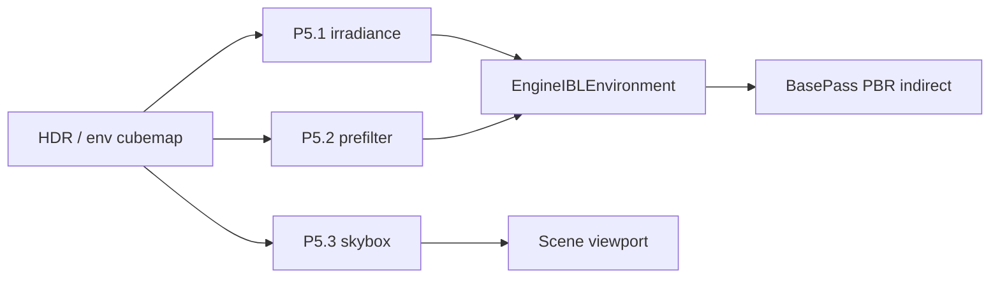
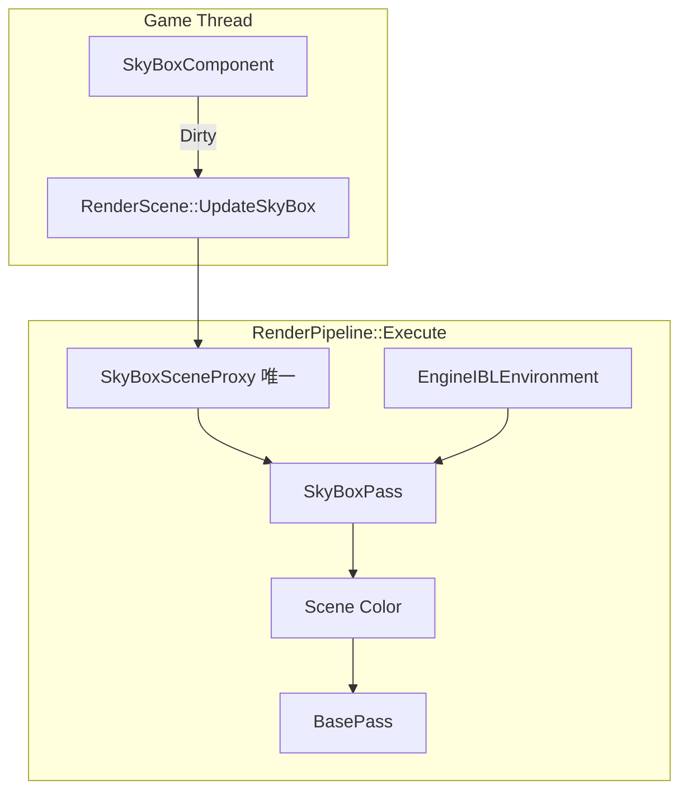

# Material System — Phase 5 详细设计（IBL 完善）

Last updated: 2026-05-23  
Status: **Phase 5 ✅**（P5.1–P5.3 已实施；P5.3 编辑器目视 ✅；P5.1/P5.2 漫反射/镜面目视可选补验）  
前置：[MATERIAL_SYSTEM_PHASE4.md](./MATERIAL_SYSTEM_PHASE4.md) ✅ · [RESOURCE_PIPELINE_PLAN.md](../RESOURCE_PIPELINE_PLAN.md) R2 ✅

**范围拍板（2026-05-23）：** Phase 5 **仅 IBL**（irradiance / prefilter / skybox）。**Parallax / POM / WPO** 移出 P5，列入 [§12 Backlog](#12-backlog视差--顶点位移有空再做)。

---

## 0) Phase 5 目标与边界

Phase 4 已交付 **可用的 split-sum IBL**（HDR → cubemap、BRDF LUT、`CalcIndirectPBR`、Pass 绑定）。Phase 5 **只做一件事**：

**把 IBL 从「能看」做到「更像 LearnOpenGL / UE」**——独立 irradiance、真 prefilter、场景天空背景。

| 做 | 不做（本阶段 / 后续） |
|----|----------------------|
| GPU **irradiance convolution** cubemap | Parallax / POM / WPO（→ §12 Backlog） |
| GPU **prefilter** cubemap（或规范离线资产管线） | Tessellation / displacement |
| **Skybox** 背景绘制（EngineDefault HDR cubemap） | 材质编辑器 Undo / Shader 实时预览 |
| `--material-ir-test` IBL 子集扩展 | Translucent IBL 专项、Detail Normal |
| | `u_EnvIntensity` 编辑器暴露（可顺手，非关门） |

**已定参数：**

| 项 | 选择 |
|----|------|
| 子阶段顺序 | **P5.1 → P5.2 → P5.3** |
| Irradiance 分辨率 | **32**（可配置常量，后续改 64 成本低） |
| Skybox | **场景视口默认开启**（保留调试开关） |

**建议工期：** 约 1–1.5 周，三块可独立 commit、独立目视验收。

---

## 1) 现状（P4 结束）

| 能力 | P4 状态 | P5 要补的 gap |
|------|---------|----------------|
| Diffuse IBL | 采样 **environment** cubemap | **Irradiance** 卷积 cubemap |
| Specular IBL | `textureLod` + HDR **mip** 或 alias | **Prefilter** pass cubemap |
| 背景 | 无 | **Skybox**（场景 `SkyBoxComponent` + `SkyBoxPass`） |
| Normal map | ✅（P2） | 本阶段不扩展 |

---

## 2) 技术路线

| 子阶段 | LearnOpenGL / 参考 |
|--------|------------------|
| P5.1 Irradiance | [IBL Diffuse irradiance](https://learnopengl.com/PBR/IBL/IBL) |
| P5.2 Prefilter | [Specular IBL](https://learnopengl.com/PBR/IBL/Specular-IBL) |
| P5.3 Skybox | 同教程 background shader |

---

## 3) 实施顺序总览

```text
P5.1  Irradiance convolution（GPU）→ m_Irradiance 专用
P5.2  Prefilter cubemap（GPU）→ m_Prefilter 专用
P5.3  Skybox pass + 与 IBL 共用 environment cubemap
```



---

## 4) P5.1 — Irradiance convolution

### 4.1 目标

从 **environment cubemap**（P4 HDR capture 或加载链）生成 **低频 diffuse** cubemap，仅供 `CalcIndirectPBR` 的 `texture(u_EnvIrradianceMap, N)`。

### 4.2 实现要点

| 项 | 说明 |
|----|------|
| Shader | `EngineDefault/Shaders/EnvMap/irradiance_convolution.{vert,frag}` |
| C++ | `EnvMapCapture::ConvolveIrradiance(envCube, faceSize=32)` |
| 存储 | `EngineIBLEnvironment::m_Irradiance` = 卷积结果；**environment** 仍作 prefilter 源 |
| 加载顺序 | 仍优先 `irradiance_*.png` 六面；无则 **GPU conv**；再 fallback 现有链 |

### 4.3 验收

- [x] 日志：`convolved irradiance cubemap 32x32 from environment`
- [ ] 目视：漫反射环境更 **柔和**（P5.2 后与 specular 分离更明显）
- [x] `--material-ir-test`：`VerifyIBLGpuConvolutionAndPrefilter`（含 irradiance）

---

## 5) P5.2 — Prefilter environment map

### 5.1 目标

生成 **带 mip 的 prefilter cubemap**（重要性采样近似），替换「environment + `glGenerateMipmap`」的 specular 近似。

### 5.2 实现要点

| 项 | 说明 |
|----|------|
| Shader | `prefilter.{vert,frag}` + 每 mip × 每 face 渲染 |
| 输入 | RGB16F environment cubemap（512） |
| 输出 | `m_Prefilter`（512，完整 mip 链） |
| `kMaterialPBRMaxReflectionLod` | 与 `log2(faceSize)` 对齐（P4 为 7.0 @512） |
| 离线备选 | 保留 `prefilter_posx.png` … 加载路径 |

### 5.3 验收

- [ ] 目视：Roughness 0 / 1 镜面模糊差异明显
- [x] 成功时 prefilter 为独立 GPU cubemap（8 mips，与 `kMaterialPBRMaxReflectionLod` 对齐）
- [x] `--material-ir-test`：`VerifyIBLGpuConvolutionAndPrefilter`

---

## 6) P5.3 — Skybox 背景（设计定稿）

### 6.1 目标

- 场景视口显示 **HDR 天空背景**，与 PBR **环境反射** 同源（`EngineIBLEnvironment::GetEnvironment()`）。
- **仅当场景中存在唯一 `SkyBoxComponent` 时** 绘制；无组件则保持清屏色。
- 对齐 LearnOpenGL [IBL](https://learnopengl.com/PBR/IBL/IBL) cubemap background；架构上对齐 UE **SkyAtmosphere：SceneComponent + 专用 Proxy + 专用 Pass**（非 StaticMesh 队列）。

### 6.2 架构选型（为何不用 StaticMesh Proxy）

| 方案 | 说明 | P5.3 选择 |
|------|------|-----------|
| A. `StaticMeshComponent` + `BasePass` | 大球进 `OpaqueQueue` | ❌ 易进 Shadow、需材质图 |
| B. `PrimitiveComponent` + 不进队列 | 有 Proxy 但不走 Mesh 队列 | ⚠️ 基类误导 CastShadow/AABB |
| **C. `SceneComponent` + `SkyBoxSceneProxy` + `SkyBoxPass`** | 同 **Light** 模式 | ✅ **采用** |

**UE 对照：**

| UE | 基类 | Proxy | 绘制 |
|----|------|-------|------|
| `USkyAtmosphereComponent` | `USceneComponent` | `FSkyAtmosphereSceneProxy` | 专用 Sky Pass |
| `USkyLightComponent` | 灯光 | 无几何 | IBL（≈ `EngineIBLEnvironment`） |
| Sky Sphere 模板 | `UStaticMeshComponent` | `FStaticMeshSceneProxy` | 普通 Mesh |

**结论：** 要 **SkyBoxSceneProxy**，不要 **StaticMeshSceneProxy**；组件继承 **`SceneComponent`**，不继承 `PrimitiveComponent`。

### 6.3 类与数据流



**SkyBoxComponent**（`Framework/Components/`，继承 `SceneComponent`）

| 成员 / 行为 | 说明 |
|-------------|------|
| `m_Enabled` | 为 false 时不绘制 |
| `m_SkyIntensity` | 默认 1.0，Pass 上传 uniform |
| `m_SkyBoxSceneProxy` | 非 owning 指针 |
| `DoEndOfFrameUpdate` | `m_bRenderStateDirty` → `RenderScene::UpdateSkyBox` |
| 析构 | `RemoveSkyBox`（对齐 `LightComponent`） |

**SkyBoxSceneProxy**（`Render/SkyBoxSceneProxies/`）

| 字段 | 说明 |
|------|------|
| `m_SkyBoxComponent` | 回指 |
| `m_Transform` | P5.3 可仅 Yaw；位置在 Pass 内跟相机 |
| `m_SkyIntensity` / `m_Enabled` | 渲染线程快照 |

**RenderScene**

```cpp
void UpdateSkyBox(SkyBoxComponent* component);
void RemoveSkyBox(const SkyBoxComponent* component);

SkyBoxSceneProxy* m_SkyBoxProxy = nullptr;  // 至多一个
std::unique_ptr<SkyBoxSceneProxy> m_SkyBoxProxyOwner;
```

**唯一性（拍板）**

| 场景 | 行为 |
|------|------|
| 0 个组件 | 不跑 `SkyBoxPass` |
| 1 个 | 正常绘制 |
| ≥2 个 | **后注册替换前者** + `ME_CORE_WARN` |

### 6.4 RenderPipeline 集成

**顺序：** `Clear` → **`SkyBoxPass`** → `BasePass` → `TranslucencyPass` → Post → Present

```cpp
rhi->Clear();
if (SkyBoxSceneProxy* sky = GetSkyBoxProxy(ctx.Scene))
{
    if (m_IBLEnvironment.GetEnvironment())
        m_SkyBoxPass.Execute(ctx, *sky, m_IBLEnvironment, sceneColorRT);
}
m_BasePass.Execute();
```

**SkyBoxPass**

| 项 | 说明 |
|----|------|
| Shader | `EnvMap/background.{vert,frag}` |
| 几何 | 单位立方体；VS 去掉 View 平移（中心=相机） |
| 采样 | `GetEnvironment()` cubemap |
| Depth | `GL_LEQUAL`，`glDepthMask(false)` |
| Cull | 内表面（LearnOpenGL `GL_FRONT` 或等价） |

**不进：** `BuildRenderQueue`、`ShadowPass`、`Material` 图、BasePass 的 mesh 纹理槽。

**可选：** `SceneDrawFlags::EnableSkyBox`（有 Proxy 且 flag 为 true 才画）。

### 6.5 与 IBL 分工

| 系统 | 职责 |
|------|------|
| `EngineIBLEnvironment` | 全局 cubemap 链 + BasePass indirect |
| `SkyBoxComponent` | 关卡是否显示天空 |
| `SkyBoxPass` | 可见背景，默认 environment cubemap |

P5.3 不做：每关卡 `OverrideCubemap`（Backlog）。

### 6.6 文件清单

| 操作 | 路径 |
|------|------|
| 新增 | `SkyBoxComponent.{h,cpp}` |
| 新增 | `SkyBoxSceneProxy.h` |
| 新增 | `SkyBoxPass.{h,cpp}` |
| 新增 | `background.{vert,frag}` |
| 修改 | `RenderScene.{h,cpp}`、`RenderPipeline.{h,cpp}` |
| 可选 | `test.mescene` 挂一个 SkyBox |

### 6.7 验收

- [x] 有组件：天空与反射同色；旋转相机一致（编辑器 `test` 场景，2026-05-23）
- [ ] 无组件 / `Enabled=false`：仅清屏
- [ ] 双组件：WARN + 唯一生效
- [x] 物体不被天空遮挡；depth 正常
- [x] `--material-ir-test` 仍绿
- [x] `test.mescene` 含 `SkyBox` GameObject + `SkyBoxComponent`

### 6.8 风险

| 风险 | 对策 |
|------|------|
| 天空盖住物体 | Pass 在 BasePass 前；不写 depth |
| 无 environment | 跳过 Pass 或 WARN |

---

## 7) 测试与文档（Phase 5 关门）

| 项 | 内容 |
|----|------|
| IR test | 现有 `VerifyIBLGpuConvolutionAndPrefilter` 仍绿；Skybox 以场景目视为主 |
| 文档 | 本文件验收勾选；`IBL/README.md`；ROADMAP；PROGRESS_LOG |
| 目视 | §8 |

---

## 8) Phase 5 完成后应看到的效果

| 区域 | 效果 |
|------|------|
| **天空** | `SkyBoxComponent` + `SkyBoxPass` 绘制 HDR 背景 |
| **漫反射环境** | 更柔和，与镜面反射分离 |
| **镜面反射** | 粗糙度对反射模糊更贴近教程 |
| **贴图凹凸** | 仍仅 **法线贴图**（P2）；无视差 / WPO |

**仍不会有：** POM、WPO、真细分位移、编辑器 Undo。

---

## 9) 风险与对策

| 风险 | 对策 |
|------|------|
| 启动时 GPU pass 变多 | irradiance 32³ + prefilter 一次性；二期可缓存到 `Textures/IBL/generated/` |
| Prefilter 耗时 | 首启日志 + 可选离线六面；与 P4 相同 |
| Skybox 与 UI 清屏色冲突 | 有 skybox 时视口清屏可弱化或忽略 |

---

## 10) 实施检查清单（开发用）

| 顺序 | 任务 | 关键路径 |
|------|------|----------|
| 1 | irradiance shader + FBO | `EnvMap/irradiance_convolution.*` |
| 2 | `ConvolveIrradiance` | `EnvMapCapture.cpp` |
| 3 | `EngineIBLEnvironment` 加载链 | 无 png 时 conv，再 bind |
| 4 | prefilter shader + mip 循环 | `EnvMap/prefilter.*` |
| 5 | `PrefilterEnvironment` | `EnvMapCapture.cpp` |
| 6a ✅ | `SkyBoxComponent` + `SkyBoxSceneProxy` | `Framework/`、`RenderScene` |
| 6b ✅ | `background.*` + `SkyBoxPass` | `EnvMap/`、`RenderPasses/` |
| 6c ✅ | `Execute` 插入 + `test.mescene` + `EnableSkyBox` flag | `RenderPipeline.cpp`、`SceneEditingViewportClient` |
| 7 ✅ | README + Phase 5 关门勾选 | `IBL/README.md`、本文件 §6.7 |

---

## 11) 参考

- [LearnOpenGL IBL](https://learnopengl.com/PBR/IBL/IBL) · [Specular IBL](https://learnopengl.com/PBR/IBL/Specular-IBL)
- [MATERIAL_SYSTEM_PHASE4.md](./MATERIAL_SYSTEM_PHASE4.md)
- [MATERIAL_SYSTEM_PHASE3.md](./MATERIAL_SYSTEM_PHASE3.md) §11（视差 / WPO 概念，非 P5 范围）

---

## 12) Backlog（视差 / 顶点位移，有空再做）

不绑定 Phase 编号，实施时再开独立设计小节或 **Phase 6**。

| 项 | 说明 | 依赖 |
|----|------|------|
| **Parallax / POM** | `MaterialParallax.glslinc`；高度图；PBR + BlinnPhong | TBN ✅ |
| **WPO** | `MP_WorldPositionOffset` 暴露；ShadowPass 一致 | 顶点编译 ✅ 占位 |
| **MP_Height** | 可选正式属性（与 POM 同批） | — |
| **Tessellation** | 真几何位移 | 管线 hull/domain |

原 P5.4 / P5.5 细节可从 git 历史或 Phase 3 §11 展开；**不在本文件维护步骤级设计**，避免与 IBL 实施混淆。
