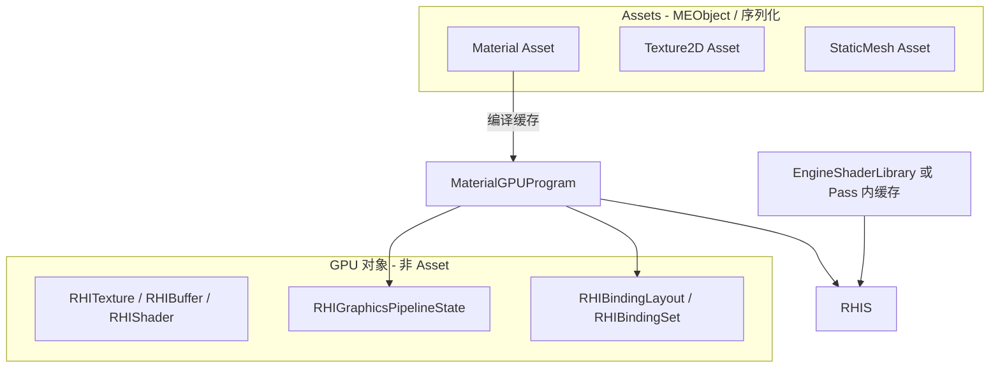

# RND-F03 — Legacy RHI removal (OpenGL-only modern path)

## Meta

| Field | Value |
|-------|--------|
| **Feature ID** | `RND-F03` |
| **Type** | Refactor |
| **Status** | In Progress |
| **Owner** | (maintainer) |
| **Last updated** | 2026-06-01 |
| **Branch** | `render`（实现）；registry/planning 可合 `master` |
| **Depends on** | `RND-F02` **Done**（现代契约 + GL `RHICreate*`/`RHICmd*` + Pass CommandList） |
| **Blocks** | `RND-F04`（Vulkan + modern RHI completion） |
| **Related** | [RND-F02](./RND-F02_MODERN_RHI_DESIGN.md) · [RND-F04](./RND-F04_VULKAN_MODERN_RHI_COMPLETION_DESIGN.md) · [FEATURE_REGISTRY](../FEATURE_REGISTRY.md) · [ACTIVE_WORK](../ACTIVE_WORK.md) |

---

## TL;DR

**问题：** F02 在 **现代契约** 下仍保留完整 Legacy 并行层：`RHITexture2D::Bind`、`VertexBuffer`、`RHIShaderLegacy::Use`/`UploadUniform*`、`OpenGLRHIModern::WrapLegacy*`、以及错误的 **Shader-as-Asset** 建模（`RHIShaderLegacy` 继承 `MEObject`）。

**方案：** 在 **仅 OpenGL** 后端上，按依赖顺序把运行时与公共 API **全部** 切到现代 RHI；**删** Legacy 公共面与 `WrapLegacy` 生产路径。**Material 编译 + 模板 + 绑定** 放在靠后切片（S6）。

**不做什么：** Vulkan（F04）；RenderGraph（F01）；F02 设计里「GL 可简化」的 barrier/queue/descriptor 完整语义（F04）。

**与 F04 的分工：** F03 = **单后端、零 Legacy、调用面纯净**；F04 = **第二后端 + 现代 RHI 能力补全**（在 F03 契约上实现 VK，并反哺 transition/sync 等）。

---

## Reader quick start

1. 读 **§2 建模修正**（Shader vs Material）— 避免按旧模型迁。
2. 读 **§5 迁移面矩阵** + **§8 切片** — 知道顺序与每片 DoD。
3. 实现前对照 **§6 引擎 Binding 表**（S3 冻结）与 **§10 删除列表**。
4. Material 工作者只读 **§7** + **§9**；其它切片勿动模板。

**代码入口（Legacy 仍活跃处）：**

- `Render/RHI/RHI.h` — Legacy API 块
- `Render/OpenGL/OpenGLRHIModern.*` — `WrapLegacy*`
- `Render/Shader.h`、`RHI/RHIShader.h` — `Shader` Asset + `RHIShaderLegacy`
- `Render/Material.*`、`Material/MaterialCompiler/`
- `RenderPipeline/RenderPasses/`、`SceneRenderTarget.*`
- `DrawCommands/MeshDrawCommand.h`、`StaticMesh*`、Loaders
- `Environment/EnvMapCapture.*`、`EngineIBLEnvironment.*`

---

## §1 背景与动机

### 1.1 F02 已交付什么

| 已交付 | 说明 |
|--------|------|
| 现代词汇 + 契约 | `RHITexture`、`RHIBuffer`、`RHIShader`、`RHIBinding*`、`RHIGraphicsPSODesc`、`RHIRenderPassInfo` |
| OpenGL 实现 | `OpenGLRHI::RHICreate*` / `RHICmd*`（瞬态 FBO、PSO fallback、draw/bind） |
| Pass 提交 | Present/Shadow/场景 Pass 经 `RHICommandList`；`RenderPasses/` 无 `glad` |
| 过渡桥 | `WrapLegacy*`、Legacy 资源创建、材质/引擎 shader 仍 `RHIShaderLegacy` |

### 1.2 F03 要交付什么

引擎在 **生产路径** 上只存在 **一套** GPU 抽象：

- 创建：`RHICreateTexture2D`、`RHICreateBuffer`、`RHICreateShader`、`RHICreateGraphicsPipelineState`、`RHICreateBindingLayout` / `Set` …
- 录制：`RHICommandList` → `RHICmd*`
- **无** `rhi->CreateVertexBuffer`、`RHITexture2D::Bind`、`shader->Use()` 于 draw hot path
- **无** `OpenGLRHIModern::WrapLegacy*` 于生产代码

### 1.3 为何单独成 Feature

- 横切 **Resource / Pass / Material / Editor / Environment**，不宜继续挂在 F02 的「S5+」脚注。
- 与 **F04 Vulkan** 分离：VK 应对接 **已无 Legacy** 的调用面，否则双端维护 Wrap + Legacy。
- **Material + 模板** 改动面大，需独立子切片与 `material-ir` 回归策略。

---

## §2 建模修正：Shader 不是 Asset，Material 才是 Asset

### 2.1 现状（问题）

| 现状 | 问题 |
|------|------|
| `ME_CLASS() RHIShaderLegacy : public MEObject` | GPU program 被当成 **引擎对象/可序列化实体**，与 UE `FRHIShader`（RHI 资源句柄）角色不符 |
| `ME_CLASS() Shader : public Asset`，持 `shared_ptr<RHIShaderLegacy>` | **Shader 被登记为可导入资产**；实际每份 Material 编译出 **独立** GLSL/program，不应与「网格纹理式」Asset 混为一谈 |
| `Material` 持 `shared_ptr<Shader> m_Shader` | 间接把「编译产物」当成 Asset 引用；Editor/Loader 路径复杂 |
| 引擎固定 shader（Present/Shadow/Sky）也走 `Shader::CreateFromFiles` → Asset 同款类型 | 引擎内置 shader 不是项目 Content，不必 Asset 化 |

### 2.2 目标模型（F03 normative）



| 概念 | F03 目标 |
|------|----------|
| **Material** | **唯一** 材质类 Asset；图、参数、shading model、blend 可序列化 |
| **编译产物** | 挂在 Material 上（或 `MaterialGPUProgram` / `MaterialRenderProxy` **非 Asset** 结构体）：`RHIShaderRef`、PSO、`RHIBindingLayout`、per-instance `RHIBindingSet` |
| **RHIShader** | 现代 RHI 类型；**不**继承 `MEObject`；由 `RHICreateShader` 创建 |
| **RHIShaderLegacy** | F03 结束时 **删除**（或仅测试夹具短期保留，不进入生产 include） |
| **Shader Asset** | **废弃**：`Shader.h` / `ShaderLoader` / `ShaderResource` 迁出或改为内部 `MaterialCompiler` 工具类型（不注册 AssetType） |
| **引擎固定 shader** | `EngineShaderLibrary` 或各 Pass `Initialize` 内：`RHICreateShader` + 缓存 `RHIGraphicsPipelineState`；源文件仍在 `EngineDefault/Shaders` |

### 2.3 反射与序列化影响

- 从 `RHIShaderLegacy` 移除 `ME_CLASS` → 删除 `RHIShader.gen.h` / 反射注册；`Material` 资产字段改为存 **编译元数据**（shading model、参数布局、可选 shader 源码 hash），**不**存 `shared_ptr<RHIShaderLegacy>`。
- `Shader` Asset 若已有 `.meta` / 项目资源：需 **迁移策略**（见 §9 S6e）：一般项目材质不应引用独立 Shader 资产；若有，合并进 Material 或标记废弃。

### 2.4 与 UE 的对照（学习用，non-normative）

| UE | minEngine F03 |
|----|----------------|
| `UMaterial` / `UMaterialInstance` | **`Material` Asset** |
| `FMaterialShaderMap` / `FShaderMap` | Material 上 **GPU program 缓存**（非 Asset） |
| `FRHIShader` | **`RHIShader`** |
| `UShader` 资产（.usf + 材质类型） | **不照搬**；我们用 Material IR + 模板，**不**单独 Shader Asset |

---

## §3 当前状态快照（F02 Done 之后）

### 3.1 仍为 Legacy 的公共 API（`RHI.h`）

`SetViewport`（Legacy 块内）、`SetClearColor`、`Clear`、`SetDrawBuffer`/`SetReadBuffer`、`Enable*`/`Disable*`、`CreateVertexBuffer`、`CreateIndexBuffer`、`CreateVertexDefinition`、`CreateFrameBuffer`、`CreateUniformBuffer`、`CreateRHITexture2D/Cube/Array`、`CreateRHIShader`（返回 `RHIShaderLegacy`）。

### 3.2 生产路径上的 Legacy 使用（摘要）

| 区域 | Legacy 用法 |
|------|-------------|
| **SceneRenderTarget** | `CreateFrameBuffer` + `CreateRHITexture2D` + `Attach*`；现代侧 `WrapLegacy2D` |
| **MeshDrawCommand** | ~~Legacy~~ → **Done (S2)**：`RHIBufferRef` + `RHIVertexInputLayoutRef`；`DrawMeshCommand` 无 Wrap |
| **BasePass / TranslucencyPass** | `RHIShaderLegacy::Use`、`BindForDraw`、`BindSceneDrawResources` 内 `texture->Bind` |
| **ShadowPass** | Directional/Spot 现代 Pass；Point 仍 `FrameBuffer` + `rhi->Clear()`；depth shader Legacy |
| **Present/Post/Sky** | 现代 draw + **仍** `UploadUniform*` / `Bind`（引擎 shader） |
| **Material** | 编译 → `Shader` Asset → `RHIShaderLegacy`；`BindForDraw` |
| **EnvMap / IBL** | `Shader::CreateFromFiles`、`GetID`、`DisableCullFace` 等 |
| **Editor** | 视口已 `GetRHINativeTextureHandle`；Material 预览仍可能经 Legacy |

### 3.3 `OpenGLRHIModern` 过渡机制

- `WrapLegacy2D/2DArray`、buffer/VAO Wrap — **F03 必须消除生产调用**
- `RHICreateTexture2D` 内部仍可能 `new OpenGLTexture2D` — 改为纯 `GLuint` 所有权在 `OpenGLRHITexture`

---

## §4 目标终态（F03 Done）

### 4.1 公共 API

- `RHI` **仅** 现代虚函数：`Initialize`/`Shutdown` + `RHICreate*` + `RHICmd*`（与 F02 §B.3 一致）。
- 无 `RHITexture2D` / `VertexBuffer` / `RHIShaderLegacy` 于 **引擎 include 树** 的 draw/resource 路径（实现细节可留在 `OpenGL/` 私有，直至删除文件）。

### 4.2 运行时行为

- 单帧场景：`RHICommandList` + `RHICmdBeginRenderPass`（场景 RT）→ Sky → Base → Translucency → Post → Present。
- 所有 draw：`RHICmdSetGraphicsPipelineState`、`SetBindingSet`、`SetVertexBuffer`、`Draw*`。
- 引擎/per-frame UBO：经 **BindingSet** 绑定，非 `BindUniformBlock` 散落调用（允许 OpenGL 后端内部映射到 `glBindBufferBase`）。

### 4.3 资产与编译

- **Material** 为材质唯一 Asset；GPU 程序为编译缓存。
- **无** `Shader` Asset 类型；`AssetManager` 不再注册 Shader loader（或仅兼容读取旧 meta 并迁移报错）。
- `RHIShader` **非** `MEObject`。

### 4.4 刻意保持简化（留给 F04）

- `RHICmdTransition` 可为 GL no-op，但 **接口存在**。
- 单队列、单 immediate CommandList 录制模型。
- PSO 缓存可仍为 per-pass 粗粒度 `RHIGraphicsPSOStateFallback`。

---

## §5 迁移面覆盖矩阵

| # | 层面 | 包含内容 | 主要文件/模块 |
|---|------|----------|----------------|
| M1 | **RHI 公共 API** | 删除 Legacy 虚函数块 | `RHI.h`、`OpenGLRHI.*` |
| M2 | **纹理/RT** | Scene RT、阴影 depth、IBL 立方体贴 **RHICreate** 持有 | `SceneRenderTarget.*`、`ShadowResourceManager`、`Texture`/`TextureCube` |
| M3 | **几何** | VB/IB/InputLayout 现代 ref；加载器 | `StaticMesh*`、`StaticMeshLoader`、`MeshDrawCommand` |
| M4 | **FrameBuffer 替代** | Legacy `FrameBuffer` 不再给 Pass；用 `RHIRenderPassInfo` + 瞬态 FBO（已有）或持久 FBO 句柄 | `SceneRenderTarget`、`ShadowPass` Point |
| M5 | **引擎 Binding** | PerFrame/Lights/Shadow/IBL 固定 layout；Present/Post/Shadow/Sky 去 `UploadUniform*` | `RenderPipeline`、`RenderPassBase`、各 Pass、`EngineIBLEnvironment` |
| M6 | **Pass 绘制** | Base/Translucency PSO（blend/depth）；全 Pass 无 Legacy shader | `*Pass.cpp` |
| M7 | **环境捕获** | EnvMap 离线 pass 现代 CommandList | `EnvMapCapture.*` |
| M8 | **Material 管线** | 模板/slot、编译产物、BindForDraw→BindingSet、废弃 Shader Asset | `Material*`、`MaterialCompiler/**`、`Shader.h` |
| M9 | **Editor** | 材质预览、缩略图、编译预览 GPU 路径 | `MaterialEditor*`、`AssetThumbnailService` |
| M10 | **实现清理** | 删 `WrapLegacy*`、Legacy 类文件或移 `Legacy/` 后删除 | `OpenGLRHIModern.*`、`RHIBuffers.h` Legacy 区等 |
| M11 | **测试** | `verify.ps1`、`material-ir`、必要时 RND 冒烟 | `Tests/` |

**Out of M8（除非绑定强制）：** Material 图编辑器 UX、新节点类型、Undo。

---

## §6 引擎 Binding 约定（S3 冻结，Material 前必读）

### 6.1 设计原则

- **Set 索引 = 更新频率**，不是「一个子系统一个 Set」。
- **(set, binding)** 二维表写死在 `EngineShaderBindings.h`；GL 上映射到 UBO binding point / texture unit。
- **主场景固定 3 个 Set**：Set0 帧+物体+灯，Set1 阴影(+IBL)，Set2 材质。
- 禁止在 GLSL 模板与 C++ 中 **分别手写** slot 数字（S6 由 assembler 从表生成）。

### 6.2 主场景 Set 分配（S3 冻结，Material 前不可变）

#### Set 0 — Scene / Object（每帧 + 每 draw 可能更新 binding 2）

| Binding | 资源 | 更新频率 |
|---------|------|----------|
| 0 | UBO `PerFrameData`（View, Proj, ViewProj, CameraPos） | 每帧 |
| 1 | UBO `LightsData` | 每帧 |
| 2 | UBO `PerObject` / `u_Model`（`mat4` 或小型 PerDraw UBO） | **每 draw** |

**Per-draw Model：** F03 采用「Set0 binding2 每 draw 更新 UBO 内容 + 必要时 `SetBindingSet(0, …)`」；不为此再开 Set。F04 可改为 dynamic offset ring buffer。

#### Set 1 — Shadow + IBL（阴影 pass 结束后绑一次，BasePass 用）

| Binding | 资源 |
|---------|------|
| 0 | Directional shadow depth SRV（2D array） |
| 1 | UBO `DirLightViewProjs` |
| 2 | UBO `CascadeFarPlanes` |
| 3+ | Spot shadow textures + `SpotLightViewProjs` UBO |
| … | Point shadow cube maps |
| N.. | IBL（env / irradiance / BRDF LUT，仅 PBR） |

无阴影/无 PBR 时仍用 **同一 layout**；后端绑 dummy 1×1 或 shader variant（实现时二选一，文档化）。

#### Set 2 — Material（每材质实例 / 每 draw）

| Binding | 资源 |
|---------|------|
| 0..k | 材质纹理 SRV（与 `MaterialShaderParameterLayout` 一致） |
| k+1 | 可选 Material 参数 UBO |

#### 引擎 Pass（Present / Post / Shadow depth / Sky）

**不占 Set 0–2**；各自 `RHICreateBindingLayout` 小 layout（例如 Post 仅 scene color SRV）。Present 可映射为 **EnginePost Set0**（与主场景 Set 编号空间独立，仅在 Pass 内 `SetBindingSet(0, …)`）。

### 6.3 OpenGL 后端组织（F03 终态）

| 阶段 | 结构 |
|------|------|
| F02–S5（现状） | `OpenGLRHI`（Legacy + 现代虚表）+ `OpenGLRHIModern`（现代类型 + `WrapLegacy*`） |
| **F03-S7** | 删除 `OpenGLRHIModern.*`；类型并入 `OpenGLRHI` 实现文件或 `OpenGLRHITexture.cpp` 等；**对外仅 `OpenGLRHI`**，无 Modern 后缀模块 |

`OpenGLRHIModern` 是 **迁移期文件划分**，不是第二套 RHI。

### 6.4 PSO 与固定函数

- F03 内：`EnableBlend`/`EnableDepthTest` 从 Pass **迁入** `RHIGraphicsPSODesc`（Base/Translucency 最后一片统一）。
- **Face culling：** 保持全局关闭直至 winding 验证（与 F02 S5 一致）；`RHICullMode` 字段保留不用。

---

## §7 Material 与着色器模板（目标架构，S6 执行）

### 7.1 编译流水线（保持 IR，改外壳）

```
MaterialEdGraph → MIR → GLSL 片段
  → ShellAssembler（Unlit/BlinnPhong/PBR .template）
  → 完整 VS/FS 源码
  → RHICreateShader（非 Shader Asset）
  → RHICreateGraphicsPipelineState + RHICreateBindingLayout
  → 缓存于 Material（MaterialGPUProgram）
```

### 7.2 模板改动要点

| 项 | 现状 | F03 目标 |
|----|------|----------|
| Uniform 块 | `layout(std140) uniform PerFrameData` 等硬编码 | 与 §6 **binding 表** 一致；可由 assembler **注入** binding 行 |
| 材质纹理 | `uniform sampler2D u_Texture0` + `BindForDraw(unit)` | `layout(binding=…)` + **Material Set** 的 `RHIBindingSet` |
| 标识符 | `GLSLShaderBinding.h` 仅符号名 | 扩展为 **符号 + slot 元数据** 供 C++ 与模板共用 |
| 顶点 | `a_Position`/`a_TexCoord` 等与 `RHIVertexInputLayout` 一致 | 编译时校验 layout 与 mesh 一致 |

### 7.3 `Material::BindForDraw` 替换

- **删除** `void BindForDraw(RHIShaderLegacy&) const`。
- **新增** `const RHIBindingSet* GetBindingSetForDraw()` 或 `void BindMaterialSet(RHICommandList&, uint32_t setIndex)`：按 **实例参数**（纹理/scalar）构建或更新 `RHIBindingSet`。
- BasePass/TranslucencyPass：`SetBindingSet(EngineSets…)` → `SetGraphicsPipelineState(materialPso)` → `SetBindingSet(MaterialSet)` → `Draw*`.

### 7.4 `Shader` Asset 废弃步骤（S6e）

1. 停止 `AssetTypeRegistry` 注册 Shader（若已注册）。
2. `Material` 序列化 **不再** 引用外部 Shader 资产路径。
3. `ShaderLoader`：删除或改为 **仅** `MaterialCompiler` 内部 `CompileGLSLFromSource(RHI&, …)`。
4. 项目内孤立 Shader 资产：文档说明废弃；可选一次性迁移脚本（低优先级）。

### 7.5 Editor / 测试

- `MaterialEditor` GPU 预览：编译后直接 `RHICreateShader`，不构造 `Shader` Asset。
- `material-ir`：**继续** 断言生成 GLSL 文本；S6b 后增加 **binding 元数据** 快照（可选新断言文件）。
- `Shader::TryCompileSourcesOnGpu`：保留为 **工具函数**（需 GL context），返回 `RHIShaderRef` 或 bool + log。

---

## §8 实现切片（F03）

> **顺序：** 先 **资源与引擎 binding**，再 **Pass**，再 **Environment**，最后 **Material + 拆 Shader Asset**，最后 **删 API**。

| 切片 | 迁移面 | 内容 | 验收 |
|------|--------|------|------|
| **F03-S1** | M2, M4 部分 | `SceneRenderTarget`：仅 `RHITextureRef` + `RHICreateTexture2D`；去掉 `FrameBuffer`/Legacy `RHITexture2D`；`OpenGLRHITexture` 正确持有 GL 对象；Present/Post 持 `RHITextureRef` | `verify.ps1`；Editor 主视口 |
| **F03-S2** | M3 | `StaticMesh`/`MeshDrawCommand` 持 `RHIBufferRef`、`RHIVertexInputLayoutRef`；Loader 用 `RHICreateBuffer`/`RHICreateVertexInputLayout` | `verify.ps1`；网格显示 |
| **F03-S3** | M5 | 冻结 §6 binding 表；PerFrame/Lights/Shadow UBO 与 shadow SRV 迁 `RHIBindingSet`；Present/Post/Shadow/Sky 去 `UploadUniform*`（可保留临时 `glProgramUniform` 封装在 OpenGL 层，但不暴露 Legacy API） | `verify.ps1`；阴影/后处理目视 |
| **F03-S4** | M6 | Base/Translucency：PSO 管 blend/depth；`DrawMeshCommand` 仅 cmdList；`BindSceneDrawResources` 改为 `BindEngineSets(cmdList)` | 主场景光照/透明 |
| **F03-S5** | M4, M7 | Point shadow 现代 depth pass；`EnvMapCapture`/`IBLEnvironment` 现代纹理与 pass | IBL/点阴影目视 |
| **F03-S6** | M8, M9 | **§7 + §9** Material 全链路；废弃 `Shader` Asset；`RHIShaderLegacy` 退出生产 | `material-ir` + Editor 材质预览 |
| **F03-S7** | M1, M10, M11 | 删 `RHI.h` Legacy；删 Legacy 类型与 `WrapLegacy*`；**合并 `OpenGLRHIModern` → `OpenGLRHI`**；grep 门禁 | 全量 `verify` + 目视回归 |

**依赖：** S1→S2→S3；S4 依赖 S2+S3；S5 可与 S4 部分并行；**S6 依赖 S3**；S7 必须最后。

---

## §9 F03-S6 子切片（Material）

| 子切片 | 内容 | 验收 |
|--------|------|------|
| **S6a** | 定稿 `EngineShaderBindings.h` + 文档表；Material 专用 set 范围 | Review 通过；无代码行为变更 |
| **S6b** | 模板 + `GLSLMaterialShellAssemblerImpl` emit binding；`material-ir` GLSL golden 更新 | `test material-ir` |
| **S6c** | `MaterialGPUProgram`（名可调整）：`RHIShader`+PSO+layout；编译走 `RHICreateShader`；Unlit 先通 | Unlit 材质绘制 |
| **S6d** | BlinnPhong/PBR + scene sets 联调；`BindForDraw` 删除 | 场景 PBR/Phong 目视 |
| **S6e** | 移除 `Shader` Asset/Loader/反射；Editor 预览；旧 meta 策略 | 无 Shader 资产注册；Editor 编译 OK |

---

## §10 删除列表（F03-S7 执行）

### 10.1 公共 API（`RHI.h`）

- 全部 Legacy `virtual`：`Enable*`、`Disable*`、`SetDrawBuffer`/`SetReadBuffer`、`SetClearColor`、`Clear`（若已由 `RHICmdBeginRenderPass` 覆盖）
- `CreateVertexBuffer`、`CreateIndexBuffer`、`CreateVertexDefinition`、`CreateFrameBuffer`、`CreateUniformBuffer`
- `CreateRHITexture2D`、`CreateRHITexture2DFloat`、`CreateRHITextureCube`、`CreateRHITexture2DArray`
- `CreateRHIShader`（返回 `RHIShaderLegacy`）

### 10.2 类型与文件（计划删除或私有化）

| 删除/废弃 | 说明 |
|-----------|------|
| `RHIShaderLegacy` + `ME_CLASS` + `RHIShader.gen.h` | 由 `RHIShader` 取代 |
| `class Shader : public Asset` | 由 Material 编译缓存取代 |
| `RHITexture2D` / `Cube` / `2DArray` 公共 `Bind`/`GetID` 作为引擎 API | 仅允许 `GetNativeHandle` on `RHITexture` |
| `VertexBuffer`、`IndexBuffer`、`VertexDefinition` 公共类 | 由 `RHIBuffer`、`RHIVertexInputLayout` 取代 |
| `FrameBuffer` 作为 Pass 输入 | 由 `RHIRenderPassInfo` 取代 |
| `OpenGLRHIModern::WrapLegacy*` | 无生产引用 |
| Pass 内 `#include glad` | F02 已清 RenderPasses；EnvMap 等 S5 清 |

### 10.3 保留（非 Legacy）

- `RHITexture::GetNativeHandle` / `GetRHINativeTextureHandle`（ImGui）
- `RHIGraphicsPSOStateFallback`
- `Shader::EngineShaderPath` → 可迁为 `EngineShaderPaths::` 自由函数

---

## §11 风险与缓解

| 风险 | 影响 | 缓解 |
|------|------|------|
| Material 模板与 §6 slot 不一致 | 运行时花屏/黑屏 | S6a 冻结表；assembler 单点生成 binding |
| 去 Shader Asset 破坏旧项目 | 加载失败 | S6e 迁移说明；Loader 友好错误 |
| `RHIShaderLegacy` 反射移除 | 旧序列化字段 | Material 资产版本 bump；缺字段则触发重编译 |
| Point shadow / EnvMap 遗漏 | S7 删 API 后编译失败 | S5 明确 DoD；grep 门禁 |
| BasePass 仍 `EnableBlend` 散落 | 与 PSO 不一致 | S4 统一进 PSO |
| F03 范围膨胀到「完善 RHI」 | 延期 | 严格 §14 defer 到 F04 |

---

## §12 F03 验收标准（Done）

- [ ] §10 删除列表已执行；`rg RHIShaderLegacy`、`rg WrapLegacy`、`rg CreateVertexBuffer` 在生产路径为 0（允许 Tests 夹具临时例外，须注明）
- [ ] `RenderPasses/`、`SceneRenderTarget`、主 `RenderPipeline` 路径无 Legacy bind/draw
- [ ] **Material** 为唯一材质 Asset；无 `Shader` Asset 注册
- [ ] `RHIShader` 非 `MEObject`；无 `RHIShader.gen.h` 于生产构建
- [ ] `.\scripts\verify.ps1` 通过
- [ ] `minEngineTests.exe test material-ir` 通过
- [ ] Editor：主视口、阴影、透明、后处理、材质编辑器预览目视通过（维护者记录）
- [ ] [FEATURE_REGISTRY](../FEATURE_REGISTRY.md) 中 F03 → **Done**；ACTIVE_WORK 指向 F04

---

## §13 明确推迟到 F04（modern RHI completion + Vulkan）

- `VulkanRHI` 与 GL 行为对齐里程碑
- `RHICmdTransition` 真语义（GL 可实现简化版）
- 多队列 / Fence / Semaphore 暴露（若需要）
- Descriptor 池化、PSO 缓存策略对齐 UE
- 格式 capability 查询、`RHITexture` 多平面等高级特性
- **Face culling** 与正面绕序全局策略（可在 F04 用 VK 验证）

---

## §14 与 F02 文档的关系

- F02 §6 中 **S5+**（材质 Binding、删 Legacy API）整体 **移至本 Feature**。
- F02 §B.6 删除列表 = 本 Feature §10 的子集；以 **§10 为准**。
- F02 Meta 中「Vulkan 在 RND-F03」已过时 → Vulkan 见 **RND-F04**。

---

## 变更记录

| 日期 | 说明 |
|------|------|
| 2026-06-01 | §6 改为三 Set（0 场景/物体/灯，1 阴影+IBL，2 材质）；§6.3 OpenGL 仅保留 `OpenGLRHI` |
| 2026-06-01 | 完整设计：建模修正（Shader≠Asset）、迁移矩阵、S1–S7 + S6 子切片、删除列表、F04 边界 |
| 2026-06-01 | 初稿登记 |
