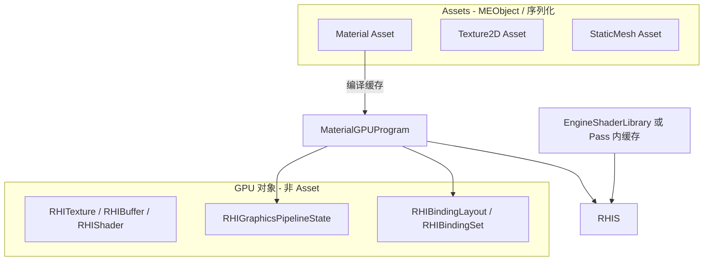

# RND-F03 — Legacy RHI removal (OpenGL-only modern path)

## Meta

| Field | Value |
|-------|--------|
| **Feature ID** | `RND-F03` |
| **Type** | Refactor |
| **Status** | In Progress（M4 管线重构 + M3 后端绞杀） |
| **Owner** | (maintainer) |
| **Last updated** | 2026-06-01（M1+M2 完成；grep + verify 通过） |
| **Branch** | `render`（实现）；registry/planning 可合 `master` |
| **Depends on** | `RND-F02` **Done**（现代契约 + GL `RHICreate*`/`RHICmd*` + Pass CommandList） |
| **Blocks** | `RND-F04`（现代 RHI 语义演进）；间接阻塞 `RND-F05`（Vulkan） |
| **Related** | [RND-F02](./RND-F02_MODERN_RHI_DESIGN.md) · [RND-F04](./RND-F04_MODERN_RHI_EVOLUTION_DESIGN.md) · [RND-F05](./RND-F05_VULKAN_MODERN_RHI_COMPLETION_DESIGN.md) · [FEATURE_REGISTRY](../FEATURE_REGISTRY.md) · [ACTIVE_WORK](../ACTIVE_WORK.md) |

---

## TL;DR

**问题：** F02 在 **现代契约** 下仍保留完整 Legacy 并行层：`RHITexture2D::Bind`、`VertexBuffer`、`RHIShaderLegacy::Use`/`UploadUniform*`、`OpenGLRHIModern::WrapLegacy*`、以及错误的 **Shader-as-Asset** 建模（`RHIShaderLegacy` 继承 `MEObject`）。

**方案：** 在 **仅 OpenGL** 后端上，把运行时与公共 API **一次性** 切到现代 RHI 终局形态；**删** Legacy 公共面、`WrapLegacy*`、`OpenGLRHIModern` 第二模块。**禁止**长期保留「BindingSet + BindUniformBlock」混合路径（见 **§8 道中复盘**）。

**不做什么：** Vulkan（F04）；RenderGraph（F01）；F02 设计里「GL 可简化」的 barrier/queue/descriptor 完整语义（F04）。

**与 F04 的分工：** F03 = **单后端、零 Legacy、调用面纯净**；F04 = **第二后端 + 现代 RHI 能力补全**（在 F03 契约上实现 VK，并反哺 transition/sync 等）。

---

## Reader quick start

1. 读 **§2 建模修正**（Shader vs Material）— 避免按旧模型迁。
2. 读 **§8 道中复盘** — 为何放弃 S3–S7 横向薄片、新策略与终局 DoD。
3. 读 **[RND-F03_MIGRATION_BLUEPRINT](./RND-F03_MIGRATION_BLUEPRINT.md)** — M1 依赖图、Legacy grep 清单、黄金场景。
4. 读 **§5 迁移面矩阵** + **§6 引擎 Binding 表** + **§10 删除列表** — 实现前对照终局契约。
5. Material 工作者读 **§7**；绑定表与 assembler 须与 **§6** 同批落地，不可再拆「半绑定」切片。

**代码入口（Legacy 仍活跃处）：**

- `Render/RHI/RHI.h` — Legacy API 块
- `Render/OpenGL/OpenGLRHIModern.*` — `WrapLegacy*`
- `Render/Shader.h`、`RHI/RHIShader.h` — `Shader` Asset + `RHIShaderLegacy`
- `Render/Material.*`、`Material/MaterialCompiler/`
- `RenderPipeline/RenderPasses/`、`SceneRenderTarget.*`
- `DrawCommands/MeshDrawCommand.h`、`StaticMesh*`、Loaders
- `Environment/EnvMapCapture.*`、`EngineIBLEnvironment.*`

---

## §1 背景与动机

### 1.1 F02 已交付什么

| 已交付 | 说明 |
|--------|------|
| 现代词汇 + 契约 | `RHITexture`、`RHIBuffer`、`RHIShader`、`RHIBinding*`、`RHIGraphicsPSODesc`、`RHIRenderPassInfo` |
| OpenGL 实现 | `OpenGLRHI::RHICreate*` / `RHICmd*`（瞬态 FBO、PSO fallback、draw/bind） |
| Pass 提交 | Present/Shadow/场景 Pass 经 `RHICommandList`；`RenderPasses/` 无 `glad` |
| 过渡桥 | `WrapLegacy*`、Legacy 资源创建、材质/引擎 shader 仍 `RHIShaderLegacy` |

### 1.2 F03 要交付什么

引擎在 **生产路径** 上只存在 **一套** GPU 抽象：

- 创建：`RHICreateTexture2D`、`RHICreateBuffer`、`RHICreateShader`、`RHICreateGraphicsPipelineState`、`RHICreateBindingLayout` / `Set` …
- 录制：`RHICommandList` → `RHICmd*`
- **无** `rhi->CreateVertexBuffer`、`RHITexture2D::Bind`、`shader->Use()` 于 draw hot path
- **无** `OpenGLRHIModern::WrapLegacy*` 于生产代码

### 1.3 为何单独成 Feature

- 横切 **Resource / Pass / Material / Editor / Environment**，不宜继续挂在 F02 的「S5+」脚注。
- 与 **F04 Vulkan** 分离：VK 应对接 **已无 Legacy** 的调用面，否则双端维护 Wrap + Legacy。
- **Material + 模板** 改动面大，需独立子切片与 `material-ir` 回归策略。

---

## §2 建模修正：Shader 不是 Asset，Material 才是 Asset

### 2.1 现状（问题）

| 现状 | 问题 |
|------|------|
| `ME_CLASS() RHIShaderLegacy : public MEObject` | GPU program 被当成 **引擎对象/可序列化实体**，与 UE `FRHIShader`（RHI 资源句柄）角色不符 |
| `ME_CLASS() Shader : public Asset`，持 `shared_ptr<RHIShaderLegacy>` | **Shader 被登记为可导入资产**；实际每份 Material 编译出 **独立** GLSL/program，不应与「网格纹理式」Asset 混为一谈 |
| `Material` 持 `shared_ptr<Shader> m_Shader` | 间接把「编译产物」当成 Asset 引用；Editor/Loader 路径复杂 |
| 引擎固定 shader（Present/Shadow/Sky）也走 `Shader::CreateFromFiles` → Asset 同款类型 | 引擎内置 shader 不是项目 Content，不必 Asset 化 |

### 2.2 目标模型（F03 normative）



| 概念 | F03 目标 |
|------|----------|
| **Material** | **唯一** 材质类 Asset；图、参数、shading model、blend 可序列化 |
| **编译产物** | 挂在 Material 上（或 `MaterialGPUProgram` / `MaterialRenderProxy` **非 Asset** 结构体）：`RHIShaderRef`、PSO、`RHIBindingLayout`、per-instance `RHIBindingSet` |
| **RHIShader** | 现代 RHI 类型；**不**继承 `MEObject`；由 `RHICreateShader` 创建 |
| **RHIShaderLegacy** | F03 结束时 **删除**（或仅测试夹具短期保留，不进入生产 include） |
| **Shader Asset** | **废弃**：`Shader.h` / `ShaderLoader` / `ShaderResource` 迁出或改为内部 `MaterialCompiler` 工具类型（不注册 AssetType） |
| **引擎固定 shader** | `EngineShaderLibrary` 或各 Pass `Initialize` 内：`RHICreateShader` + 缓存 `RHIGraphicsPipelineState`；源文件仍在 `EngineDefault/Shaders` |

### 2.3 反射与序列化影响

- 从 `RHIShaderLegacy` 移除 `ME_CLASS` → 删除 `RHIShader.gen.h` / 反射注册；`Material` 资产字段改为存 **编译元数据**（shading model、参数布局、可选 shader 源码 hash），**不**存 `shared_ptr<RHIShaderLegacy>`。
- `Shader` Asset 若已有 `.meta` / 项目资源：需 **迁移策略**（见 §9 S6e）：一般项目材质不应引用独立 Shader 资产；若有，合并进 Material 或标记废弃。

### 2.4 与 UE 的对照（学习用，non-normative）

| UE | minEngine F03 |
|----|----------------|
| `UMaterial` / `UMaterialInstance` | **`Material` Asset** |
| `FMaterialShaderMap` / `FShaderMap` | Material 上 **GPU program 缓存**（非 Asset） |
| `FRHIShader` | **`RHIShader`** |
| `UShader` 资产（.usf + 材质类型） | **不照搬**；我们用 Material IR + 模板，**不**单独 Shader Asset |

---

## §3 当前状态快照（F02 Done 之后）

### 3.1 仍为 Legacy 的公共 API（`RHI.h`）

`SetViewport`（Legacy 块内）、`SetClearColor`、`Clear`、`SetDrawBuffer`/`SetReadBuffer`、`Enable*`/`Disable*`、`CreateVertexBuffer`、`CreateIndexBuffer`、`CreateVertexDefinition`、`CreateFrameBuffer`、`CreateUniformBuffer`、`CreateRHITexture2D/Cube/Array`、`CreateRHIShader`（返回 `RHIShaderLegacy`）。

### 3.2 生产路径上的 Legacy 使用（摘要）

| 区域 | Legacy 用法 |
|------|-------------|
| **SceneRenderTarget** | `CreateFrameBuffer` + `CreateRHITexture2D` + `Attach*`；现代侧 `WrapLegacy2D` |
| **MeshDrawCommand** | ~~Legacy~~ → **Done (S2)**：`RHIBufferRef` + `RHIVertexInputLayoutRef`；`DrawMeshCommand` 无 Wrap |
| **BasePass / TranslucencyPass** | `RHIShaderLegacy::Use`、`BindForDraw`、`BindSceneDrawResources` 内 `texture->Bind` |
| **ShadowPass** | Directional/Spot 现代 Pass；Point 仍 `FrameBuffer` + `rhi->Clear()`；depth shader Legacy |
| **Present/Post/Sky** | 现代 draw + **仍** `UploadUniform*` / `Bind`（引擎 shader） |
| **Material** | 编译 → `Shader` Asset → `RHIShaderLegacy`；`BindForDraw` |
| **EnvMap / IBL** | `Shader::CreateFromFiles`、`GetID`、`DisableCullFace` 等 |
| **Editor** | 视口已 `GetRHINativeTextureHandle`；Material 预览仍可能经 Legacy |

### 3.3 `OpenGLRHIModern` 过渡机制

- `WrapLegacy2D/2DArray`、buffer/VAO Wrap — **F03 必须消除生产调用**
- `RHICreateTexture2D` 内部仍可能 `new OpenGLTexture2D` — 改为纯 `GLuint` 所有权在 `OpenGLRHITexture`

---

## §4 目标终态（F03 Done）

### 4.1 公共 API

- `RHI` **仅** 现代虚函数：`Initialize`/`Shutdown` + `RHICreate*` + `RHICmd*`（与 F02 §B.3 一致）。
- 无 `RHITexture2D` / `VertexBuffer` / `RHIShaderLegacy` 于 **引擎 include 树** 的 draw/resource 路径（实现细节可留在 `OpenGL/` 私有，直至删除文件）。

### 4.2 运行时行为

- 单帧场景：`RHICommandList` + `RHICmdBeginRenderPass`（场景 RT）→ Sky → Base → Translucency → Post → Present。
- 所有 draw：`RHICmdSetGraphicsPipelineState`、`SetBindingSet`、`SetVertexBuffer`、`Draw*`。
- 引擎/per-frame UBO：经 **BindingSet** 绑定，非 `BindUniformBlock` 散落调用（允许 OpenGL 后端内部映射到 `glBindBufferBase`）。

### 4.3 资产与编译

- **Material** 为材质唯一 Asset；GPU 程序为编译缓存。
- **无** `Shader` Asset 类型；`AssetManager` 不再注册 Shader loader（或仅兼容读取旧 meta 并迁移报错）。
- `RHIShader` **非** `MEObject`。

### 4.4 刻意保持简化（留给 F04）

- `RHICmdTransition` 可为 GL no-op，但 **接口存在**。
- 单队列、单 immediate CommandList 录制模型。
- PSO 缓存可仍为 per-pass 粗粒度 `RHIGraphicsPSOStateFallback`。

---

## §5 迁移面覆盖矩阵

| # | 层面 | 包含内容 | 主要文件/模块 |
|---|------|----------|----------------|
| M1 | **RHI 公共 API** | 删除 Legacy 虚函数块 | `RHI.h`、`OpenGLRHI.*` |
| M2 | **纹理/RT** | Scene RT、阴影 depth、IBL 立方体贴 **RHICreate** 持有 | `SceneRenderTarget.*`、`ShadowResourceManager`、`Texture`/`TextureCube` |
| M3 | **几何** | VB/IB/InputLayout 现代 ref；加载器 | `StaticMesh*`、`StaticMeshLoader`、`MeshDrawCommand` |
| M4 | **FrameBuffer 替代** | Legacy `FrameBuffer` 不再给 Pass；用 `RHIRenderPassInfo` + 瞬态 FBO（已有）或持久 FBO 句柄 | `SceneRenderTarget`、`ShadowPass` Point |
| M5 | **引擎 Binding** | PerFrame/Lights/Shadow/IBL 固定 layout；Present/Post/Shadow/Sky 去 `UploadUniform*` | `RenderPipeline`、`RenderPassBase`、各 Pass、`EngineIBLEnvironment` |
| M6 | **Pass 绘制** | Base/Translucency PSO（blend/depth）；全 Pass 无 Legacy shader | `*Pass.cpp` |
| M7 | **环境捕获** | EnvMap 离线 pass 现代 CommandList | `EnvMapCapture.*` |
| M8 | **Material 管线** | 模板/slot、编译产物、BindForDraw→BindingSet、废弃 Shader Asset | `Material*`、`MaterialCompiler/**`、`Shader.h` |
| M9 | **Editor** | 材质预览、缩略图、编译预览 GPU 路径 | `MaterialEditor*`、`AssetThumbnailService` |
| M10 | **实现清理** | 删 `WrapLegacy*`、Legacy 类文件或移 `Legacy/` 后删除 | `OpenGLRHIModern.*`、`RHIBuffers.h` Legacy 区等 |
| M11 | **测试** | `verify.ps1`、`material-ir`、必要时 RND 冒烟 | `Tests/` |

**Out of M8（除非绑定强制）：** Material 图编辑器 UX、新节点类型、Undo。

---

## §6 引擎 Binding 约定（S3 冻结，Material 前必读）

### 6.1 设计原则

- **Set 索引 = 更新频率**，不是「一个子系统一个 Set」。
- **(set, binding)** 二维表写死在 `EngineShaderBindings.h`；GL 上映射到 UBO binding point / texture unit。
- **主场景固定 3 个 Set**：Set0 帧+物体+灯，Set1 阴影(+IBL)，Set2 材质。
- 禁止在 GLSL 模板与 C++ 中 **分别手写** slot 数字（S6 由 assembler 从表生成）。

### 6.2 主场景 Set 分配（S3 冻结，Material 前不可变）

#### Set 0 — Scene / Object（每帧 + 每 draw 可能更新 binding 2）

| Binding | 资源 | 更新频率 |
|---------|------|----------|
| 0 | UBO `PerFrameData`（View, Proj, ViewProj, CameraPos） | 每帧 |
| 1 | UBO `LightsData` | 每帧 |
| 2 | UBO `PerObject` / `u_Model`（`mat4` 或小型 PerDraw UBO） | **每 draw** |

**Per-draw Model：** F03 采用「Set0 binding2 每 draw 更新 UBO 内容 + 必要时 `SetBindingSet(0, …)`」；不为此再开 Set。F04 可改为 dynamic offset ring buffer。

#### Set 1 — Shadow + IBL（阴影 pass 结束后绑一次，BasePass 用）

| Binding | 资源 |
|---------|------|
| 0 | Directional shadow depth SRV（2D array） |
| 1 | UBO `DirLightViewProjs` |
| 2 | UBO `CascadeFarPlanes` |
| 3+ | Spot shadow textures + `SpotLightViewProjs` UBO |
| … | Point shadow cube maps |
| N.. | IBL（env / irradiance / BRDF LUT，仅 PBR） |

无阴影/无 PBR 时仍用 **同一 layout**；后端绑 dummy 1×1 或 shader variant（实现时二选一，文档化）。

#### Set 2 — Material（每材质实例 / 每 draw）

| Binding | 资源 |
|---------|------|
| 0..k | 材质纹理 SRV（与 `MaterialShaderParameterLayout` 一致） |
| k+1 | 可选 Material 参数 UBO |

#### 引擎 Pass（Present / Post / Shadow depth / Sky）

**不占 Set 0–2**；各自 `RHICreateBindingLayout` 小 layout（例如 Post 仅 scene color SRV）。Present 可映射为 **EnginePost Set0**（与主场景 Set 编号空间独立，仅在 Pass 内 `SetBindingSet(0, …)`）。

### 6.3 OpenGL 后端组织（F03 终态）

| 阶段 | 结构 |
|------|------|
| F02–S5（现状） | `OpenGLRHI`（Legacy + 现代虚表）+ `OpenGLRHIModern`（现代类型 + `WrapLegacy*`） |
| **F03-M1** | 删除 `OpenGLRHIModern.*`；类型并入 `OpenGLRHI` 实现文件或 `OpenGLRHITexture.cpp` 等；**对外仅 `OpenGLRHI`**，无 Modern 后缀模块 |

`OpenGLRHIModern` 是 **迁移期文件划分**，不是第二套 RHI。

### 6.4 PSO 与固定函数

- F03 内：`EnableBlend`/`EnableDepthTest` 从 Pass **迁入** `RHIGraphicsPSODesc`（Base/Translucency 最后一片统一）。
- **Face culling：** 保持全局关闭直至 winding 验证（与 F02 S5 一致）；`RHICullMode` 字段保留不用。

---

## §7 Material 与着色器模板（目标架构，S6 执行）

### 7.1 编译流水线（保持 IR，改外壳）

```
MaterialEdGraph → MIR → GLSL 片段
  → ShellAssembler（Unlit/BlinnPhong/PBR .template）
  → 完整 VS/FS 源码
  → RHICreateShader（非 Shader Asset）
  → RHICreateGraphicsPipelineState + RHICreateBindingLayout
  → 缓存于 Material（MaterialGPUProgram）
```

### 7.2 模板改动要点

| 项 | 现状 | F03 目标 |
|----|------|----------|
| Uniform 块 | `layout(std140) uniform PerFrameData` 等硬编码 | 与 §6 **binding 表** 一致；可由 assembler **注入** binding 行 |
| 材质纹理 | `uniform sampler2D u_Texture0` + `BindForDraw(unit)` | `layout(binding=…)` + **Material Set** 的 `RHIBindingSet` |
| 标识符 | `GLSLShaderBinding.h` 仅符号名 | 扩展为 **符号 + slot 元数据** 供 C++ 与模板共用 |
| 顶点 | `a_Position`/`a_TexCoord` 等与 `RHIVertexInputLayout` 一致 | 编译时校验 layout 与 mesh 一致 |

### 7.3 `Material::BindForDraw` 替换

- **删除** `void BindForDraw(RHIShaderLegacy&) const`。
- **新增** `const RHIBindingSet* GetBindingSetForDraw()` 或 `void BindMaterialSet(RHICommandList&, uint32_t setIndex)`：按 **实例参数**（纹理/scalar）构建或更新 `RHIBindingSet`。
- BasePass/TranslucencyPass：`SetBindingSet(EngineSets…)` → `SetGraphicsPipelineState(materialPso)` → `SetBindingSet(MaterialSet)` → `Draw*`.

### 7.4 `Shader` Asset 废弃步骤（S6e）

1. 停止 `AssetTypeRegistry` 注册 Shader（若已注册）。
2. `Material` 序列化 **不再** 引用外部 Shader 资产路径。
3. `ShaderLoader`：删除或改为 **仅** `MaterialCompiler` 内部 `CompileGLSLFromSource(RHI&, …)`。
4. 项目内孤立 Shader 资产：文档说明废弃；可选一次性迁移脚本（低优先级）。

### 7.5 Editor / 测试

- `MaterialEditor` GPU 预览：编译后直接 `RHICreateShader`，不构造 `Shader` Asset。
- `material-ir`：**继续** 断言生成 GLSL 文本；S6b 后增加 **binding 元数据** 快照（可选新断言文件）。
- `Shader::TryCompileSourcesOnGpu`：保留为 **工具函数**（需 GL context），返回 `RHIShaderRef` 或 bool + log。

---

## §8 道中复盘与策略修订

> **状态：** 原 **S3 引擎 BindingSet 切片已尝试并回滚**（`render` @ `f17cee1` 为当前基线：S1–S2 保留）。下文记录挫折、决定与替代方案。

### 8.1 我们遇到了什么

**原策略（S1→S7 横向薄片）** 按资源类型分层：RT → Mesh → Binding → Pass PSO → Env → Material → 删 Legacy。每层单独验收、单独 commit。

**S3 实践中的问题：**

| 现象 | 根因（归纳） |
|------|----------------|
| 方向光/点光强度异常（intensity=1 目视约 0.2） | `LightsData` UBO 与 `RHIBindingSet` / `BindUniformBlock` **双轨并存**；Set0 绑了 buffer，但 GLSL 330 材质无法 `layout(binding=…)`，仍依赖 per-draw block 链接，易与 `glBindBufferBase` 顺序/状态冲突 |
| 点光像方向光、照亮全场 | 同上 — 光照 UBO 未在 shader 侧稳定生效时的典型症状 |
| 方向光/点光阴影消失，spot 仍有 | **部分** 资源类型（2D array、cube）走新 SRV wrap/bind 路径，2D spot 仍接近旧路径；混合态下只修好一条光型 |
| 每个切片都要长 debug，修的是脚手架 | S3 验收通过 `verify.ps1`，但 **无黄金场景光照/阴影目视**；自动化测不到「强度 1 看起来像 0.2」 |
| 中间产物价值低 | `EngineSceneBindingSets` + `WrapLegacyUniformBuffer` + 保留 `UploadUniformInt` — **终局仍要删**；推到 S7 合并 `OpenGLRHIModern` 时，前面 Wrap 层全部作废 |

**结论：** 横向薄片在「绑定 / Shader / Material」交界处必然产生 **长期混合运行时**。混合态不是可维护的里程碑，却是 debug 成本最高的阶段。

### 8.2 决定

1. **保留已完成且相对独立的 S1–S2**（场景 RT、网格 `RHIBuffer`/`RHIVertexInputLayout`）。二者仍可能内部使用 `WrapLegacy*`，但 **不扩大** Wrap 面。
2. **放弃原 S3–S7 顺序**，**回滚失败的 S3**（代码回到 `f17cee1`）。
3. **余下 F03 改为「终局迁移」**：在 **一条连贯逻辑链** 内，从当前基线一次性推到 §12 验收标准，而不是再切「半现代」薄片。
4. **硬门禁：** 迁移合并后，生产路径 **不得** 同时存在 `RHIBindingSet` 与 `BindUniformBlock`/`UploadUniformInt` 绑场景资源；**不得** 存在 `OpenGLRHIModern::WrapLegacy*`；**不得** 保留 `OpenGLRHIModern` 为第二模块。

> 若逻辑链设计正确、依赖顺序在实现前写清，「一步登天」的难度主要来自 **纪律**（禁止妥协），而非技术不可行。

### 8.3 终局产物应长什么样

实现完成时，渲染栈应满足：

| 维度 | 终局形态 |
|------|----------|
| **公共 RHI API** | `RHI.h` **仅** `RHICreate*` / `RHICmd*`；§10 Legacy 列表 **零** 生产引用 |
| **OpenGL 后端** | **单一** `OpenGLRHI`（+ 按类型拆 `.cpp` 可选）；**无** `OpenGLRHIModern.*`；**无** `WrapLegacy*` |
| **GPU 资源** | 纹理/缓冲/布局 **创建时即** `RHICreateTexture` / `RHICreateBuffer` / `RHICreateVertexInputLayout`；Loader、Shadow、IBL、Screen quad **不** 经 Legacy 类型中转 |
| **绑定** | `EngineShaderBindings.h` 为 **唯一** slot 真源；引擎 Pass + 材质 GLSL **`layout(binding=…)`**（统一 **GLSL 420+**）；draw 路径 **仅** `SetBindingSet` |
| **Shader / Material** | **无** `Shader` Asset；`MaterialGPUProgram`（名可调整）持 `RHIShader`+PSO+layout+per-instance set；`RHIShaderLegacy` 退出生产 |
| **Pass** | Shadow / Base / Translucency / Post / Present / Sky / Env **仅** `RHICommandList`；PSO 管 depth/blend；无 Pass 内 `glad` |
| **验证** | `verify.ps1` + `material-ir` + **黄金场景目视**（见 8.4） |

### 8.4 一步迁移必须注意的要点

实现前 **必须先写清依赖图**（可附在本节或 Implementation Plan），至少覆盖：

1. **绑定链三件套同批落地** — `EngineShaderBindings.h`、C++ `RHIBindingLayout`/`RHIBindingSet`、`GLSLMaterialShellAssembler` emit `layout(binding=…)`。**禁止** 先迁 C++ BindingSet 而材质仍 330 + `BindUniformBlock`。
2. **资源创建点清单** — 列出仍调用 `CreateUniformBuffer` / `CreateRHITexture2D` / `WrapLegacy*` 的文件；迁移时 **改创建点**，而非在 draw 时 Wrap。
3. **`OpenGLRHIModern` 合并顺序** — 类型并入 `OpenGLRHI` **之后** 生产路径已无 Wrap 调用；避免「合并文件」与「删 Wrap」两个 PR 互相纠缠。
4. **Shadow 全光型一致** — Directional（2D array）、Spot（2D）、Point（cube + legacy FBO）须在 **同一绑定模型** 下重做；S1–S2 已暴露的 depth mask / clear 陷阱写入黄金场景回归项。
5. **Material 与引擎 Pass 耦合** — BasePass 的 Set0/1/2 与 `Material::BindForDraw` 合并为 BindingSet；删除 `BindForDraw` 中的 texture unit 硬编码。
6. **黄金场景（目视门禁）** — 固定场景：BlinnPhong 网格 + **方向光 intensity=1** + **点光** + **spot** + 阴影开；对比迁移前截图或 maintainer sign-off。`verify.ps1` **不能** 作为唯一光照验收。
7. **`material-ir` golden** — GLSL 版本升至 420、binding 行变更时 **同 PR** 更新 golden / 快照。
8. **grep 门禁（合并前）** — `WrapLegacy`、`RHIShaderLegacy`、`BindUniformBlock`、`CreateVertexBuffer`、`OpenGLRHIModern` 在生产 `src/` 为 0（Tests 夹具例外须注明）。
9. **ImGui / Editor 桥** — `GetNativeHandle` 保留；确认 RT 所有权变更后 Editor 视口仍正确。
10. **范围纪律** — barrier/多队列/Vulkan 仍属 F04；F03 不借迁移之名扩 RHI 语义。

### 8.5 新实现切片（替代原 S3–S7）

> **原则：** 仅保留 **可独立验收且不产生混合运行时** 的里程碑；其余合并为 **一次终局迁移**。

| 切片 | 状态 | 内容 | 验收 |
|------|------|------|------|
| **F03-S1** | **Done** | 场景 RT 现代所有权；Present/Post 持 `RHITextureRef` | `f17cee1`；主视口 |
| **F03-S2** | **Done** | 网格 `RHIBuffer` / `RHIVertexInputLayout`；Loader 现代创建 | `f17cee1`；网格显示 |
| **F03-P0** | **Done** | **迁移蓝图**：[RND-F03_MIGRATION_BLUEPRINT](./RND-F03_MIGRATION_BLUEPRINT.md)；`EngineShaderBindings.h` 定稿 | Review 通过 |
| **F03-M1** | **Done** | **终局迁移（单逻辑链）**：按蓝图 §1–§4；§10 删除列表 + §6 绑定 + §7 Material + 合并 `OpenGLRHIModern` → `OpenGLRHI` | §12 全部勾选；grep 门禁；黄金场景目视 |
| **F03-M2** | **Done** | **文档 sign-off**：M1 调用面验收、PROGRESS_LOG、§12 勾选（调用面） | @ 2026-06-01 |
| **F03-M3** | **In Progress** | **后端内绞杀（§15.1–15.3）**：删 `OpenGLShader` / `OpenGLTexture*` 维度类包装 | §15.1 grep；可与 M4 并行 |
| **F03-M4** | **Next** | **管线现代 RHI 重构（§16）**：旧 Pass 编排 → 统一 Pass 节拍 + 权威 PSO；**停用 EnvMap** | §16.6 验收；黄金场景（无 IBL） |

**废止：** 原 **S3–S7** 及 **§9 S6a–S6e** 子切片表 — 仅作历史参考，**不得** 再作 backlog 来源。

**依赖：** S1–S2 → P0 → M1 → M2 → **M4（主）** + M3（配套）。**M4 优先于继续横向 Pass 修补**；不划入 F04。

---

## §10 删除列表（F03-M1 执行）

### 10.1 公共 API（`RHI.h`）

- 全部 Legacy `virtual`：`Enable*`、`Disable*`、`SetDrawBuffer`/`SetReadBuffer`、`SetClearColor`、`Clear`（若已由 `RHICmdBeginRenderPass` 覆盖）
- `CreateVertexBuffer`、`CreateIndexBuffer`、`CreateVertexDefinition`、`CreateFrameBuffer`、`CreateUniformBuffer`
- `CreateRHITexture2D`、`CreateRHITexture2DFloat`、`CreateRHITextureCube`、`CreateRHITexture2DArray`
- `CreateRHIShader`（返回 `RHIShaderLegacy`）

### 10.2 类型与文件（计划删除或私有化）

| 删除/废弃 | 说明 |
|-----------|------|
| `RHIShaderLegacy` + `ME_CLASS` + `RHIShader.gen.h` | 由 `RHIShader` 取代 |
| `class Shader : public Asset` | 由 Material 编译缓存取代 |
| `RHITexture2D` / `Cube` / `2DArray` 公共 `Bind`/`GetID` 作为引擎 API | 仅允许 `GetNativeHandle` on `RHITexture` |
| `VertexBuffer`、`IndexBuffer`、`VertexDefinition` 公共类 | 由 `RHIBuffer`、`RHIVertexInputLayout` 取代 |
| `FrameBuffer` 作为 Pass 输入 | 由 `RHIRenderPassInfo` 取代 |
| `OpenGLRHIModern::WrapLegacy*` | 无生产引用 |
| Pass 内 `#include glad` | F02 已清 RenderPasses；EnvMap 等 S5 清 |

### 10.3 保留（非 Legacy）

- `RHITexture::GetNativeHandle` / `GetRHINativeTextureHandle`（ImGui）
- `RHIGraphicsPSOStateFallback`
- `Shader::EngineShaderPath` → 可迁为 `EngineShaderPaths::` 自由函数

---

## §11 风险与缓解

| 风险 | 影响 | 缓解 |
|------|------|------|
| Material 模板与 §6 slot 不一致 | 运行时花屏/黑屏 | P0 定稿 `EngineShaderBindings.h`；assembler 与 C++ layout **同 PR** |
| 去 Shader Asset 破坏旧项目 | 加载失败 | M1 含迁移说明；Loader 友好错误 |
| `RHIShaderLegacy` 反射移除 | 旧序列化字段 | Material 资产版本 bump；缺字段则触发重编译 |
| Point shadow / EnvMap 遗漏 | M1 删 API 后编译失败 | 8.4 资源创建点清单；grep 门禁 |
| BasePass 仍 `EnableBlend` 散落 | 与 PSO 不一致 | M1 内 PSO 统一；禁止半迁 Pass |
| **混合绑定路径**（S3 教训） | 光强/阴影静默错误 | **硬门禁** §8.2；禁止 `BindingSet` + `BindUniformBlock` 并存 |
| F03 范围膨胀到 Vulkan | 延期 | Vulkan 见 F04；**OpenGL 后端内绞杀** 留在 F03-M3（§15） |

---

## §12 F03 验收标准

### §12.1 调用面（M1–M2 Done @ 2026-06-01）

- [x] §10 删除列表已执行；`rg RHIShaderLegacy`、`rg WrapLegacy`、`rg CreateVertexBuffer` 在生产路径为 0（允许 Tests 夹具临时例外，须注明）
- [x] `RenderPasses/`、`SceneRenderTarget`、主 `RenderPipeline` 路径无 Legacy bind/draw
- [x] **Material** 为唯一材质 Asset；无 `Shader` Asset 注册
- [x] `RHIShader` 非 `MEObject`；无 `RHIShader.gen.h` 于生产构建
- [x] `.\scripts\verify.ps1` 通过
- [x] `minEngineTests.exe test material-ir` 通过
- [x] Editor：主视口、阴影、透明、后处理、材质编辑器预览目视通过（维护者记录 @ 2026-06-01）

### §12.2 后端实现面（M3）

- [ ] 无 `OpenGLShader` 类型；`OpenGLRHIShader` 直接持有 program
- [ ] 无 `OpenGLTexture2D` / `Cube` / `2DArray`；`OpenGLRHITexture` 直接 upload/持有 `GLuint`
- [ ] grep：`OpenGLShader`、`OpenGLTexture2D`、`OpenGLTextureCube`、`OpenGLTexture2DArray` 在生产路径为 0

### §12.3 管线心智模型（M4 — F03 真正 Done 前须完成 §16）

- [ ] **权威 PSO**：固定功能状态 + shader + **vertex layout** 仅经 `SetGraphicsPipelineState` 生效；无旁路 `RHICmd*` 改同类状态（如已删 `SetVertexInputLayout`）
- [ ] **Pass 节拍统一**：所有 draw 类 `RHICmd*` 仅在 `BeginRenderPass`/`EndRenderPass` 之间（含合法嵌套）；`RHICreate*` 资源创建可在 Pass 外
- [ ] **单一 draw 契约**：`SetPSO` → `SetBindingSet(s)` → `SetVertexBuffer`/`SetIndexBuffer` → `Draw*`；Pass 类不各自发明流程
- [ ] **EnvMap / IBL 离线捕获停用**（运行时与加载路径）；PBR 可先无 IBL 或占位
- [ ] `verify.ps1` + 黄金场景回归（阴影 + 主视口；**不要求** EnvMap）
- [ ] [FEATURE_REGISTRY](../FEATURE_REGISTRY.md) F03 → **Done**；ACTIVE_WORK 指向 F04

---

## §13 明确推迟到 F04（modern RHI completion + Vulkan）

- `VulkanRHI` 与 GL 行为对齐里程碑
- `RHICmdTransition` 真语义（GL 可实现简化版）
- 多队列 / Fence / Semaphore 暴露（若需要）
- Descriptor 池化、PSO 缓存策略对齐 UE
- 格式 capability 查询、`RHITexture` 多平面等高级特性
- **Face culling** 与正面绕序全局策略（可在 F04 用 VK 验证）
---

## §15 F03-M3：后端内绞杀（Post-M2 续作，仍属 F03）

> **读者定位：** F03 §12 验收的是「引擎调用面零 Legacy」；本节记录 **OpenGL 后端内部** 与 **契约完备性** 上仍未达「现代 RHI 终局形态」的项。  
> **维护者立场（2026-06-01）：** 不接受长期保留「`OpenGLRHI*` 包装旧类型」——应 **一口气越过包装层**，让后端实现类 **就是** 资源本体，而非 Legacy 类型的 `shared_ptr` 外壳。

### 15.1 原则：禁止「新类型套旧类型」

| 反模式（F03 末仍可见） | 期望终局 |
|------------------------|----------|
| `OpenGLRHIShader` 持有 `shared_ptr<OpenGLShader>` | `OpenGLRHIShader`（或内嵌匿名实现）**直接** compile/link/`glDeleteProgram`；删除独立 `OpenGLShader` 公共类 |
| `OpenGLRHITexture` 持有 `OpenGLTexture2D` / `Cube` / `2DArray` | **单一** `OpenGLRHITexture`：根据 `RHITextureCreateDesc::Dimension` 分支 `glTexImage*` / upload；无按维度拆的平行 C++ 类型 |
| 引擎 Pass `std::make_shared<OpenGLRHIShaderResourceView>` | `RHI::RHICreateShaderResourceView(desc)`；引擎只持 `RHIShaderResourceViewRef` |
| `RHIBindingLayoutEntry::ShaderBinding` = GL texture unit / UBO binding point | 逻辑 `(set, binding)`；GL/VK 映射留在后端 |
| `RHICmdSetBindingSet(setIndex, …)` 忽略 `setIndex` | 真多 Set 绑定；与 pipeline layout / descriptor set 对齐（VK 必需） |

**与 F03 已删 `WrapLegacy*` 的区别：** 公共 API 层已无 Wrap；但 **后端实现层** 仍用「旧维度分类类 + 新 RHI 壳」达成同样效果——属于 **F03-M3 未完成项**，在 F03 内清掉后再标 Feature Done。

### 15.2 纹理：`OpenGLTexture2D` / `Cube` / `2DArray`（`OpenGLTexture.h`）

**现状：**

- `OpenGLRHITexture` 构造时 `switch (desc.Dimension)`，分别 `make_shared<OpenGLTexture2D|Cube|2DArray>`，再 `GetID()` 抄到 `m_TextureId`。
- `OpenGLTextureUploadDesc` + `TextureUsage` 与 `RHITextureCreateDesc` **双描述**；`ToLegacyTextureDesc()` 命名即承认过渡。

**为何不符合现代 RHI：**

- 现代契约里 **只有** `RHITexture` + `RHITextureCreateDesc`（含 `Dimension`、`Format`、`Flags`）；维度是 desc 字段，不是类型系统里的三个平行类。
- 与已删的 `RHITexture2D`/`Cube`/`2DArray` **公共** Legacy 类同构——只是改成了 `OpenGL*` 前缀并标为 internal，心智负担仍在。

**目标形态（F03-M3）：**

1. 删除 `OpenGLTexture.h` 中三个维度类；upload / mipmap / wrap 逻辑迁入 `OpenGLRHITexture.cpp`（可按 dimension 分 **成员函数**，非类型）。
2. `OpenGLRHITexture` 唯一持有 `GLuint m_TextureId`、`GLenum m_Target`、可选 staging。
3. grep 门禁扩展：`OpenGLTexture2D`、`OpenGLTextureCube`、`OpenGLTexture2DArray` 在生产路径为 0。

### 15.3 Shader：`OpenGLRHIShader` 包装 `OpenGLShader`

**现状：**

- `RHICreateShader` → `make_shared<OpenGLShader>` → `make_shared<OpenGLRHIShader>(shader)`。
- `OpenGLShader` 仍保留 `Use()`、`m_UniformLocationCache`（upload 已删，成为死代码）。
- `EngineShaderUtils::GetOpenGLShader` / `TryCompileSourcesOnGpu` 直接依赖 `OpenGLShader`。

**为何不符合现代 RHI：**

- `RHIShader` 抽象应映射到 **GPU program 句柄**；中间多一层旧编译器类 = 当年 `RHIShaderLegacy` 的 **后端版同构**。
- PSO 的 `ApplyGraphicsPipelineState` 经 `OpenGLRHIShader::GetProgramId()` 再摸到 `OpenGLShader::m_ID`——多一跳且无增益。

**目标形态：**

1. 将 `OpenGLShader.cpp` 的 compile/link/log 逻辑 **内联进** `OpenGLRHIShader`（或 `OpenGLRHIResources` 内单一实现类）。
2. 删除 `OpenGLShader.h/.cpp`；`OpenGLHeaders.h` 不再暴露。
3. `EngineShaderUtils::TryCompileSourcesOnGpu` 改为对 `RHI::RHICreateShader` 或 package-private 编译入口，不暴露 GL 类型。

### 15.4 其它过渡态（按优先级）

| 优先级 | 项 | 说明 |
|--------|-----|------|
| P0 | 引擎层 `OpenGLRHIShaderResourceView` 直 new | 缺 `RHICreateShaderResourceView`；`RHIShaderResourceView` 近乎空壳 |
| P0 | `setIndex` 未参与绑定 | 多 Set 靠多次 `SetBindingSet` 覆盖 GL 状态，非 descriptor set 语义 |
| P1 | `RHIGraphicsPSOStateFallback` | PSO 为 desc 袋子；GL 只应用 program + 粗粒度 depth/blend；`PixelShader` 槽未用；cull 硬关 |
| P1 | `RHI.h` 即时 `Enable*` / `SetClearColor` | Pass 已少用；`RenderSystem` 仍 `static_cast<OpenGLRHI*>` + `WindowSystem::Clear` |
| P1 | `Material::BindForDraw` 每 draw `CreateBindingSet` | 应 compile 时缓存 set，draw 只 update UBO / 换 SRV |
| P1 | `ShadowTypes::TextureUnit` | 与 `RHITextureRef` 并存的 GL unit 思维 |
| P2 | `FromLegacyVAO` | 无调用方 |
| P2 | `ShaderResource` 反射 + ContentBrowser `"Shader"` | 资产生态残留 |
| P2 | `EngineShaderPath("../Shaders")` | 未走路径注册 |

### 15.5 与 F03 Done 的关系

- **M1–M2 Done** = §12.1 调用契约纯净。
- **F03 Feature Done** = §12.1 + §12.2（M3）+ **§12.3（M4）**。
- **M3** 与 **M4** 可并行 commit，但 **M4 决定管线是否「现代」**；仅 M3 不足以标 Done。
- **F04** 仅 Vulkan 与跨后端契约补全。

---

## §16 复盘再复盘：管线重构（F03-M4）— 现代 RHI 心智，非 GL 状态机套壳

> **维护者立场（管线暂停后共识）：** F03-M1/M2 清掉了 **公共 Legacy API**，但未清掉 **旧管线编排与 OpenGL 式散弹状态思维**。继续用「看似现代的 RHICmd*」承载旧 Pass 习惯，会得到 **四不像**。  
> **目标：** **完全重构** 渲染管线编排，使其贴合现代 RHI 模式（参考 UE `FRHICommandList` / `FGraphicsPipelineStateInitializer` / RenderPass 边界），而不是用新接口名套旧流程。

### 16.1 病根摘要（为何「越迁越乱」）

| 现象 | 根因 |
|------|------|
| PSO 存在但 Pass 仍可旁路改 layout / 状态 | PSO **非权威**；`RHIGraphicsPSOStateFallback` 只是 desc 袋子 |
| Material PSO 无 layout，Mesh 靠 draw command 带 layout | **同一引擎两种 draw 哲学** |
| Shadow / Scene / Post / Present 各写各的 | **无统一 Pass 模板**（Begin → Setup → Draw* → End） |
| `SetBindingSet` 多次覆盖、`setIndex` 无效 | Binding 仍是 GL 立即绑定，非 pipeline layout |
| `Material::BindForDraw` 每 draw `CreateBindingSet` | 旧「每 draw 绑纹理」思维换皮 |
| EnvMapCapture 自成体系 | **集中呈现** §15 全部反模式（旁路、嵌套 FBO、引擎层 `OpenGL*`、与主 Pass 不一致） |

**结论：** 问题不只是类型包装（§15），而是 **从未冻结「唯一 draw 状态机」** 就横向迁 Pass。

### 16.2 我们要做的 vs 不要做的

| 要做 | 不要做 |
|------|--------|
| 用 **现代 RHI 编排** 重写主帧管线（Shadow → Scene → Post → Present） | 继续逐个 Pass 打补丁、加旁路 `RHICmd*` |
| **权威 PSO**（含 vertex layout）；draw 只补动态 VB/IB | 保留「有时信 PSO、有时信 Pass 成员、有时信旁路 API」 |
| 参考 **UE** 分层：`RHICreate*` 建资源；`RHICmd*` 在 Pass 内录制 draw | 把 `glEnable`/`glBind*` 思维映射成更多零散命令 |
| 接受当前 **CommandList 立即执行**（单线程） | 为了「像 GL」而破坏 Command 顺序语义 |

### 16.3 CommandList 的正确理解（维护者确认）

**你的理解是对的**，文档冻结如下：

1. **`RHICommandList`（现实现：立即转发）**  
   - **现阶段**：单线程，Command **顺序执行** 即可；实现可以是 `m_RHI->RHICmd*()` 直调。  
   - **概念模型**（面向未来多线程 / Vulkan）：CommandList = **线程安全的 Command 队列 + CommandBuffer**；录制与提交可分离，**语义** 仍按录制顺序生效。  
   - **命名保留 `CommandList`** 合理：实现从 immediate → 录制+submit 演进时，**Pass 代码不应大改**。

2. **`RHICreate*`（资源工厂）**  
   - **允许在 Pass 外**调用（初始化、加载、编译、缓存 PSO/BindingLayout/Buffer）。  
   - 与 draw 命令分离 — 对齐 UE 的 `RHICreate*` / `CreateGraphicsPipelineState` 在 init 或 render thread 资源准备阶段。

3. **`RHICmd*`（draw 与 pass 作用域命令）**  
   - **必须在 `BeginRenderPass` / `EndRenderPass` 之间**（含 **合法嵌套** 的子 pass，如 CSM 每层 shadow map）。  
   - 包括：`SetGraphicsPipelineState`、`SetBindingSet`、`SetViewport`、`SetVertexBuffer`、`SetIndexBuffer`、`Draw*`。  
   - **禁止** 在 Pass 外出现会改变「当前 pass 内 GPU 配置」的 `RHICmd*`（窗口 clear 等应收敛为显式 pass 或 backend 初始化，而非散落 `RHI::Enable*`）。

4. **约束的是「作用域」与「权威性」，不是「是否立即执行」**。

```text
[Pass 外]  RHICreateTexture / RHICreateBuffer / RHICreatePSO / RHICreateBindingLayout …

[Pass 内]  BeginRenderPass
             SetViewport (optional)
             SetGraphicsPipelineState   ← 权威固定状态 + layout + shader
             SetBindingSet (per layout)
             SetVertexBuffer / SetIndexBuffer
             Draw / DrawIndexed
           EndRenderPass
```

### 16.4 参考 UE 的阅读锚点（教案，非照抄）

| UE 概念 | minEngine 目标对应 |
|---------|-------------------|
| `FRHICommandList` + `FRHICommandListImmediate` | `RHICommandList`（现 immediate；语义按 §16.3） |
| `FGraphicsPipelineStateInitializer` → `RHICreateGraphicsPipelineState` | **完整** PSO desc（shader、layout、blend、depth、RT formats） |
| Render pass / subpass 边界 | `RHIRenderPassInfo` + `Begin/EndRenderPass` |
| `SetGraphicsPipelineState` 后 draw | 禁止旁路改同类状态 |
| Mesh draw：`SetStreamSource` + PSO 已含 layout | `SetVertexBuffer` + PSO 含 `VertexInputLayout` |
| Uniform/SRV 经 descriptor / RHI resources | `BindingSet` + 帧/材质缓存，非 per-draw 重建 |

实现细节可简化为 GL backend；**编排契约** 先与 UE/Vulkan 对齐，避免「GL 状态机 API 换名」。

### 16.5 EnvMap / IBL：本阶段 **停用**

**决策：** M4 期间 **停用一切 EnvMap 相关运行时路径**（`EnvMapCapture`、`EngineIBLEnvironment` 加载与绑定、SkyBox 对 cubemap 的依赖链若仅服务 IBL 可一并简化），**不** 在本轮修补 EnvMap。

**理由：**

- EnvMap 代码 **同时承载** 旁路 binding、嵌套 pass、引擎层 `OpenGLRHIShaderResourceView`、与主 `RenderPipeline` 不一致的 cmd 流程 — 最适合作为 **反例**，不适合作为并行迁移目标。
- 先让 **Shadow + Scene（Base/Translucent）+ Post + Present** 跑在 **统一 Pass 契约** 上；PBR 可暂时无 IBL 或常量占位。
- EnvMap **整体重构** 排在 M4 主路径验收之后（仍属 F03 或单独 Slice，**不** 阻塞 M4 管线骨架）。

**验收调整：** 黄金场景 M4 不要求 IBL/EnvMap 目视；§8.4 中 IBL 项 M4 阶段标 **N/A**。

### 16.6 M4 建议执行顺序

1. **冻结 §16.3 契约** + 单一 `MeshDraw`/`FullscreenDraw` 辅助（或 ADR 一页）。  
2. **停用 EnvMap**（feature flag 或编译/加载路径短路 + 文档）。  
3. **重整 `RenderPipeline::Execute` 节拍** — 一个主 cmdList、清晰 pass 树。  
4. **ShadowPass** 对齐嵌套 pass 模板（已有多层 Begin/End，收敛为统一 helper）。  
5. **BasePass / TranslucencyPass** — Material PSO **含 mesh layout**（或与 mesh 级 PSO 变体缓存）。  
6. **Post / Present** — 去掉 PSO 与 layout 双通道；Fullscreen PSO 一次到位。  
7. **BindingSet** 缓存 + `setIndex` 语义（可与 §15.4 P0 合并）。  
8. EnvMap 重写（**M4 之后**）。

### 16.7 管线复盘专文

M4 相关 **现状盘点、问题归纳、UE 阅读锚点、松散建议**（非可执行设计）见：

**[RND-F03-M4_PIPELINE_REFACTOR_DESIGN.md](./RND-F03-M4_PIPELINE_REFACTOR_DESIGN.md)**

其中 **§4** 记录：PSO 不应归属 `Material`；**§9** 为已拍板的 **简化实施方向**（EnvMap 先行、`Pass::PrepareDrawCommands`、统一 `SubmitDraw`；D8-2/3 优先，D8-1/4 本阶段不做）。

§16 为共识摘要；执行以 §9 为准。

---

## §14 与 F02 文档的关系

- F02 §6 中 **S5+**（材质 Binding、删 Legacy API）整体 **移至本 Feature**。
- F02 §B.6 删除列表 = 本 Feature §10 的子集；以 **§10 为准**。
- F02 Meta 中「Vulkan 在 RND-F03」已过时 → 语义演进见 **RND-F04**；Vulkan 见 **RND-F05**。

---

## 变更记录

| 日期 | 说明 |
|------|------|
| 2026-06-01 | **P0 Done**：[RND-F03_MIGRATION_BLUEPRINT](./RND-F03_MIGRATION_BLUEPRINT.md) + `EngineShaderBindings.h` |
| 2026-06-01 | **§8 道中复盘**：S3 BindingSet 尝试失败并回滚；废止 S3–S7 横向薄片；新切片 P0/M1/M2；终局门禁（无 WrapLegacy、无 OpenGLRHIModern） |
| 2026-06-01 | §6 改为三 Set（0 场景/物体/灯，1 阴影+IBL，2 材质）；§6.3 OpenGL 仅保留 `OpenGLRHI` |
| 2026-06-01 | 完整设计：建模修正（Shader≠Asset）、迁移矩阵、S1–S7 + S6 子切片、删除列表、F04 边界 |
| 2026-06-01 | 初稿登记 |
| 2026-06-01 | **§15 + F03-M3**：Post-M2 复盘；后端内绞杀留在 F03（非 F04）；§12 拆调用面/实现面 |
| 2026-06-01 | **§16 + F03-M4**：复盘再复盘 — 管线现代 RHI 重构（非套壳）；CommandList/Pass 作用域；**停用 EnvMap**；§12.3 |
| 2026-06-01 | M4 专文（后改为 **复盘**）：[RND-F03-M4_PIPELINE_REFACTOR_DESIGN.md](./RND-F03-M4_PIPELINE_REFACTOR_DESIGN.md)；§16.7 |
| 2026-06-02 | M4 专文 **§9** 拍板：简单管线 + EnvMap 先行；§16.7 指向 §9 |
