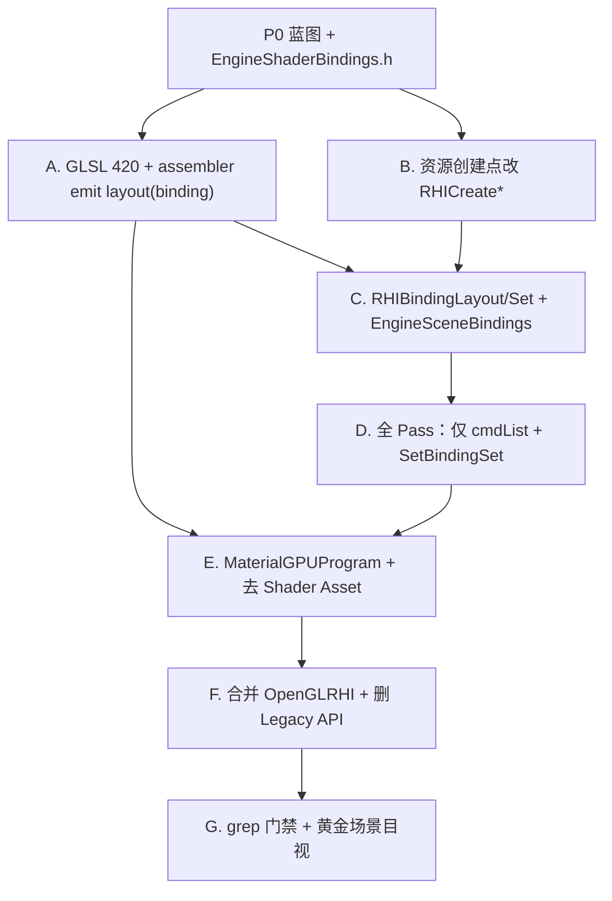

# RND-F03 — Migration Blueprint (P0)

## Meta

| Field | Value |
|-------|--------|
| **Feature ID** | `RND-F03-P0` |
| **Parent** | [RND-F03_LEGACY_RHI_REMOVAL_DESIGN](./RND-F03_LEGACY_RHI_REMOVAL_DESIGN.md) §8 |
| **Status** | Done (blueprint only — **no runtime behavior change**) |
| **Baseline** | `render` @ `f17cee1`（S1–S2） |
| **Last updated** | 2026-06-01 |

---

## TL;DR

P0 产出：**Legacy 创建点清单**、**M1 依赖图**、**黄金场景目视门禁**、定稿 `minEngine/minEngine/src/Runtime/Function/Render/EngineShaderBindings.h`。  
**F03-M1** 按本蓝图单链落地；禁止再出现 BindingSet + `BindUniformBlock` 混合路径。

---

## 1. M1 依赖图（实现顺序）



### 1.1 链内硬规则

| 规则 | 说明 |
|------|------|
| **绑定三件套同批** | `EngineShaderBindings.h`、C++ layout、`GLSLMaterialShellAssembler` 的 `layout(binding=…)` **同一工作段完成**，不得先绑 C++ 后补 shader |
| **改创建点，不 Wrap** | M1 禁止新增任何 `WrapLegacy*`；已有 Wrap 调用点列入 §2，迁移时 **删除** |
| **单轨 draw** | `BindSceneDrawResources` 终局形态：`SetBindingSet(0..2)` + draw；**无** `BindUniformBlock` / `texture->Bind` / `UploadUniformInt`（引擎场景资源） |
| **合并最后** | `OpenGLRHIModern` 并入 `OpenGLRHI` **在** Wrap 生产引用清零 **之后** |

### 1.2 M1 建议工作段（不对外拆 milestone）

| 段 | 内容 | 完成标志 |
|----|------|----------|
| **A** | 全部引擎/材质/Env shader → `#version 420 core`；`.glslinc` 由 assembler 注入 binding 行 | `material-ir` golden 更新；编译通过 |
| **B** | §2.1–2.3 创建点 → `RHICreateBuffer` / `RHICreateTexture2D` / `RHICreateShader` | grep `CreateUniformBuffer` 等在生产 Pass 路径为 0 |
| **C** | `EngineSceneBindingSets`（或等价）+ per-pass 小 layout | Set0/1/2 帧级构建 |
| **D** | Shadow/Base/Translucency/Post/Present/Sky/EnvMap | 无 Legacy GL 状态散落（depth/blend 进 PSO） |
| **E** | `Material::BindForDraw` → Set2；`Shader` Asset 移除 | Editor 材质预览 OK |
| **F** | §10 删除列表 + 删 `OpenGLRHIModern.*` | grep 门禁 |
| **G** | §3 黄金场景 | maintainer sign-off |

---

## 2. Legacy 创建点清单（基线 grep @ f17cee1）

> 路径前缀：`minEngine/minEngine/src/`。M1 结束时 §2 生产路径应 **清零**（Tests 夹具例外须注明）。

### 2.1 `WrapLegacy*`（12 处生产调用 + 定义文件）

| 文件 | 调用 | M1 替换方向 |
|------|------|-------------|
| `PresentPass.cpp` | `WrapLegacyVertexDefinition`, `WrapLegacyVertexBuffer` | Screen quad：`RHICreateVertexInputLayout` + `RHICreateBuffer` 在 `Initialize` |
| `PostProcessPass.cpp` | 同上 | 同上 |
| `SkyBoxPass.cpp` | 同上 | Cube VB/layout 现代创建 |
| `ShadowPass.cpp` | `WrapLegacy2DArray`, `WrapLegacy2D` | Shadow RT 持 `RHITextureRef`；`BeginRenderPass` 直接用现代纹理 |
| `OpenGLRHIModern.cpp/.h` | 全部 `WrapLegacy*` 定义 | **删除文件**；逻辑并入 `OpenGLRHI` |

**已现代（无 Wrap）：** `StaticMesh.cpp`, `StaticMeshLoader.cpp`, `SceneRenderTarget.cpp`（S1–S2）。

### 2.2 Legacy `RHI::Create*`（生产调用）

| API | 主要调用点 | M1 替换 |
|-----|------------|---------|
| `CreateUniformBuffer` | `RenderPipeline.cpp`（6× UBO） | `RHICreateBuffer(Uniform)` + `EngineShaderBindings` binding point |
| `CreateFrameBuffer` | `RenderPipeline.cpp`（point shadow）、`EnvMapCapture.cpp`（3×） | `RHIRenderPassInfo` + 现代 depth/color target；Env 离线 pass 同理 |
| `CreateVertexBuffer` | `RenderPipeline.cpp`（screen quad）、`SkyBoxPass.cpp`、`EnvMapCapture.cpp`（3×） | `RHICreateBuffer(Vertex)` |
| `CreateVertexDefinition` | 同上 | `RHICreateVertexInputLayout` |
| `CreateRHITexture2D` | `ShadowResourceManager`, `Texture2DLoader`, `Texture.cpp` | `RHICreateTexture2D(RHITextureCreateDesc)` |
| `CreateRHITexture2DArray` | `ShadowResourceManager` | `RHICreateTexture2D`（dimension 2DArray） |
| `CreateRHITextureCube` | `ShadowResourceManager`, `TextureCubeLoader`, `EnvMapCapture` | `RHICreateTexture2D`（dimension Cube） |
| `CreateRHIShader` | `Shader.cpp` | `RHICreateGraphicsShader`（现代 `RHIShader`） |

**间接入口（一并清理）：** `RHIBuffers.cpp` 静态 `VertexBuffer::Create` 等工厂。

### 2.3 Legacy 绑定 / draw（生产路径）

| 模式 | 主要文件 | M1 替换 |
|------|----------|---------|
| `BindUniformBlock` | `RenderPassBase.cpp`, `ShadowPass.cpp` | `SetBindingSet` + GLSL `layout(binding=…)` |
| `UploadUniformMat4/Int/Float*` | `RenderPassBase`, `ShadowPass`, `PostProcessPass`, `PresentPass`, `SkyBoxPass`, `EnvMapCapture`, `EngineIBLEnvironment` | Set2 材质 UBO；Pass 参数 UBO 或 push constants 封装在 OpenGL 层（不暴露 Legacy API） |
| `RHITexture*::Bind(unit)` | `RenderPassBase`, `EngineIBLEnvironment`, `EnvMapCapture` | `RHIBindingSet` SRV |
| `material->GetShader()->GetRHIShader()` | `BasePass`, `TranslucencyPass` | `MaterialGPUProgram` + `RHIShader` |
| `Material::BindForDraw` | `Material.cpp` | Set2 `RHIBindingSet` |
| `Shader::CreateFromFiles` | `RenderPipeline`, `ShadowPass`, `PresentPass`, `SkyBoxPass`, `EnvMapCapture` | 引擎固定 shader：编译缓存持 `RHIShader`；Material 走编译器 |
| `EnableBlend/DepthTest/SetDepthMask` | `BasePass`, `TranslucencyPass`, `ShadowPass`, `EnvMapCapture` | `RHIGraphicsPSODesc` |
| `FrameBuffer::Bind/Attach*` | `ShadowPass`（point）、`EnvMapCapture` | `BeginRenderPass` |
| `VertexDefinition/Buffer::Bind` | `EnvMapCapture` | `cmdList.SetVertexBuffer` + layout |

### 2.4 类型 / 模块待移除

| 项 | 位置 |
|----|------|
| `RHIShaderLegacy` / `OpenGLShader` 作为 MEObject | `RHIShader.h`, `OpenGLShader.*`, `RHIShader.gen.*` |
| `class Shader : public Asset` | `Shader.h/cpp`, `ShaderLoader` |
| `VertexBuffer`, `IndexBuffer`, `VertexDefinition` 公共类 | `RHIBuffers.h`, `OpenGLBuffers.*` |
| `FrameBuffer` | `OpenGLBuffers.*` |
| `RHITexture2D/Cube/2DArray` 公共 `Bind`/`GetID` | `RHITexture.h`, `OpenGLTexture.*` |
| `OpenGLRHIModern.*` | 整文件删除 |

### 2.5 已现代（保留并扩展）

| 项 | 位置 |
|----|------|
| `RHICreateTexture2D` | `SceneRenderTarget.cpp` |
| `RHICreateBuffer` / `RHICreateVertexInputLayout` | `StaticMesh.cpp`, `StaticMeshLoader.cpp` |
| `RHICommandList` draw | `RenderPassBase::DrawMeshCommand`, scene pass `BeginRenderPass` |
| `RHICmdSetGraphicsPipelineState` | Present/Post/Shadow（部分） |

---

## 3. 黄金场景目视门禁

> `verify.ps1` **不能**替代本节。M1 合并前 maintainer 必须目视 sign-off。

### 3.1 场景构成（Editor 主视口）

在 **同一测试场景** 中同时存在：

| 元素 | 要求 |
|------|------|
| 网格 | 至少 1 个 **BlinnPhong** opaque mesh（有纹理更佳） |
| 方向光 | **intensity = 1.0**；开启阴影 |
| 点光 | 1 盏；有限影响范围（**不应**像方向光一样照亮全场）；开启阴影 |
| 聚光灯 | 1 盏；锥形衰减；开启阴影 |
| 相机 | 固定角度，便于截图对比 |

### 3.2 通过标准

| 检查项 | 预期 |
|--------|------|
| 方向光亮度 | intensity=1 时，受光面亮度与 **S1–S2 基线**（`f17cee1` 目视）一致，**非** ~0.2 灰蒙 |
| 点光形状 | 近亮远暗，**非**全场均匀照明 |
| 方向光阴影 | CSM 可见、稳定（无整块错误或闪烁） |
| 点光阴影 | cube shadow 可见 |
| 聚光灯阴影 | 仍正常（S3 失败时 spot 仍通，作回归锚点） |
| 透明物体 | TranslucencyPass 排序与混合正常 |
| 后处理 + Present | FXAA/Sharpen 链无黑屏、无偏色 |
| PBR（若有） | IBL 环境光正常 |

### 3.3 记录方式

- 迁移前：在 `PROGRESS_LOG.md` 记一条「黄金场景基线 @ f17cee1 OK」
- M1 后：同场景再目视；可选截图存 `docs/ai/sessions/`（非 Tier A backlog）

---

## 4. grep 门禁（M1 合并前）

在 `minEngine/minEngine/src/Runtime/Function/Render/`（及 Pass 相关）执行，**生产路径为 0**：

```text
WrapLegacy
BindUniformBlock
CreateUniformBuffer
CreateVertexBuffer
CreateIndexBuffer
CreateVertexDefinition
CreateFrameBuffer
CreateRHITexture
RHIShaderLegacy
OpenGLRHIModern
```

允许例外（须 PR 说明）：

- `Tests/` 夹具
- `Shader::TryCompileSourcesOnGpu` 工具路径（若暂留）
- 生成代码删除前的过渡 commit（**不得**合入 main/render 终态）

---

## 5. 与主设计案的关系

| 文档 | 角色 |
|------|------|
| [RND-F03 §6](./RND-F03_LEGACY_RHI_REMOVAL_DESIGN.md) | Binding 语义与 Set 分配 |
| [RND-F03 §8](./RND-F03_LEGACY_RHI_REMOVAL_DESIGN.md) | 道中复盘、策略修订、P0/M1/M2 切片 |
| **本文** | M1 执行清单与依赖图 |
| `EngineShaderBindings.h` | slot 数字 **唯一真源** |

---

## 变更记录

| 日期 | 说明 |
|------|------|
| 2026-06-01 | P0 初稿：grep 清单、依赖图、黄金场景、grep 门禁 |
| 2026-06-01 | M1+M2 完成：grep 门禁全绿；`verify.ps1` + material-ir PASS |
