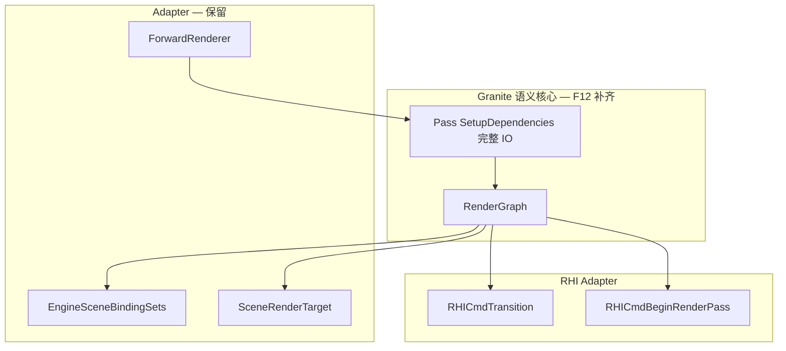

# Granite RDG Semantic Parity — Design Spec

## Meta
- **ID:** `RND-F12`
- **Type:** Feature
- **Status:** Planned
- **Owner:** project maintainer
- **Last updated:** 2026-08-30
- **Related:** [Implementation](./RND-F12_GRANITE_RDG_BAKE_SEMANTICS_IMPLEMENTATION.md), [FEATURE_REGISTRY](../FEATURE_REGISTRY.md), [ACTIVE_WORK](../ACTIVE_WORK.md), [RND-F07](./RND-F07_GRANITE_RDG_RESOURCE_REFACTOR_DESIGN.md), [RND-F08](./RND-F08_SHADOW_GRAPH_OWNERSHIP_DESIGN.md), [BUG-RENDER-013](../bugs/BUG-RENDER-013.md), [RND-TD025 §8](./RND-TD025_SHADOW_CONVENTION_GAP_DESIGN.md)
- **Reference source (local):** `D:\Dev\GitRepo\Granite\renderer\render_graph.hpp` / `render_graph.cpp`（MIT；**语义权威**，非代码复制源）

## TL;DR

**北极星：** 在 minEngine 架构内 **尽可能完整复刻 Granite RenderGraph 的全部语义**（依赖闭包、physical 资源、transient、barrier、enqueue 同步、条件 pass 等）——**化用设计，不粘贴代码**。

`RND-F07` 只落了 API 外壳；Renderer 补丁（`ForceInclude`、`Fingerprint`、图外 set1）与半套 `Bake` 导致 [BUG-RENDER-013](../bugs/BUG-RENDER-013.md)。本 Feature 分 **Phase A→D** 递进补齐 Granite 语义；阴影回归是 Phase A 验收探针，**不是**范围上限。

## Scope
- **In:** 见 §4 Granite 语义全景表与 §5 分阶段交付；Adapter 边界（§3）；删除非 Granite 补丁（§6）
- **Out:** 逐行移植 Granite C++；改 Granite 设计去迁就 minEngine 补丁；阴影算法/CSM 质量（除非 RDG 修后仍失败）；材质 IR / Editor UI

## Reader quick start
1. **§3 Adapter 边界** — 什么保留、什么必须改
2. **§4 Granite 语义全景** — 完整对照与 minEngine 差距
3. **§5 分阶段交付** — Phase A（S01–S07）→ D
4. [Implementation](./RND-F12_GRANITE_RDG_BAKE_SEMANTICS_IMPLEMENTATION.md) — 切片与 DoD
5. Granite：`bake()` L2993+、`enqueue_render_passes` L2522+

---

## 1) 背景与北极星

### 1.1 为何是 Feature 而非 Bugfix

| 现象 | 错误归类 | 根因类 |
|------|----------|--------|
| VK 多光源 shadow 异常 | shader / set1 | RDG 语义未闭合 |
| Toggle shadow latched state | descriptor dirty | 图外失效 + 无 barrier |
| Dir-only VK 正常 | Dir 数学错 | 多 pass 图参与时半套 RDG 暴露 |

继续在 `ForwardRenderer` 打补丁（BUG-013 S1–S4 已证伪）= **拒绝 Granite 语义、发明第三套模型**。

### 1.2 北极星（North Star）

> **目标：** minEngine `RenderGraph` 对任意帧图，在可观测行为上与 Granite `RenderGraph` **语义等价**——同一组 `setup_dependencies` 声明应产生相同的 pass 序、physical 别名规则、transient 判定、layout barrier 与 enqueue 同步义务。
>
> **手段：** 对照 Granite 阶段表在 minEngine 实现 **同名语义阶段**；通过 RHI adapter 映射到 GL/VK，**不**要求类名/文件结构一致。
>
> **非目标：** 复制 Granite 源码、引入 `TaskComposer` 除非多队列 slice 启动。

### 1.3 与 F07 的关系

| | F07（Done shell） | F12（本 Feature） |
|---|-------------------|-------------------|
| 交付 | `add_pass` / 简化 Bake / `SetupAttachments` / `IRenderPass` | Granite **完整 bake + execute 语义** |
| 验收 | 图拥有 RT、主路径接回 | 语义单测 + BUG-013 + 全景表逐项闭合 |
| 状态 | Meta 标注 shell | 关账条件 = §4 表 **Mandatory** 行全 Done |

---

## 2) Granite 能否「原样」套进 minEngine？

**不能自动完美套入，但语义完全可对齐。** Granite 假设 Vulkan 中心 + 可选多队列；我们有双 RHI、图外 `EngineSceneBindingSets`、`SceneRenderTarget` 视口层、固定 shadow slot 拓扑——这些是 **Adapter 层**，不推翻 Granite 核心。

**原则：改我们的基础，不改 Granite 设计。**

---

## 3) Adapter 边界（minEngine 保留 vs 必须收敛）

### 3.1 保留层（合法 Adapter，不违背 Granite）

| minEngine 组件 | 角色 | Granite 等价物 |
|----------------|------|----------------|
| `ForwardRenderer` | 场景收集、UBO、构图入口 | 应用层组 graph |
| `SceneRenderTarget::PublishGraph*` | Editor 视口展示句柄 | 离屏 backbuffer → UI |
| `EngineSceneBindingSets` set0 ring | Per-draw `u_Model` | Granite 不规定；图外 OK |
| `EngineSceneBindingSets` set1 | Shadow/IBL SRV 绑定 | 应消费 `GetPhysicalTexture`；绑定时机服从图 |
| 固定 `kMaxShadowGraphPasses` | 引擎预算 / slot 策略 | 可用 `render_pass_is_conditional` + 满配 IO 声明 |
| 单 `RHICommandList` / 单 graphics queue | Phase A–C 默认 | Granite 子集（无 async） |
| `NeedRenderPass()` | 本帧跳过 GPU | `need_render_pass()` |
| GL 路径 barrier no-op | 双 RHI | Granite VK 路径的 adapter |

### 3.2 必须收敛进 RDG 语义（禁止长期留在 Renderer）

| 反模式 | 为何违背 Granite | 处置 |
|--------|------------------|------|
| `ForceIncludePass("Shadow.*")` | 绕过 consumer read 闭包 | **删除**（S01） |
| `BuildShadowResourceFingerprint` | 图外字符串 invalidate | **删除**（S02） |
| `m_PendingShadowBindingInvalidate` | 图外 set1 脏标记 | **删除**（S06） |
| Scene 不 `AddTextureInput(shadow)` | 无 generic read edge | **补全**（S01） |
| `Enqueue` 无 pass 间 barrier | 无 `build_physical_barriers` | **实现**（S03） |
| `AddTextureInput` 无 stage/access/layout | `AccessedTextureResource` 缺失 | **扩展 API**（S03） |
| read 无 writer 静默跳过 | Granite throw | **Bake 报错**（S01） |
| `SetupAttachments` 忽略 swapchain | backbuffer alias 未实现 | **Phase C**（S08） |

### 3.3 架构适配图



### 3.4 Bake 频率策略（定案）

Granite：**每次 `bake()` 都重跑全部 pass 的 `setup_dependencies()`**，再 derive 序与 physical。

minEngine 今日：`IsBaked()==true` 时 **跨帧跳过** `Bake()`，`SetupDependencies` 冻结。

| 策略 | 说明 | 结论 |
|------|------|------|
| **A. 每帧 Bake** | 最贴 Granite；`SetupDependencies` 每帧刷新 read/write 集 | **Phase A 末默认采纳** |
| B. 拓扑缓存 Bake | 仅 `AddPass`/尺寸/attachment 变时 rebake；执行仍每帧 Enqueue+barrier | 可作为优化，**不替代** A 的语义单测 |
| C. 跨帧缓存 + 补丁 | fingerprint / ForceInclude | **禁止** |

**契约：**
- Phase A 结束前：`Execute` 每帧调用 `Bake()`（或等价：invalidate 使 `IsBaked` 每帧 false），直至单测证明缓存安全。
- `NeedRenderPass()` 只控制 **是否录制 GPU**，不改变 **Bake 已建立的 IO 闭包**。
- `SetPermanentGraphOutput` 允许 **Bake 拓扑满配**；运行时 inactive 靠 `NeedRenderPass()`，与 Granite `render_pass_is_conditional` 对齐。

---

## 4) Granite 语义全景表（复刻清单）

权威对照：`Granite::RenderGraph::bake()`（`render_graph.cpp` L2993+）及 `enqueue_render_passes`（L2522+）。

图例：**Done** = F07 已有；**A/B/C/D** = F12 Phase；**Def** = 明确 Deferred（另 Feature 或引擎不需要）。

### 4.1 Bake 阶段（`bake()`）

| # | Granite 阶段 | 语义要点 | minEngine 今日 | F12 |
|---|--------------|----------|----------------|-----|
| 1 | `setup_dependencies` | 每 pass 声明 IO，清空再填 | ✓ 每 Bake | Done |
| 2 | `validate_passes` | backbuffer 存在且有 writer | ✓ | Done |
| 3 | backbuffer → `traverse_dependencies` | 从 consumer 反向闭包 | △ + ForceInclude | **A S01** |
| 4 | `reverse(pass_stack)` | 执行序 dependency-first | ✗ DFS 末尾 push | **A S01** 单测等价 |
| 5 | `filter_passes` | 去重保序 | ✓ | Done |
| 6 | `reorder_passes` | 减 hard barrier / tiler merge 友好 | ✗ | **B S09** |
| 7 | `build_physical_resources` | physical index；color/depth rename alias | △ 仅 color alias | **B S10** depth rename |
| 8 | `build_physical_passes` | logical → physical；subpass merge | ✗ 1:1 | **C S11** |
| 9 | `build_transients` | 单 physical pass 内 attachment 可 transient | ✗ | **B S04** |
| 10 | `build_render_pass_info` | 统一 load/store/clear | ✗ 分散各 Pass | **C S12** |
| 11 | `build_barriers` | logical 级 hazard | ✗ | **A S03** 最小 |
| 12 | `build_physical_barriers` | physical 级 layout transition 计划 | ✗ | **A S03** / **C** 加强 |
| 13 | `build_aliases` | swapchain / proxy | ✗ swapchain 未接 | **C S08** |
| 14 | Pass `setup(device)` | bake 后一次 PSO/持久状态 | △ SetupAttachments 内 | **B** 对齐时机 |

### 4.2 依赖遍历（`traverse_dependencies`）

| IO 类型 | Granite | minEngine | F12 |
|---------|---------|-----------|-----|
| `generic_texture_inputs` | ✓ + stage/access/layout | `AddTextureInput` 无元数据 | **A S01/S03** |
| `color_inputs` | ✓ | color alias 部分 | **B** |
| `attachment_inputs` | ✓ | ✗ | **B** |
| `depth_stencil_input` | ✓ merge dep | ✓ | Done |
| `color_scale_inputs` | ✓ | ✗ | Def（post scale） |
| `storage_*` / `buffer_inputs` | ✓ | ✗ 无 Buffer RDG | **D** 或 Def |
| `proxy_inputs/outputs` | ✓ | ✗ | Def |
| 无 writer 的 read | **throw** | 静默 | **A S01 throw** |
| `pass_dependencies` 显式图 | ✓ | ✗ | **A S01** |
| `pass_merge_dependencies` | ✓ | ✗ | **C S11** |

### 4.3 资源与 `setup_attachments`

| 语义 | Granite | minEngine | F12 |
|------|---------|-----------|-----|
| `ATTACHMENT_INFO_PERSISTENT_BIT` | 控制复用 | `RDGAttachmentFlags::Persistent` 部分用 | **B** 接入 bake |
| `physical_events` layout 状态 | per-attachment | ✗ | **A S03** |
| `physical_history_*` ping-pong | history 输入 | ✗ | **D** |
| `InputRelative` 尺寸 | ✓ | throw | **B S04** |
| Buffer physical | ✓ | ✗ | **D** |
| ImGui 跨帧 retain 纹理 | persistent + events | 注释式 retain | **B** 改由语义驱动 |

### 4.4 Execute（`enqueue_render_passes`）

| 语义 | Granite | minEngine | F12 |
|------|---------|-----------|-----|
| `physical_pass_invalidate_attachments_early` | enqueue 前 discard | ✗ | **A S03** |
| `enqueue_prepare_render_pass` | 每 pass CPU prep | `RunPrepare` | Done |
| `build_render_pass` | GPU 录制 | `RunBuildRenderPass` | Done |
| pass 间 pipeline barrier | automatic | ✗ | **A S03** |
| `TaskComposer` / 多队列 | semaphore | 单 CB | **D S13** |
| `RenderPassExternalLockInterface` | 外部同步 | ✗ | **D** |
| `need_render_pass()` | 条件跳过 | ✓ | Done |
| `render_pass_is_conditional()` | bake 拓扑标记 | △ PermanentOutput | **A** 文档化等价 |

### 4.5 Pass 声明 API（subset 映射）

| Granite API | minEngine | F12 |
|-------------|-----------|-----|
| `add_color_output(name, info, colorInput?)` | ✓ | Done |
| `add_texture_input(name, stages)` | △ 无 stages | **S03** |
| `set_depth_stencil_output/input` | ✓ | Done |
| `add_resolve_output` | ✗ | Def |
| `add_history_input` | ✗ | Def |
| `add_storage_*` | ✗ | Def |
| `ForceIncludePass` | minEngine 独有 | **删除** |

---

## 5) 分阶段交付

```text
Phase A — Bake 闭包 + Barrier 最小闭环（验收 BUG-013）
  S01 read edge + pass_dependencies + missing-writer throw
  S02 invalidate 模型；删 Fingerprint
  S03 VK barrier + AccessedTexture 元数据 + physical_events
  S06 Binding 与 physical 生命周期对齐
  S07 收口 + 013 回归

Phase B — Bake 后半段（Granite bake 9–14 主体）
  S04 build_transients + InputRelative
  S09 reorder_passes（简化版可接受）
  S10 build_physical_resources 增强（depth rename / queue flags）

Phase C — Execute 与 Present 链
  S08 swapchain alias / build_aliases
  S11 build_physical_passes（subpass merge）
  S12 build_render_pass_info 集中化

Phase D — Granite 全量（按需）
  S13 TaskComposer / async compute / external lock
  S14 Buffer / storage RDG
  S15 history / mipgen / swapchain scale pass
```

**关账定义：**
- **F12 Phase A Done：** §4.1 行 3–5、11–12 与 §4.2 generic read 行闭合；BUG-013 Verified；无 §6 删除项残留。
- **F12 Full Done：** §4 所有 **Mandatory**（标记为 A/B/C 非 Def）行 Done；Def 行有文档说明为何不实现。

---

## 6) 非 Granite 项删除清单（Phase A 必须为零）

| 项 | 文件 | 删除/替换 |
|----|------|-----------|
| `ForceIncludePass` shadow 用法 | `ForwardRenderer.cpp` | consumer read edge |
| `BuildShadowResourceFingerprint` | `ForwardRenderer.cpp/.h` | `RenderGraph::InvalidateBake` |
| `m_LastShadowResourceFingerprint` | `ForwardRenderer.h` | — |
| `m_PendingShadowBindingInvalidate` | `ForwardRenderer` | physical 变化 → set1 dirty |
| 手工拆 `EnqueueRenderPasses(filter)` | 已回退 | 禁止再引入 |
| Renderer 字符串 hash 场景状态 | — | 禁止新引入 |

`ForceIncludePass` **API 本身**：Present 若仍无 backbuffer write 链可暂留 **一处**；shadow **零**处。长期 Present 应通过 `AddTextureInput` + write pass 纳入闭包后删除 API。

---

## 7) 方案摘要（Phase A 切片）

### 7.1 S01 — Read dependency 闭包

- Scene/Post：`AddTextureInput` shadow atlases + post 链
- `TraverseDependencies`：建 `pass_dependencies`；read 无 writer → `logic_error`
- 单测：pass 序 + 无 ForceInclude 仍含 shadow writers
- 评估 `reverse`：与 Granite 执行序 **语义等价**（单测锁定）

### 7.2 S02 — Invalidate

- 删除 fingerprint；`SetBackbufferDimensions` / graph rebuild / attachment info 变化 → invalidate
- **每帧 Bake**（§3.4 策略 A）直至证明可安全缓存

### 7.3 S03 — Barrier + `AccessedTextureInput`

扩展 `AddTextureInput`：

```cpp
struct RDGTextureAccess {
    RDGPipelineStage Stage = RDGPipelineStage::FragmentShader;
    RDGTextureLayout Layout = RDGTextureLayout::ShaderRead;
    // 映射到 RHITextureTransitionInfo / Vk 等价
};
RDGTextureResource& AddTextureInput(const std::string& name, RDGTextureAccess access = {});
```

`EnqueueRenderPasses`：在 pass `RunBuildRenderPass` 前对 inputs 插入 `cmdList.Transition`（VK）；维护 `physical_events` 等价状态。

### 7.4 S06 — Binding

- `EngineSceneBindingSets`：dirty = physical index / `shared_ptr` 地址 / dims 变化
- `BindGraphShadowTextures` 保留为薄封装（`GetPhysicalTextureShared` → ctx）
- 禁止 fingerprint 触发 `InvalidateShadowTextureBindings`

---

## 8) 备选方案

| 选项 | 结论 |
|------|------|
| 继续 Renderer 补丁 | **拒绝** |
| 仅 read edge 无 barrier | **仅 S01 过渡** |
| 粘贴 Granite.cpp | **拒绝** |
| 分 Phase A→D 语义复刻 + Adapter | **选用** |

---

## 9) 风险与缓解

| 风险 | 缓解 |
|------|------|
| 每帧 Bake 成本 | Phase A 先正确性；后 profile；B 阶段再论缓存 |
| GL/VK 分叉 | barrier 经 RHI；GL no-op |
| 范围膨胀 | §4 表 Mandatory vs Def；D 另开 slice |
| PermanentOutput vs 动态 shadow | conditional pass 语义 + read edge |

---

## 10) 验收标准

### Phase A（BLOCK 013）
- [ ] §6 删除清单为零（shadow ForceInclude）
- [ ] read 无 writer：Bake throw
- [ ] `render-graph`：序 + barrier 钩子单测
- [ ] VK：BUG-RENDER-013 全矩阵
- [ ] GL：黄金场景无回归
- [ ] 每帧 Bake 或单测证明缓存等价

### Full F12（后续 Phase）
- [ ] §4 Mandatory 行全部 Done 或 Def 有记录
- [ ] 无新增 Renderer 图外 invalidate 补丁

---

## 11) Status note

**Planned** — 2026-08-30 扩充：北极星 = Granite **全语义**复刻；Adapter §3；全景表 §4；Phase A–D。

---

## 变更记录

| 日期 | 说明 |
|------|------|
| 2026-08-30 | 初稿：F07 续作；BUG-013 探针 |
| 2026-08-30 | 扩充：北极星、Adapter 边界、Bake 频率定案、Granite 全景表、Phase A–D、删除清单 |
