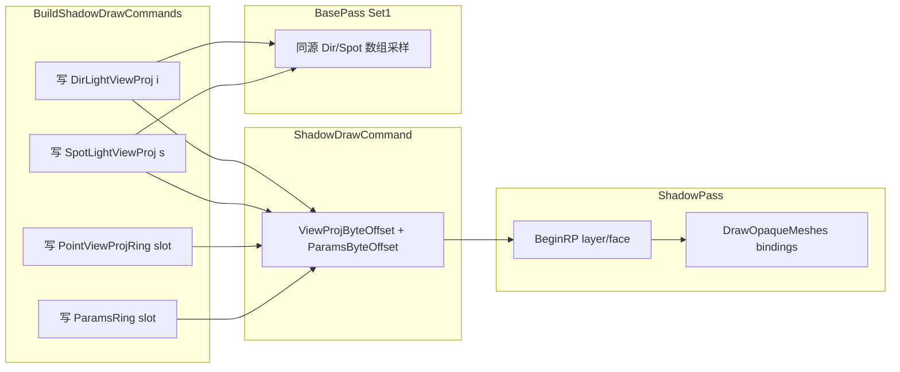

# Shadow Pass UBO Lifetime + VK Multi-Map Shadow Fix — Design Spec

## Meta
- **ID:** `RND-F14`
- **Type:** Feature *(bug-driven refactor of shadow write-path uniforms)*
- **Status:** **Done** — Phase A implemented; user VK full-map verified 2026-08-31
- **Owner:** project maintainer
- **Last updated:** 2026-08-31
- **Related:**
  - [BUG-RENDER-013](../bugs/BUG-RENDER-013.md) · [BUG-RENDER-010](../bugs/BUG-RENDER-010.md)
  - [RND-F13 ManualRenderer](./RND-F13_MANUAL_RENDERER_DESIGN.md)（诊断场地）
  - [VK_SHADOW_PICCOLO_MINENGINE_REFERENCE.md](./VK_SHADOW_PICCOLO_MINENGINE_REFERENCE.md)
  - 旧计划（将被本设计重排）：[BUG-RENDER-013_VK_SHADOW_FIX_EXECUTION_PLAN.md](./BUG-RENDER-013_VK_SHADOW_FIX_EXECUTION_PLAN.md)
- **Implementation:** [RND-F14_SHADOW_PASS_UBO_LIFETIME_IMPLEMENTATION.md](./RND-F14_SHADOW_PASS_UBO_LIFETIME_IMPLEMENTATION.md)

## TL;DR

**主因假设（用户提出，代码证据强支持）：** ShadowPass 在每条 `ShadowDrawCommand` 上对 **同一块 host-visible** `m_LightViewProjUniformBuffer`（及 `ShadowPassParams`）做 `memcpy` 覆盖，而 Vulkan 只是把 draw **录进 CB**；submit 后 GPU 执行时，多 pass 共享的 UBO 已是**最后一次写入** → Dir cascade / Point faces（以及 full-map 下跨类型）矩阵与 params **串扰**。

**方案：** 让「每次 shadow 绘制」绑定 **该次专用的 UBO 槽**（ring 或直接绑采样侧已按 slot 写好的数组 offset），消除「录制时覆盖、执行时串读」；顺带收敛 **矩阵双轨**。Pass 类拆分、Set1 卫生、R32 A/B 等作为 **后续优化轨**，不挡主因修复。

## Scope

### In
- Shadow **写入**路径的 UBO / Params **生命周期与绑定契约**
- 与采样侧矩阵 **单源**（Dir cascade / Spot slot）
- ManualRenderer 上验证；Forward+RDG 继承同一 ShadowPass 修复
- 文档重排 BUG-013 主因叙事

### Out（本期不实现，仅设计里登记方向）
- 把 ShadowPass 拆成三个独立 Pass 类（Phase B）
- Piccolo 式 R32 color shadow / Point GS（可选实验轨）
- RDG bake 语义大改（RND-F12）
- CSM 分裂数学重写、生产默认改 Manual

## Reader quick start
1. 本文件 §1–3：根因与推荐方案  
2. **§2.4**：历史先例（PerObject ring，`bbdcdca`）  
3. **§3.4–§3.8**：重构形态 + **目标代码（show me the code）**  
4. §4–6：备选、风险、验收  
5. §7：优化方向 backlog（Pass 拆分 / Set1 / layout…）  
6. 代码入口：`ShadowPass.cpp` · `VulkanRHIBuffer::UpdateSubresource` · `ForwardRenderer::BuildShadowDrawCommands`

---

## Pre-flight（实现前）

| 项 | 结论 |
|----|------|
| **Prerequisites** | RND-F13 Manual 可跑；ShadowPass / Set1 / PerObject ring 已存在 → **sound** |
| **Tech-debt risk** | 若只加 if 分支保留双路径 → **medium**；应用 **true refactor**：删掉「单 mat4 覆盖」路径 |
| **WIP** | RND-F13 / ED-F01 / BUG-013 同轨；本 Feature **收窄为 UBO 寿命** → **proceed with scope cut** |
| **Recommendation** | **Go with scope cut**：先 Phase A（UBO 寿命 + 矩阵单源）；Pass 拆分 / Set1 / R32 **Defer** 至 Phase B/C |
| **真重构 vs 创可贴** | **真重构**：目标契约「每 ShadowDrawCommand 一次独立可见的 ViewProj（+ Params）槽」；删除 `UpdateLightViewProjBuffer` 覆盖同 offset 的用法 |

---

## 1) 背景与目标

### 1.1 已坐实 / 强相关观察

| 观察 | 含义 |
|------|------|
| Dir-only（`MAX_*=0`）VK **错误较轻** | 单类型、尤其单 cascade 时覆盖次数少 → 症状弱 |
| Spot 在 Manual+VK **几乎正确**（略 bias） | Spot 通常 **1 pass / 独立 Texture2D**；且采样侧已按 slot 写 `SpotLightViewProj` |
| Full-map（Dir+Spot+Point）明显坏；Manual == Forward+RDG | 问题在共享 ShadowPass / UBO / VK，非 RDG |
| OpenGL 同场景更好 | GL `glBufferSubData` 与 draw 的时序语义更「即时」；VK deferred 放大问题 |

### 1.2 根因模型（推荐主因）

```text
CPU 录制帧:
  Cmd0: memcpy(LightVP ← cascade0);  record Draw* → 描述符指向 LightVP@0
  Cmd1: memcpy(LightVP ← cascade1);  record Draw* → 同一 LightVP@0
  ...
  CmdN: memcpy(LightVP ← last);     record Draw*
Submit → GPU 执行:
  所有 Draw 读 LightVP@0 → 几乎都是 last 的矩阵
```

同时受害：

- `m_LightViewProjUniformBuffer`（单 `mat4`）
- `m_ShadowParamsUniformBuffer`（`UseLinearDepth` / `LightPos` / `FarPlane`）— Point 与 Dir/Spot **串 params**

**对照：** `PerObject` 已用 ring + `BufferOffset`，同帧多 draw **安全**。Shadow ViewProj **未**采用同一模式。

**Piccolo：** 不是「Pass 类名」本身防串扰，而是 **upload ring + dynamic offset**，每次 draw 绑自己的槽。

### 1.3 成功标准（用户可感知）

- Full-map Manual+VK：Dir / Spot / Point 阴影 **互不串扰**；Dir cascade 层内容与索引一致  
- Spot 保持现有正确性；Dir/Point 达到接近 Spot 的「几何正确」等级（bias 属质量轨）  
- GL 无回归；Forward+RDG 与 Manual 一致改善  

### 1.4 帧 submit 与 UBO 语义（审阅用）

Editor 主路径 **每帧 1 次** `vkQueueSubmit`（`RHIClearBackbuffer` → 录场景+ImGui → `RHIPresent`/`EndFrameRecordingAndSubmit`）。  
因此不是「只传了一个矩阵给 GPU」，而是 **submit 前 CPU 已把同一块 `LightViewProj@0` 覆盖成最后一次写入**；GPU 执行 CB 里**所有** shadow draw 时读到的都是这份最终值。这与 BUG-RENDER-005 的 PerObject 模型相同。

---

## 2) 现状

### 2.1 写入路径（问题点）

| 资源 | 容量 | ShadowPass 用法 | 安全？ |
|------|------|-----------------|--------|
| `m_LightViewProjUniformBuffer` | `1 × mat4` | 每 command `UpdateSubresource(offset=0)` | ❌ |
| `m_ShadowParamsUniformBuffer` | `1 × ShadowPassParamsUBO` | 每 command 覆盖 offset 0 | ❌ |
| `m_PerObjectUniformBuffer` | ring slots | `WriteNextPerObjectModel` + offset | ✅ |
| `m_DirLightViewProjUniformBuffer` | `MAX_CASCADES × mat4` | **仅** `BuildShadowDrawCommands` 写；ShadowPass **不绑** | 采样侧相对 ✅；写入侧双轨 ❌ |
| `m_SpotLightViewProjUniformBuffer` | `MAX_SPOT × mat4` | Build 时按 slot 写；ShadowPass 仍走单 mat4 | Spot **画**仍可能被后续 command 覆盖 |

### 2.2 Descriptor 契约

- Shadow set：`UNIFORM_BUFFER`（非 dynamic），bind 时 **无** 把内容拷进 CB  
- `CreateShaderBindingSet` 写入 `VkDescriptorBufferInfo{ buffer, offset, range }`；offset 恒为 0（LightVP / Params）  
- VK buffer：`HOST_VISIBLE | HOST_COHERENT` + mapped `memcpy`

### 2.3 与旧执行方案的关系

旧 [执行方案](./BUG-RENDER-013_VK_SHADOW_FIX_EXECUTION_PLAN.md) 的 **S01「矩阵单源」** 方向正确，但叙述偏「双轨一致性」。本设计把主因明确为：**deferred GPU + 同 offset 覆盖**；单源是修复的 **自然结果**（绑采样数组槽），而非仅「让两份数据相等」。

### 2.4 历史先例：PerObject Ring（同类根因，已修一半）

| 项 | 内容 |
|----|------|
| **Commit** | `bbdcdca`（2026-08-26）`fix(render): fix Vulkan per-draw transforms, sky bake, and buffer lifetime` |
| **Co-authored** | Cursor（agent） |
| **关联 Bug** | [BUG-RENDER-005](../bugs/BUG-RENDER-005.md)（Cube 不可见）、[BUG-RENDER-006](../bugs/BUG-RENDER-006.md)（plane scale 像变厚） |
| **文档** | [ED-F01_VULKAN_VISUAL_PARITY_BUGFIX_DESIGN.md](../Editor/ED-F01_VULKAN_VISUAL_PARITY_BUGFIX_DESIGN.md) BF-S02 |

**当时症状：** 单个 host-visible `PerObject` UBO，`UpdatePerObjectModel` 每 draw `memcpy` 到 offset 0；多 draw 录进同一 CB 后一次 submit → 全部 draw 读到**最后一个** model matrix。

**当时修复：** `EngineSceneBindingSets::WriteNextPerObjectModel` + aligned ring + descriptor `BufferOffset`/`BufferRange`（与 `ShadowPass` 同 commit 已接入 PerObject）。

**遗漏（同 commit 内）：** `ShadowPass` 仍对 `m_LightViewProjUniformBuffer` / `m_ShadowParamsUniformBuffer` 使用 **offset 0 覆盖**。`EngineSceneBindingSets.h` 注释已写明 hazard，但未延伸到 LightViewProj。

```diff
# bbdcdca — ShadowPass.cpp（节选）
- m_PerObjectUniformBuffer->UpdateSubresource(&drawCommand.m_ModelMatrix, 0, sizeof(Matrix4));
+ const uint32_t perObjectOffset = pipeline->GetSceneBindings().WriteNextPerObjectModel(...);
+ resources[0] = {..., m_LightViewProjUniformBuffer, nullptr, 0, 0};  // ← 未改
```

**结论：** RND-F14 不是新发明，而是 **把 2026-08-26 已验证的 ring 模式补全到 Shadow 的 ViewProj + Params**；属小规模真重构，非架构大换血。

---

## 3) 方案

### 3.1 推荐：Phase A — Shadow UBO 槽化 + 矩阵单源（最小真重构）

**目标契约**

> 每一条被录制的 shadow draw，其绑定的 `LightViewProj`（及 `ShadowPassParams`）在 **从录制到 GPU 执行该 draw** 期间不被后续 CPU `memcpy` 覆盖。

**推荐实现（A1 — 优先）**

1. **Dir：** ShadowPass 绘制 cascade `i` 时，descriptor 直接绑  
   `m_DirLightViewProjUniformBuffer`，`BufferOffset = i * alignedStride`，`BufferRange = sizeof(mat4)`。  
   - `BuildShadowDrawCommands` **唯一**写该数组（已有）。  
   - **删除** shadow 路径对 `m_LightViewProjUniformBuffer` 的依赖（或仅作 fallback 删除）。  
2. **Spot：** 同理绑 `m_SpotLightViewProjUniformBuffer` 的 `spotSlot` offset（Build 已写）。  
3. **Point：** 无采样侧 ViewProj 数组时：
   - **A1-P：** 引入 `m_PointLightViewProjRing`（或通用 `ShadowDrawViewProjRing`），容量 ≥ `kMaxShadowGraphPasses`（或 `MAX_POINT * 6`），每 face command 写一槽并绑 offset；**或**
   - **A1-P'：** 通用 shadow ring：所有类型的写入都走 ring，Dir/Spot 的采样数组仍由 Build 另写（双写一轮，契约简单但多一次 memcpy）——不如 A1 干净。  
4. **ShadowPassParams：** 同样 ring（每 command 一槽），避免 Point 的 `UseLinearDepth=1` 污染 Dir/Spot 的 `0`。  
5. **Shader：** `ShadowPass.vert` 仍 `uniform LightViewProj { mat4 ViewProj; }`；靠 descriptor range=`sizeof(mat4)` 指向数组元素即可，**不必**改成 SSBO。  

**API / 行为契约**

- `ShadowDrawCommand` 增加（或复用现有字段）：`ViewProjBufferSlot` / `ParamsSlot` / 明确 `TargetLayer`↔Dir cascade、`SpotSlot`、`PointFace`  
- `DrawOpaqueMeshes` 改为接受 **本次 pass 的 binding 参数**（ViewProj buffer+offset、Params buffer+offset），禁止再读「全局当前 LightVP」  
- `UpdateLightViewProjBuffer(mat4)` **删除**或改为「WriteSlot(slot, mat4)」  

**数据流（目标）**

```text
BuildShadowDrawCommands
  → 写 DirLightViewProj[i] / SpotLightViewProj[s] / PointRing[f]
  → 写 ShadowParamsRing[cmd]
ShadowPass::Render*(command)
  → BeginRP(target layer/face)
  → CreateBindingSet( ViewProj@slot, PerObject@ring, Params@slot )
  → DrawOpaqueMeshes
  → EndRP
BasePass
  → Set1 采 DirLightViewProj[] / Spot[] / cube（与写入同源）
```

### 3.2 Phase A 切片建议（实现计划定稿时细化）

| Slice | 内容 | 验证 |
|-------|------|------|
| **A0** | 文档 + 假设锁定；可选：临时把 shadow UBO 扩成 `N*mat4` 只写不绑 offset 作对照实验 | 记录 |
| **A1** | Dir 绑 `DirLightViewProj[i]`；删单 mat4 覆盖（Dir 路径） | Manual VK：1 cascade → 4 cascade；RenderDoc 层内容不同 |
| **A2** | Spot 绑 `SpotLightViewProj[s]` | Spot-only 不回归；Dir+Spot 不串 |
| **A3** | Params ring + Point ViewProj ring；Point 6 face | Point-only；full-map |
| **A4** | Forward+RDG 回归；删死代码 / `m_LightViewProjUniformBuffer` | GL+VK |

### 3.3 模块边界

| 模块 | 职责 |
|------|------|
| `ForwardRenderer` / `ManualRenderer` | 拥有采样 UBO + ring；Build 写槽；把 buffer 指针交给 ShadowPass |
| `ShadowPass` | 只按 command 绑槽、画 mesh；**不**拥有「当前全局矩阵」语义 |
| `EngineSceneBindingSets` | 主 pass Set1 不变（先）；脏检查另 Phase |
| `VulkanRHIBuffer` | 可保持 host memcpy；寿命正确后不必立刻改成 staging |

### 3.4 重构总览（小规模真重构）

**性质：** bug-driven refactor；**不**拆三个 ShadowPass 类（Phase B）；**不**改 shader 布局；**不**动 Set1 采样契约（Phase C）。

**删除列表（Phase A 完成后必须消失）**

| 删除 / 停用 | 原因 |
|-------------|------|
| `ForwardRenderer::m_LightViewProjUniformBuffer` | 单 mat4 覆盖源 |
| `ShadowPass::m_LightViewProjUniformBuffer` | 同上 |
| `ShadowPass::UpdateLightViewProjBuffer` | 覆盖式更新 |
| `ShadowPass::UpdateShadowParams` 写 offset 0 | Params 串扰 |
| `m_ShadowParamsUniformBuffer`（单块 `sizeof(ShadowPassParamsUBO)`） | 换 ring |

**新增 / 扩展**

| 新增 | 职责 |
|------|------|
| `ShadowUniformBuffers`（新头文件，或 `ForwardRenderer` 内嵌） | 持有 Dir/Spot/Point ViewProj 与 Params ring；算 stride |
| `ShadowDrawCommand` 扩展 | 每 command 的 `ViewProjByteOffset` / `ParamsByteOffset` |
| `ShadowPass::m_ShadowUniforms` | 只读指针 + stride；不拥有 GPU 资源 |
| `BuildShadowDrawCommands` | Point 矩阵写入 `PointViewProjRing`；为每条 command 填 offset |
| `ShadowPass::DrawOpaqueMeshes(cmd, bindings)` | 按 pass 绑定 ViewProj@offset、Params@offset |

**架构（目标）**



### 3.5 新增类型（头文件草案）

**`Shadow/ShadowUniformBuffers.h`**（建议路径）

```cpp
#pragma once

#include "Runtime/Function/Render/EnginePassUniforms.h"
#include "Runtime/Function/Render/RenderPipeline/Shadow/ShadowTypes.h"
#include "Runtime/Function/Render/RHI/RHIBuffers.h"

namespace minEngine
{
    /** GPU buffers + strides for shadow *write* path. Sampling arrays (Dir/Spot) stay dual-use. */
    class ShadowUniformBuffers
    {
    public:
        static constexpr uint32_t kParamsRingSlots = kMaxShadowGraphPasses;

        void Initialize(RHICommandList& cmdList, RHI& rhi);
        void Shutdown();
        void BeginShadowFrame(); // reset params write index only

        // Dir / Spot: offsets into existing sampling buffers (written in BuildShadowDrawCommands).
        RHIBuffer* GetDirLightViewProjBuffer() const { return m_DirLightViewProj.get(); }
        RHIBuffer* GetSpotLightViewProjBuffer() const { return m_SpotLightViewProj.get(); }
        uint32_t GetMat4SlotStride() const { return m_Mat4SlotStride; }

        uint32_t Mat4ByteOffsetForDirCascade(uint32_t cascadeIndex) const;
        uint32_t Mat4ByteOffsetForSpotSlot(uint32_t spotSlot) const;

        // Point: write-only ring (no lit-pass sampler for ViewProj).
        uint32_t WritePointViewProj(const Matrix4& viewProj);
        RHIBuffer* GetPointViewProjRing() const { return m_PointViewProjRing.get(); }

        // Params: one slot per ShadowDrawCommand.
        uint32_t WriteParams(const ShadowPassParamsUBO& params);
        RHIBuffer* GetParamsRing() const { return m_ParamsRing.get(); }
        uint32_t GetParamsSlotStride() const { return m_ParamsSlotStride; }

    private:
        RHIBufferRef m_DirLightViewProj;
        RHIBufferRef m_SpotLightViewProj;
        RHIBufferRef m_PointViewProjRing;
        RHIBufferRef m_ParamsRing;

        uint32_t m_Mat4SlotStride = 256;
        uint32_t m_ParamsSlotStride = 256;
        uint32_t m_PointViewProjWriteIndex = 0;
        uint32_t m_ParamsWriteIndex = 0;
    };

    /** Resolved each ShadowDrawCommand — passed into DrawOpaqueMeshes. */
    struct ShadowPassUniformBinding
    {
        RHIBuffer* ViewProjBuffer = nullptr;
        uint32_t ViewProjByteOffset = 0;
        RHIBuffer* ParamsBuffer = nullptr;
        uint32_t ParamsByteOffset = 0;
    };
}
```

**`ShadowTypes.h` — `ShadowDrawCommand` 扩展**

```cpp
struct ShadowDrawCommand
{
    // ... existing Type, Handle, ViewProj, Target, etc. ...

    /** Filled in BuildShadowDrawCommands; consumed by ShadowPass (no runtime memcpy). */
    ShadowPassUniformBinding UniformBinding{};
};
```

> 也可把 `UniformBinding` 拆成两个 `uint32_t` offset 字段 + ShadowPass 内按 `Type` 解析 buffer；上表把「解析结果」固化在 command 上，Render* 更薄。

### 3.6 目标代码形态（Show me the code）

以下为目标态 **伪 diff**（审阅用；实现时以仓库为准）。

---

#### 3.6.1 `ShadowUniformBuffers.cpp` — 与 PerObject 同模式的 ring

```cpp
void ShadowUniformBuffers::Initialize(RHICommandList& cmdList, RHI& rhi)
{
    const uint32_t uboAlign = rhi.RHIGetMinUniformBufferOffsetAlignment();
    m_Mat4SlotStride = AlignUp(static_cast<uint32_t>(sizeof(Matrix4)), uboAlign);
    m_ParamsSlotStride = AlignUp(static_cast<uint32_t>(sizeof(ShadowPassParamsUBO)), uboAlign);

    m_DirLightViewProj = cmdList.CreateBuffer(
        MakeUniformBufferDesc(m_Mat4SlotStride * MAX_CASCADES));
    m_SpotLightViewProj = cmdList.CreateBuffer(
        MakeUniformBufferDesc(m_Mat4SlotStride * MAX_SPOT_SHADOW_MAPS));
    m_PointViewProjRing = cmdList.CreateBuffer(
        MakeUniformBufferDesc(m_Mat4SlotStride * kMaxShadowGraphPasses));
    m_ParamsRing = cmdList.CreateBuffer(
        MakeUniformBufferDesc(m_ParamsSlotStride * kParamsRingSlots));
}

void ShadowUniformBuffers::BeginShadowFrame()
{
    m_PointViewProjWriteIndex = 0;
    m_ParamsWriteIndex = 0;
}

uint32_t ShadowUniformBuffers::WritePointViewProj(const Matrix4& viewProj)
{
    const uint32_t slot = m_PointViewProjWriteIndex++;
    const uint32_t offset = slot * m_Mat4SlotStride;
    m_PointViewProjRing->UpdateSubresource(&viewProj, offset, sizeof(Matrix4));
    return offset;
}

uint32_t ShadowUniformBuffers::WriteParams(const ShadowPassParamsUBO& params)
{
    const uint32_t slot = m_ParamsWriteIndex++;
    const uint32_t offset = slot * m_ParamsSlotStride;
    m_ParamsRing->UpdateSubresource(&params, offset, sizeof(ShadowPassParamsUBO));
    return offset;
}
```

---

#### 3.6.2 `BuildShadowDrawCommands` — 构建时写槽 + 填 binding（不再依赖 ShadowPass 覆盖）

**Directional（已有数组写，补 binding）**

```cpp
for (int i = 0; i < MAX_CASCADES; ++i)
{
    m_ShadowUniforms.GetDirLightViewProjBuffer()->UpdateSubresource(
        &command.ViewProj,
        m_ShadowUniforms.Mat4ByteOffsetForDirCascade(i),
        sizeof(Matrix4));
}

for (uint32_t layerIndex = 0; layerIndex < cascadeCount; ++layerIndex)
{
    ShadowDrawCommand command{};
    command.ViewProj = cascadeLightViewProjs[layerIndex];
    command.Target.TargetLayer = layerIndex;
    command.UniformBinding.ViewProjBuffer = m_ShadowUniforms.GetDirLightViewProjBuffer();
    command.UniformBinding.ViewProjByteOffset =
        m_ShadowUniforms.Mat4ByteOffsetForDirCascade(layerIndex);

    ShadowPassParamsUBO params{};
    params.UseLinearDepth = 0;
    command.UniformBinding.ParamsBuffer = m_ShadowUniforms.GetParamsRing();
    command.UniformBinding.ParamsByteOffset = m_ShadowUniforms.WriteParams(params);

    result.Commands.push_back(command);
}
```

**Spot**

```cpp
m_ShadowUniforms.GetSpotLightViewProjBuffer()->UpdateSubresource(
    &command.ViewProj,
    m_ShadowUniforms.Mat4ByteOffsetForSpotSlot(spotSlot),
    sizeof(Matrix4));

command.UniformBinding.ViewProjBuffer = m_ShadowUniforms.GetSpotLightViewProjBuffer();
command.UniformBinding.ViewProjByteOffset =
    m_ShadowUniforms.Mat4ByteOffsetForSpotSlot(spotSlot);
command.UniformBinding.ParamsBuffer = m_ShadowUniforms.GetParamsRing();
command.UniformBinding.ParamsByteOffset = m_ShadowUniforms.WriteParams(/* linear=0 */);
```

**Point（每 face 一条 command）**

```cpp
for (ShadowDrawCommand& command : pointCommands)
{
    command.UniformBinding.ViewProjBuffer = m_ShadowUniforms.GetPointViewProjRing();
    command.UniformBinding.ViewProjByteOffset =
        m_ShadowUniforms.WritePointViewProj(command.ViewProj);

    ShadowPassParamsUBO params{};
    params.UseLinearDepth = 1;
    params.LightPos[0] = command.LightPosition.x;
    // ...
    command.UniformBinding.ParamsBuffer = m_ShadowUniforms.GetParamsRing();
    command.UniformBinding.ParamsByteOffset = m_ShadowUniforms.WriteParams(params);
}
```

`BuildSceneSet1` 的 `dirLightViewProjs` / `spotLightViewProjs` 改为指向 **`ShadowUniformBuffers` 内同一块 buffer**（与 shadow draw 单源）。

---

#### 3.6.3 `ShadowPass` — 删除覆盖；`DrawOpaqueMeshes` 吃 binding

**`ShadowPass.h`（目标）**

```cpp
class ShadowPass : public RenderPassBase
{
public:
    void SetShadowUniforms(const ShadowUniformBuffers* uniforms) { m_ShadowUniforms = uniforms; }
    // 删除: RHIBuffer* m_LightViewProjUniformBuffer;
    // 删除: UpdateLightViewProjBuffer

private:
    void DrawOpaqueMeshes(RHICommandList& cmdList, const ShadowPassUniformBinding& bindings);
    const ShadowUniformBuffers* m_ShadowUniforms = nullptr;
    // m_ShadowParamsUniformBuffer 删除 — 使用 uniforms 的 params ring
};
```

**`DrawOpaqueMeshes`（目标核心）**

```cpp
void ShadowPass::DrawOpaqueMeshes(RHICommandList& cmdList, const ShadowPassUniformBinding& bindings)
{
    if (!pipeline || !m_PerObjectUniformBuffer || bindings.ViewProjBuffer == nullptr
        || bindings.ParamsBuffer == nullptr)
    {
        return;
    }

    RHIShaderBindingSetLayout* layout = pipeline->GetPipelineLayouts().GetShadowShaderBindingSetLayout();
    if (!layout)
    {
        return;
    }

    for (auto& drawCommand : m_OpaqueQueue)
    {
        if (!drawCommand.m_CastShadow)
        {
            continue;
        }

        RHIGraphicsPipelineStateRef pso =
            GetOrCreateShadowPipelineForLayout(drawCommand.m_VertexInputLayout, cmdList);
        if (!pso || !drawCommand.m_VertexBuffer)
        {
            continue;
        }

        const uint32_t perObjectOffset =
            pipeline->GetSceneBindings().WriteNextPerObjectModel(drawCommand.m_ModelMatrix);

        std::vector<RHIShaderBinding> resources(3);
        resources[0] = {
            RHIShaderBindingType::UniformBuffer,
            bindings.ViewProjBuffer,
            nullptr,
            bindings.ViewProjByteOffset,
            static_cast<uint32_t>(sizeof(Matrix4))};
        resources[1] = {
            RHIShaderBindingType::UniformBuffer,
            m_PerObjectUniformBuffer,
            nullptr,
            perObjectOffset,
            static_cast<uint32_t>(sizeof(Matrix4))};
        resources[2] = {
            RHIShaderBindingType::UniformBuffer,
            bindings.ParamsBuffer,
            nullptr,
            bindings.ParamsByteOffset,
            static_cast<uint32_t>(sizeof(ShadowPassParamsUBO))};

        RHIShaderBindingSetRef shadowSet = cmdList.CreateShaderBindingSet(layout, resources);
        // ... SubmitMeshDrawPacket（与现有一致）
    }
}
```

**`RenderDirectionalShadow`（目标 — 无 memcpy）**

```cpp
void ShadowPass::RenderDirectionalShadow(RHICommandList& cmdList, const ShadowDrawCommand& command)
{
    if (!command.Handle.IsValid() || !command.Handle.HasBoundTexture())
    {
        return;
    }

    RHIRenderPassInfo passInfo{};
    passInfo.DepthStencil.DepthStencilTarget = command.Handle.Texture.get();
    passInfo.DepthStencil.ArraySlice = command.Target.TargetLayer;
    passInfo.DepthStencil.Action = RHIDepthStencilTargetActions::ClearDepthStencilStoreDepthStencil;
    passInfo.ClearValue.Depth = 1.0f;

    const ShadowResolution& resolution = command.Handle.Resolution;
    cmdList.BeginRenderPass(passInfo);
    cmdList.SetViewport(0, 0, resolution.Width, resolution.Height, RHIViewportConvention::ShadowMap2D);

    // 矩阵与 params 已在 BuildShadowDrawCommands 写入对应槽；此处只绑定。
    DrawOpaqueMeshes(cmdList, command.UniformBinding);

    cmdList.EndRenderPass();
}
```

`RenderSpotShadow` / `RenderPointShadow` 同样：**删掉** `UpdateLightViewProjBuffer` + `UpdateShadowParams`，只 `DrawOpaqueMeshes(cmdList, command.UniformBinding)`。

---

#### 3.6.4 `ForwardRenderer::Initialize` — 接线变化

```cpp
// 删除:
// m_LightViewProjUniformBuffer = cmdList.CreateBuffer(MakeUniformBufferDesc(sizeof(Matrix4)));
// m_ShadowPass.m_LightViewProjUniformBuffer = ...

m_ShadowUniforms.Initialize(cmdList, *rhi);
m_ShadowPass.SetShadowUniforms(&m_ShadowUniforms);

// Set1 / shadow pass 共用:
// m_DirLightViewProjUniformBuffer → m_ShadowUniforms.GetDirLightViewProjBuffer()
// m_SpotLightViewProjUniformBuffer → m_ShadowUniforms.GetSpotLightViewProjBuffer()
```

`Execute` / `ManualRenderer::Execute` 内在 shadow  pass 前：

```cpp
m_ShadowUniforms.BeginShadowFrame();
BuildShadowDrawCommands(ctx);
```

---

#### 3.6.5 Shader — **不变**

`ShadowPass.vert` 仍为单 `mat4 ViewProj`；靠 descriptor `range = sizeof(mat4)` + `offset` 指向数组元素即可。

```glsl
layout (std140, set = 0, binding = 0) uniform LightViewProj
{
    mat4 ViewProj;
};
```

`ShadowPass.frag` / `ShadowPassParams` UBO 布局不变；仅 descriptor offset 按 slot 变化。

---

#### 3.6.6 与 BUG-RENDER-005 修复的对照

| | PerObject（已修 `bbdcdca`） | LightViewProj（RND-F14） |
|--|---------------------------|---------------------------|
| 症状 | 多 mesh 同矩阵 | 多 shadow pass 同矩阵 |
| 缓冲 | `m_PerObjectUniformBuffer` ring | Dir/Spot 数组 + Point ring |
| 绑定 | `BufferOffset = slot * stride` | 同左 |
| 写入时机 | `WriteNextPerObjectModel` 每 draw | Build 阶段每 **command** 写槽 |
| ShadowPass | 已用 ring | **目标：同模式** |

---

### 3.7 文件 touch 清单（实现时）

| 文件 | 变更 |
|------|------|
| `Shadow/ShadowUniformBuffers.h/.cpp` | **新增** |
| `Shadow/ShadowTypes.h` | `ShadowDrawCommand` + `ShadowPassUniformBinding` |
| `ShadowPass.h/.cpp` | 删覆盖 API；`DrawOpaqueMeshes(bindings)` |
| `ForwardRenderer.h/.cpp` | 拥有 `ShadowUniformBuffers`；删 `m_LightViewProj`；Build 填 binding |
| `ManualRenderer.cpp` | `BeginShadowFrame`；Set1 指针改接 `ShadowUniformBuffers` |
| `EngineSceneBindingSets.cpp` | 无逻辑必改（PerObject 已 OK） |
| `ShadowPass.vert/.frag` | 无改（首选） |

### 3.8 Phase A 切片（更新）

| Slice | 内容 | 验证 |
|-------|------|------|
| **A0** | 落地 `ShadowUniformBuffers` + 类型；暂不接 ShadowPass | 编译 |
| **A1** | Dir：`UniformBinding` + 删 `UpdateLightViewProj` | 4 cascade RenderDoc |
| **A2** | Spot 绑 spot 数组 offset | Spot-only / Dir+Spot |
| **A3** | Point ViewProj ring + Params ring | Point-only / full-map |
| **A4** | 删 `m_LightViewProjUniformBuffer`；Forward+RDG；GL 回归 | BUG-013 验收项 |

---

## 4) 备选方案

| 选项 | 优点 | 缺点 | 结论 |
|------|------|------|------|
| **A1 绑采样数组 + Point/Params ring** | 消双轨；与 Spot 已验证模式一致；改动面可控 | Point 需新 ring | **选用（Phase A）** |
| **A2 全类型通用 ShadowRing** | 一种机制 | Dir/Spot 与采样数组可能双写；易忘同步 | 备选，若 A1 接线别扭 |
| **B `vkCmdUpdateBuffer` + barrier** | 更新进 CB | 同步复杂；与现有 host UBO 模型不一致 | 不推荐作主路径 |
| **C 每 command 独立 `RHIBuffer`** | 最直观 | 分配爆炸、descriptor 压力 | 仅作实验 |
| **D 先拆三个 ShadowPass 类** | 结构清晰 | **alone 不修覆盖**；diff 大 | **Phase B**，不挡 A |
| **E 立即改 R32 color（Piccolo）** | 对照有价值 | 不解决 UBO 寿命；工作量大 | **Phase C 可选 A/B** |

---

## 5) 风险与缓解

| 风险 | 影响 | 缓解 |
|------|------|------|
| UBO min alignment：`offset` 必须对齐 | VK validation / 黑屏 | 用 `RHIGetMinUniformBufferOffsetAlignment()` 算 stride（与 PerObject 相同） |
| Descriptor 每 mesh 重建 + 新 offset | 分配压力 | 保持现有 per-draw set；先正确再优化 cache |
| Ring 溢出（opaque × shadow passes） | 覆盖 ring 自身 | 容量按 `kMaxShadowGraphPasses * maxCasters` 或与 PerObject 共用策略 + assert |
| 误判：修完仍有浅影 | 期望过高 | 明确 bias / BUG-010 为 **质量轨 Phase D** |
| GL 行为变化 | 回归 | A1–A4 每刀 GL 目视 |

---

## 6) 验收标准

- [ ] Design 审阅通过；Implementation Plan 落地切片 ID  
- [ ] Manual + VK：**Spot-only** 不回归  
- [ ] Manual + VK：**Dir-only，4 cascade**，RenderDoc 各 layer 投影内容可区分且与 cascade 选择一致（非四层同一矩阵）  
- [ ] Manual + VK：**Point-only** 六面可辨；无 Dir/Spot params 串入  
- [ ] Manual + VK：**full-map**，Dir 不随 Point Cast Shadow 开关「长出/闩锁」错影  
- [ ] Forward + RDG 同场景改善与 Manual 同级  
- [ ] OpenGL 回归通过  
- [ ] 删除（或不再使用）shadow 路径「单 mat4 全局覆盖」；PROGRESS_LOG 记录根因结论  

---

## 7) 其他应当优化的方向（Backlog，非 Phase A 阻塞）

以下项 **值得做**，但应在 UBO 寿命修好、full-map 基本正确后再开，避免同时改太多变量。

### 7.1 Phase B — ShadowPass 按灯类型拆分（结构）

| 方向 | 内容 | 动机 |
|------|------|------|
| B1 | 抽出 `ShadowDepthDrawHelper`（PSO / PerObject / mesh 循环） | 去重 |
| B2 | `DirectionalShadowPass` / `SpotShadowPass` / `PointShadowPass` | 清晰；Point 可换专用 frag（无 `UseLinearDepth` 分支） |
| B3 | RDG：`ShadowGraphPass` 可持有「类型化 pass」引用 | 图语义可读 |

**注意：** 拆类 **不替代** Phase A；拆完仍须每 draw 独立槽。

### 7.2 Phase C — Set1 / 采样侧卫生

| 方向 | 内容 |
|------|------|
| C1 | `InvalidateShadowTextureBindings` 与 cast-shadow 开关契约（BUG-011/013 latch） |
| C2 | BuildSceneSet1 dirty 拆分（仅 shadow 变时重建） |
| C3 | 可选：Dir / Spot / Point binding 构建函数分离（仍可同一 set） |

### 7.3 Phase D — VK 资源与质量

| 方向 | 内容 |
|------|------|
| D1 | Depth atlas / cube：**per-layer** transition 审计；Manual 末尾 Transition 与 EndRP 是否重复/不足 |
| D2 | Bias / 接收体 acne（BUG-010）；Spot 小 bias 微调 |
| D3 | （可选）Dir R32 color A/B 对照 Piccolo — **仅当 A 修完仍系统性 depth 采样失败** |

### 7.4 Phase E — 上传模型升级（可选）

| 方向 | 内容 |
|------|------|
| E1 | 通用 frame upload ring（对齐 Piccolo dynamic UBO/SSBO） | 统一 PerObject / Shadow / 未来 per-draw |
| E2 | `UNIFORM_BUFFER_DYNAMIC` + `vkCmdBindDescriptorSets` dynamicOffsets | 少建 descriptor set |

E 是基础设施，**不要**与 Phase A 绑死；A 用现有 `BufferOffset` + 静态 descriptor 即可达标。

### 7.5 明确不优先

- 为对齐 Piccolo 把 Point 改成 GS + 2D array  
- 把主场景 shadow 纹理塞进 Set0  
- 以「改 RDG」为主线修 BUG-013  

---

## 8) 与实验矩阵的更新建议

| 配置 | 期望（Phase A 后） |
|------|-------------------|
| Spot-only | 保持 ≈ 正确 |
| Dir-only，1 cascade | 应接近 Spot 质量（几何） |
| Dir-only，4 cascade | **各层正确**；不再「四层同矩阵」 |
| Point-only | 独立正确 |
| Full-map | 无跨类型串扰；再谈 bias |

若 A1（仅 Dir 绑数组）后 **4 cascade 已正确、full-map 仍坏** → 优先查 Params/Point ring（A3）与 Set1（C），而非立刻 R32。

---

## 9) Status note

- **Status:** **Done** — Phase A implemented and user-verified (2026-08-31)
- **Follow-up:** Phase B–E backlog in §7; receiver self-shadow acne → ShadowPass Front cull (next round)

---

## 变更记录

| 日期 | 说明 |
|------|------|
| 2026-08-31 | Draft：UBO 寿命主因 + Phase A–E 方案；依托 BUG-013 / RND-F13 观察 |
| 2026-08-31 | §2.4 历史先例（`bbdcdca`/BUG-005）；§3.4–§3.8 重构形态 + 目标代码 |
| 2026-08-31 | Phase A Done；BUG-RENDER-013 closed |
