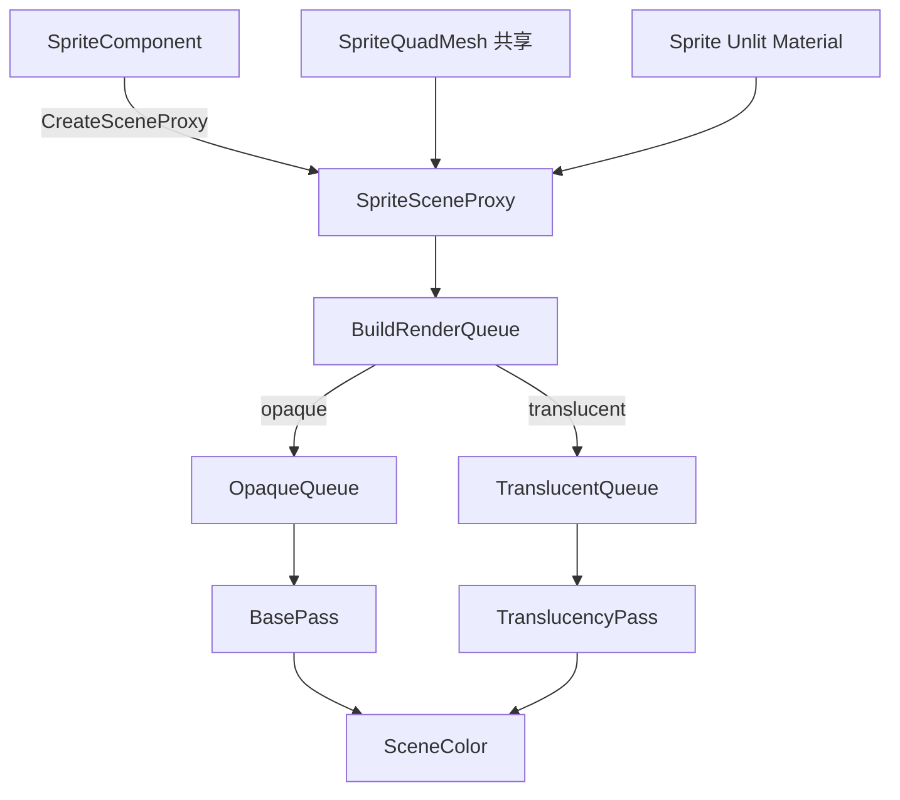
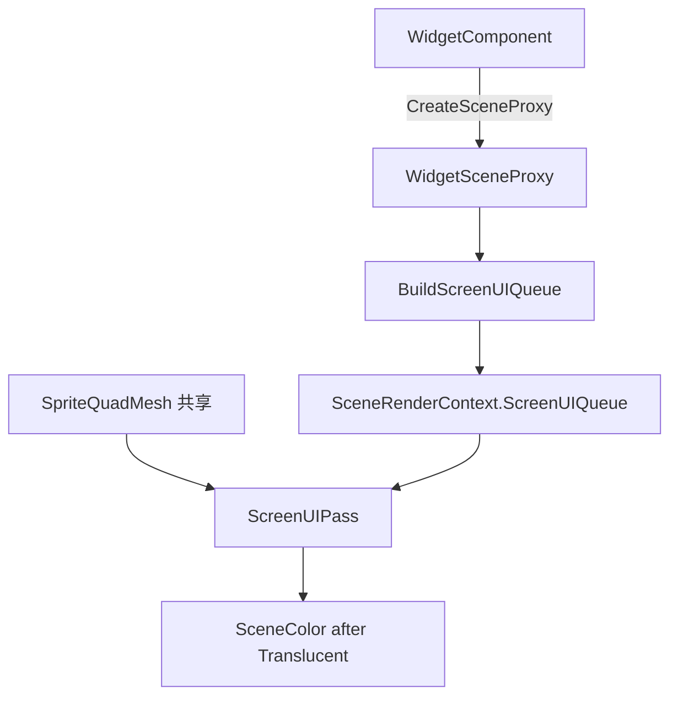

# RND-F16 — 2D Rendering Foundation

## Meta
- **ID:** `RND-F16`
- **Type:** Feature
- **Status:** In Progress
- **Owner:** project maintainer
- **Last updated:** 2026-09-04
- **Branch:** `feat/ui`
- **Related:**
  - [UI-F01](../Platform/UI/UI-F01_UI_SYSTEM_DESIGN.md)（Canvas / Layout 消费者；Path B 之后）
  - [FEATURE_REGISTRY](../FEATURE_REGISTRY.md) · [ACTIVE_WORK](../ACTIVE_WORK.md)
  - 外部底稿：[minEngine_ui_mvp_suggestions.md](../../external/minEngine_ui_mvp_suggestions.md)
  - 代码对照：`SceneRenderContext` / `ForwardRenderer` / `SpriteQuadMesh` / SkyBox 登记模式
  - UE：Paper2D；UMG Screen vs 本引擎有 Proxy + ScreenUIQueue
- **Depends on:** Modern RHI + `ForwardRenderer` / Manual RDG（可用即可）
- **Blocks:** `UI-F01` Screen-space 绘制
- **Implementation:** [RND-F16_2D_RENDERING_FOUNDATION_IMPLEMENTATION.md](./RND-F16_2D_RENDERING_FOUNDATION_IMPLEMENTATION.md)

## TL;DR

**问题：** Sprite（世界面片）与 Screen Widget（HUD）不能走同一条 Overlay 通道。

**方案：** 共享 2D 原语 + 分路径。  
- **Path A（已落地）：** `SpriteComponent` → Opaque/Translucent；透明性 = Color.a 或纹理可能含 alpha；无阴影 / 无 billboard。  
- **Path B（下一主线）：** `WidgetComponent` → `ScreenUIQueue`（在 `SceneRenderContext`）→ ScreenUI Pass；像素 + 左上；关深度；**无 Canvas**（留给 UI-F01）。

## Scope

### In（本 Feature）
- Path A：共享 unit quad + Sprite unlit + 入队 + 透明分流（**Done**）
- Path B：ScreenUI Queue/Pass + `WidgetComponent` / Proxy + `UIDrawCommand`（§10）

### Out
- Billboard；Layout / Hit-test / 完整 Widget 行为（`UI-F01`）
- **`CanvasComponent`（本 Feature Path B MVP 不做）**
- World Canvas；Paper2D / Slate；**Editor ImGui**（无关）

## Reader quick start
1. §3 双路径心智  
2. §9 Path A（已实现）  
3. **§10 Path B 详细设计** ← 下一实现前必读  
4. 代码：`SceneRenderContext`、`ForwardRenderer::BuildFrameRenderGraph`、`SpriteQuadMesh`

---

## 1) 背景与目标

见既有双路径动机：Sprite 要场景深度；Screen UI 要保序合成。成功标准：场景内可见 Sprite；Proxy 入队；`Color`/纹理 alpha 分流正确；阴影关闭。

---

## 2) 现状（代码事实）

```text
StaticMeshComponent : PrimitiveComponent
  → CreateSceneProxy() → StaticMeshSceneProxy { VB, IB, layout, Material* }
  → RenderScene::UpdatePrimitive
  → ForwardRenderer::BuildRenderQueue
       dynamic_cast<StaticMeshSceneProxy*>
       → MeshDrawCommand
       → Material::IsTranslucent() ? TranslucentQueue : OpaqueQueue
  → BasePass / TranslucencyPass
```

| 缺口 | 说明 |
|------|------|
| Path A Sprite | **已落地**（见 §9 / 代码） |
| Path B ScreenUI | **无** `ScreenUIQueue` / Pass / `WidgetComponent`（见 §10） |
| `SceneRenderContext` | 仅有 Opaque/Translucent；待加 `ScreenUIQueue` |

---

## 3) 方案总览

```text
共享: unit quad + Sprite unlit material/PSO 约定
        │
   ┌────┴────┬──────────────┐
   ▼         ▼              ▼
Path A    Path B         Path C
Sprite    Screen UI      World UI（后）
↓         ↓
Opaque/   ScreenUIQueue
Translucent  ScreenUI Pass
```

帧序（Screen UI 到位后）：… → Opaque → Translucent → (Debug) → **ScreenUI** → Post → Present。

### 3.1 Path A 摘要
`SpriteComponent` : `PrimitiveComponent`；固定 Transform 朝向；`CastShadow=false`；队列由 §9.4 规则决定。

### 3.2 Path B 摘要
`WidgetComponent` ∈ **`SceneComponent`（非 Primitive）** + Proxy；入 **`SceneRenderContext::ScreenUIQueue`**；帧序 Translucent → **ScreenUI** → Post。详见 §10。

### 3.3 实现顺序
```text
S0–S2  Path A —— Done
S3     Path B：Queue + Pass + WidgetComponent（无 Canvas）
—— 之后 UI-F01：Canvas / Layout / Hit-test ——
```

---

## 4) UE 对照（学习）

| 主题 | 锚点 | minEngine |
|------|------|-----------|
| Sprite→场景 | Paper2D `CreateSceneProxy` / `GetDynamicMeshElements` | Path A 同构 |
| Screen 无 Proxy | UMG Screen → Slate 层 | **刻意分叉**：有 Proxy，进 ScreenUIQueue |
| World Widget | `FWidget3DSceneProxy` + RT | Path C 后置 |

---

## 5) 备选方案

| 选项 | 结论 |
|------|------|
| 双路径 + 共享原语 | **选用** |
| 单一 Overlay 吃 Sprite+UI | 弃用 |
| Screen UI 进 TranslucentQueue | 拒绝（破坏 UI 序） |
| MVP 每 Sprite 独立动态 VB | 拒绝；用共享 unit quad + ModelMatrix 缩放 |

---

## 6) 风险与缓解

| 风险 | 缓解 |
|------|------|
| 仅看 `Color.a` 漏掉纹理镂空 | §9.4：纹理「可能含 alpha」也进 Translucent |
| 保守半透过多伤合批 | 可接受；日后 `bForceOpaque` / Masked |
| `dynamic_cast` 堆类型 | Sprite 先对齐 StaticMesh；后可 `GatherMeshDraws` 虚函数 |
| Color 每帧改 Material | Proxy 缓存；参数 dirty 策略见 §9.5 |

---

## 7) 验收标准（Path A MVP）

- [ ] `SpriteComponent` 可挂 GO；反射可见 Texture / UV / Size / Color
- [ ] 经 `SpriteSceneProxy` 进入 Opaque **或** Translucent 队列（规则 §9.4）
- [ ] `CastShadow == false`；不进入阴影 caster 集
- [ ] 无 billboard；朝向跟 Transform
- [ ] Playground 或 test：至少 1 个不透明 + 1 个半透（Color 或纹理）Sprite 可见
- [ ] Path B 契约仍写在本文 §10（可不实现）

---

## 8) Decisions

| 项 | 决定 |
|----|------|
| 顺序 | 先 Path A（含 SpriteComponent 基础） |
| Billboard | MVP 不做 |
| 阴影 | MVP `CastShadow = false`（构造默认；可保留 API 但不进阴影） |
| 着色 | 组件 `m_Color`（`Vector4` RGBA）乘采样结果 |
| 透明分流 | **`Color.a` 不足不透明 OR 纹理可能含 alpha** → Translucent（§9.4） |
| 几何 | 共享 unit quad；世界尺寸用 Size × Transform |
| Path B Proxy | `SceneComponent` + Proxy 同构；**不**继承 `PrimitiveComponent` |
| Path B 坐标 | **像素 + 原点左上**（相对当前视口） |
| Path B Queue | 挂在 **`SceneRenderContext`**（与 Opaque/Translucent 并列） |
| Path B 几何 | **复用 `SpriteQuadMesh` unit quad**；屏幕矩阵 / 常量不同 |
| Path B Depth | MVP **关闭**深度测写；仅 `stableOrder` 保序 |
| Path B vs ImGui | **无关**（游戏/PIE Screen UI ≠ Editor Dock） |
| Path B Canvas | **MVP 不做**；单个 `WidgetComponent` 直接入队；Canvas → UI-F01 |

---

## 9) Path A 详细设计 — 数据结构 / 接口 / 数据流

### 9.1 类型与文件落点（建议）

| 类型 | 建议路径 | 职责 |
|------|----------|------|
| `SpriteComponent` | `Runtime/Function/Framework/Components/SpriteComponent.h` | 游戏线程权威数据；`CreateSceneProxy` |
| `SpriteSceneProxy` | `Runtime/Function/Render/PrimitiveSceneProxies/SpriteSceneProxy.h` | 渲染镜像（非拥有 GPU mesh） |
| `SpriteQuadMesh`（或 `SpriteGeometry`） | `Runtime/Function/Render/Sprite/` | 进程内共享 unit quad VB/IB/layout |
| `SpriteMaterialUtil` / 默认 Material | 同目录或 Material 资源 | Unlit textured + vertex/tint color |
| `ForwardRenderer::BuildRenderQueue` | 现有文件 | 增加 Sprite 分支 |

命名对齐现有：`m_` 成员、PascalCase 类型、`ME_CLASS` / `ME_PROPERTY` 反射。

### 9.2 游戏线程：`SpriteComponent`

对齐 `StaticMeshComponent` 合同：继承 `PrimitiveComponent`，实现 `GetBoundingBox` / `CreateSceneProxy`。

```text
SpriteComponent : PrimitiveComponent
{
  // --- ME_PROPERTY（示意）---
  shared_ptr<Texture2D> m_Texture;     // 必填才可画；null → 不入队
  Vector4               m_Color;       // RGBA，默认 (1,1,1,1)；乘在采样色上
  Vector2               m_Size;        // 本地/世界平面上的宽高（单位与场景一致）
  Vector4               m_UVRect;      // (u0,v0,u1,v1)，默认 (0,0,1,1)
  // 可选后置: shared_ptr<Sprite> m_SpriteAsset;

  // --- 行为 ---
  SetTexture / SetColor / SetSize / SetUVRect  → MarkRenderStateDirty()
  GetBoundingBox()  → 由 Size + 世界矩阵估 AABB（固定朝向 quad）
  CreateSceneProxy() → new SpriteSceneProxy，填入只读快照
  CastShadow: 构造时 m_CastShadow = false
}
```

**不变量：**
1. `m_Size.x/y > 0` 才生成有效 AABB/绘制；否则跳过。  
2. 朝向完全由 `SceneComponent` Transform 决定（本地 XY 平面张成 quad，**+Z 为面片法线约定**——实现时与引擎坐标一致并写进注释）。  
3. 不在组件内持有 per-instance VB（共享 unit quad）。

**与 StaticMesh 对照：**

| | StaticMeshComponent | SpriteComponent |
|--|---------------------|-----------------|
| 几何来源 | `StaticMesh` 资产 | 共享 unit quad × Size |
| 外观 | `Material` | 默认 Sprite unlit + Texture + Color（可后置 Override Material） |
| 阴影默认 | `true` | **`false`** |

### 9.3 渲染线程镜像：`SpriteSceneProxy`

```text
SpriteSceneProxy : PrimitiveSceneProxy
{
  // 非拥有：指向共享几何
  RHIBuffer*            m_VertexBuffer;
  RHIVertexInputLayout* m_VertexInputLayout;
  RHIBuffer*            m_IndexBuffer;

  Material*             m_Material;      // 默认 Sprite material 或 override
  Texture2D*            m_Texture;       // 非拥有；绑到 material/参数
  Vector4               m_Color;
  Vector4               m_UVRect;
  Vector2               m_Size;

  bool                  m_bNeedsTranslucentPass;  // Create/Update 时算好
  // m_Transform / m_CastShadow 来自基类（CastShadow 恒 false）
}
```

**创建时机：** 与 StaticMesh 相同——`PrimitiveComponent::DoEndOfFrameUpdate` → `RenderScene::UpdatePrimitive` → `CreateSceneProxy()` 或刷新已有 proxy 字段。

**ModelMatrix：**  
`WorldMatrix * Scale(m_Size.x, m_Size.y, 1)`（若 unit quad 为 [-0.5,0.5]² 或 [0,1]²，缩放与原点约定必须与 VB 一致；**实现前在代码注释钉死一种**）。推荐：**中心在原点、边长 1 的 quad**，再乘 Size。

### 9.4 透明性（Translucency）规则 — Color + Texture

用户修正后的完整规则：

```text
NeedsTranslucentPass =
     ColorAlphaIsTranslucent(m_Color.a)
  OR TextureMayHaveAlpha(m_Texture)
  OR (m_Material && m_Material->IsTranslucent())   // 若允许 override
```

| 谓词 | MVP 定义 |
|------|----------|
| `ColorAlphaIsTranslucent(a)` | `a < 1.0f - kAlphaEps`（建议 `kAlphaEps = 1.0f/255.0f`） |
| `TextureMayHaveAlpha(tex)` | `tex == null` → false；否则 **`tex->GetChannels() >= 4`**（或未来 `HasAlphaChannel()`）为 true 则视为可能半透 |
| Material override | MVP 可无 override；若有且 `IsTranslucent()`，强制 Translucent |

**语义说明：**
- **保守：** 带 alpha 通道的纹理（即使像素全不透明）也会进 TranslucentQueue——正确优先于合批。  
- **不**在 MVP 做 CPU 读回扫描「是否真有 a&lt;1 纹素」。  
- **Masked（alpha test）** 后置；镂空精灵先走半透也可接受。  
- 日后优化：`bTreatTextureAsOpaque` 或导入时烘焙 `m_bSourceHasTransparentTexels`。

**入队（BuildRenderQueue）：**

```text
if (proxy->m_bNeedsTranslucentPass)
    TranslucentQueue.push_back(cmd);
else
    OpaqueQueue.push_back(cmd);

cmd.m_CastShadow = false;  // 即使组件被改，MVP 阴影构建忽略 Sprite
```

计算时机：在 `CreateSceneProxy` / dirty 更新时写入 `m_bNeedsTranslucentPass`，避免每帧重复判纹理。

### 9.5 Material / 着色接口

**MVP 推荐：** 引擎持有一份 **默认 Sprite Unlit Material**（或等价 PSO + 最小绑定）：

- 采样 `Texture2D`  
- 输出 `sample * Color`（Color 来自 material 参数或顶点色）  
- Blend：与队列一致——Opaque 用不透明 PSO；半透用 alpha blend（可由同一 Material 的 `MaterialBlendMode` 在 dirty 时切换，或双 Material 实例）

**接口倾向（二选一，实现选默认 A）：**

| | A. 双默认 Material（推荐 MVP） | B. 单 Material 改 BlendMode |
|--|-------------------------------|-----------------------------|
| Opaque | `SpriteUnlitOpaque` | 运行时设 `Opaque` |
| Translucent | `SpriteUnlitTranslucent` | 运行时设 `Translucent` |
| 优点 | 无运行时改 blend 坑 | 少资源 |
| 缺点 | 两份 | dirty 时要同步 blend |

Proxy 上 `m_Material` 指向当前选用的那份；`MeshDrawCommand::m_Material` 照旧。

**Color / UV 如何进 GPU（MVP）：**
- **Color：** material scalar/vector 参数（改 Color → `MarkRenderStateDirty` → 更新 proxy → 更新 material 参数或 per-draw 常量）。若 material 实例按组件独享，注意别共享可变实例。  
- **UVRect：** 优先 **顶点 UV 在 VS 里用 uniform 做 remap**（`uv = lerp(uv0, uv1, attrib)`），避免每 Sprite 重建 VB。  
- 禁止 MVP 为每个 Sprite `Create` 新 VB。

### 9.6 共享几何：`SpriteQuadMesh`

```text
SpriteQuadMesh (进程单例或 ForwardRenderer 持有)
{
  RHIBuffer* VB;           // 4 顶点: pos.xyz, uv.xy  (unit square)
  RHIBuffer* IB;           // 6 indices
  RHIVertexInputLayout*;
  void EnsureInitialized(RHI&);
}
```

所有 `SpriteSceneProxy` 非拥有指针指向同一套缓冲。生命周期：Renderer/RHI 初始化时创建，关闭时释放。

### 9.7 `MeshDrawCommand` 填充

与 StaticMesh 同构，不新增 Command 类型（MVP）：

```text
MeshDrawCommand cmd;
cmd.m_VertexBuffer / Layout / IndexBuffer = 共享 quad;
cmd.m_Material     = spriteProxy->m_Material;
cmd.m_ModelMatrix  = WorldMatrix * Scale(Size.x, Size.y, 1);
cmd.m_BoundingBox  = component->GetBoundingBox();
cmd.m_CastShadow   = false;
```

若现有 `PrepareSceneMeshDrawPackets` 假定某些 material 绑定布局，Sprite material 必须满足同一绑定约定或走已有 unlit 路径——**实现 Slice 时对着 `SceneMeshDrawUtils` 验一次**。

### 9.8 接口一览（对外）

**游戏 / 编辑器 / Lua（反射）：**

| API | 说明 |
|-----|------|
| `SetTexture(shared_ptr<Texture2D>)` | dirty |
| `SetColor(Vector4)` | dirty；影响半透判定 |
| `SetSize(Vector2)` | dirty；影响 AABB / 矩阵 |
| `SetUVRect(Vector4)` | dirty |
| `Get*` | 只读 |
| `CastShadow()` | 继承；MVP 保持 false |

**渲染内部（非脚本 API）：**

| API | 说明 |
|-----|------|
| `SpriteComponent::CreateSceneProxy()` | 分配并填充 proxy |
| `SpriteComponent::GetBoundingBox()` | AABB |
| `SpriteSceneProxy` 字段 | 供 `BuildRenderQueue` 读取 |
| `SpriteQuadMesh::EnsureInitialized` | 共享几何 |
| `ComputeSpriteNeedsTranslucentPass(color, texture, material*)` | 纯函数，便于单测 |

### 9.9 数据流（端到端）

```text
[Authoring / Lua / Editor]
  SpriteComponent.{Texture, Color, Size, UVRect, Transform}
           │
           │ MarkRenderStateDirty
           v
[End of frame] PrimitiveComponent::DoEndOfFrameUpdate
           │
           v
  RenderScene::UpdatePrimitive
           │
           ├─ CreateSceneProxy / refresh SpriteSceneProxy
           │     copy Color, UV, Size, Texture*
           │     resolve Material (opaque vs translucent asset)
           │     m_bNeedsTranslucentPass = Compute...(§9.4)
           │     m_CastShadow = false
           │     bind shared SpriteQuadMesh pointers
           v
[Frame] ForwardRenderer::Execute
           │
           v
  BuildRenderQueue
           │  dynamic_cast SpriteSceneProxy*
           │  fill MeshDrawCommand (shared VB/IB, ModelMatrix, Material)
           │  push Opaque or Translucent by m_bNeedsTranslucentPass
           v
  ShadowPass  ← 仅 OpaqueQueue 中 CastShadow 者；Sprite 被跳过
  BasePass    ← Opaque（含不透明 Sprite）
  TranslucencyPass ← 半透 Sprite（按相机距离排序，与网格半透相同）
           v
  SceneColor → (future ScreenUI) → Post → Present
```



### 9.10 测试与验证建议

| 用例 | 期望 |
|------|------|
| Color=(1,1,1,1)，RGB 三通道纹理 | OpaqueQueue |
| Color.a=0.5，任意纹理 | TranslucentQueue |
| Color.a=1，RGBA 纹理 | TranslucentQueue（保守） |
| 无 Texture | 不入队 |
| CastShadow 查询 | false；阴影图无该 caster |
| 旋转 Transform | 面片朝向变，无需 billboard |

单测可测：`ComputeSpriteNeedsTranslucentPass`；集成：Playground 摆两张 Sprite。

### 9.11 刻意不做（Path A）

- Sprite 资产图集编辑器、Flipbook  
- 每实例动态批到一个 mega VB（可后置）  
- Billboard / 相机锁定  
- 阴影  
- 与 UI Widget 共用 ScreenUI Pass  

---

## 10) Path B 详细设计 — ScreenUI Queue / Pass / WidgetComponent

> **拍板（2026-09-04）：** 像素+左上；Queue 在 `SceneRenderContext`；复用 `SpriteQuadMesh`；关深度；与 ImGui 无关；**无 Canvas**。

### 10.1 目标与边界

| | Path A Sprite | Path B Widget |
|--|---------------|---------------|
| 组件基类 | `PrimitiveComponent` | **`SceneComponent`（禁止继承 Primitive）** |
| 队列 | Opaque / Translucent | **仅** `ScreenUIQueue` |
| 排序 | 相机距离 | **`stableOrder` 升序**（同 order 时注册序） |
| 坐标 | 世界 Transform | **视口像素，原点左上** |
| Depth | 参与场景深度 | MVP **关测写** |
| Canvas | N/A | **后置（UI-F01）** |

**成功标准（Path B MVP）：**
- 场景中挂一个 `WidgetComponent`，给定像素矩形 + Color（可选 Texture），在 ScreenUI Pass 可见
- 不出现在 Opaque/Translucent；开/关 PostProcess 仍叠在正确层
- Editor ImGui 行为不变

### 10.2 为何不走 Primitive

`RenderScene` 对 `PrimitiveComponent` 会登记进 `m_PrimitiveSceneProxies`，`BuildRenderQueue` 默认按网格规则入 Opaque/Translucent。  
Widget **红线**是永远不进这两条队列。故采用与 **SkyBox / Light** 类似的模式：`SceneComponent` 自管 Proxy，由 `RenderScene` **单独列表**持有。

```text
WidgetComponent : SceneComponent
  CreateSceneProxy() → WidgetSceneProxy*
RenderScene
  m_WidgetSceneProxyOwners / m_WidgetSceneProxies   // 新增；与 Primitive 列表分离
```

### 10.3 坐标与布局约定（像素 + 左上）

| 量 | 约定 |
|----|------|
| 原点 | 当前绘制视口 **左上角** `(0,0)` |
| +X | 向右（像素） |
| +Y | **向下**（像素） |
| 视口尺寸 | `viewportWidth` / `viewportHeight`（来自本帧 Scene 绘制视口，非 ImGui 区域） |
| 组件位置 | `SceneComponent` 的 **Relative/World Location.xy** 解释为 **左上角像素**（MVP：忽略父级 3D 旋转；Scale 可用于 Size 乘子或忽略——默认 **Size 绝对像素**） |
| `m_Size` | `(width, height)` 像素；默认例如 `(100, 100)` |
| 几何中心 | unit quad 中心在原点 → Model 需平移到矩形中心：`(x + w/2, y + h/2)` 再换算 NDC |

**像素 → NDC（OpenGL 风格，Y 向上 NDC）：**

```text
ndcX =  2 * (pixelX / viewportWidth)  - 1
ndcY =  1 - 2 * (pixelY / viewportHeight)   // 左上像素 → NDC 上边
```

ScreenUI Pass 用正交投影或直接构造 **屏幕 ModelMatrix**（缩放 w/h、平移中心），再乘上述约定；**不**使用主相机 View/Perspective。

**MVP 简化：** 不做旋转；`Transform.Rotation` 忽略。父附着若存在，仅累加 Location.xy（无 Canvas 时通常直接挂在根 GO）。

### 10.4 类型与文件落点

| 类型 | 建议路径 | 职责 |
|------|----------|------|
| `UIDrawCommand` | `Runtime/Function/Render/DrawCommands/UIDrawCommand.h` | ScreenUI 入队元素 |
| `WidgetComponent` | `Framework/Components/WidgetComponent.*` | 游戏线程权威；反射 |
| `WidgetSceneProxy` | `Render/SceneProxies/WidgetSceneProxy.h`（或 `UI/`） | 渲染镜像 |
| `ScreenUIPass` | `Render/RenderPipeline/ScreenUIPass.*` | 消费队列、关深度、画 quad |
| `BuildScreenUIQueue` | `ForwardRenderer`（或同文件私有方法） | 填 `ctx.ScreenUIQueue` |
| 几何 | **复用** `SpriteQuadMesh` | 不新建 VB |
| 材质 | `ScreenUIMaterialFactory` 或扩展现有 Unlit | 纹理可选；Tint/Opacity |

### 10.5 数据结构

```text
// SceneRenderContext 增补
std::vector<UIDrawCommand> ScreenUIQueue;
// ResetFrame() 中 clear

struct UIDrawCommand
{
  Matrix4x4   ScreenModelMatrix; // 或等价：像素 rect + 由 Pass 组矩阵
  Vector4     Color;             // RGBA 乘采样
  Vector4     UVRect;            // (u0,v0,u1,v1)；MVP 可固定 (0,0,1,1)，字段预留
  Vector4     ClipRect;          // 像素 scissor；MVP 可 = 全视口或暂不启用
  RHITexture* Texture;           // null → 纯色（白纹理或无采样着色）
  Material*   Material;          // 已编译；null → 跳过
  uint32_t    StableOrder;       // 小者先画（画家算法）
};
```

```text
WidgetComponent : SceneComponent
{
  shared_ptr<Texture2D> m_Texture;   // 可选
  Vector4               m_Color;     // 默认 (1,1,1,1)
  Vector2               m_Size;      // 像素，默认 (100,100)
  uint32_t              m_StableOrder; // 默认 0；可反射编辑
  // Location.xy = 左上角像素（见 §10.3）

  WidgetSceneProxy* CreateSceneProxy();
  void UpdateSceneProxy(WidgetSceneProxy&);
}

WidgetSceneProxy
{
  // 非拥有：SpriteQuadMesh* 或渲染时取 Get()
  Vector2   m_SizePx;
  Vector2   m_TopLeftPx;     // 已解析的屏幕像素（含附着累加）
  Vector4   m_Color;
  Vector4   m_UVRect;
  Texture2D*/RHITexture* …
  Material* m_Material;
  uint32_t  m_StableOrder;
  bool      m_bVisible;      // 无有效绘制则 false
}
```

命名：**仅** `WidgetComponent`（不用 VisualWidgetComponent）。

### 10.6 接口与帧内数据流

```text
[Game] WidgetComponent 属性变更 → MarkRenderStateDirty（或等价）
         │
         v
[RenderScene] 登记/更新 WidgetSceneProxy（独立于 Primitive 列表）
         │
         v
[Frame] ForwardRenderer::Execute
         │
         ├─ BuildRenderQueue(ctx)     // 仅 Mesh / Sprite → Opaque|Translucent
         ├─ BuildScreenUIQueue(ctx)   // 遍历 Widget proxies → ScreenUIQueue
         │       sort by StableOrder
         │
         v
  Graph: Shadow → Sky → Opaque → Translucent → (Debug)
       → **ScreenUI** → Post → Present
```



**`BuildScreenUIQueue` 规则：**
1. 仅读 `RenderScene` 的 Widget proxy 列表  
2. `m_bVisible == false` 或 Material 未就绪 → 跳过  
3. Texture 可选：无纹理则纯色（工厂保证有默认路径）  
4. **禁止**写入 `OpaqueQueue` / `TranslucentQueue`  
5. 按 `StableOrder` 稳定排序后交给 Pass

**`ScreenUIPass` 规则：**
1. 绑定 SceneColor（与 Translucent 之后同一 RT）  
2. **Depth test/write OFF**；Blend ON（标准 alpha）  
3. 对每条 `UIDrawCommand`：绑定共享 VB/IB + Material + ScreenModelMatrix  
4. Scissor：MVP 可整视口；`ClipRect` 字段预留，启用时再开  
5. 空队列：no-op  

### 10.7 与现有代码的挂接点

| 位置 | 改动 |
|------|------|
| `SceneRenderContext` | 增加 `ScreenUIQueue` + `ResetFrame` clear |
| `ForwardRenderer::BuildFrameRenderGraph` | Translucent/Debug 之后、`Post.FXAA` 之前插入 `Scene.ScreenUI` |
| `ForwardRenderer::Execute` | 调用 `BuildScreenUIQueue` |
| `RenderScene` | Widget 注册/注销/dirty 更新（对齐 SkyBox 模式，勿塞进 Primitive） |
| `minEngine.h` | 导出 `WidgetComponent` |

### 10.8 材质与着色（MVP）

- Unlit：`out = texture(BaseColor, uv) * Color`；无纹理则 `out = Color`  
- Blend：SrcAlpha / OneMinusSrcAlpha  
- UV：共享 quad 的 0..1；`UVRect` remap **可后置**（与 Sprite 同债）  
- 不写阴影、不写 GBuffer 变体

### 10.9 测试与验证

| 用例 | 期望 |
|------|------|
| 单 Widget，Color 不透明，左上 (0,0) Size 200×100 | 视口左上出现色块 |
| 两 Widget，StableOrder 0 与 1，重叠 | order 大者后画（盖住） |
| 仅 Sprite、无 Widget | ScreenUI Pass no-op；场景正常 |
| Widget 存在时查 Opaque/Translucent | **无**该 draw |
| Editor ImGui | 不受影响 |

单测（可选）：像素→NDC 辅助函数；或队列排序谓词。目视：Editor PIE / 场景挂 Widget。

### 10.10 刻意不做（Path B MVP）

- `CanvasComponent` / RenderMode / 提交批根  
- Layout、Hit-test、Button、Text、输入  
- Scissor 裁剪树、图集 UV remap GPU  
- World Space UI（Path C）  
- 与 Editor ImGui 共享任何状态  
- 深度测试「按 UI z」  

### 10.11 红线（必须）

1. `WidgetSceneProxy` / `UIDrawCommand` **不得**进入 Opaque 或 Translucent 队列  
2. ScreenUI **不得**使用主相机透视投影做 HUD 定位  
3. Path B 代码路径 **不**依赖 ImGui  
4. 不在本切片引入 Canvas  

---

## 11) Status note

| 字段 | 内容 |
|------|------|
| Status | **In Progress**（Path A Done；Path B S03a/b 代码已落地，待目视） |
| Next | Editor 目视 `WidgetComponent`；再 UI-F01 Canvas |
| Path B | 见 §10 |

---

## 变更记录

| 日期 | 说明 |
|------|------|
| 2026-09-01 | 占位：Sprite 2D |
| 2026-09-03 | 升格 Foundation；双路径修订；先 Path A；Billboard Out；Proxy 同构 Path B |
| 2026-09-03 | Color + 阴影拍板 |
| 2026-09-03 | **§9 详细设计：** 数据结构/接口/数据流；透明性 = Color.a **或** 纹理可能含 alpha；Status → Planned |
| 2026-09-04 | Path A 代码+目视验收；Status → In Progress |
| 2026-09-04 | **§10 Path B 详细设计：** 像素左上；Queue@SceneRenderContext；复用几何；关深度；无 Canvas；与 ImGui 无关 |