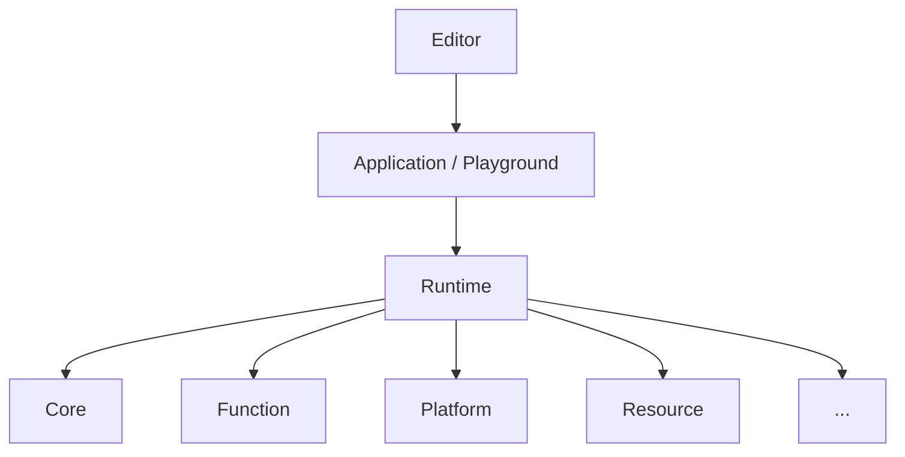

# minEngine

**个人学习型 C++ 游戏引擎**

## 文档说明

本站为 minEngine 的公开技术手册。引擎迭代较快，许多系统形态仍在变化，文档以**与 `src/Runtime` 对齐的分层结构**逐步补充，首期多为占位页。

页脚 **最后更新** 日期对应该页在 Git 中的最后一次修改，便于判断内容时效性。

## 快速链接

- [快速开始](getting-started/index.md) — 环境、构建与运行（文档建设中）
- [GitHub 仓库](https://github.com/Max1122Chen/minEngine)

## 架构一览

各层说明见 **[运行时](runtime/overview.md)**（左侧导航：核心 · 功能层 · 平台层 · 资源层）。
