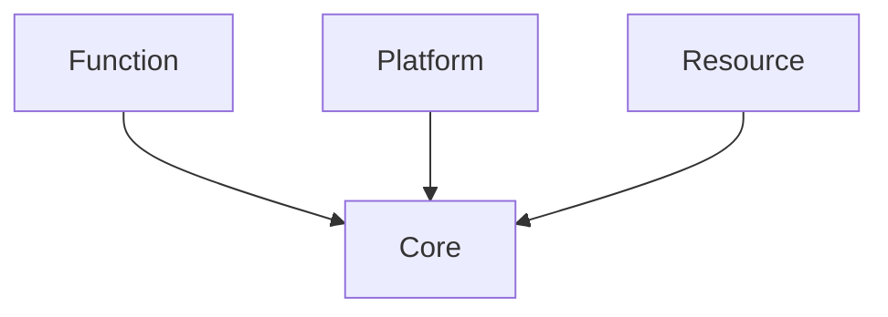

# Core

`Runtime/Core` 是 minEngine 的**基础设施层**：对象身份、反射元数据、序列化、路径与命令行等。上层 **Function**（场景、渲染等）与 **Resource**（资产）都建立在这一层之上，但 Core **不**依赖 Function。

## 在 Runtime 中的位置

Core 提供「引擎内万物」的公共约定：`MEObject` 身份、`MEClass` 描述、存档格式、日志与路径解析。

## 子模块一览

| 模块                                | 职责                                    | 主要入口                                                |
| --------------------------------- | ------------------------------------- | --------------------------------------------------- |
| [Object](object.md)               | `MEObject` 实例、`ObjectManager` 注册与 GC  | `MEObject.h`, `ObjectManager.h`                     |
| [Reflection](reflection.md)       | 类型/属性/函数元数据（**概念参考 UE 的 UObject 反射**） | `ReflectionSystem`, `MEClass`, `ReflectionMacros.h` |
| [Serialization](serialization.md) | 基于反射的读写、JSON/二进制 Archive              | `Serializer.h`, `JsonArchive.h`, `BinaryArchive.h`  |
| [Math](math.md)                   | 向量/矩阵类型与少量几何工具（**类型来自 GLM**）          | `Math.h`, `Math/Geometry/`                          |
| [Log](log.md)                     | 双通道日志（**后端为 spdlog**）                 | `LogSystem.h`, `ME_CORE_`* / `ME_*` 宏               |
| [Paths](paths.md)                 | 引擎根、默认资产、工程 Content 路径                | `PathRegistry.h`                                    |
| [CLI](cli.md)                     | 统一命令行解析（模式、配置路径等）                     | `ApplicationCommandLine.h`                          |
| [GUID](guid.md)                   | 128 位对象/资产标识                          | `GUID.h`                                            |
| [Assert](assert.md)               | 调试断言宏                                 | `Assert.h`                                          |

`Core.h` 聚合常用头文件；`EngineAPI.h` 定义 `MINENGINE_API` 导出宏；`TypeTraits.h` 供反射与序列化做类型判断。

## 设计取向

- **Object / Reflection / Serialization** 的整体分工（`Outer`、`IsA`、属性遍历、GUID 引用、延后解析）有意**对齐 Unreal Engine 的常见做法**，实现是 minEngine 自己的 C++ 代码。
- **Math、Log、JSON** 等使用成熟第三方库（GLM、spdlog、[nlohmann/json](https://github.com/nlohmann/json)），Core 只做薄封装或类型别名。
- `Reflection/Legacy/`、`Serialization/Legacy/` 为**旧管线残留**，新功能应走当前 `ReflectionSystem` + `Serializer`；Legacy 仅作兼容与迁移参考。

## 典型协作关系

1. 类型通过 `ME_CLASS()` / `ME_GENERATED_BODY` 注册到 `ReflectionSystem`，生成代码在 `*.gen.h`（构建期产出）。
2. `ObjectManager::NewObject` 创建实例并登记 GUID。
3. `Serializer` 按 `MEProperty` 写入 `JsonArchive` 或 `BinaryArchive`；对象引用先记 GUID，加载后 `ResolvePendingObjectRefs`。
4. 启动时 `ApplicationCommandLine` → `PathRegistry::LoadEngineConfiguration` 解析 `EngineConfig.meconfig` 与工程根路径。

代码目录：`minEngine/minEngine/src/Runtime/Core/`