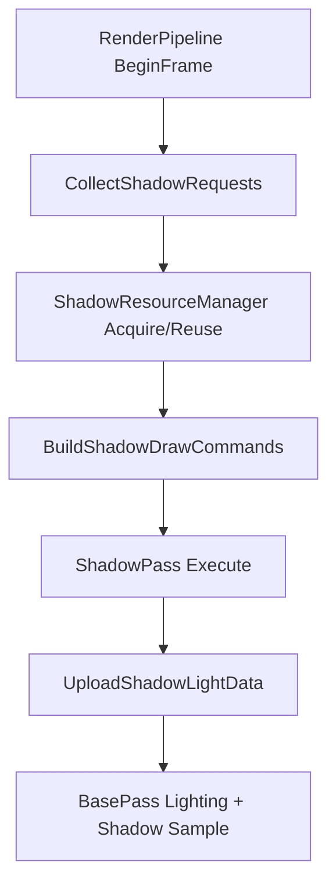

# minEngine 阴影系统小而美设计（v1）

更新时间：2026-03-27

## 1. 设计目标

本方案追求：

1. 支持方向光、点光、聚光的基础阴影渲染。
2. 阴影资源可复用，避免每帧创建销毁纹理。
3. 数据流简单清晰，调试成本低。
4. 后续扩展成本低，但不引入商业引擎级复杂工程。

明确不做：

1. 复杂图集打包算法。
2. bindless、虚拟阴影贴图、页表系统。
3. 过度抽象的渲染图系统。

---

## 2. 核心思路（一句话）

统一一层轻量 ShadowResourceManager 做资源池和句柄分发；
不同光型只在“渲染策略”上分支。

---

## 3. 资源策略（按光型）

### 3.1 方向光（Directional）

1. 使用一张深度 Texture2DArray（例如 4 层，给 CSM）。
2. 每个方向光分配一段连续 layer（基础版可先只支持 1 个方向光）。
3. 只有分辨率或级联数改变时重建；平时复用。

### 3.2 聚光（Spot）

1. 预留为阴影图集（Shadow Atlas）方向。
2. 第一阶段只保留接口，不实现具体资源分配和渲染。

### 3.3 点光（Point）

1. 第一阶段只保留接口，不实现具体资源分配和渲染。
2. 未来方向为深度 cubemap 复用。

---

## 4. 数据结构建议

下面是建议的数据结构（示意）：

```cpp
// 复用 LightComponent.h 中的 LightType
// enum class LightType : uint8_t { Directional, Point, Spot };

enum class ShadowResourceType : uint8_t
{
    Invalid,
    Depth2DArray,
    DepthCube
};

struct ShadowLightKey
{
    LightType Type;
    const void* LightProxyPtr; // 当前项目可先用 proxy 地址做稳定键
};

struct ShadowResolution
{
    uint32_t Width = 0;
    uint32_t Height = 0;
};

struct ShadowResourceHandle
{
    ShadowResourceType ResourceType = ShadowResourceType::Invalid;
    int TextureUnit = -1;

    // Depth2DArray 用
    int ArrayBaseLayer = -1;
    int LayerCount = 0;

    // DepthCube 用
    int CubeIndex = -1;

    ShadowResolution Resolution;
    bool Valid = false;
};

struct ShadowRequest
{
    ShadowLightKey Key;
    ShadowResolution Resolution;
    uint32_t Priority = 0; // 预留：后续用于预算裁剪
};

struct ShadowDrawCommand
{
    LightType Type;
    ShadowResourceHandle Handle;

    // Directional/Spot: 一次渲染一个矩阵
    Matrix4 ViewProj;

    // Point: 六面渲染时使用
    Matrix4 ViewProjFaces[6];

    // 本次渲染目标
    int TargetLayer = -1; // Array 目标层
    int TargetFace = -1;  // Cube 目标面
};
```

说明：

1. ShadowResourceHandle 是关键，BasePass/LightUBO 只传句柄索引，不直接持有纹理对象。
2. ShadowRequest 只描述“需要什么”，不做创建逻辑。
3. ShadowDrawCommand 是 ShadowPass 的直接输入。

---

## 5. 函数接口建议

## 5.1 ShadowResourceManager

```cpp
class ShadowResourceManager
{
public:
    void Initialize(RHI* rhi);
    void Shutdown();

    void BeginFrame(uint64_t frameIndex);
    void EndFrame();

    ShadowResourceHandle AcquireDirectional(const ShadowRequest& req, uint32_t cascadeCount);

    // 第一阶段先保留接口，不实现具体分配逻辑
    ShadowResourceHandle AcquireSpot(const ShadowRequest& req);
    ShadowResourceHandle AcquirePoint(const ShadowRequest& req);

    // 当前仅落地 Directional
    std::shared_ptr<RHITexture2DArray> GetDirectionalShadowArray() const;
};
```

接口原则：

1. Acquire 系列只做“分配/复用句柄”。
2. ShadowPass 通过句柄反查资源并执行渲染。
3. EndFrame 可做简单的空闲回收策略。
4. 过滤策略放在 Collect 阶段，Request 本身不再携带 CastShadow 字段。

## 5.2 RenderPipeline（建议拆分）

```cpp
void CollectShadowRequests();
void BuildShadowDrawCommands();
void UploadShadowLightData();
```

说明：

1. Collect 只收集。
2. Build 负责把 request + handle 变成可执行渲染条目。
3. Upload 只上传 shader 采样所需数据。

## 5.3 FrameBuffer（你已做完基础扩展）

已具备：

1. AttachDepthBufferLayer(Texture2DArray, layer)
2. AttachDepthCubeFace(TextureCube, face)

这正是后续 CSM 与点光阴影的核心挂载能力。

---

## 6. 帧内数据流



重点：

1. 请求收集与资源分配分离。
2. ShadowPass 不关心灯组件层细节，只执行渲染条目。
3. BasePass 不关心资源生命周期，只按句柄采样。

---

## 7. 采样接口建议（shader 视角）

第一版建议：

1. 方向光：sampler2DArrayShadow（CSM）。
2. 聚光：sampler2DArrayShadow（每灯一层）。
3. 点光：samplerCubeShadow 或 samplerCube（先手动比较也可）。

LightsData 中为每种光增加最少字段：

1. ShadowType（无阴影 / 2DArray / Cube）
2. ShadowIndex（layer 或 cube index）
3. 方向光额外携带 cascade split 参数。

---

## 8. CSM 原理（开始实现前必须统一）

CSM（Cascaded Shadow Maps）的核心是：

1. 把相机视锥按距离切成多段（cascade）。
2. 每段使用单独的光空间正交投影生成一张阴影图。
3. 片元着色时根据深度选择对应 cascade 采样。

为什么有效：

1. 近处用更高 texel 密度，阴影更清晰。
2. 远处允许更低精度，整体成本可控。

一个直观公式：

$$
split_i = \lambda \cdot split_i^{log} + (1-\lambda) \cdot split_i^{lin}, \quad i=1..N
$$

其中：

1. $N$ 是级联数（通常 3 或 4）。
2. $\lambda$ 为混合系数（常用 0.6~0.8）。

最小实现流程：

1. 计算每个 cascade 的相机子视锥 8 个角点（世界空间）。
2. 用方向光方向构造 light view，把角点投到 light space。
3. 对投影后的包围盒取 min/max，构造正交矩阵。
4. 渲染到 Texture2DArray 的对应 layer。
5. BasePass 依据 view-space 深度选择 layer 采样。

常见伪影与最小对策：

1. 级联抖动：做 texel snapping（把光空间投影原点对齐到阴影贴图 texel 网格）。
2. 接缝明显：级联边界加少量 overlap 或过渡混合。
3. 阴影 acne：基于法线和斜率增加 bias。

CSM 数据流（Directional）


推荐第一版参数：

1. CascadeCount = 4
2. DirectionalShadowResolution = 2048
3. SplitLambda = 0.7
4. PCF = 3x3
5. 每帧只支持一个投影方向光

---

## 9. 最小实现路线（推荐）

### 阶段 A：先把资源复用跑通（1-2 天）

1. 增加 ShadowResourceManager（仅 Directional）。
2. 移除每帧创建方向光 shadow texture 的逻辑。
3. 方向光阴影资源改为持久化。

验收标准：

1. 连续运行时纹理 ID 稳定。
2. 阴影效果与当前版本一致。

### 阶段 B：Direction CSM4（2-4 天）

1. 方向光切换到 Texture2DArray。
2. ShadowPass 按 layer 渲染。
3. BasePass 按级联采样。

验收标准：

1. 近景质量提升。
2. 镜头移动无明显级联跳变（可接受轻微抖动）。

### 阶段 C：Spot/Point 接口预埋（0.5-1 天）

1. 保留 AcquireSpot/AcquirePoint 与对应数据结构。
2. 不接入渲染，仅验证接口可编译。
3. Spot 预留图集字段（TileOffset/TileScale）但先不启用。

---

## 10. 调试建议（强烈推荐）

1. 阴影资源面板：显示每帧 active handle 数量、复用命中率。
2. 阴影可视化模式：按不同光型/级联输出不同颜色。
3. 输出关键日志：Acquire 是否新建、是否复用、是否触发回收。

---

## 11. 你当前项目的推荐默认参数

1. Directional CSM 级联数：4
2. Directional 阴影分辨率：2048
3. Spot 阴影分辨率：1024
4. Point 阴影分辨率：512 或 1024（先从 512 起步）
5. 阴影预算：
   - Directional: 1
   - Spot: 4
   - Point: 2

---

## 12. 决策总结

这是一个“低复杂度、可持续迭代”的设计：

1. 统一资源管理，减少混乱。
2. 光型策略分治，避免一锅粥。
3. 不追求一步到位，只追求每一阶段可运行、可验证、可复用。

---

## 13. 已执行的冗余清理（当前代码）

1. ShadowRequest 已移除 CastShadow 字段（Collect 阶段已过滤）。
2. 已移除 Directional legacy 2D 过渡接口，只保留 array 路径。
3. 旧 ShadowEntry 数据流已替换为 ShadowRequest + ShadowDrawCommand。
